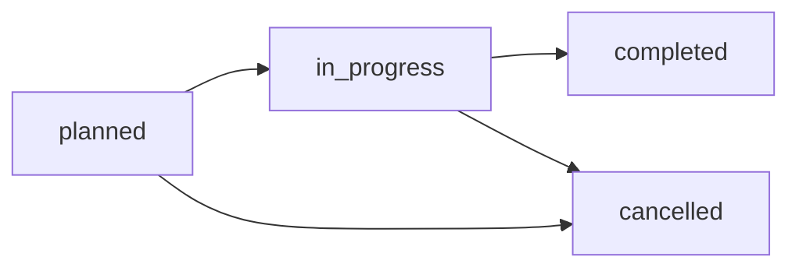

## Overview

The **Campus Outreach CRM** is DormWay's internal system for managing growth campaigns at the campus level. It tracks outreach activities (events, campaigns, partnerships) and maintains a contact database of student leaders, administrators, and influencers at each campus.

<CardGroup cols={2}>
  <Card title="Outreach Activities" icon="rocket">
    Campaign planning, execution tracking, and signup conversion metrics
  </Card>
  <Card title="Contact Management" icon="address-book">
    Database of campus contacts with follow-up scheduling and engagement status
  </Card>
  <Card title="Campus-Level Analytics" icon="chart-bar">
    Compare campaign effectiveness across campuses
  </Card>
  <Card title="Owner Assignment" icon="user-tag">
    Assign activities to Alex, Lauren, or other growth team members
  </Card>
</CardGroup>

---

## Database Schema

### `campus_outreach` Table

| Field | Type | Description |
|-------|------|-------------|
| `id` | UUID | Primary key |
| `campus_id` | UUID | Links to `contexts` table (campus context) |
| `activity_type` | TEXT | Campaign category (see below) |
| `title` | TEXT | Activity name (e.g., "Spring '26 Ambassador Recruitment") |
| `description` | TEXT | Detailed campaign plan |
| `status` | TEXT | `planned`, `in_progress`, `completed`, `cancelled` |
| `owner_id` | UUID | Growth team member assigned (Alex, Lauren, etc.) |
| `start_date` | DATE | Campaign start date |
| `end_date` | DATE | Campaign end date (optional) |
| `target_signups` | INTEGER | Goal: number of signups expected |
| `actual_signups` | INTEGER | Result: actual signups achieved |
| `notes` | TEXT | Campaign notes and learnings |
| `metadata` | JSONB | Additional context (budget, channels used, etc.) |
| `created_at` | TIMESTAMPTZ | Record creation time |
| `updated_at` | TIMESTAMPTZ | Last update time |

### `campus_outreach_contacts` Table

| Field | Type | Description |
|-------|------|-------------|
| `id` | UUID | Primary key |
| `campus_id` | UUID | Links to `contexts` table |
| `name` | TEXT | Contact name |
| `role` | TEXT | `student_leader`, `administrator`, `influencer`, `ambassador`, etc. |
| `email` | TEXT | Email address (optional) |
| `phone` | TEXT | Phone number (optional) |
| `instagram_handle` | TEXT | Instagram handle for social outreach |
| `status` | TEXT | Engagement level (see below) |
| `last_contact_date` | DATE | When we last reached out |
| `next_followup_date` | DATE | Scheduled next touchpoint |
| `notes` | TEXT | Conversation notes, interests, opportunities |
| `metadata` | JSONB | Additional info (e.g., major, graduation year) |
| `created_at` | TIMESTAMPTZ | Record creation time |
| `updated_at` | TIMESTAMPTZ | Last update time |

---

## Activity Types

<Tabs>
  <Tab title="ambassador_recruitment">
    **Ambassador Recruitment**

    Enroll campus ambassadors to promote DormWay among peers.

    **Typical Activities**:
    - Instagram DM campaigns
    - Student org partnerships
    - Referral incentive programs

    **Success Metrics**: Ambassadors enrolled, referral signups
  </Tab>

  <Tab title="campus_campaign">
    **Campus-Wide Campaign**

    Broad awareness campaigns targeting entire campus.

    **Typical Activities**:
    - Flyering, tabling
    - Social media takeovers
    - Email blasts to student lists

    **Success Metrics**: Impressions, clicks, signups
  </Tab>

  <Tab title="partnership">
    **Strategic Partnership**

    Collaborate with campus organizations (student gov, Greek life, etc.).

    **Typical Activities**:
    - Co-branded events
    - Official endorsements
    - Integration with campus systems

    **Success Metrics**: Partnership agreements, shared users
  </Tab>

  <Tab title="event">
    **In-Person Event**

    Workshops, info sessions, or demo booths.

    **Typical Activities**:
    - Syllabus upload workshops
    - Study skills seminars
    - Campus app fairs

    **Success Metrics**: Attendees, demo signups
  </Tab>

  <Tab title="social_media">
    **Social Media Campaign**

    Instagram, TikTok, or Twitter campaigns.

    **Typical Activities**:
    - Influencer partnerships
    - Meme campaigns
    - User-generated content challenges

    **Success Metrics**: Engagement rate, profile visits, signups
  </Tab>

  <Tab title="other">
    **Other Initiatives**

    Custom campaigns not fitting above categories.
  </Tab>
</Tabs>

---

## Activity Workflow



<Steps>
  <Step title="Planned">
    Activity created with target dates and signup goals. Owner assigned.
  </Step>

  <Step title="In Progress">
    Campaign execution underway. Update `actual_signups` as they come in.
  </Step>

  <Step title="Completed">
    Campaign finished. Record final signup count and learnings in notes.
  </Step>

  <Step title="Cancelled (Optional)">
    Campaign abandoned (e.g., campus unresponsive, timing changed).
  </Step>
</Steps>

---

## Contact Engagement Levels

<Tabs>
  <Tab title="prospect">
    **Prospect**

    Identified potential contact, not yet reached out.

    **Next Steps**: Initial DM/email outreach
  </Tab>

  <Tab title="contacted">
    **Contacted**

    Reached out, awaiting response.

    **Next Steps**: Follow up if no response in 3-5 days
  </Tab>

  <Tab title="engaged">
    **Engaged**

    Active conversation, interest expressed.

    **Next Steps**: Schedule meeting, share partnership details
  </Tab>

  <Tab title="active">
    **Active Partner**

    Collaborating on campaigns, driving signups.

    **Next Steps**: Maintain relationship, explore expansion
  </Tab>

  <Tab title="inactive">
    **Inactive**

    Previously active but no longer engaging.

    **Next Steps**: Re-engagement campaign or archive
  </Tab>
</Tabs>

---

## Admin Workflows

### 1. Create Campus Campaign

<CodeGroup>

```bash cURL
curl -X POST http://localhost:3001/api/admin/growth/outreach/activities \
  -H "Content-Type: application/json" \
  -H "X-User-Role: admin" \
  -d '{
    "campus_id": "umich-campus-uuid",
    "activity_type": "ambassador_recruitment",
    "title": "UMich Spring 2026 Ambassador Program",
    "description": "Recruit 20 ambassadors from key student orgs",
    "owner_id": "lauren-uuid",
    "start_date": "2026-01-15",
    "end_date": "2026-02-15",
    "target_signups": 100,
    "status": "planned"
  }'
```

```sql SQL
INSERT INTO campus_outreach (
  campus_id, activity_type, title, description,
  owner_id, start_date, end_date, target_signups, status
) VALUES (
  'umich-campus-uuid',
  'ambassador_recruitment',
  'UMich Spring 2026 Ambassador Program',
  'Recruit 20 ambassadors from key student orgs',
  'lauren-uuid',
  '2026-01-15',
  '2026-02-15',
  100,
  'planned'
);
```

</CodeGroup>

### 2. Add Campus Contact

<CodeGroup>

```bash cURL
curl -X POST http://localhost:3001/api/admin/growth/outreach/contacts \
  -H "Content-Type: application/json" \
  -H "X-User-Role: admin" \
  -d '{
    "campus_id": "umich-campus-uuid",
    "name": "Sarah Johnson",
    "role": "student_leader",
    "instagram_handle": "@sarahj_umich",
    "email": "sarahj@umich.edu",
    "status": "prospect",
    "notes": "President of Engineering Student Council, 10k Instagram followers",
    "metadata": {
      "major": "Computer Science",
      "graduation_year": 2026
    }
  }'
```

```sql SQL
INSERT INTO campus_outreach_contacts (
  campus_id, name, role, instagram_handle, email, status, notes, metadata
) VALUES (
  'umich-campus-uuid',
  'Sarah Johnson',
  'student_leader',
  '@sarahj_umich',
  'sarahj@umich.edu',
  'prospect',
  'President of Engineering Student Council, 10k Instagram followers',
  '{"major": "Computer Science", "graduation_year": 2026}'::jsonb
);
```

</CodeGroup>

### 3. Track Campaign Progress

<Steps>
  <Step title="Update Status to In Progress">
    Mark campaign as `in_progress` when execution begins.
  </Step>

  <Step title="Log Signups">
    Increment `actual_signups` as new users join via campaign tracking links.

    ```sql
    UPDATE campus_outreach
    SET
      actual_signups = actual_signups + 5,
      updated_at = NOW()
    WHERE id = 'activity-uuid';
    ```
  </Step>

  <Step title="Update Contact Status">
    As you engage contacts, update their status from `prospect` → `contacted` → `engaged` → `active`.
  </Step>

  <Step title="Complete Campaign">
    Mark as `completed`, add learnings to notes.

    ```sql
    UPDATE campus_outreach
    SET
      status = 'completed',
      notes = 'Exceeded target by 15%. Instagram DMs most effective channel.',
      updated_at = NOW()
    WHERE id = 'activity-uuid';
    ```
  </Step>
</Steps>

---

## Contact Follow-Up System

### Scheduling Next Touchpoints

Set `next_followup_date` to ensure contacts don't go cold.

**Example Cadence**:
| Status | Follow-Up Frequency |
|--------|---------------------|
| Prospect | N/A (initial outreach pending) |
| Contacted | 3-5 days (if no response) |
| Engaged | 1-2 weeks (maintain momentum) |
| Active | Monthly (relationship maintenance) |
| Inactive | Quarterly (re-engagement attempt) |

### Daily Follow-Up Report

```sql
-- Contacts needing follow-up today or overdue
SELECT
  coc.id,
  coc.name,
  coc.role,
  coc.instagram_handle,
  coc.status,
  coc.next_followup_date,
  c.name as campus_name
FROM campus_outreach_contacts coc
JOIN contexts c ON c.id = coc.campus_id
WHERE coc.next_followup_date <= CURRENT_DATE
  AND coc.status NOT IN ('inactive')
ORDER BY coc.next_followup_date ASC;
```

<Tip>
  **Automation Idea**: Send daily Slack notification with follow-up reminders to growth team.
</Tip>

---

## Analytics & Reporting

### Campaign Performance Dashboard

<Info>
  **Coming Soon**: Analytics dashboard with charts comparing campaigns. See [GROWTH_OPS_ANALYTICS_PLAN.md](https://github.com/DormWay/dormway-platform/blob/main/GROWTH_OPS_ANALYTICS_PLAN.md).
</Info>

| Metric | Description | Calculation |
|--------|-------------|-------------|
| **Conversion Rate** | Signups / Target signups | `(actual_signups / target_signups) * 100` |
| **Cost per Signup** | Budget / Signups | Extract from `metadata.budget` |
| **Active Campaigns** | In-progress campaigns | `COUNT(*) WHERE status = 'in_progress'` |
| **Top Performing Campuses** | Campuses with highest conversions | `GROUP BY campus_id ORDER BY SUM(actual_signups)` |

### Weekly Campaign Summary

```sql
SELECT
  co.activity_type,
  COUNT(*) as total_campaigns,
  SUM(co.actual_signups) as total_signups,
  AVG(CASE
    WHEN co.target_signups > 0
    THEN (co.actual_signups::float / co.target_signups) * 100
  END) as avg_conversion_rate
FROM campus_outreach co
WHERE co.start_date >= CURRENT_DATE - INTERVAL '7 days'
  AND co.status != 'cancelled'
GROUP BY co.activity_type
ORDER BY total_signups DESC;
```

**Example Output**:
| Activity Type | Total Campaigns | Total Signups | Avg Conversion Rate |
|---------------|-----------------|---------------|---------------------|
| ambassador_recruitment | 5 | 387 | 128% |
| campus_campaign | 3 | 215 | 95% |
| event | 2 | 42 | 84% |

---

## Multi-Campus Strategy

### Campus Prioritization

Use outreach analytics to prioritize high-potential campuses.

**Factors**:
- **Enrollment Size**: Larger schools = more TAM
- **Engagement Rate**: Active contacts / total contacts
- **Signup Velocity**: Signups per week trend
- **Competition**: Presence of competing apps

```sql
-- Top 10 campuses by signup potential
SELECT
  c.name as campus_name,
  c.metadata->>'enrollment' as enrollment,
  COUNT(DISTINCT coc.id) as total_contacts,
  COUNT(DISTINCT CASE WHEN coc.status = 'active' THEN coc.id END) as active_contacts,
  SUM(co.actual_signups) as total_signups,
  AVG(co.actual_signups) as avg_signups_per_campaign
FROM contexts c
LEFT JOIN campus_outreach co ON co.campus_id = c.id
LEFT JOIN campus_outreach_contacts coc ON coc.campus_id = c.id
WHERE c.type = 'campus'
GROUP BY c.id, c.name, c.metadata
ORDER BY total_signups DESC, enrollment::integer DESC
LIMIT 10;
```

### Expansion Playbook

<Steps>
  <Step title="Research Phase">
    - Identify top 3 student orgs on campus
    - Find influencers with 5k+ followers
    - Research campus culture and pain points
  </Step>

  <Step title="Initial Outreach">
    - Add 10-15 key contacts to CRM
    - Send personalized DMs to influencers
    - Offer free trial or campus ambassador program
  </Step>

  <Step title="Launch Campaign">
    - Create `campus_campaign` activity
    - Set signup targets based on campus size
    - Run for 2-4 weeks with daily monitoring
  </Step>

  <Step title="Relationship Building">
    - Convert engaged contacts to ambassadors
    - Host virtual or in-person events
    - Partner with student orgs for co-branded initiatives
  </Step>

  <Step title="Scale & Optimize">
    - Analyze which channels drove most signups
    - Double down on top-performing tactics
    - Replicate winning playbooks to similar campuses
  </Step>
</Steps>

---

## Best Practices

<AccordionGroup>
  <Accordion title="Personalize Outreach" icon="heart">
    Don't use generic templates. Reference specific campus details, student orgs, or recent events.
  </Accordion>

  <Accordion title="Track Everything" icon="database">
    Log every interaction in contact notes. Record channel, message sent, response received.
  </Accordion>

  <Accordion title="Set Realistic Targets" icon="bullseye">
    Signup targets should be 1-5% of campus enrollment for broad campaigns. Adjust based on historical data.
  </Accordion>

  <Accordion title="Follow Up Consistently" icon="calendar-check">
    Most partnerships happen after 3-5 touchpoints. Don't give up after first message.
  </Accordion>

  <Accordion title="Celebrate Wins" icon="trophy">
    Share successful campaign results with team. Recognize top-performing growth team members.
  </Accordion>
</AccordionGroup>

---

## API Reference

See full API documentation: [Growth Ops API Reference](/docs/growth-ops/api#campus-outreach)

**Quick Links**:
- `GET /api/admin/growth/outreach/activities` - List all campaigns
- `POST /api/admin/growth/outreach/activities` - Create new campaign
- `PATCH /api/admin/growth/outreach/activities/:id` - Update campaign status
- `GET /api/admin/growth/outreach/contacts` - List all contacts
- `POST /api/admin/growth/outreach/contacts` - Add new contact
- `PATCH /api/admin/growth/outreach/contacts/:id` - Update contact status
