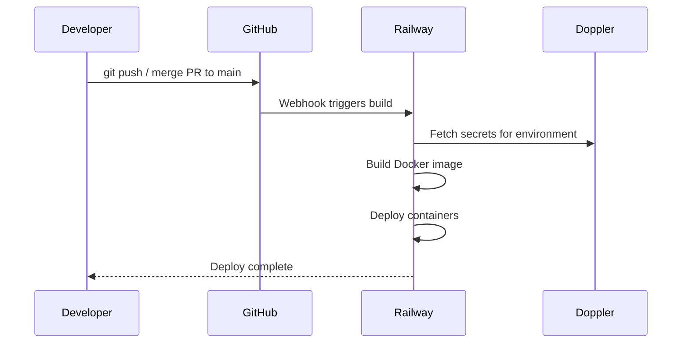

# Deployment & Railway

<Warning>
  **DormWay production runs on Railway — NOT AWS.** Never reference ECS, Fargate, Lambda, or any AWS service for production deploys. Historical docs may mention AWS ECS — those are outdated.
</Warning>

DormWay uses Railway for production hosting with Doppler for secret injection. Deployments are fully automated: merge to `main` and Railway picks it up.

## Deployment Flow



**Key rule:** Never deploy manually. Push to `main` and Railway handles the rest.

## Environments

| Doppler Config | Environment | Branch |
|----------------|-------------|--------|
| `prd` | Production | `main` |
| `stg` | Staging | `staging` |
| `dev` | Shared dev | feature branches |
| `dev_ethan` | Ethan's dev VM | personal |
| `dev_riley` | Riley's dev VM | personal |

Each environment has its own Neon database branch, Doppler config, and Railway service.

## Doppler Secret Management

All secrets live in Doppler — never in `.env` files, never committed to git.

### Working with Doppler

```bash
# Login and set up (one-time per machine)
doppler login
cd .repos/dormway-platform
doppler setup
# Select: project = dormway, config = dev_YOURNAME

# Verify it works
doppler run -- echo "OK"

# Print a specific secret
doppler secrets get DATABASE_URL --plain

# Inject secrets into a command
doppler run -- node my-script.js
```

### Adding / Updating Secrets

Add secrets in the Doppler dashboard at https://dashboard.doppler.com. Changes take effect on next deploy (Railway re-fetches secrets at build time).

<Note>
  Railway auto-deploys when Doppler pushes a new environment variable — no manual redeploy needed.
</Note>

### Secret Naming Conventions

| Pattern | Used For |
|---------|----------|
| `DATABASE_URL` | Read-only Neon connection (RLS enforced) |
| `DATABASE_URL_ADMIN` | Admin Neon connection (bypasses RLS) |
| `NEXT_PUBLIC_*` | Next.js client-side variables |
| `VITE_*` | Vite / Admin Dashboard variables |

**NEVER** use `DATABASE_URL` for write operations — use `DATABASE_URL_ADMIN`.

## Service Architecture on Railway

DormWay runs as multiple Railway services per environment:

| Service | Description |
|---------|-------------|
| `api-router` | Express.js API gateway (port 3001) |
| `engine` | Temporal workflow workers (port 3030) |
| `dormway-lockedin` | Next.js student app (port 3008) |
| `dormway-admin` | Vite admin dashboard (port 3004) |
| `dormway-crews` | Python AI agents (port 8000) |
| `ably-relay` | Real-time messaging relay (port 3032) |

Each service has its own Railway deployment with its own build configuration.

## Build Requirements per Service

### api-router

Standard Node.js build — Railway runs `npm ci && npm run build` automatically.

### engine

Requires two build steps (both must run after any Temporal changes):

```bash
npm run build           # Compile TypeScript
npm run build:workflow  # Bundle workflows for Temporal sandbox
```

### dormway-lockedin (Next.js)

Railway runs `npm run build` → outputs to `.next/`. Environment variables must be prefixed with `NEXT_PUBLIC_` for client-side access.

### dormway-crews (Python)

Railway runs `pip install -r requirements.txt` then starts the FastAPI server.

## Triggering a Deploy

### Normal deploy

```bash
git checkout -b feat/my-feature
# ... make changes ...
git push origin feat/my-feature
# Open PR, get review, merge to main
# Railway automatically deploys
```

### Check deploy status

Railway dashboard at https://railway.app — navigate to your project and check the deployment logs.

### Monitoring logs in production

Use Railway's built-in log viewer in the dashboard, or query via Railway CLI:

```bash
railway logs --service api-router
railway logs --service engine --tail 100
```

## Rolling Back

Railway keeps deployment history. To roll back:
1. Go to Railway dashboard → your service → Deployments
2. Find the previous successful deploy
3. Click "Redeploy"

## Environment Variables: What Each Service Needs

### api-router

Key variables (all injected via Doppler):

```
DATABASE_URL          # Neon read connection
DATABASE_URL_ADMIN    # Neon admin connection
TEMPORAL_ADDRESS      # Temporal Cloud endpoint
CLERK_SECRET_KEY      # Clerk JWT validation
ABLY_API_KEY          # Realtime messaging
```

### dormway-lockedin

```
NEXT_PUBLIC_API_BASE_URL          # relay.dormway.app (production)
NEXT_PUBLIC_CLERK_PUBLISHABLE_KEY
CLERK_SECRET_KEY
```

### dormway-admin

```
VITE_API_URL               # relay.dormway.app (production)
VITE_CLERK_PUBLISHABLE_KEY
```

<Warning>
  Never hardcode these values. All services must throw a clear startup error if required env vars are missing — no silent fallbacks to hardcoded defaults.
</Warning>

## Database: Neon PostgreSQL

Production uses Neon cloud-hosted PostgreSQL. There is no local or self-hosted PostgreSQL.

```bash
# Run a production query (requires DATABASE_URL_ADMIN in Doppler prd config)
cd .repos/dormway-platform
bash -c 'doppler run --config prd -- bash -c '\''psql "$DATABASE_URL_ADMIN" -c "SELECT COUNT(*) FROM accounts;"'\'''
```

### Running Migrations

```bash
cd .repos/dormway-platform

# Dry-run first
make db-migrate-dry

# Apply to production Neon
doppler run --config prd -- make db-migrate
```

Migrations live in `infrastructure/database/migrations/`. The runner tracks execution in the `migration_history` table and is idempotent — safe to re-run.

## Authentication: Clerk

DormWay uses Clerk for web authentication.

- **dormway-lockedin** and **dormway-admin** validate Clerk JWTs
- **Mobile apps** use device keys (no Clerk)
- **api-router** validates tokens from both sources

Historical docs mentioning Auth0 are outdated — Clerk is the current system.
