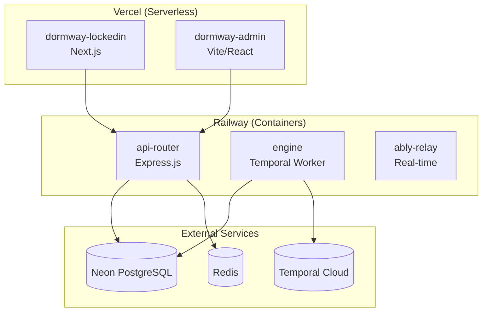

# Backend Scaling Runbook

_Last updated: 2026-01-04_

This runbook documents procedures for scaling DormWay backend services to handle increased load.

## Infrastructure Overview

| Service | Platform | URL |
|---------|----------|-----|
| api-router | Railway | https://railway.app |
| engine (Temporal) | Railway | https://railway.app |
| ably-relay | Railway | https://railway.app |
| dormway-lockedin | Vercel | https://vercel.com |
| dormway-admin | Vercel | https://vercel.com |
| Database | Neon PostgreSQL | https://console.neon.tech |
| Workflows | Temporal Cloud | https://cloud.temporal.io |



---

## When to Scale

### Proactive Scaling Triggers

| Metric | Threshold | Action |
|--------|-----------|--------|
| P95 latency | > 500ms sustained | Scale Railway services |
| Error rate | > 2% | Investigate first, then scale |
| Memory usage | > 80% | Increase Railway memory |
| Neon connections | > 80% of limit | Increase pool or Neon compute |
| Temporal workflow backlog | > 100 pending | Scale engine replicas |
| Vercel function timeouts | Increasing | Check API Router |

### Reactive Scaling Triggers

- Traffic spike (launch, viral moment, beginning of semester)
- Planned event (beta launch, campus onboarding)
- Incident requiring additional capacity

---

## Railway Service Scaling

### Railway Dashboard

**URL**: https://railway.app/project/[PROJECT_ID]

Railway auto-deploys from GitHub. For scaling:

1. Go to Railway Dashboard
2. Select the service (api-router, engine, etc.)
3. Click **Settings** tab
4. Adjust resources under **Resources**

### Scale via Railway CLI

```bash
# Install Railway CLI
npm install -g @railway/cli

# Login
railway login

# List services
railway status

# Scale service replicas (if using Pro plan)
railway scale api-router --replicas 2

# View logs
railway logs api-router
```

### api-router Scaling

**Current Config** (`services/api-router/railway.json`):
```json
{
  "deploy": {
    "restartPolicyType": "ON_FAILURE",
    "restartPolicyMaxRetries": 10
  }
}
```

**Scaling Options**:

| Setting | Default | Scaled |
|---------|---------|--------|
| Memory | 512MB | 1GB-2GB |
| CPU | 0.5 vCPU | 1-2 vCPU |
| Replicas | 1 | 2-4 (Pro plan) |

**To scale via Railway Dashboard:**
1. Go to api-router service
2. Settings → Resources
3. Increase Memory/CPU sliders
4. Changes deploy automatically

### engine (Temporal Worker) Scaling

**Scaling Options**:

| Setting | Default | Scaled |
|---------|---------|--------|
| Memory | 1GB | 2GB-4GB |
| CPU | 1 vCPU | 2 vCPU |
| Replicas | 1 | 2-3 (Pro plan) |

**When to scale engine:**
- Workflow backlog growing in Temporal Cloud
- Slow DayPlan generation (>30s)
- High activity processing latency

### Railway Environment Variables

**Note:** Most scaling settings are hardcoded in source code, not environment variables.

**Actual configurable env vars (set in Railway Dashboard):**

```env
# Temporal Cloud connection
TEMPORAL_NAMESPACE=dormway
TEMPORAL_ADDRESS=<your-temporal-cloud-address>
TEMPORAL_API_KEY=<your-api-key>

# Temporal timeouts (optional)
TEMPORAL_WORKFLOW_EXECUTION_TIMEOUT=30m
TEMPORAL_WORKFLOW_RUN_TIMEOUT=30m
TEMPORAL_ACTIVITY_START_TO_CLOSE_TIMEOUT=10m
```

**Settings configured in code (not env vars):**
- Connection pool: 20 max connections (in `dormway-core/src/adapters/database/postgres.adapter.ts`)
- Rate limits: See `api-router/src/middleware/rate-limit.ts`
- Worker concurrency: Temporal SDK defaults

---

## Vercel Scaling

### Vercel Dashboard

**URL**: https://vercel.com/[TEAM]/[PROJECT]

Vercel is serverless and scales automatically. Key settings:

### dormway-lockedin (Next.js)

**Settings to check:**
1. **Function Regions**: Deploy to regions near users
2. **Function Memory**: Increase from 1024MB if needed
3. **Function Duration**: Default 10s, max 60s (Pro)

**Via Vercel Dashboard:**
1. Go to Project Settings
2. Functions → Configure
3. Adjust memory/timeout per function

### dormway-admin (Vite)

Static site - scales automatically via Vercel Edge Network.

### Vercel Environment Variables

```env
# API endpoint (points to Railway api-router)
NEXT_PUBLIC_API_BASE_URL=https://api.dormway.app

# Increase if needed
VERCEL_FUNCTION_TIMEOUT=30
```

---

## Database Connection Pool Tuning

### Current Configuration

From `dormway-core/src/adapters/database/postgres.adapter.ts`:

```typescript
const DEFAULT_OPTIONS = {
  maxConnections: 20,      // Max connections per service instance
  idleTimeoutMs: 30000,    // Close idle connections after 30s
  connectionTimeoutMs: 2000, // Fail if can't connect in 2s
};
```

### Connection Math

| Service | Instances | Connections/Instance | Total |
|---------|-----------|---------------------|-------|
| api-router | 1 | 20 | 20 |
| engine | 1 | 20 | 20 |
| **Total** | - | - | **40** |

**Neon Free Tier**: 100 concurrent connections
**Neon Pro Tier**: Higher limits based on compute size

### Adjusting Pool Size

**Option 1: Railway Environment Variable**

In Railway Dashboard → Service → Variables:
```
DATABASE_POOL_SIZE=30
```

Redeploy to apply.

**Option 2: SystemConfigService (no restart)**

Via Admin UI (`/system-settings`) or API.

### Connection Exhaustion Recovery

```bash
# Check active connections in Neon
# Neon Console > Project > Monitoring > Active Connections

# Or via psql
echo "SELECT count(*) FROM pg_stat_activity WHERE state = 'active';" | \
  bash -c 'doppler run -- bash -c '\''psql "$DATABASE_URL_ADMIN"'\'''
```

**Quick fixes:**
1. Restart affected Railway service (releases connections)
2. Scale down replicas temporarily
3. Increase Neon compute size (more connection slots)

---

## Neon Database Scaling

### Autoscaling Configuration

Neon autoscales compute within configured bounds.

**Via Neon Console:**
1. Go to https://console.neon.tech
2. Select project → Branches → main
3. Click compute endpoint → Edit
4. Adjust:
   - **Min Compute**: 0.25 CU (scales to zero)
   - **Max Compute**: Up to 8 CU
   - **Autosuspend**: After idle period

### Compute Units (CU) Guidance

| Active Users | Recommended Max CU |
|--------------|-------------------|
| < 100 | 0.5 CU |
| 100-500 | 1 CU |
| 500-1000 | 2 CU |
| > 1000 | 4 CU |

### Query Performance Under Load

```sql
-- Check slow queries
SELECT pid, now() - pg_stat_activity.query_start AS duration, query
FROM pg_stat_activity
WHERE state = 'active'
ORDER BY duration DESC
LIMIT 10;

-- Check connection count
SELECT count(*) FROM pg_stat_activity;

-- Kill runaway query
SELECT pg_cancel_backend(PID);
```

---

## Temporal Workflow Scaling

### Task Queue Architecture

From `engine/src/config.ts`:

```typescript
taskQueues: {
  student: 'student-worker',      // StudentWatcher, DayPlan
  campus: 'campus-worker',        // Campus sync, enrichment
  city: 'city-worker',            // City sync, weather
  syllabus: 'syllabus-processor', // Syllabus parsing
  semester: 'semester-processor', // Semester overlays
  // ... 18 total queues
}
```

### Monitoring Workflow Health

**Temporal Cloud UI:**
- https://cloud.temporal.io/namespaces/dormway/workflows

**Key metrics:**
- Running workflows count
- Schedule backlog (pending workflows)
- Activity failure rate
- Workflow execution latency

### Scaling Temporal Workers

Each Railway engine instance runs workers for all 14 active task queues.

**Resource-Based Auto-Tuning:**

All workers use Temporal's resource-based tuner (configured in `engine/src/index.ts`):

```typescript
const resourceBasedTunerOptions: ResourceBasedTunerOptions = {
  targetMemoryUsage: 0.8,  // Target 80% memory utilization
  targetCpuUsage: 0.9,     // Target 90% CPU utilization
};
```

This automatically adjusts concurrent activity slots based on available resources:
- More headroom → More concurrent activities
- Resource pressure → Throttles back automatically

**To increase throughput:**

1. **Vertical scaling** (increase Railway resources)
   - Railway Dashboard → engine service → Settings
   - Increase memory/CPU → tuner allows more concurrent activities
   - Cost-effective for moderate load increases

2. **Horizontal scaling** (add Railway replicas)
   - Railway Dashboard → engine service → Settings → Replicas
   - Each replica runs all 14 workers independently
   - Best for high load / redundancy

3. **Adjust tuner targets** (code change)
   - Increase `targetMemoryUsage` (e.g., 0.85) if memory is underutilized
   - Increase `targetCpuUsage` (e.g., 0.95) if CPU is underutilized
   - Requires rebuild and redeploy

**Temporal timeout env vars (optional):**
```env
TEMPORAL_WORKFLOW_EXECUTION_TIMEOUT=30m  # Default
TEMPORAL_WORKFLOW_RUN_TIMEOUT=30m        # Default
TEMPORAL_ACTIVITY_START_TO_CLOSE_TIMEOUT=10m  # Default
```

### Workflow Backlog Handling

If workflows are backing up:

```bash
# Check Temporal Cloud UI for:
# - Workflows with status=Running for too long
# - Repeated activity retries

# Signal stuck StudentWatcher to retry
temporal workflow signal \
  --namespace dormway \
  --workflow-id "student-watcher-{userId}" \
  --name "generate_plan"
```

---

## Rate Limiting Configuration

### Current Limits

From `api-router/src/middleware/rate-limit.ts`:

| Endpoint | Window | Max Requests | Key |
|----------|--------|--------------|-----|
| Global | 10 sec | 60 | user_id or IP |
| Dashboard composite | 10 sec | 20 | user_id or IP |
| Telemetry | 10 sec | 50 | user_id:telemetry |
| GraphQL | 10 sec | 30 | user_id or IP |

### Adjusting Rate Limits

**Rate limits are configured in code**, not environment variables:

```typescript
// In api-router/src/middleware/rate-limit.ts
rateLimit({ windowSec: 10, max: 60 })  // Global default
```

**To adjust limits:**
1. Modify rate limit values in `api-router/src/middleware/rate-limit.ts`
2. Redeploy api-router to Railway

**For load testing:** Temporarily comment out rate limit middleware in route files.

---

## Pre-Launch Scaling Checklist

Before a major traffic event:

- [ ] Scale api-router memory to 1GB+
- [ ] Scale engine memory to 2GB+
- [ ] Verify Neon autoscaling max is adequate (2+ CU)
- [ ] Check Vercel function configuration
- [ ] Verify rate limits are appropriate
- [ ] Check connection pool headroom (< 70% used)
- [ ] Review Temporal workflow backlog (should be 0)
- [ ] Set up monitoring alerts for load event

### Post-Launch Checklist

After traffic normalizes (wait 30+ minutes):

- [ ] Review performance metrics
- [ ] Identify any bottlenecks hit
- [ ] Scale down Railway resources (cost savings)
- [ ] Document lessons learned
- [ ] Update this runbook if needed

---

## Monitoring During Scale Events

### Key Dashboards

| Tool | URL | Key Metrics |
|------|-----|-------------|
| Railway | https://railway.app | CPU, memory, requests |
| Vercel | https://vercel.com | Function invocations, errors |
| Sentry | https://sentry.io/organizations/dormway/ | Error rate, P95 latency |
| Temporal | https://cloud.temporal.io/namespaces/dormway | Workflow rate, failures |
| Neon | https://console.neon.tech | CPU, connections, query latency |

### Quick Health Check

```bash
# Check API health
curl -s https://api.dormway.com/health | jq

# Check Railway service status
railway status

# Check Vercel deployment status
vercel ls
```

---

## Rollback Procedures

### Railway Rollback

**Via Dashboard:**
1. Go to service → Deployments
2. Find previous successful deployment
3. Click "Redeploy"

**Via CLI:**
```bash
railway rollback api-router
```

### Vercel Rollback

**Via Dashboard:**
1. Go to project → Deployments
2. Find previous deployment
3. Click "..." → Promote to Production

**Via CLI:**
```bash
vercel rollback
```

---

## Cost Considerations

### Railway Pricing (as of Jan 2026)

| Resource | Cost |
|----------|------|
| Memory | $10/GB/month |
| CPU | $20/vCPU/month |
| Network | $0.10/GB egress |

**Tip**: Scale down after traffic events to reduce costs.

### Vercel Pricing

| Plan | Included | Overage |
|------|----------|---------|
| Pro | 1M function invocations | $0.60/100K |
| Pro | 100GB bandwidth | $0.15/GB |

### Neon Pricing

| Plan | Compute | Storage |
|------|---------|---------|
| Free | 0.25 CU, 191h/month | 0.5 GB |
| Pro | Autoscale up to 8 CU | Pay per GB |

---

## Related Documents

- [Incident Handling](/docs/operations/runbooks/incident-handling)
- [Monitoring Triage](/docs/operations/runbooks/monitoring-triage)
- [How DormWay Works](/docs/engineering/architecture/how-dormway-works)
