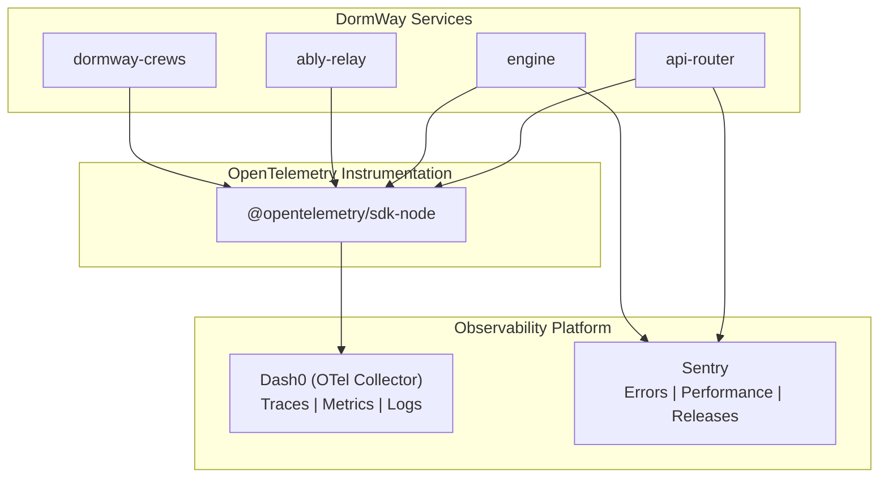

# Monitoring Triage Runbook

_Last updated: 2026-01-04_

This runbook documents procedures for monitoring system health and triaging alerts.

## Observability Stack Overview



### Monitoring Tools

| Tool | Purpose | URL | Key Metrics |
|------|---------|-----|-------------|
| **Sentry** | Error tracking | https://sentry.io/organizations/dormway/ | Error rate, P95 latency |
| **Dash0** | Traces & metrics | https://app.dash0.com | Request latency, throughput |
| **Temporal Cloud** | Workflow health | https://cloud.temporal.io/namespaces/dormway | Workflow failures, queue depth |
| **Neon Console** | Database health | https://console.neon.tech | Query latency, connections |
| **Health Endpoints** | Service availability | /health on each service | Up/down status |

---

## Daily Monitoring Checklist

### Morning Check (9:00 AM)

- [ ] **Sentry Dashboard**: Check for new issues overnight
  - https://sentry.io/organizations/dormway/issues/
  - Filter by "First Seen: Last 24 hours"

- [ ] **Temporal Workflows**: Check for failed workflows
  - https://cloud.temporal.io/namespaces/dormway/workflows?status=Failed
  - Review any StudentWatcher or DayPlan failures

- [ ] **Service Health**: Quick health check
  ```bash
  curl -s https://api.dormway.com/health | jq
  ```

- [ ] **DayPlan Generation**: Verify morning plans generated
  - Check Temporal for StudentWatcher completions around 5:00 AM
  - Verify no widespread failures

### Continuous Monitoring

| Metric | Normal Range | Alert Threshold | Action |
|--------|-------------|-----------------|--------|
| Error rate | < 1% | > 5% | Investigate Sentry |
| P95 latency | < 500ms | > 2s | Check slow queries |
| Workflow failures | < 1% | > 5% | Check Temporal |
| Database connections | < 80% | > 90% | Scale or optimize |

---

## Alert Triage Procedure

### Step 1: Receive Alert

Alerts arrive via:
- **Sentry**: Email + Slack #alerts
- **Dash0**: Dashboard alerts
- **Synthetic checks**: Health endpoint failures

### Step 2: Classify Alert

| Alert Type | Severity | Response |
|------------|----------|----------|
| Service down | SEV-1/SEV-2 | Immediate escalation |
| Error spike (>10x normal) | SEV-2 | Investigate within 1 hour |
| Performance degradation | SEV-3 | Investigate within 4 hours |
| Single error instance | SEV-4 | Review in next business day |
| Informational | N/A | Log and archive |

### Step 3: Initial Investigation

#### For Error Alerts (Sentry)

```bash
# 1. Go to Sentry issue
# https://sentry.io/organizations/dormway/issues/[ISSUE_ID]/

# 2. Check:
# - Error message and stack trace
# - Affected users/sessions
# - Browser/device breakdown
# - Release version

# 3. Check if related to recent deployment
cd .repos/dormway-platform
git log --oneline -5

# 4. Check logs for context
make logs s=api-router | grep -i error | tail -50
```

#### For Performance Alerts (Dash0)

```bash
# 1. Go to Dash0 dashboard
# https://app.dash0.com/

# 2. Check:
# - Which endpoints are slow
# - When did slowdown start
# - Is it correlated with traffic spike

# 3. Check database queries
# Connect to Neon and check slow query log
```

#### For Workflow Alerts (Temporal)

```bash
# 1. Go to Temporal Cloud
# https://cloud.temporal.io/namespaces/dormway/workflows

# 2. Filter by status=Failed

# 3. Click into failed workflow
# - Check error message
# - Review event history
# - Identify failing activity

# 4. Common fixes:
# - Signal workflow to retry
# - Fix data issue and signal
# - Cancel and restart workflow
```

### Step 4: Document & Escalate

If alert requires action:
1. Create Linear ticket with findings
2. Assign to appropriate team member
3. If SEV-1/SEV-2: Follow [Incident Handling](/docs/operations/runbooks/incident-handling)

---

## Monitoring Dashboards

### Sentry Views

| View | Purpose | URL |
|------|---------|-----|
| Issues | Active errors | /issues/ |
| Performance | Latency trends | /performance/ |
| Releases | Deployment tracking | /releases/ |
| Alerts | Alert rules | /alerts/rules/ |

### Dash0 Dashboards

| Dashboard | Metrics | Key Indicators |
|-----------|---------|----------------|
| Overview | All services | Request rate, error rate |
| API Router | BFF endpoints | Latency by endpoint |
| Engine | Temporal activities | Activity duration |
| Database | Query performance | Query latency |

### Temporal Views

| View | Shows | Action |
|------|-------|--------|
| Running Workflows | Active work | Normal, monitor queue depth |
| Failed Workflows | Errors | Investigate each failure |
| Workflow History | Event timeline | Debug specific workflow |

---

## Common Alert Patterns

### Pattern: Error Spike After Deployment

**Symptoms:**
- Sentry shows new errors
- Errors started at deployment time
- Single error type, high volume

**Triage:**
1. Identify the error in Sentry
2. Correlate with deployment time
3. Check if rollback needed
4. See [Incident Handling](/docs/operations/runbooks/incident-handling#quick-mitigation-options)

### Pattern: Slow Database Queries

**Symptoms:**
- High latency on multiple endpoints
- Dash0 shows slow traces
- Database as common factor

**Triage:**
```sql
-- Check for long-running queries
SELECT pid, now() - pg_stat_activity.query_start AS duration, query
FROM pg_stat_activity
WHERE state = 'active'
ORDER BY duration DESC
LIMIT 10;

-- Check for missing indexes
SELECT relname, seq_scan, idx_scan
FROM pg_stat_user_tables
WHERE seq_scan > idx_scan
ORDER BY seq_scan DESC
LIMIT 10;
```

### Pattern: Temporal Workflow Failures

**Symptoms:**
- Workflows failing at specific activity
- Same error repeated across workflows
- User data not updating

**Triage:**
1. Check Temporal UI for failure pattern
2. Identify failing activity
3. Check activity logs
4. Common causes:
   - External service down
   - Database connection issues
   - Invalid data from upstream

### Pattern: Memory/Resource Exhaustion

**Symptoms:**
- Services restarting (OOM kills)
- Gradual performance degradation
- ECS task failures

**Triage:**
```bash
# Check ECS task status
aws ecs describe-tasks \
  --cluster dormway-cluster \
  --tasks $(aws ecs list-tasks --cluster dormway-cluster --service dormway-api-router-service --query 'taskArns[0]' --output text)

# Check CloudWatch for memory metrics
```

---

## Health Check Reference

### Endpoint Details

```bash
# API Router
GET https://api.dormway.com/health
Response: {"status":"ok","timestamp":"...","version":"..."}

# Internal services (via Docker network)
GET http://engine:3030/health
GET http://ably-relay:3032/health
```

### Custom Health Checks

API Router health includes:
```typescript
// From: services/api-router/src/routes/health-routes.ts
{
  status: "ok",
  timestamp: new Date().toISOString(),
  version: process.env.GIT_COMMIT || "unknown",
  services: {
    database: "connected" | "disconnected",
    redis: "connected" | "disconnected",
    temporal: "connected" | "disconnected"
  }
}
```

---

## Scheduled Monitoring Tasks

| Task | Frequency | Owner | Documentation |
|------|-----------|-------|---------------|
| Daily health review | Daily 9 AM | On-call | This runbook |
| Weekly error review | Monday | Engineering | Sentry triage |
| Monthly metrics review | 1st of month | Engineering Lead | Performance report |
| Quarterly capacity planning | Quarterly | Platform | Infrastructure review |

---

## Alert Configuration

### Sentry Alert Rules

| Rule | Trigger | Action |
|------|---------|--------|
| Error spike | >100 events in 1 hour | Slack #alerts |
| New issue | First occurrence | Email + Slack |
| Regression | Fixed issue recurs | Slack #alerts |
| Performance | P95 > 3s | Slack #alerts |

### Recommended Dash0 Alerts

| Metric | Condition | Severity |
|--------|-----------|----------|
| Request error rate | > 5% for 5 min | SEV-2 |
| P95 latency | > 2s for 5 min | SEV-3 |
| Request rate drop | < 50% of baseline | SEV-2 |
| Trace errors | > 10% for 5 min | SEV-3 |

---

## Runbook Maintenance

Update this runbook when:
- New monitoring tools added
- New services deployed
- Alert thresholds changed
- New alert patterns identified

---

## Related Documents

- [Incident Handling](/docs/operations/runbooks/incident-handling)
- [Production Operations](/docs/operations/runbooks/production-operations)
- [OpenTelemetry and Dash0 Implementation](/docs/engineering/technical/telemetry-and-analytics/opentelemetry-and-dash0-implementation)
- [Third-Party Tools & Services Inventory](/docs/engineering/architecture/third-party-tools-services-inventory)
