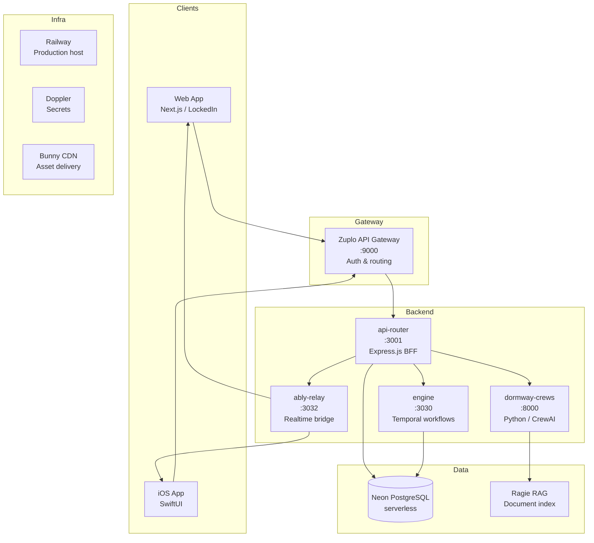
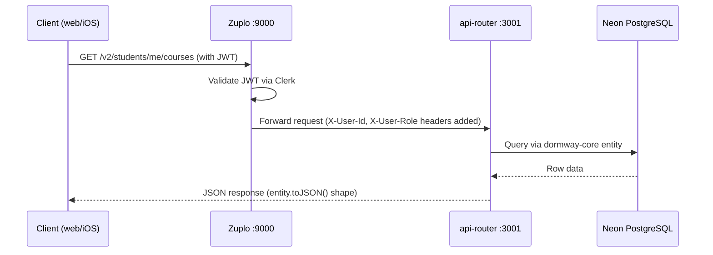
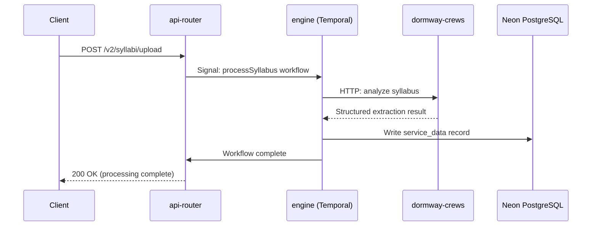

# Platform Architecture

DormWay is a multi-service platform. This page gives a high-level map of how the services connect, where data lives, and how requests flow from a student's device to the database and back.

For deep implementation details on specific services, see the [Engineering Reference](/docs/engineering) section.

---

## Service Map

---

## Services

### Zuplo API Gateway (port 9000)

The public entry point for all client requests. Handles:
- JWT validation via Clerk
- User identity enrichment (injects `X-User-Id` and `X-User-Role` headers)
- Rate limiting and routing
- All traffic from web and iOS passes through Zuplo before reaching api-router

### api-router (port 3001)

The primary backend service — an Express.js BFF (Backend for Frontend). Responsibilities:
- Serves all `/v2/` API endpoints consumed by web and iOS
- Composes data from multiple sources into client-ready responses (BFF pattern)
- Manages Canvas LMS integration: syncs courses, assignments, grades
- Handles auth-aware database queries via dormway-core entities
- Triggers Temporal workflow signals and queries
- Publishes realtime events to Ably

### engine (port 3030)

The Temporal workflow host. Long-running and scheduled work runs here:
- **StudentWatcher** — Digital twin per student; monitors schedule, triggers day plan generation
- **DayPlan generation** — Runs at 05:00 campus local time each day
- **Syllabus processing** — Orchestrates syllabus crew jobs from upload to database insertion
- **Campus and term lifecycle** — Semester transitions, academic calendar management
- **Canvas sync workflows** — Periodic and on-demand LMS data refresh

### dormway-crews (port 8000)

Python microservice built on the CrewAI multi-agent framework. Handles AI-intensive batch work:
- Syllabus analysis: extracts deadlines, grading policies, professor insights, peak weeks
- Crew document Q&A: indexes uploaded files in Ragie and answers member questions with streaming responses
- Called by the engine via HTTP; results written back to the database

### ably-relay (port 3032)

A thin service that bridges api-router events to Ably channels. Clients subscribe to channels named by their user or context ID and receive live pushes for:
- Grade postings
- New assignments
- Schedule changes
- Context transitions (current class, next event)

---

## Data Layer

### Neon PostgreSQL

All persistent data lives in a single Neon serverless PostgreSQL database. Key tables:

| Table | Purpose |
|-------|---------|
| `accounts` | User accounts (linked to Clerk) |
| `contexts` | Hierarchical entity store — cities, campuses, buildings, courses, students |
| `student_time_blocks` | All scheduled events: classes, assignments, focus blocks, personal events |
| `service_data` | Time-series data from external services (Canvas, syllabus crews); partitioned by month |
| `crews` / `crew_members` | Crews collaboration data |

The **contexts table** is the backbone of DormWay's data model. A context can be a city, campus, building, course, or student — with a consistent `type` field and hierarchical parent/child relationships. This lets the entire platform reason about "where a student is" and "what they're enrolled in" through one unified model.

### dormway-core

A shared TypeScript library (not a running service) used by both api-router and engine. It contains:
- Entity classes with `toJSON()` serialization (the source of truth for API response shapes)
- Factory methods for common database query patterns
- Domain services for campus, term, course, and student logic
- All database access in application code must go through dormway-core — no raw SQL in routes or activities

---

## Request Flow

A typical API request from a student's device:

For data that requires AI processing (syllabus analysis, Crews document Q&A), the flow extends through the engine and dormway-crews:

---

## Infrastructure

| Concern | Solution |
|---------|---------|
| Production hosting | Railway (all services) |
| Secrets management | Doppler (configs: `prd`, `stg`, `dev`, per-developer branches) |
| Database | Neon PostgreSQL (serverless, branch-per-developer for local dev) |
| Asset delivery | Bunny CDN |
| Realtime | Ably pub/sub |
| Authentication | Clerk |
| Observability | OpenTelemetry distributed tracing; PortKey for LLM call monitoring |

### Environment Model

Doppler holds all secrets and injects them at runtime. Each developer has their own Neon branch (via Doppler config `dev_<name>`), so local development runs against a full isolated copy of the schema with no shared state.

Railway auto-deploys on push. Doppler changes (new env var) trigger a Railway redeploy automatically — no manual redeploy needed.

---

## BFF Pattern

api-router is a BFF (Backend for Frontend). Each `/v2/` endpoint is designed for a specific client view — it fetches from multiple database tables, joins with external data (Canvas, campus metadata), applies business logic, and returns a single composed response.

This means the client does not orchestrate multiple API calls. A single request to `/v2/students/me/dashboard` returns everything the dashboard needs to render. The BFF layer absorbs the complexity of data composition so clients stay simple.

---

## Web App Rendering

The web app (`dormway-lockedin`) uses Next.js App Router. Architecture contracts:

- `page.tsx` and `layout.tsx` files are server components by default
- `'use client'` is added only at leaf-level interactivity boundaries
- Deterministic route redirects execute on the server (`redirect()`)
- Root layout hosts only truly global providers (query client, theme, Clerk)
- Dashboard-specific concerns (realtime, analytics) are scoped below the dashboard route boundary

This keeps initial page loads fast and prevents non-dashboard routes from loading dashboard-heavy runtimes.
