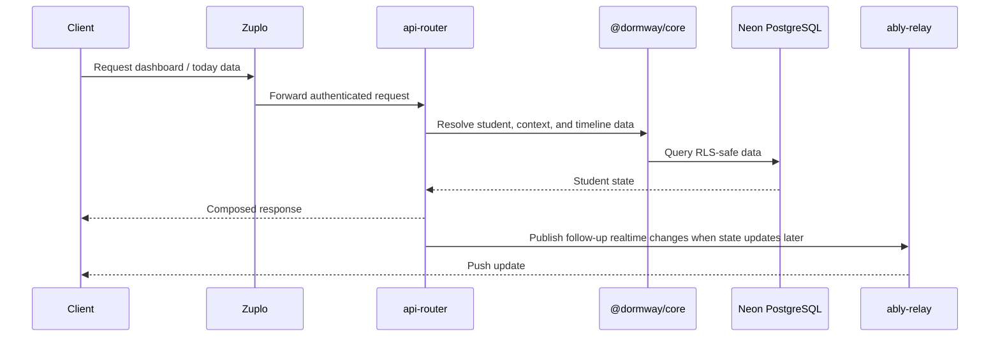
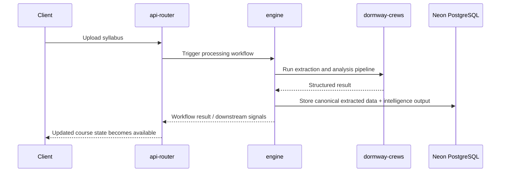

# Platform Architecture

DormWay looks simple on the surface because the complexity is pushed underneath it. Students see Today, Tasks, Schedule, Courses, and Ace. Underneath that is a service graph that keeps each student's academic state current over time.

This page focuses on the **logical architecture** and the contracts between systems. Deployment topology changes more often than the product model, so the service boundaries matter more than any one hosting diagram.

## Consumer Surface Map

Before the backend service map, this diagram shows the current client-facing footprint across pre-auth, onboarding, iOS, and web surfaces. It is broader than the canonical navigation IA, so flagged or secondary surfaces can appear here even when they are not part of the five-item top-level navigation contract.


---

## Service Map

```mermaid
graph TD
    subgraph Clients
        W[LockedIn web<br/>Next.js]
        IOS[iPhone and iPad app<br/>SwiftUI]
    end

    subgraph Edge
        Z[Zuplo gateway<br/>auth, routing, rate limits]
    end

    subgraph App Layer
        API[api-router<br/>Express BFF]
        CORE[@dormway/core<br/>shared entities + domain logic]
        RELAY[ably-relay<br/>realtime bridge]
        CREWS[dormway-crews<br/>AI batch pipelines]
    end

    subgraph Workflow Layer
        ENG[engine<br/>Temporal workers + schedules]
        SW[StudentWatcher<br/>per-student workflows]
        DPR[DayPlanRouter<br/>global timed delivery router]
        PS[Pre-semester dispatch<br/>cohort reminders]
    end

    subgraph Data and Integrations
        DB[(Neon PostgreSQL)]
        RR[(Read replica<br/>eligible reads)]
        RAG[Ragie / document index]
        EXT[Canvas, calendars,<br/>campus and city data]
        CIO[Customer.io]
    end

    W --> Z
    IOS --> Z
    Z --> API
    API --> CORE
    API --> DB
    API --> RR
    API --> RELAY
    API --> ENG
    API --> EXT
    ENG --> SW
    ENG --> DPR
    ENG --> PS
    SW --> DB
    ENG --> CREWS
    ENG --> EXT
    ENG --> CIO
    DPR --> CIO
    PS --> CIO
    CREWS --> RAG
    RELAY --> W
    RELAY --> IOS
```

---

## Services

### Clients

- **LockedIn web** is the student-facing Next.js app inside `dormway-platform`
- **iPhone and iPad** use the native SwiftUI app in `ios-clean`
- Both surfaces are trying to answer the same student question with different density and interaction models

### Zuplo Gateway

Zuplo is the public edge for client traffic. It handles request validation, routing, and identity enrichment before requests reach application services.

### `api-router`

`api-router` is the main Backend for Frontend. It is where client-oriented endpoints get composed for web and iOS. Responsibilities include:

- Serving the main authenticated API surface
- Joining data from multiple sources into client-ready payloads
- Triggering Temporal signals and workflow queries
- Coordinating realtime event publication
- Handling integrations and business logic that should not live in the client

This is also where the current codebase still carries some legacy direct database access. The target architecture centralizes domain behavior in `@dormway/core`, but that migration is not yet 100% complete.

### `@dormway/core`

`@dormway/core` is the shared domain library used by the backend services. It owns the most important entity and context contracts:

- Context graph traversal
- Shared entity serialization
- Domain services for students, terms, courses, and campus logic
- RLS-aware and admin-aware database access patterns

### `engine`

`engine` is the workflow runtime built on Temporal. It owns the long-running and scheduled work that should survive restarts and keep student state fresh over time.

Major responsibilities include:

- StudentWatcher workflows
- Day plan generation
- Sync orchestration and recurring schedules
- Syllabus-processing orchestration
- Term and campus lifecycle workflows
- Notification timing and downstream triggers

As of the April 2026 watcher work, the engine layer is no longer only "StudentWatcher plus cron." It now also includes the first dedicated timed-delivery router path (`DayPlanRouter`) backed by durable delivery intents.

As of the May 2026 pre-semester work, the engine also owns verified cohort-event dispatch. Admin-reviewed campus deadline rows start deterministic dispatcher workflows that sleep until their computed send time and then render through Customer.io.

### StudentWatcher

StudentWatcher is the most important architectural unit in DormWay. Each student gets a durable workflow that can run for months, receive signals, evaluate sync cadence, and coordinate downstream work without being reduced to a simple cron entry.

The current direction is to keep StudentWatcher as the **student state owner** while moving timer-heavy delivery into domain routers. That split matters when you reason about new timed features: not every reminder or send should live in the watch loop anymore.

### `dormway-crews`

`dormway-crews` handles AI-heavy batch workflows such as syllabus analysis and document-grounded Q&A. It is called from the workflow layer rather than directly from clients.

### `ably-relay`

`ably-relay` turns application events into realtime channel updates for the clients. That is how changes in assignments, grades, plans, or context can reach students without forcing constant polling.

### Flag and rollout control

DormWay now has a production-ready three-layer rollout model:

- **Hypertune** for client-side flags and exposure tracking
- **`system_config`** for server-side kill switches and operational toggles
- **`campus_configs.feature_flags`** for per-campus overrides

This is part of the platform architecture, not only a growth detail, because public surfaces and routed delivery paths are being shipped behind those controls.

---

## Core Data Contracts

### Neon PostgreSQL

Neon-backed PostgreSQL is the canonical data layer. Important contracts include:

| Table / concept | Role |
|-----------------|------|
| `contexts` + `context_dependencies` | The tree-plus-graph model for cities, campuses, buildings, students, and courses |
| `student_time_blocks` / `time_blocks` | The normalized schedule layer |
| `service_data` | Time-series and ingestion output store used across sync and intelligence flows |
| `migration_history` | Schema migration tracking |

Read-heavy paths are being migrated to explicit read helpers rather than implicit primary reads. Public campus pages, mobile campus discovery, dashboard Aurora reads, and many authenticated mobile GET paths now use `readQuery`, `readQueryWithSession`, or `readQuerySingleWithSession` so eligible traffic can use a read pool while writes stay on the primary.

See [Schedule Runtime Reliability](/docs/engineering/schedule-runtime-reliability) for the current read-replica and schedule-processing contracts.

### Context graph

DormWay's context model is one of its defining architectural choices. The system reasons about cities, campuses, buildings, courses, and students through one graph-backed model instead of a pile of disconnected tables.

### RLS and admin access

The platform uses separate access patterns for student-safe and admin-level queries:

- Standard application access uses `DATABASE_URL` with RLS semantics
- Admin and workflow paths can use `DATABASE_URL_ADMIN`
- Session-bound queries set user and role context explicitly

---

## Key Flows

### Student asks "what matters now?"



### Student uploads a syllabus



---

## Scheduled and Realtime Contracts

The architecture depends on a few recurring contracts being true:

- Sync schedules are provisioned and managed through Temporal
- StudentWatcher loops continuously and uses `continueAsNew` to stay healthy over long periods
- Realtime updates move through Ably channels
- The context graph, not just flat task tables, drives personalization and campus awareness

Supporting services such as `canvas-sync`, `trigger`, and plugin-runner schedules fill in specialized orchestration and automation paths around the core system.

---

## Why It Is Built This Way

DormWay's architecture is opinionated because the product promise is opinionated. A student should not have to manually maintain a planner, manually refresh multiple tools, or guess which source is right.

The architecture exists to make the surface feel simpler than the underlying reality. That is the product standard the system is serving.
