```mermaid
sequenceDiagram
    participant Student
    participant API Router
    participant Engine
    participant Course Activity
    participant DB

    Student->>API Router: POST /api/schedule/import
    API Router->>Engine: Trigger scheduleImportWorkflow
    Engine->>Course Activity: createCourseContexts("ENTR 490 105")
    Course Activity->>DB: Search contexts by aliases
    DB-->>Course Activity: No match
    Course Activity->>DB: INSERT context (source=schedule_import, section="105")
    DB-->>Course Activity: contextId1
    Course Activity->>DB: INSERT enrollment (student → contextId1)

    Note over Student: Later...
    Student->>API Router: POST /api/canvas/sync
    API Router->>Engine: Trigger canvasFullSyncWorkflow
    Engine->>Course Activity: syncCanvasCourses()
    Course Activity->>Course Activity: findExistingCourseContext("ENTR 490")
    Course Activity->>DB: Search contexts by aliases
    DB-->>Course Activity: Found contextId1 (source=schedule_import)
    Course Activity->>Course Activity: Prefer existing non-Canvas source (line 105)
    Course Activity->>DB: UPDATE context (canvas_course_id=123, preserve section="105")
    DB-->>Course Activity: contextId1 (enriched)
    Course Activity->>DB: UPSERT enrollment (student → contextId1)
```

# Course Context Creation - Implementation Plan (DORM-455)

#implementation-plan #course-contexts #dorm-455 #architecture #temporal-workflows

**Created**: 2025-10-29
**Status**: Design Phase
**Priority**: High
**Related**: [Engineering/Architecture/Contexts System](/docs/engineering/architecture/sot-context-system), [Operations/Bug Reports/Course Deduplication Issues](/docs/operations/bug-reports/course-deduplication-issues)

---

## 📋 Overview

### Problem Statement
Course context creation is currently fragmented across multiple pathways (Canvas sync, schedule import, syllabus upload, calendar imports) with NO centralized normalization or deduplication logic. This leads to:

- **Duplicate course contexts** for the same course from different sources
- **Data conflicts** when Canvas says "ENTR 490" but schedule says "ENTR 490 105 FA 2025"
- **Lost data** when updates from one source overwrite another
- **Inconsistent behavior** across pathways
- **No clear authority rules** for which source wins for each field

### Solution Approach
Design ONE centralized Temporal activity (`upsertCourseContext`) that black-boxes ALL course context creation logic:
- Course normalization (CS 101 vs CS101 vs Computer Science 101)
- Deduplication across sources
- Data merging/enrichment
- Authority rules (which source wins for each field)
- Global vs student-specific data separation

---

## 🔍 Current State Analysis

### ✅ CRITICAL QUESTIONS VERIFIED

**Verified from codebase (2025-10-29):**

#### 1. **What creates course contexts?**

| Source | Creates Course Context? | Data Quality | Code Reference |
|--------|------------------------|--------------|----------------|
| **Schedule Import** | ✅ YES | Rich (course codes, sections) | `scheduleImport.workflow.ts:751-784` calls `createCourseContexts()` |
| **Canvas PAT** | ✅ YES | Rich (full LMS metadata) | `canvas.activities.ts:537` calls `createCourseContexts()` |
| **Syllabus Upload** | ✅ YES | Rich (extracted course info) | `syllabusProcessor.workflow.ts:1249,1753` calls `syllabusActivities.createCourseContext()` |
| **Google Calendar** | ❌ NO | Poor (just event titles) | `studentProcessor.workflow.ts:520-523` - `contextId: undefined` |
| **ICS Import** | ❌ NO | Poor (just event titles) | `scheduleImport.workflow.ts:57` → `normalizeAndStoreCalendarData(contextId: undefined)` |

#### 2. **Canvas Sync Behavior**

**When course context exists:**
- Lines 512-514: Finds existing context via `findExistingCourseContext()`
- Lines 653-669: Enriches with Canvas metadata (preserves existing data)
- Prefers non-Canvas sources (line 105 comment)

**When NO course context exists:**
- Lines 520-537: Adds to `pendingCourses[]`
- **Line 537: CALLS `createCourseContexts()`** - Canvas DOES create course contexts!
- This ONLY works with Canvas Personal Access Token (full API access)
- Canvas ICS feed does NOT create contexts (insufficient data)

#### 3. **Calendar Integration (CURRENT GAP)**

**Google Calendar & ICS imports:**
- Create `student_time_blocks` records
- **Do NOT link to course contexts** (`context_id = undefined`)
- Store event titles like "CS 101 Lecture" but no structured course codes
- **GAP**: Should fuzzy match event titles to existing course contexts

**Evidence:**
```typescript
// studentProcessor.workflow.ts:520-523
const googleCalendarResult = await calendarActivities.normalizeAndStoreCalendarData(
  'google',
  calendarData.events,
  undefined, // No context ID for personal calendars  ← THIS IS THE GAP
  ...
);
```

#### 4. **Data Sources Summary**

**Primary Context Creators (Rich Data):**
- Schedule Import → `createCourseContexts()`
- Canvas PAT → `createCourseContexts()`
- Syllabus Upload → `syllabusActivities.createCourseContext()`

**Secondary Data (Poor Quality - Time Blocks Only):**
- Google Calendar → time blocks, NO contexts
- ICS Import → time blocks, NO contexts
- Canvas ICS Feed → time blocks, NO contexts (insufficient metadata)

**DORM-455 Implementation Must:**
1. Unify the three context creators into ONE `upsertCourseContext()` activity
2. Add fuzzy matching for calendar events → existing course contexts
3. Handle Canvas PAT vs Canvas ICS (different data quality)

### Existing Course Context Code Locations

#### 1. **Schedule Import Workflow** (`services/engine/src/workflows/scheduleImport.workflow.ts`)
- **Lines 751-784**: Creates course contexts via `createCourseContexts()` activity
- **Lines 765-783**: Creates enrollments via `createCourseEnrollments()` activity
- **Authority**: User-provided schedule data (highest trust for enrollment)
- **Source tag**: `schedule_import`
- **Normalization**: Uses `normalizeCourseCodeValue()` to extract subject/number
- **Context**: Lines 226-234 show regex-based course code parsing

#### 2. **Canvas Sync Workflow** (`services/engine/src/workflows/canvasSync.workflow.ts`)
- **Lines 226-246**: Fetches and syncs courses
- **Lines 253-276**: Optionally fetches syllabi per course
- **Authority**: Canvas LMS data (medium trust, may have outdated sections)
- **Source tag**: `canvas`
- **CRITICAL**: Canvas sync does NOT create course contexts - only enriches existing ones

#### 3. **Canvas Activities** (`services/engine/src/activities/canvas.activities.ts`)
- **Lines 370-682**: `syncCanvasCourses()` - enriches existing course contexts with Canvas data
- **Lines 417-434**: Normalizes Canvas course codes to primary tokens (e.g., "ENTR 490")
- **Lines 502-532**: Checks for existing course contexts - ONLY enriches if found
- **Lines 78-145**: `findExistingCourseContext()` - searches by aliases, compacts, and fallbacks
- **Lines 549-577**: Uses `courseContextIds` map to resolve context IDs by code
- **Authority resolution**: Canvas is ALWAYS secondary - only enriches existing contexts
- **Metadata merge**: Lines 653-669 preserve existing metadata, add Canvas-specific fields
- **CRITICAL**: Canvas sync requires course contexts to already exist from schedule/syllabus sources

#### 4. **Course Activities** (`services/engine/src/activities/course.activities.ts`)
- **Lines 40-321**: `createCourseContexts()` - schedule import course creation
- **Lines 62-162**: Extensive alias lookup and fuzzy matching logic
- **Lines 188-204**: Reuses existing contexts if found (skips upsert)
- **Lines 236-313**: Creates new contexts with full metadata
- **Lines 326-548**: `createCourseEnrollments()` - manages student → course dependencies
- **Lines 362-460**: **CRITICAL**: Removes duplicate enrollments by canonical code
- **Issue**: Enrollment deduplication logic BUT no course context deduplication

#### 5. **Syllabus Activities** (DIFFERENT function!)
- **File**: `services/engine/src/activities/syllabus.activities.ts`
- **Function**: `syllabusActivities.createCourseContext()` (singular!)
- **Called from**: `syllabusProcessor.workflow.ts:1249, 1753`
- **🔴 CRITICAL ISSUE**: Syllabus uses a DIFFERENT course creation function than schedule/Canvas!
- This means syllabus course context creation logic is COMPLETELY SEPARATE
- No shared normalization, no shared deduplication
- **MUST BE UNIFIED** in DORM-455 implementation
- **Authority**: Syllabus data (highest trust for course details like assignments, grading)
- **Source tag**: `processed_syllabus_crew` in service_data
- Stores processed syllabus in `service_data` table with `context_id` reference
- **Lines 1143-1176** (canvas.activities.ts): Canvas checks for existing processed syllabus

#### 6. **Google Calendar Sync** (calendar.activities.ts)
- **File**: `services/engine/src/activities/calendar.activities.ts` (lines 1-200)
- Uses `calendarNormalizationService` to normalize calendar events
- **Authority**: User's Google Calendar (medium trust, may have stale data)
- **Source tag**: `google_calendar` (likely)
- **Storage**: Creates `student_time_blocks` not course contexts directly

### Data Model

#### Course Context Schema (contexts table)
```sql
-- Primary fields
id: uuid (PK)
parent_id: uuid (FK to campus context)
type: 'course'
name: text (e.g., "Introduction to Entrepreneurship")
external_id: text (e.g., "ENTR-490" or "CANVAS-12345")
organization_id: uuid (Required for multi-tenant uniqueness)
status: text ('active' | 'inactive')
metadata: jsonb

-- Metadata structure (from course.activities.ts lines 242-266)
{
  courseCode: "ENTR 490",
  courseName: "Introduction to Entrepreneurship",
  courseType: "scheduled" | "async" | "hybrid" | "online",
  section: "105",
  instructor: "Jane Doe",
  location: "Building A, Room 101",
  schedule: "MoWe 10:00 AM - 11:20 AM",
  meetingPattern: { days: ["Mo", "We"], startTime: "10:00", endTime: "11:20" },
  term: "Fall 2025",
  year: 2025,
  semesterDates: { start: "2025-08-25", end: "2025-12-08" },

  // Normalization fields (from buildCourseCodeMetadata)
  courseCodeCanonical: "ENTR-490",
  courseCodeCanonicalWithSection: "ENTR-490-105",
  courseCodeCompact: "ENTR490",
  courseCodeRootCanonical: "ENTR-490",
  courseCodeRootCompact: "ENTR490",
  courseCodeSection: "105",
  courseCodeAliases: ["ENTR 490", "ENTR-490", "ENTR 490-105", ...],
  courseCodeAliasCompacts: ["ENTR490", "ENTR490105", ...],

  // Source tracking
  source: "schedule_import" | "canvas" | "google_calendar" | ...,

  // Canvas-specific (if source=canvas)
  canvas_course_id: 12345,
  canvas_course_code: "ENTR-490-001-FA25",
  canvas_enrollment_term_id: "term_123",
  term_name: "Fall 2025",
  term_classification: "current",
  canvas_last_synced_at: "2025-10-29T12:00:00Z"
}
```

#### Enrollment Context Schema (context_dependencies table)
```sql
-- Many-to-many relationship: student → course
parent_context_id: uuid (student context ID)
child_context_id: uuid (course context ID)
dependency_type: "enrolled_in" | "interested_in" | "dropped"
organization_id: uuid
metadata: jsonb {
  organizationId: uuid,
  term: "Fall 2025",
  section: "105",
  enrollmentDate: "2025-08-20T00:00:00Z",

  // If promoted from interested_in
  promoted_by: "schedule_import",
  promoted_at: "2025-10-29T12:00:00Z",

  // If dropped
  archived: true,
  archived_at: "2025-10-30T12:00:00Z",
  dropped_at: "2025-10-30T12:00:00Z",
  dropped_source: "schedule_import_diff"
}
```

---

## 🏗️ Architecture Design

### Centralized Course Context Activity

**New activity**: `upsertCourseContext()`

**Location**: `services/engine/src/activities/course.activities.ts` (refactor existing `createCourseContexts`)

**Signature**:
```typescript
export async function upsertCourseContext(
  input: {
    courseCode: string;
    courseName: string;
    section?: string;
    schedule?: string;
    location?: string;
    instructor?: string;
    courseType?: 'scheduled' | 'async' | 'hybrid' | 'online';
    meetingPattern?: MeetingPattern;
    term?: string;
    year?: number;
    semesterDates?: { start: string; end: string };
  },
  context: {
    campusId: string;
    organizationId: string;
    userId: string;
    studentContextId: string;
    source: CourseSource; // 'schedule_import' | 'canvas' | 'google_calendar' | 'syllabus'
  },
  options?: {
    createEnrollment?: boolean;
    enrollmentType?: 'enrolled_in' | 'interested_in';
    mergeStrategy?: 'preserve_existing' | 'prefer_source' | 'smart_merge';
  }
): Promise<{
  courseContextId: string;
  isNew: boolean;
  merged: boolean;
  conflicts?: Array<{ field: string; existingValue: any; newValue: any; resolution: string }>;
}>
```

**Internal Logic Flow**:
```
1. Normalize Course Code
   ↓
2. Search for Existing Context
   ↓
3. Apply Data Authority Rules
   ↓
4. Merge/Upsert Context
   ↓
5. (Optional) Create/Update Enrollment
   ↓
6. Return Result with Conflict Details
```

**Normalization Strategy**:
- Use existing `buildCourseCodeMetadata()` utility (lines 4-8 imports in course.activities.ts)
- Extract canonical form: subject + number (e.g., "ENTR 490")
- Generate aliases: with/without spaces, with/without dashes, with/without section
- Store ALL aliases in metadata for future lookups

**Deduplication Logic**:
```typescript
// Priority order for matching:
1. Exact canonical match (ENTR-490 == ENTR-490)
2. Alias overlap (ENTR 490 in aliases of ENTR-490)
3. Compact match (ENTR490 == ENTR490)
4. Token subset match (all tokens of new code in existing code's tokens)
5. Fuzzy name match (85%+ similarity in course names)

// If multiple matches found, prefer:
1. Non-Canvas sources over Canvas
2. Most recently synced
3. Most complete metadata
```

**Data Merging Strategy**:

| Field | Authority Priority | Merge Rule |
|-------|-------------------|------------|
| `courseCode` | Schedule > Canvas > Calendar | First non-null, prefer user input |
| `courseName` | Syllabus > Schedule > Canvas | First non-null, prefer most detailed |
| `section` | Schedule > Canvas > Calendar | First non-null |
| `schedule` | Schedule > ICS > Canvas | First non-null, validate format |
| `location` | Schedule > Canvas | First non-null |
| `instructor` | Syllabus > Canvas > Schedule | First non-null |
| `term` | Campus Config > Canvas > Schedule | Campus config is source of truth |
| `year` | Campus Config > Canvas > Schedule | Campus config is source of truth |
| `semesterDates` | Campus Config > Schedule > Canvas | Campus config is source of truth |
| `courseType` | Auto-detect > Syllabus > Schedule | Infer from schedule pattern |
| Canvas metadata | Canvas only | Only Canvas can set these fields |

**Smart Merge Logic**:
```typescript
function smartMerge(existing: Metadata, incoming: Metadata, source: CourseSource): Metadata {
  const result = { ...existing };

  // For each field, apply authority rules
  for (const [field, value] of Object.entries(incoming)) {
    if (value === null || value === undefined) continue;

    const existingSource = existing.source;
    const authority = getFieldAuthority(field, source, existingSource);

    if (authority === 'incoming') {
      result[field] = value;
    } else if (authority === 'existing') {
      // Keep existing value
    } else if (authority === 'merge') {
      result[field] = mergeFieldValues(existing[field], value, field);
    }
  }

  // Always merge aliases (union)
  result.courseCodeAliases = mergeAliasLists(
    existing.courseCodeAliases || [],
    incoming.courseCodeAliases || []
  );

  // Track source history
  result.sourceHistory = [
    ...(existing.sourceHistory || []),
    { source, timestamp: new Date().toISOString(), fields: Object.keys(incoming) }
  ];

  return result;
}
```

---

### API Layer Design

**New API endpoints** (to avoid direct contexts table queries):

#### 1. **Get Course Context by ID**
```
GET /api/courses/:contextId
Authorization: User JWT or Device Key

Response:
{
  id: "uuid",
  courseCode: "ENTR 490",
  courseName: "Introduction to Entrepreneurship",
  section: "105",
  schedule: "MoWe 10:00 AM - 11:20 AM",
  instructor: "Jane Doe",
  term: "Fall 2025",
  campusId: "uuid",
  enrollment: {
    status: "enrolled_in",
    enrolledAt: "2025-08-20T00:00:00Z"
  }
}
```

#### 2. **List Student's Courses**
```
GET /api/students/:userId/courses
Query params: ?term=Fall+2025&includeDropped=false

Response:
{
  courses: [
    { id, courseCode, courseName, ... },
    ...
  ],
  total: 5
}
```

#### 3. **Search Courses (Admin)**
```
GET /api/admin/courses/search
Query params: ?campusId=uuid&q=ENTR+490&limit=20

Response:
{
  courses: [
    { id, courseCode, courseName, enrollmentCount, sources: ["canvas", "schedule"] },
    ...
  ]
}
```

#### 4. **Trigger Course Sync (Admin)**
```
POST /api/admin/courses/sync
Body: { campusId: "uuid", source: "canvas" | "schedule" | "all" }

Response:
{
  workflowId: "course-sync-campus-uuid-123456",
  status: "running"
}
```

---

## 🔀 Implementation Pathways

### Pathway 1: Canvas → Schedule Import

**Scenario**: Student syncs Canvas FIRST (no course contexts exist yet), then uploads their schedule PDF

**Sequence**:


**Key Decision Points**:
1. **Canvas sync does NOT create course contexts** - only stores Canvas course data
2. **Schedule import creates the course context** (first creator)
3. **Background enrichment** links Canvas data to schedule-created contexts

**Expected Outcome**:
- ONE course context (contextId1)
- `source` = "schedule_import" (creator)
- Metadata enriched with Canvas data via background job
- `sourceHistory` shows both "schedule_import" and "canvas"

---

### Pathway 2: Schedule → Canvas Sync

**Scenario**: Student uploads schedule first, then connects Canvas

**Sequence**:


**Key Decision Points**:
1. **Line 105 (canvas.activities.ts)**: Explicitly prefers non-Canvas sources
2. **Line 653-669 (canvas.activities.ts)**: Merges Canvas metadata without overwriting core fields

**Expected Outcome**:
- ONE course context (contextId1)
- `source` = "schedule_import" (preserved)
- `metadata.canvas_course_id` = 123 (added)
- `section` = "105" (preserved from schedule)

---

### Pathway 3: Syllabus → Canvas Sync

**Scenario**: Student uploads syllabus, then syncs Canvas

**Sequence**:


**Critical Code Locations**:
- **Lines 1143-1176 (canvas.activities.ts)**: Checks for duplicate syllabi by `canvas_file_id`
- **Lines 1354-1370 (canvas.activities.ts)**: Creates service_data record with `context_id`

**Expected Outcome**:
- Syllabus and Canvas data remain ORPHANED until schedule import
- Background job needed to link orphaned data to course contexts
- **This is a GAP in current implementation**

---

### Pathway 4: Syllabus → Schedule Import

**Scenario**: Student uploads syllabus, then uploads schedule

**Sequence**:


**Current Gap**: No automatic linking of syllabi to course contexts after the fact

**Future Enhancement**: Background job to match orphaned syllabi:
```sql
-- Find syllabi without context_id that match existing course contexts
SELECT sd.id AS syllabus_id, c.id AS course_context_id
FROM service_data sd
JOIN contexts c ON c.type = 'course'
  AND (
    sd.data->>'courseName' ILIKE '%' || c.metadata->>'courseCode' || '%'
    OR c.metadata->'courseCodeAliases' @> to_jsonb(sd.data->>'courseName')
  )
WHERE sd.method = 'processed_syllabus_crew'
  AND sd.context_id IS NULL
  AND sd.user_id = c.user_id;
```

---

### Pathway 5: Google Calendar → Canvas

**Scenario**: Student imports Google Calendar events, then syncs Canvas

**Sequence**:


**Current State**:
- Google Calendar events stored in `student_time_blocks` table
- NO automatic linking to course contexts
- Relies on manual `context_id` assignment

**Recommendation**: Add background enrichment job:
```typescript
// Pseudo-code for future enhancement
async function enrichTimeBlocksWithCourseContexts(userId: string) {
  const timeBlocks = await getTimeBlocksWithoutContext(userId);
  const courses = await getUserCourses(userId);

  for (const block of timeBlocks) {
    const matchedCourse = findBestCourseMatch(block.title, courses);
    if (matchedCourse && matchedCourse.confidence > 0.85) {
      await updateTimeBlockContext(block.id, matchedCourse.contextId);
    }
  }
}
```

---

### Pathway 6: iPhone Calendar → Any Source

**Scenario**: Student imports ICS file from iPhone Calendar

**Sequence**:


**Key Points**:
- ICS import goes through `scheduleImportWorkflow` (not calendar workflow)
- Uses GPT-5 to parse ICS content into structured courses
- Treated as "schedule_import" source (high authority)
- Creates both course contexts AND time blocks

**Special Handling**:
- ICS files may contain recurring events → expand into instances
- ICS events may have different granularity than Canvas (e.g., individual class meetings vs course)

---

### Pathway 7: Multiple Students, Same Syllabus

**Scenario**: Two students in the same course upload the same syllabus

**Sequence**:


```mermaid
sequenceDiagram
    participant Student A
    participant Student B
    participant API Router
    participant Engine
    participant Syllabus Processor
    participant Course Activity
    participant DB

    Student A->>API Router: POST /api/schedule/import ("ENTR 490")
    API Router->>Engine: scheduleImportWorkflow
    Engine->>Course Activity: createCourseContexts("ENTR 490")
    Course Activity->>DB: INSERT course context (contextIdA, source=schedule_import)
    DB-->>Course Activity: contextIdA
    Course Activity->>DB: INSERT enrollment (studentA → contextIdA)

    Student A->>API Router: POST /api/syllabus/upload
    API Router->>Engine: syllabusProcessorWorkflow
    Engine->>Syllabus Processor: CrewAI processes
    Syllabus Processor->>DB: INSERT service_data (context_id=contextIdA, user_id=studentA)

    Note over Student B: Different student, same course
    Student B->>API Router: POST /api/schedule/import ("ENTR 490")
    API Router->>Engine: scheduleImportWorkflow
    Engine->>Course Activity: createCourseContexts("ENTR 490")
    Course Activity->>DB: Search for existing course context
    DB-->>Course Activity: Found contextIdA (but belongs to different org/campus)
    Course Activity->>Course Activity: Check organization_id, parent_id (campus)
    Course Activity->>DB: REUSE contextIdA if same campus/org
    DB-->>Course Activity: contextIdA (or new contextIdB if different campus)
    Course Activity->>DB: INSERT enrollment (studentB → contextIdA)

    Student B->>API Router: POST /api/syllabus/upload (same PDF as Student A)
    API Router->>Engine: syllabusProcessorWorkflow
    Engine->>Syllabus Processor: CrewAI processes
    Syllabus Processor->>DB: INSERT service_data (context_id=contextIdA, user_id=studentB)
```

**Privacy Rules**:
1. **Course contexts are SHARED** across students at the same campus/org
2. **Enrollments are PRIVATE** (one per student in context_dependencies)
3. **Syllabi are PRIVATE** (service_data rows per user, even if same context_id)
4. **Time blocks are PRIVATE** (student_time_blocks per user)

**De-duplication Logic**:
- Course contexts matched by: `organization_id` + `parent_id` (campus) + `courseCode` aliases
- If multiple students at DIFFERENT campuses have "ENTR 490", create SEPARATE contexts
- If same campus, REUSE the same course context

**Data Separation**:
```sql
-- Global course data (shared)
SELECT * FROM contexts WHERE type = 'course' AND id = 'contextIdA';

-- Student-specific enrollment (private)
SELECT * FROM context_dependencies
WHERE child_context_id = 'contextIdA' AND parent_context_id = 'studentAContextId';

-- Student-specific syllabus (private)
SELECT * FROM service_data
WHERE context_id = 'contextIdA' AND user_id = 'studentA';

-- Student-specific time blocks (private)
SELECT * FROM student_time_blocks
WHERE context_id = 'contextIdA' AND user_id = 'studentA';
```

---

## 📊 Data Authority Matrix

| Field | Schedule Import | Canvas | Syllabus | Google Cal | ICS Import | Notes |
|-------|----------------|--------|----------|------------|------------|-------|
| **courseCode** | 🥇 Highest | 🥈 Medium | 🥉 Low | 🚫 N/A | 🥇 Highest | User input always wins |
| **courseName** | 🥈 Medium | 🥉 Low | 🥇 Highest | 🚫 N/A | 🥈 Medium | Syllabus most accurate |
| **section** | 🥇 Highest | 🥈 Medium | 🥉 Low | 🚫 N/A | 🥇 Highest | User knows their section |
| **schedule** | 🥇 Highest | 🥉 Low | 🚫 N/A | 🥈 Medium | 🥇 Highest | User schedule > LMS |
| **location** | 🥇 Highest | 🥈 Medium | 🚫 N/A | 🥉 Low | 🥇 Highest | User schedule most current |
| **instructor** | 🥉 Low | 🥈 Medium | 🥇 Highest | 🚫 N/A | 🥉 Low | Syllabus has official name |
| **term** | 🥈 Medium | 🥉 Low | 🥇 Campus Config | 🚫 N/A | 🥈 Medium | Campus config is truth |
| **year** | 🥈 Medium | 🥉 Low | 🥇 Campus Config | 🚫 N/A | 🥈 Medium | Campus config is truth |
| **semesterDates** | 🥈 Medium | 🥉 Low | 🥇 Campus Config | 🚫 N/A | 🥈 Medium | Campus config is truth |
| **courseType** | 🥇 Auto-detect | 🥉 Low | 🥈 Medium | 🚫 N/A | 🥇 Auto-detect | Infer from schedule pattern |
| **canvas_course_id** | 🚫 N/A | 🥇 Only | 🚫 N/A | 🚫 N/A | 🚫 N/A | Canvas-only metadata |
| **canvas_enrollment_term_id** | 🚫 N/A | 🥇 Only | 🚫 N/A | 🚫 N/A | 🚫 N/A | Canvas-only metadata |

**Authority Legend**:
- 🥇 **Highest**: Wins in all conflicts
- 🥈 **Medium**: Wins if higher authority is null
- 🥉 **Low**: Only used if all higher authorities are null
- 🚫 **N/A**: Source doesn't provide this field

---

## 🔧 Normalization Strategy

### Course Code Normalization

**Existing Utility** (already in codebase):
- **File**: `services/engine/src/utils/courseCode.ts`
- **Function**: `buildCourseCodeMetadata(code: string, name?: string)`

**Normalization Rules**:
```typescript
// Input variations:
"ENTR 490"           → canonical: "ENTR-490", compact: "ENTR490"
"ENTR-490"           → canonical: "ENTR-490", compact: "ENTR490"
"ENTR490"            → canonical: "ENTR-490", compact: "ENTR490"
"ENTR 490 105"       → canonical: "ENTR-490", section: "105"
"ENTR-490-105-FA25"  → canonical: "ENTR-490", section: "105"
"CS101"              → canonical: "CS-101", compact: "CS101"
"CS 101"             → canonical: "CS-101", compact: "CS101"

// Aliases generated for "ENTR 490 105":
[
  "ENTR 490",       // Original without section
  "ENTR-490",       // Canonical
  "ENTR 490 105",   // Original with section
  "ENTR-490-105",   // Canonical with section
  "ENTR490",        // Compact
  "ENTR490105"      // Compact with section
]
```

**Key Normalization Functions** (from buildCourseCodeMetadata):
- `canonical`: Subject-Number with dash (e.g., "ENTR-490")
- `compact`: Subject+Number no separator (e.g., "ENTR490")
- `canonicalWithSection`: With section (e.g., "ENTR-490-105")
- `rootCanonical`: Subject-Number only (e.g., "ENTR-490" even if input had section)
- `tokens`: Array of individual parts (e.g., ["ENTR", "490", "105", "FA", "2025"])

---

## 🔍 Deduplication Logic

### Matching Algorithm (Priority Order)

```typescript
async function findExistingCourseContext(
  code: string,
  courseName: string | undefined,
  campusContextId: string,
  organizationId: string
): Promise<string | null> {

  // Step 1: Build normalized metadata
  const meta = buildCourseCodeMetadata(code, courseName);

  // Step 2: Search by aliases (highest confidence)
  const { data: aliasMatches } = await supabase.searchContextsByMetadata({
    courseLookup: {
      aliases: meta.aliases,
      compactAliases: meta.compactAliases,
      campusId: campusContextId,
      organizationId,
      courseName
    }
  });

  if (aliasMatches && aliasMatches.length > 0) {
    // Prefer non-Canvas sources
    const nonCanvas = aliasMatches.find(m => m.metadata?.source !== 'canvas');
    if (nonCanvas) return nonCanvas.id;
    return aliasMatches[0].id;
  }

  // Step 3: Fallback to direct campus query
  const { data: campusCourses } = await supabase.searchContextsByMetadata({
    type: 'course',
    parent_id: campusContextId
  });

  for (const candidate of campusCourses || []) {
    // Check alias overlap
    const candidateMeta = buildCourseCodeMetadata(candidate.metadata?.courseCode);
    const candidateAliases = new Set([
      ...candidate.metadata?.courseCodeAliases || [],
      candidateMeta.canonical,
      candidateMeta.compact
    ]);

    const hasOverlap = meta.aliases.some(alias =>
      candidateAliases.has(alias.toUpperCase())
    );

    if (hasOverlap) return candidate.id;

    // Check token subset (all tokens of new code in candidate)
    const candidateTokens = new Set(candidateMeta.tokens.map(t => t.toUpperCase()));
    const isSubset = meta.tokens.every(token =>
      candidateTokens.has(token.toUpperCase())
    );

    if (isSubset) return candidate.id;
  }

  // Step 4: No match found
  return null;
}
```

**Conflict Resolution**:
```typescript
// If multiple matches found at same confidence level:
1. Prefer non-Canvas sources (schedule_import, google_calendar) over Canvas
2. Prefer most recently synced (updated_at DESC)
3. Prefer most complete metadata (non-null field count)
4. If still tied, use first match (deterministic)
```

---

## 🔐 Privacy & Data Separation

### Global vs Student-Specific Data

**Global Data** (Shared across students at same campus):
- **Table**: `contexts` (type='course')
- **Scope**: All students at the same `organization_id` + `parent_id` (campus)
- **Fields**: Course code, name, term, schedule, location
- **Example**: "ENTR 490" at University of Michigan

**Student-Specific Data** (Private per student):
- **Table**: `context_dependencies` (enrollment records)
- **Scope**: One row per student per course
- **Fields**: Enrollment status, enrollment date, section assignment
- **Example**: Student A enrolled in "ENTR 490 Section 105"

**Service Data** (Private per student):
- **Table**: `service_data`
- **Scope**: One row per student per service per course
- **Fields**: Processed syllabi, assignments, grades, calendar events
- **Example**: Student A's syllabus for "ENTR 490" stored separately from Student B's

**Time Blocks** (Private per student):
- **Table**: `student_time_blocks`
- **Scope**: One row per student per time block
- **Fields**: Schedule events, class meetings, assignments
- **Example**: Student A's class schedule for "ENTR 490" different from Student B's

### Access Control Rules

```sql
-- ✅ CORRECT: Get student's courses (respects privacy)
SELECT c.*
FROM contexts c
JOIN context_dependencies cd ON cd.child_context_id = c.id
WHERE cd.parent_context_id = :studentContextId
  AND cd.dependency_type = 'enrolled_in'
  AND c.type = 'course';

-- ❌ WRONG: Query all courses at campus (exposes other students' data)
SELECT c.*
FROM contexts c
WHERE c.parent_id = :campusContextId
  AND c.type = 'course';

-- ✅ CORRECT: Get student's syllabus for a course
SELECT sd.*
FROM service_data sd
WHERE sd.user_id = :userId
  AND sd.context_id = :courseContextId
  AND sd.method = 'processed_syllabus_crew';

-- ❌ WRONG: Get all syllabi for a course (exposes other students' uploads)
SELECT sd.*
FROM service_data sd
WHERE sd.context_id = :courseContextId
  AND sd.method = 'processed_syllabus_crew';
```

---

## 🏗️ Implementation Phases

### Phase 1: Refactor Existing Course Activities (20 hours)
**Goal**: Consolidate `createCourseContexts()` and Canvas sync into unified `upsertCourseContext()`

**Tasks** (hour estimates):
1. Extract normalization logic into reusable function (2 hours)
2. Extract deduplication logic into reusable function (3 hours)
3. Create `upsertCourseContext()` activity with smart merge (6 hours)
4. Update `scheduleImportWorkflow` to use new activity (2 hours)
5. Update `canvasSync.workflow.ts` to use new activity (2 hours)
6. Update `syllabusProcessor.workflow.ts` to use new activity (3 hours)
7. Write unit tests for normalization and deduplication (2 hours)

**Files Changed**:
- `services/engine/src/activities/course.activities.ts` (refactor)
- `services/engine/src/workflows/scheduleImport.workflow.ts` (update)
- `services/engine/src/workflows/canvasSync.workflow.ts` (update)
- `services/engine/src/workflows/syllabusProcessor.workflow.ts` (update)
- `services/engine/src/activities/canvas.activities.ts` (simplify)
- `services/engine/src/activities/syllabus.activities.ts` (refactor)

**Success Criteria**:
- Schedule import + Canvas sync + Syllabus produce ONE course context per course
- No duplicate contexts created
- Metadata merged correctly according to authority rules

---

### Phase 2: API Layer for Course Access (12 hours)
**Goal**: Provide clean API endpoints to replace direct database queries

**Tasks** (hour estimates):
1. Implement `GET /api/courses/:contextId` (2 hours)
2. Implement `GET /api/students/:userId/courses` (2 hours)
3. Implement `GET /api/admin/courses/search` (2 hours)
4. Implement `POST /api/admin/courses/sync` (1 hour)
5. Update frontend (dormway-lockedin) to use new endpoints (3 hours)
6. Update admin dashboard to use new endpoints (2 hours)

**Files Changed**:
- `services/api-router/src/routes/courses-routes.ts` (new)
- `services/api-router/src/services/course-service.ts` (new)
- `services/dormway-lockedin/src/lib/api/courses.ts` (new)
- `services/dormway-admin/src/pages/courses/` (new)

**Success Criteria**:
- Frontend no longer queries `contexts` table directly
- All course data accessed via API
- Proper access control enforced

---

### Phase 3: Syllabus → Course Linking (8 hours)
**Goal**: Automatically link uploaded syllabi to course contexts

**Tasks** (hour estimates):
1. Create background job to match orphaned syllabi (3 hours)
2. Update `syllabusProcessorWorkflow` to link to existing course if found (2 hours)
3. Update `fetchAndProcessCanvasSyllabus` to check for manual uploads (2 hours)
4. Add fuzzy matching for course names in syllabus text (1 hour)

**Files Changed**:
- `services/engine/src/workflows/syllabusProcessor.workflow.ts` (update)
- `services/engine/src/activities/canvas.activities.ts` (update lines 1143-1176)
- `services/engine/src/activities/syllabus-linking.activities.ts` (new)

**Success Criteria**:
- Manual syllabus upload automatically finds matching course context
- Canvas syllabus fetch respects manual uploads (no duplicates)
- Orphaned syllabi get linked when course context created later

---

### Phase 4: Calendar Integration Enhancement (10 hours)
**Goal**: Link Google Calendar and ICS events to course contexts

**Tasks** (hour estimates):
1. Add course matching logic to `normalizeAndStoreCalendarData()` (4 hours)
2. Enrich `student_time_blocks` with `context_id` via fuzzy title matching (3 hours)
3. Handle recurring event expansion properly (2 hours)
4. Support manual override of course assignments (1 hour)

**Files Changed**:
- `services/engine/src/activities/calendar.activities.ts` (update)
- `services/engine/src/services/calendarNormalization.service.ts` (update)

**Success Criteria**:
- Google Calendar events automatically linked to course contexts
- ICS import events linked to courses
- User can manually assign events to courses if auto-match fails

---

### Phase 5: Multi-Student Scenarios & Testing (10 hours)
**Goal**: Ensure privacy and correctness for multiple students in same course

**Tasks** (hour estimates):
1. Test: Two students upload same schedule (1 hour)
2. Test: Two students upload same syllabus (1 hour)
3. Test: Different campuses, same course code (1 hour)
4. Test: Privacy - Student A cannot see Student B's data (2 hours)
5. Add integration tests for all pathways (3 hours)
6. Performance test with 1000+ students (2 hours)

**Files Changed**:
- `services/engine/src/tests/course-context-integration.test.ts` (new)

**Success Criteria**:
- Shared course contexts work correctly
- Private data remains private
- No N+1 query problems
- Fast performance (< 100ms per course lookup)

---

## ⏱️ Total Estimated Time: 60 hours

---

## 🧪 Testing Strategy

### Unit Tests

```typescript
// services/engine/src/activities/__tests__/course.activities.test.ts

describe('upsertCourseContext', () => {
  it('should normalize course codes correctly', async () => {
    const result = await upsertCourseContext({
      courseCode: 'ENTR 490 105 FA 2025',
      courseName: 'Intro to Entrepreneurship',
      section: '105'
    }, context);

    expect(result.metadata.courseCodeCanonical).toBe('ENTR-490');
    expect(result.metadata.courseCodeSection).toBe('105');
  });

  it('should find existing course by alias', async () => {
    // Pre-create course with "ENTR 490"
    await createExistingCourse('ENTR-490');

    // Try to create with different format
    const result = await upsertCourseContext({
      courseCode: 'ENTR490',
      courseName: 'Intro to Entrepreneurship'
    }, context);

    expect(result.isNew).toBe(false);
    expect(result.merged).toBe(true);
  });

  it('should apply authority rules correctly', async () => {
    // Create from Canvas first
    await upsertCourseContext({
      courseCode: 'ENTR 490',
      section: null
    }, { ...context, source: 'canvas' });

    // Update from schedule import
    const result = await upsertCourseContext({
      courseCode: 'ENTR 490',
      section: '105'
    }, { ...context, source: 'schedule_import' });

    expect(result.metadata.section).toBe('105'); // Schedule wins
  });
});
```

### Integration Tests

```typescript
// services/engine/src/tests/course-pathways.integration.test.ts

describe('Course Context Pathways', () => {
  it('Pathway 1: Canvas → Schedule', async () => {
    // Step 1: Canvas sync
    await executeWorkflow('canvasFullSyncWorkflow', userId);
    const canvasCourses = await getCourses(userId);
    expect(canvasCourses).toHaveLength(5);

    // Step 2: Schedule import
    await executeWorkflow('scheduleImportWorkflow', {
      userId,
      courses: [{ code: 'ENTR 490 105', ... }]
    });

    // Verify: Still 5 courses (no duplicates)
    const afterSchedule = await getCourses(userId);
    expect(afterSchedule).toHaveLength(5);

    // Verify: Section updated from schedule
    const entr490 = afterSchedule.find(c => c.courseCode === 'ENTR 490');
    expect(entr490.section).toBe('105');
  });

  it('Pathway 7: Two students, same course', async () => {
    // Student A uploads schedule
    await executeWorkflow('scheduleImportWorkflow', { userId: 'userA', ... });
    const courseA = await getCourses('userA');

    // Student B uploads schedule
    await executeWorkflow('scheduleImportWorkflow', { userId: 'userB', ... });
    const courseB = await getCourses('userB');

    // Verify: Same course context ID (shared)
    expect(courseA[0].id).toBe(courseB[0].id);

    // Verify: Different enrollments (private)
    const enrollmentA = await getEnrollment('userA', courseA[0].id);
    const enrollmentB = await getEnrollment('userB', courseB[0].id);
    expect(enrollmentA.id).not.toBe(enrollmentB.id);
  });
});
```

### E2E Tests

```bash
# Smoke test for course context system
make test-course-contexts

# Should test:
# 1. Schedule import creates course
# 2. Canvas sync finds existing course
# 3. Syllabus links to course
# 4. Calendar events link to course
# 5. No duplicates created
# 6. Privacy maintained
```

---

## 🚀 Migration Plan

### Pre-Migration Audit (Day 1)

```sql
-- Count duplicate course contexts
SELECT
  c.metadata->>'courseCode' as course_code,
  COUNT(*) as duplicate_count
FROM contexts c
WHERE c.type = 'course'
GROUP BY c.metadata->>'courseCode'
HAVING COUNT(*) > 1
ORDER BY COUNT(*) DESC;

-- Count orphaned syllabi (no context_id)
SELECT COUNT(*)
FROM service_data
WHERE method = 'processed_syllabus_crew'
  AND context_id IS NULL;

-- Count time blocks without context
SELECT COUNT(*)
FROM student_time_blocks
WHERE context_id IS NULL
  AND source IN ('google_calendar', 'schedule_import');
```

### Migration Steps (Day 2-3)

```sql
-- Step 1: Deduplicate existing course contexts
-- (Run via Temporal workflow to handle complex merging)
-- POST /api/admin/courses/deduplicate

-- Step 2: Link orphaned syllabi to course contexts
UPDATE service_data sd
SET context_id = (
  SELECT c.id
  FROM contexts c
  WHERE c.type = 'course'
    AND c.metadata->>'courseCode' = sd.data->>'courseCode'
    AND c.parent_id = sd.data->>'campusId'
  LIMIT 1
)
WHERE sd.method = 'processed_syllabus_crew'
  AND sd.context_id IS NULL
  AND sd.data->>'courseCode' IS NOT NULL;

-- Step 3: Enrich time blocks with context_id
-- (Run via background job with fuzzy matching)

-- Step 4: Verify migration
SELECT
  'Total Courses' as metric,
  COUNT(*) as count
FROM contexts WHERE type = 'course'
UNION ALL
SELECT
  'Orphaned Syllabi',
  COUNT(*)
FROM service_data
WHERE method = 'processed_syllabus_crew' AND context_id IS NULL
UNION ALL
SELECT
  'Unlinked Time Blocks',
  COUNT(*)
FROM student_time_blocks
WHERE context_id IS NULL AND source IN ('google_calendar', 'schedule_import');
```

### Rollback Plan

If migration fails:
1. Restore database from pre-migration backup
2. Revert code changes to previous version
3. Investigate failures in migration logs
4. Fix issues and retry

---

## 🎯 Success Criteria

### Functional Requirements
- ✅ One course context per unique (campus, course code) combination
- ✅ Multiple sources (Canvas, schedule, syllabus, calendar) merge into single context
- ✅ Authority rules enforced (schedule > Canvas for section, etc.)
- ✅ Privacy maintained (student data separated from global course data)
- ✅ No duplicate courses created
- ✅ Orphaned syllabi and calendar events automatically linked

### Performance Requirements
- ✅ Course lookup < 100ms (with proper indexes)
- ✅ Deduplication check < 50ms per course
- ✅ Full course sync (50 courses) < 5 seconds
- ✅ No N+1 queries in API endpoints

### Data Quality Requirements
- ✅ 95%+ of courses have correct metadata (name, section, term)
- ✅ 90%+ of syllabi linked to course contexts
- ✅ 85%+ of calendar events linked to course contexts
- ✅ Zero duplicate course contexts for same (campus, code)

---

## 📚 Related Documentation

- [Engineering/Architecture/Contexts System](/docs/engineering/architecture/sot-context-system) - Parent-child hierarchy design
- [Engineering/Architecture/Context Dependencies](/docs/engineering/architecture/sot-context-system) - Many-to-many graph relationships
- [Operations/Bug Reports/Course Deduplication Issues](/docs/operations/bug-reports/course-deduplication-issues) - Historical problems
- [Canvas Backfill Runbook](/docs/operations/runbooks/canvas-backfill-runbook) - Canvas sync procedures
- Engineering/Architecture/Temporal Workflows - Workflow patterns
- Engineering/Architecture/Database Schema - Full schema reference

---

## 🚨 Risks & Challenges

### Technical Challenges

1. **Fuzzy Matching Complexity**
   - **Problem**: "CS 101" vs "CSCI 101" vs "Computer Science 101" may be same course
   - **Mitigation**: Use token-based matching + Levenshtein distance for course names
   - **Fallback**: Manual admin tool to merge courses

2. **Multi-Tenant Data Conflicts**
   - **Problem**: Different campuses may have same course code (e.g., "MATH 101")
   - **Mitigation**: Always include `organization_id` + `parent_id` in uniqueness checks
   - **Risk**: Low (schema enforces this)

3. **Source Authority Ambiguity**
   - **Problem**: What if Canvas says section "001" but schedule says "105"?
   - **Mitigation**: Clear authority matrix (schedule wins for section)
   - **Fallback**: Store both values in `sourceHistory`, allow admin override

4. **Performance at Scale**
   - **Problem**: 10,000 students * 5 courses = 50,000 course contexts
   - **Mitigation**: Proper database indexes on `organization_id`, `parent_id`, `metadata->>'courseCode'`
   - **Monitoring**: Add APM tracking for slow queries

### Data Challenges

1. **Orphaned Syllabi**
   - **Problem**: Syllabus uploaded before course context exists
   - **Mitigation**: Background job to link orphaned syllabi after course creation
   - **Monitoring**: Daily report of orphaned syllabi count

2. **Calendar Event Matching**
   - **Problem**: "ENTR 490 Lecture" vs "Introduction to Entrepreneurship" title mismatch
   - **Mitigation**: Fuzzy title matching + manual user assignment UI
   - **Fallback**: Leave unmatched events without context_id

3. **Cross-Source Conflicts**
   - **Problem**: Canvas says course ended, but student still has it in schedule
   - **Mitigation**: Respect schedule as "currently enrolled" truth, Canvas as historical
   - **UI**: Show warning if Canvas course ended but schedule still has it

---

## 🔄 Future Enhancements

### Phase 6+: Advanced Features

1. **Machine Learning Course Matching**
   - Train ML model on historical course code variations
   - Auto-detect "CS 101" = "CSCI 101" = "Computer Science 101"
   - Confidence scoring for auto-merge vs manual review

2. **Cross-Campus Course Sharing**
   - Share course metadata across campuses (e.g., standardized "MATH 101")
   - Allow students to contribute corrections to global course database
   - Federated learning from all campuses

3. **Real-Time Conflict Resolution UI**
   - Show students when conflicting data detected (Canvas vs schedule)
   - Let student choose which source to trust for each field
   - Store user preference for future merges

4. **Temporal Deduplication Workflow**
   - Scheduled workflow to find and merge duplicate courses
   - Admin approval required before merging
   - Preserve all source data in `sourceHistory`

---

## 📞 Contact & Support

**Implementation Owner**: Engine Team
**Linear Issue**: [DORM-455](https://linear.app/dormway/issue/DORM-455)
**Slack Channel**: #dormway-dev
**Documentation Updates**: Update this doc as implementation progresses

---

## ✅ Implementation Checklist

### Phase 1: Core Refactoring (20 hours)
- [ ] Extract normalization logic (2h)
- [ ] Extract deduplication logic (3h)
- [ ] Create `upsertCourseContext()` activity (6h)
- [ ] Update `scheduleImportWorkflow` (2h)
- [ ] Update `canvasSync.workflow.ts` (2h)
- [ ] Update `syllabusProcessor.workflow.ts` (3h)
- [ ] Write unit tests (2h)
- [ ] Code review & merge

### Phase 2: API Layer (12 hours)
- [ ] Implement course API endpoints (7h)
- [ ] Update frontend to use new APIs (3h)
- [ ] Update admin dashboard (2h)
- [ ] Integration tests (included)
- [ ] Code review & merge

### Phase 3: Syllabus Linking (8 hours)
- [ ] Create syllabus linking job (3h)
- [ ] Update syllabus processor (2h)
- [ ] Update Canvas syllabus fetch (2h)
- [ ] Add fuzzy matching (1h)
- [ ] Test manual + auto linking (included)
- [ ] Code review & merge

### Phase 4: Calendar Enhancement (10 hours)
- [ ] Add course matching to calendar sync (4h)
- [ ] Enrich time blocks with context_id (3h)
- [ ] Handle recurring events (2h)
- [ ] Manual override support (1h)
- [ ] Test Google Calendar + ICS (included)
- [ ] Code review & merge

### Phase 5: Testing & Migration (10 hours)
- [ ] Run pre-migration audit (1h)
- [ ] Multi-student testing (5h)
- [ ] Integration tests (3h)
- [ ] Performance testing (2h)
- [ ] Execute migration scripts (included)
- [ ] Production deployment (included)
- [ ] Post-deployment monitoring (included)

**Total: 60 hours** across 5 phases

---

**Last Updated**: 2025-10-29
**Document Version**: 1.0
**Status**: Ready for Review
