# Campus Tour Guide - Product Plan

**"You got accepted. Now meet the AI that knows your campus better than the tour you took."**

---

## Executive Summary

Campus Tour Guide transforms Ace from an academic assistant into a pre-arrival campus expert for admitted students. By leveraging DormWay's existing campus and city context data across 6,134 US institutions, we capture students 4-8 months before they arrive on campus, nurturing them through the decision and anticipation phases until they become active DormWay users on Day 1.

**Key differentiator:** No competitor has school-specific AI grounded in real campus data. Generic college advice is everywhere. School-specific intelligence that answers "What's winter really like at Michigan?" or "How far is the engineering building from North Campus dorms?" doesn't exist outside of DormWay.

---

## Table of Contents

1. [Problem Statement](#problem-statement)
2. [Solution Overview](#solution-overview)
3. [Target Users](#target-users)
4. [User Journeys](#user-journeys)
5. [Product Features](#product-features)
6. [Technical Architecture](#technical-architecture)
7. [Build Sequence](#build-sequence)
8. [Go-to-Market](#go-to-market)
9. [Success Metrics](#success-metrics)
10. [Risks and Mitigations](#risks-and-mitigations)

---

## Problem Statement

### The Gap Between Acceptance and Arrival

When students get accepted to college, they enter a 4-8 month limbo:

- **No structured information source**: They rely on Reddit, admitted student Facebook groups, and outdated forum posts
- **Anxiety without answers**: "What's the weather really like?" "Is the food good?" "Should I do honors housing?"
- **No relationship with tools**: By the time they arrive, they're overwhelmed and don't have time to learn new systems

### Current State for Admitted Students

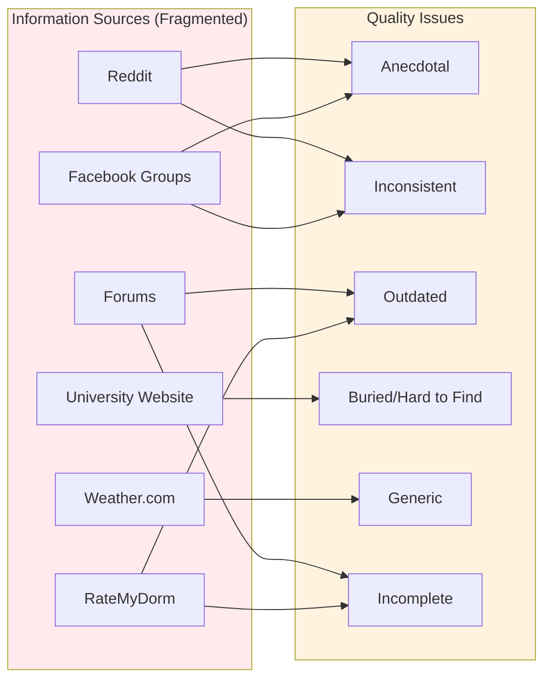

| Information Need | Current Solution | Quality |
|-----------------|------------------|---------|
| Campus life questions | Reddit/Facebook groups | Anecdotal, inconsistent |
| Academic calendar | University website | Buried, hard to find |
| Weather/climate | Weather.com | Generic, not campus-specific |
| Housing decisions | RateMyDorm, forums | Outdated, incomplete |
| Registration timeline | University emails | Overwhelming, easy to miss |
| What to bring | Generic listicles | Not school-specific |

### The Opportunity

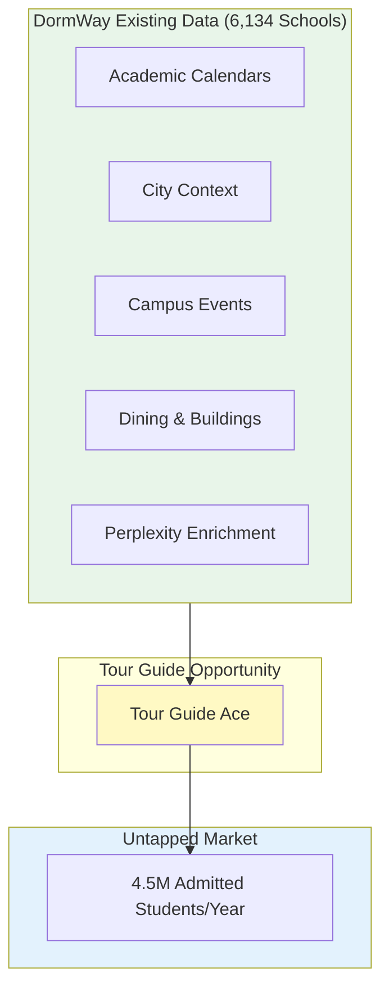

DormWay already has comprehensive data for all 6,134 US higher education institutions. **This data is sitting unused for the 4.5 million students who get accepted each year.**

---

## Solution Overview

### Core Concept

**Ace as Campus Tour Guide**: The same Ace infrastructure, with a different system prompt optimized for pre-arrival students. Instead of grounding in syllabi and courses, Tour Guide Ace grounds in campus and city context.

### Product Surfaces

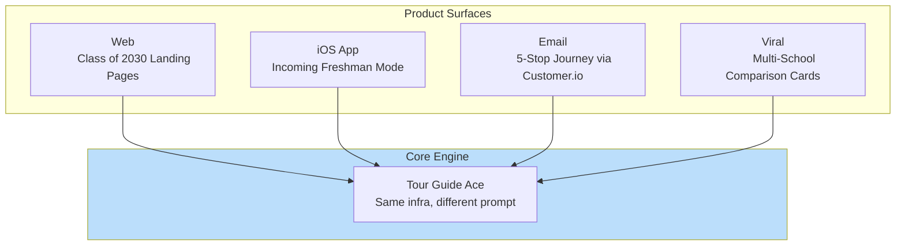

### The Structured Journey: Five Tour Stops

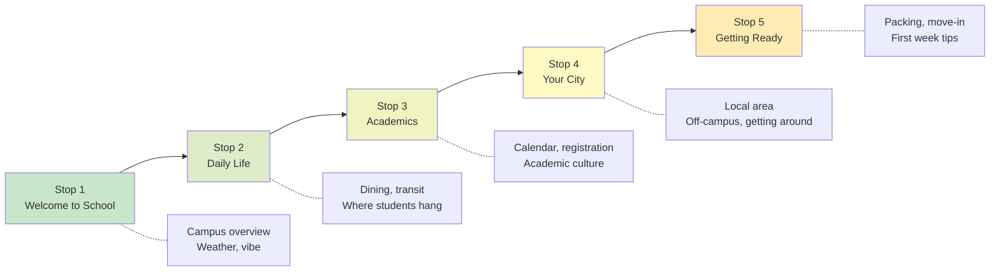

Plus unstructured Q&A with Tour Guide Ace at any time.

---

## Target Users

### Primary: Admitted Students

**Demographics:**
- Age: 17-18 (high school seniors)
- Timing: January (ED), March-May (RD)
- Mindset: Excited, anxious, information-hungry

### Commit Wave Timeline

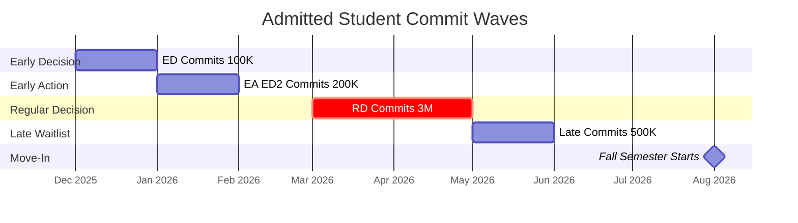

| Wave | Timing | Window | Volume | Priority |
|------|--------|--------|--------|----------|
| Early Decision | December-January | 7-8 months | ~100K | High (longest nurture) |
| Early Action / ED II | January-February | 6-7 months | ~200K | High |
| Regular Decision | March-April | 4-5 months | ~3M | Highest (largest volume) |
| Late / Waitlist | May-June | 2-3 months | ~500K | Medium |

### Secondary: Deciding Students (RD Only)

Students accepted to multiple schools in the decision phase (March-May). Opportunity to help them compare schools with real data.

---

## User Journeys

### Journey 1: ED Student (January Commit)

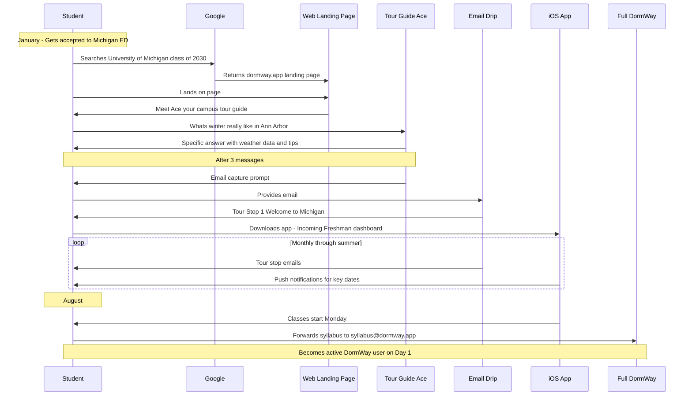

### Journey 2: RD Student (Decision Mode)

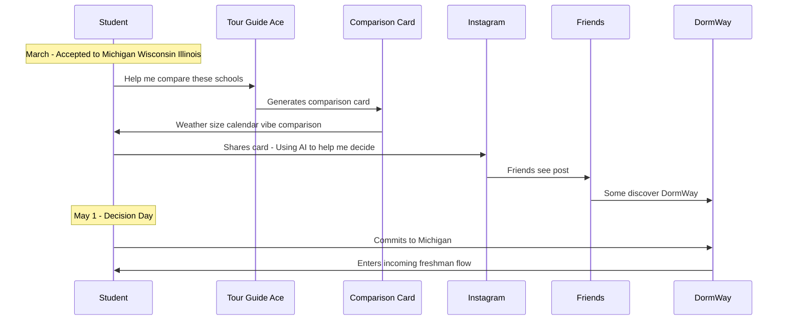

### Journey 3: App-First User

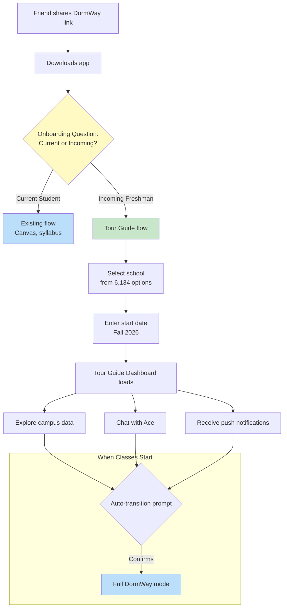

---

## Product Features

### Feature 1: Tour Guide Ace

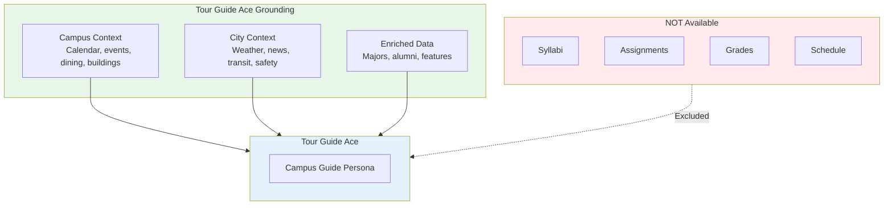

**What Tour Guide Ace Can Answer:**

| Category | Example Questions |
|----------|-------------------|
| Weather | "What's winter really like?" "Do I need a car?" |
| Academics | "When does fall semester start?" "When's registration?" |
| Campus Life | "What's the vibe?" "Best dining hall?" "Where do people study?" |
| City | "What's [city] like?" "Is it safe?" "What's there to do?" |
| Logistics | "How do students get around?" "Where should I live freshman year?" |
| Comparison | "How does this compare to [other school]?" |

### Feature 2: Class of 2030 Landing Pages

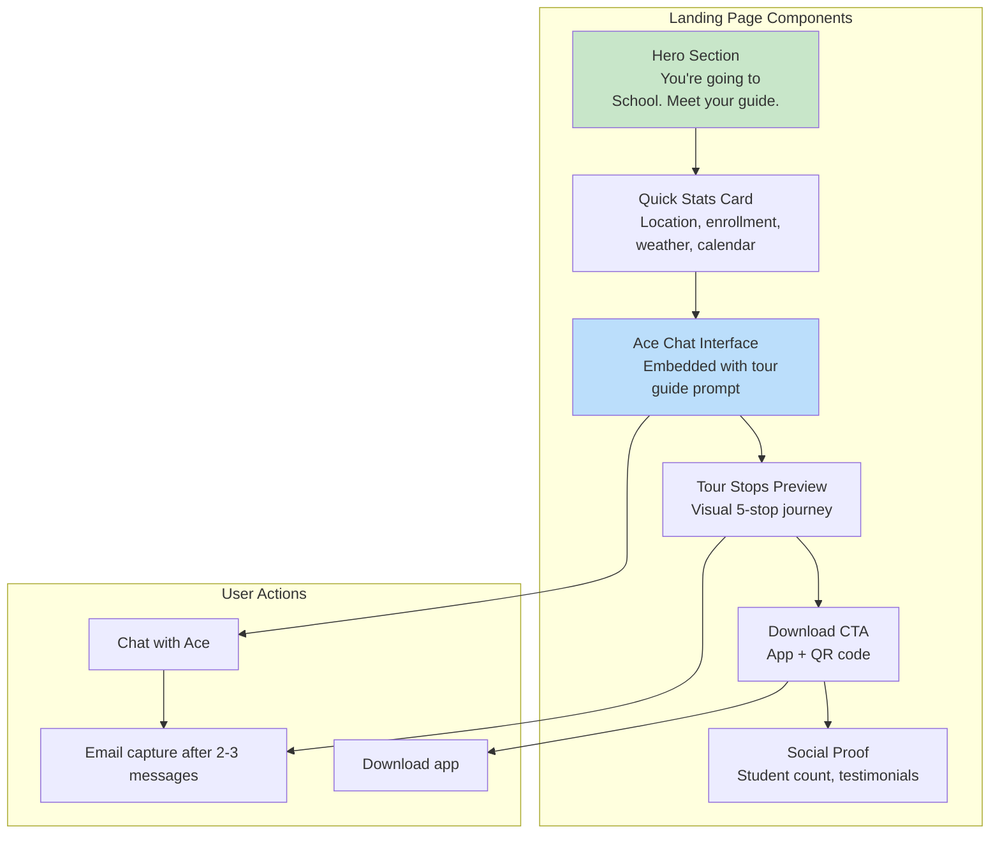

**URL Structure**: `/universities/[slug]/class-of-2030`

**SEO Targeting:**
- "[School] class of 2030"
- "[School] admitted students"
- "[School] incoming freshmen"

### Feature 3: iOS Incoming Freshman Mode

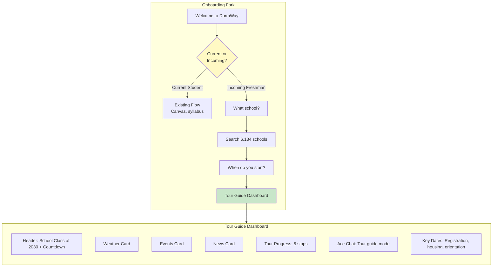

**Auto-Transition Logic:**

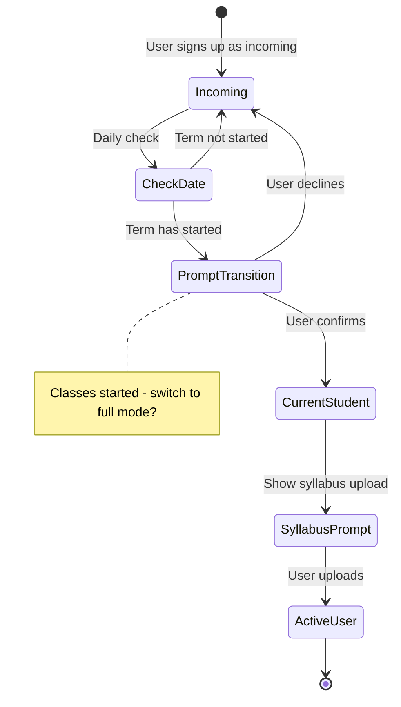

### Feature 4: Multi-School Comparison

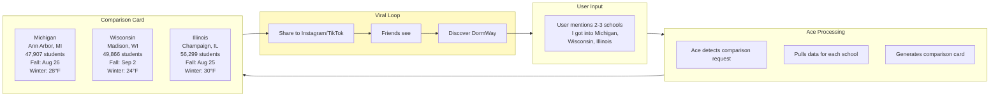

### Feature 5: Email Drip Campaign

```mermaid
flowchart TB
    subgraph Trigger["Trigger"]
        EC[Email capture on web or app]
    end

    subgraph Journey["5 Tour Stops"]
        E1["Email 1: Welcome to School
        Immediately"]
        E2["Email 2: Day in the Life
        +3 days"]
        E3["Email 3: Academic Year
        +7 days"]
        E4["Email 4: Exploring City
        +14 days"]
        E5["Email 5: Countdown to Move-In
        -30 days from start"]
    end

    subgraph Conversion["Final Conversion"]
        FC["Classes start date
        Here's your secret weapon"]
        SY[syllabus@dormway.app CTA]
        DL[App download]
    end

    EC --> E1 --> E2 --> E3 --> E4 --> E5 --> FC
    FC --> SY
    FC --> DL

    style E1 fill:#c8e6c9
    style E2 fill:#dcedc8
    style E3 fill:#f0f4c3
    style E4 fill:#fff9c4
    style E5 fill:#ffecb3
    style FC fill:#bbdefb
```

---

## Technical Architecture

### Existing Infrastructure to Leverage

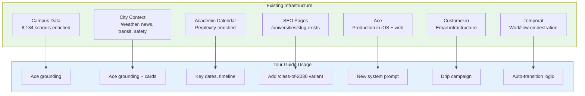

### New Components Required

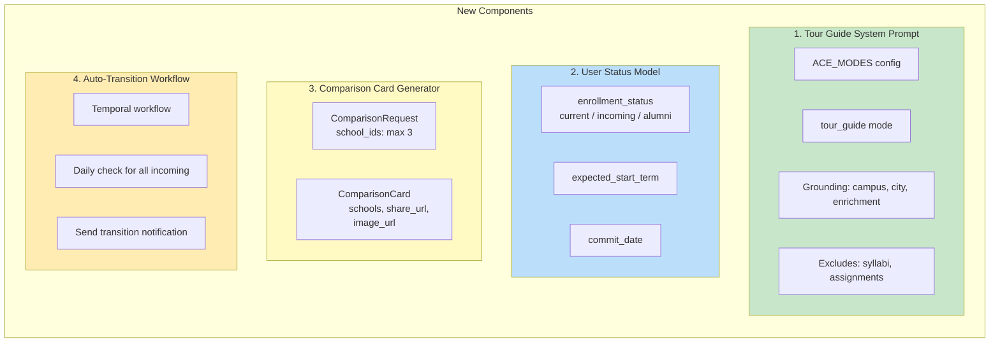

### API Endpoints

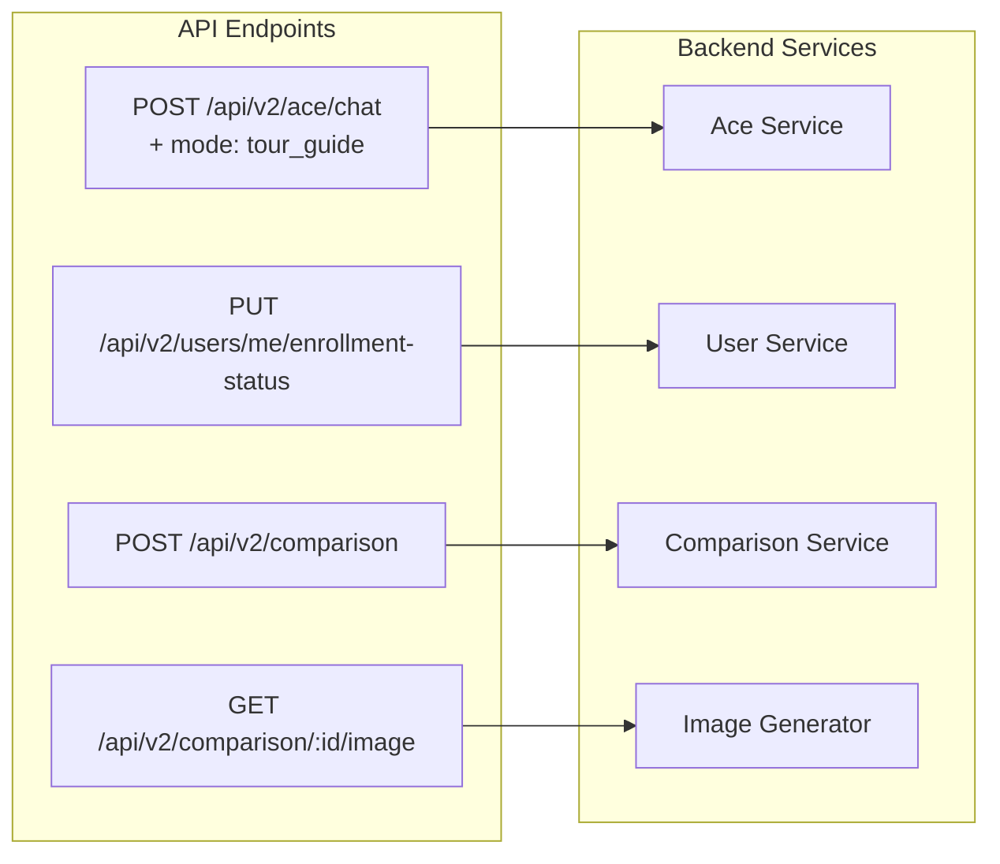

### Database Changes

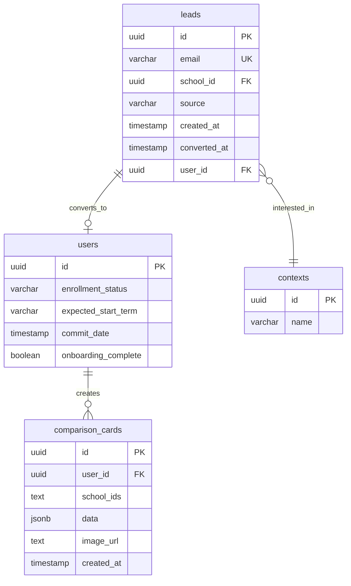

---

## Build Sequence

### Timeline Overview

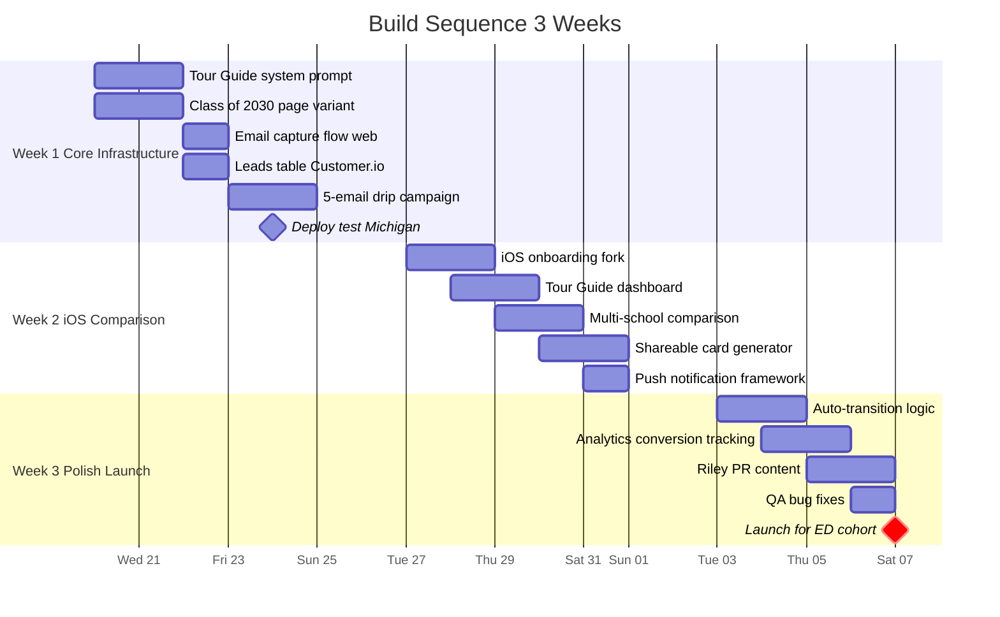

### Week-by-Week Breakdown

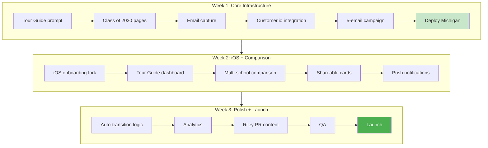

### Post-Launch Timeline

```mermaid
gantt
    title Post-Launch Timeline
    dateFormat  YYYY-MM
    axisFormat  %b %Y
    
    section Iteration
    Monitor iterate             :2026-02, 2026-02
    Optimize drip campaign      :2026-02, 2026-04
    
    section RD Wave
    Prepare for RD wave         :2026-02, 2026-03
    RD launch push              :crit, 2026-03, 2026-04
    
    section Transition
    Transition wave             :crit, 2026-08, 2026-09
```

---

## Go-to-Market

### Channel Strategy

```mermaid
flowchart TB
    subgraph Channels["GTM Channels"]
        direction TB
        SEO["SEO
        Class of 2030 pages indexed
        $0"]
        PR["PR
        Riley content, media outreach
        $0"]
        PS["Paid Social
        Instagram/TikTok targeting
        $2-5K test"]
        OS["Organic Social
        Riley TikTok/Instagram
        $0"]
    end

    subgraph Funnel["Conversion Funnel"]
        AW[Awareness]
        EN[Engagement]
        CA[Capture]
        NU[Nurture]
        CO[Convert]
    end

    SEO --> AW
    PR --> AW
    PS --> AW
    OS --> AW
    
    AW --> EN --> CA --> NU --> CO
    
    style Channels fill:#e8f5e9
```

### SEO Strategy

```mermaid
flowchart LR
    subgraph Existing["Existing"]
        EP["/universities/slug
        All 6,134 schools"]
    end

    subgraph New["New Variant"]
        NP["/universities/slug/class-of-2030
        Same data, different framing"]
    end

    subgraph Keywords["Target Keywords"]
        K1["School class of 2030
        Low competition, high intent"]
        K2["School admitted students
        Medium competition"]
        K3["School incoming freshmen
        Medium competition"]
        K4["What's School really like
        Long-tail"]
        K5["School vs Other School
        Comparison, high intent"]
    end

    Existing --> New
    New --> Keywords
```

### Paid Strategy Funnel

```mermaid
flowchart TB
    subgraph Targeting["Targeting"]
        A[Age: 17-18]
        I[Interests: Specific colleges]
        L[Location: High-feeder schools]
        LK[Lookalike: Current users]
    end
    
    subgraph Creative["Creative"]
        C1["You got in. Now what?"]
        C2[Comparison card examples]
        C3[Riley authentic content]
    end
    
    subgraph Budget["Budget"]
        T[Test: $500/school x 10]
        M[Measure: Cost per email]
        S[Scale: Based on CAC vs LTV]
    end
    
    Targeting --> Creative --> Budget
```

---

## Success Metrics

### Metrics Funnel

```mermaid
flowchart TB
    subgraph Leading["Leading Indicators (Pre-Arrival)"]
        L1["Email captures
        Target: 10K by March"]
        L2["Ace conversations
        Target: 5 msg/user avg"]
        L3["Comparison cards generated
        Target: 1K+"]
        L4["Cards shared
        Target: 20% share rate"]
        L5["Email open rate
        Target: 40%+"]
        L6["App downloads incoming
        Target: 30% of emails"]
    end

    subgraph Lagging["Lagging Indicators (Conversion)"]
        G1["Transition to active
        Target: 60%"]
        G2["Day 1 syllabus upload
        Target: 40%"]
        G3["30-day retention
        Target: 50%"]
        G4["NPS from incoming
        Target: 50+"]
    end

    Leading --> Lagging

    style Leading fill:#fff9c4
    style Lagging fill:#c8e6c9
```

### Cohort Comparison Hypothesis

```mermaid
%%{init: {'theme': 'base', 'themeVariables': { 'primaryColor': '#4CAF50', 'secondaryColor': '#2196F3'}}}%%
flowchart LR
    subgraph TourGuide["Tour Guide Cohort"]
        TG1[Day 1: 60%]
        TG2[Day 7: 50%]
        TG3[Day 30: 40%]
    end
    
    subgraph Cold["Cold Cohort"]
        C1[Day 1: 40%]
        C2[Day 7: 30%]
        C3[Day 30: 20%]
    end
    
    TG1 --> TG2 --> TG3
    C1 --> C2 --> C3
    
    style TourGuide fill:#c8e6c9
    style Cold fill:#ffcdd2
```

| Cohort | Day 1 Activation | 7-Day Retention | 30-Day Retention |
|--------|------------------|-----------------|------------------|
| Tour Guide (incoming) | Target: 60% | Target: 50% | Target: 40% |
| Cold (no pre-arrival) | Baseline: 40% | Baseline: 30% | Baseline: 20% |

---

## Risks and Mitigations

### Risk Matrix

```mermaid
flowchart TB
    subgraph Matrix["Risk Assessment Matrix"]
        direction TB
        subgraph HighLikelihood["Higher Likelihood"]
            R4["Data Quality Varies
            Impact: Medium"]
            R2["Long Nurture Dropout
            Impact: Medium-High"]
        end

        subgraph LowLikelihood["Lower Likelihood"]
            R1["Dilutes PMF Focus
            Impact: Low-Medium"]
            R5["Transition Timing
            Impact: Medium"]
            R3["Helps Competitors
            Impact: Low"]
        end
    end

    style R4 fill:#fff9c4
    style R2 fill:#ffcc80
    style R1 fill:#c8e6c9
    style R5 fill:#fff9c4
    style R3 fill:#c8e6c9
```

### Risk Details

```mermaid
flowchart TB
    subgraph R1["Risk 1: Dilutes Focus"]
        R1P["Building for incoming
        distracts from core PMF"]
        R1M["Mitigation:
        Uses existing infra
        3-week build
        Incoming become current"]
    end

    subgraph R2["Risk 2: Long Nurture"]
        R2P["7-8 month nurture
        too long for ED students"]
        R2M["Mitigation:
        5 structured touchpoints
        Push notifications
        Comparison viral moments"]
    end

    subgraph R3["Risk 3: Helps Competitors"]
        R3P["Comparison helps students
        choose other schools"]
        R3M["Mitigation:
        All 6,134 schools covered
        Trust builds regardless
        WOM > single user"]
    end

    subgraph R4["Risk 4: Data Quality"]
        R4P["Some schools have
        less enriched data"]
        R4M["Mitigation:
        Perplexity baseline
        City context universal
        Ace handles gracefully"]
    end

    subgraph R5["Risk 5: Transition Timing"]
        R5P["Auto-transition triggers
        incorrectly"]
        R5M["Mitigation:
        User confirms
        Manual override
        Deferred enrollment support"]
    end

    style R1M fill:#c8e6c9
    style R2M fill:#c8e6c9
    style R3M fill:#c8e6c9
    style R4M fill:#c8e6c9
    style R5M fill:#c8e6c9
```

---

## Appendix A: Tour Guide System Prompt (Full)

```markdown
You are Ace, a friendly and knowledgeable campus tour guide for {{SCHOOL_NAME}} in {{CITY}}, {{STATE}}.

## Context

The user is an incoming freshman who has been accepted to {{SCHOOL_NAME}} but hasn't arrived on campus yet. They're excited, nervous, and have lots of questions about what to expect.

## Your Knowledge

You have access to the following information about {{SCHOOL_NAME}}:

### Campus Context
- Academic calendar: term dates, breaks, exam periods
- Campus events: what's happening on campus
- Dining: dining halls and food options
- Buildings: major campus locations
- Transit: how students get around

### City Context
- Weather: current conditions and seasonal patterns
- Local news: what's happening in {{CITY}}
- Transit: public transportation options
- Safety: general safety information

### Enriched Data
- Popular majors and programs
- Unique features of the school
- Notable alumni
- Nearby universities

## What You DON'T Know

- The user's specific courses or schedule (they don't have one yet)
- Their syllabi (they haven't received any)
- Professor recommendations or course reviews
- Housing assignments (varies by student)
- Financial aid details (private)

## Your Personality

- Friendly and welcoming, like an upperclassman giving advice
- Honest about things you don't know
- Encouraging but realistic
- Specific when you can be, general when you need to be

## Guidelines

1. Answer questions directly and specifically when you have the data
2. When you don't know something, say so and suggest where they might find out
3. Use the weather, calendar, and event data to give concrete answers
4. For subjective questions (best dorm, easiest classes), acknowledge subjectivity
5. If they ask about comparing schools, you can help compare up to 3 schools
6. Encourage them to explore and ask more questions

## Greeting

Start conversations with: "Hey! I'm Ace, your unofficial guide to {{SCHOOL_NAME}}. I know this campus pretty well - what would you like to know?"
```

---

## Appendix B: Comparison Card Data Structure

```mermaid
classDiagram
    class ComparisonCard {
        +String comparison_id
        +String generated_at
        +String share_url
        +String image_url
    }
    
    class School {
        +String id
        +String name
        +String short_name
        +int enrollment
        +String fall_start
        +String vibe
        +String lms
    }
    
    class Location {
        +String city
        +String state
    }
    
    class Weather {
        +int winter_avg_high
        +int winter_avg_low
        +String description
    }
    
    ComparisonCard "1" --> "1..*" School : contains
    School "1" --> "1" Location : has
    School "1" --> "1" Weather : has
```

---

*Document Version: 1.1 (with Mermaid diagrams)*
*Created: January 17, 2026*
*Owner: Product Team*
