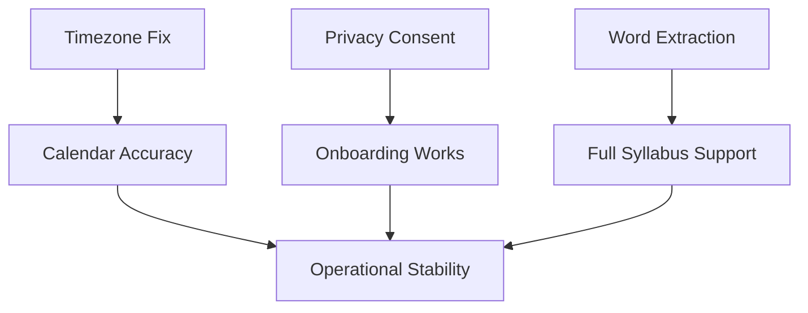

# TODO List

Prioritized tasks for [DormWay](/docs/operations/meta/obsidian-indexes/dormway) filtered through our [5 Core User Journeys](/docs/plans/planning/5-core-user-journeys). Updated July 14, 2025.

## ✅ Recently Completed (July 6-19)

### Journey Components
- [x] **[Privacy Consent Default](/docs/product/features/student-experience/privacy-consent-default)** - Defaults to false ✅
- [x] **[5 Core User Journeys](/docs/plans/planning/5-core-user-journeys) Documentation** ✅
- [x] **Journey 2: Syllabus Upload** - Complete ✅
  - PDF/Word extraction via Temporal (mammoth.js implemented)
  - BrainGains document upload UI
  - Toast notifications and error handling
- [x] **Journey 3: Calendar Connection** - Complete ✅
  - Calendar selection UI (July 10)
  - Calendar preferences persistence (July 9-10)
  - Server-side filtering based on preferences
  - Async schedule import via screenshot
  - Timezone conversion with campus metadata
  - Success screen with animations
- [x] **Journey 4: First BrainGains Use** - Complete ✅
  - BrainGains search UI with RAG Q&A
  - Real-time responses with sources
  - Recent searches and suggestions
  - **Native chat interface implementation (July 14)** ✅
  - **Multi-turn conversations with context** ✅
  - **Streaming responses with typing indicator** ✅
  - **Chat history and management** ✅

### App Store Compliance (July 19)
- [x] **Remove DeviceActivity Framework** ✅
  - Removed DeviceActivityMonitorExtension 
  - Disabled all screen time collection
  - Updated Context Prediction Prompt
  - Updated API router to remove screen time
- [x] **Add Motion Activity Tracking** ✅
  - Implemented MotionDataCollector
  - Added motion activity to context predictions
  - Created comprehensive debug views
- [x] **Update All AI Systems** ✅
  - Updated engine context aggregator
  - Modified all AI crews to use motion data
  - Removed screen time from all active crews

### Supporting Features
- [x] **Profile & Preferences Persistence** (July 11) ✅
- [x] **Customer.io Event Tracking** ✅
- [x] **Share Extension Configuration** ✅
- [x] **Onboarding Components** (July 2, 6) ✅
  - Fixed cross-device onboarding sync
  - Moved from local storage to cloud profile

## 🔴 Critical - Blocks [Launch Plan](/docs/plans/planning/launch-plan)

- [ ] **Complete Journey 1: [Onboarding](/docs/product/features/onboarding/onboarding)**
  - ✅ Privacy consent defaults to false
  - ✅ Campus selection implemented
  - ✅ Major selection implemented
  - ✅ Profile persistence (July 11)
  - ⚠️ Status: Need to verify full flow works end-to-end
  
- [ ] **Complete Journey 5: Daily Usage**
  - ✅ Context system implemented
  - ✅ Dashboard updates via Ably
  - ✅ Push notifications (Customer.io)
  - ⚠️ Status: Need to verify fast launch and fresh data

## 🟡 High Priority - Polish

- [x] **Polish BrainGains Search UI/UX** ✅
  - ✅ Implemented turn-based chat (July 14)
  - ✅ Native SwiftUI chat interface
  - ✅ Optimized for Vectara v2 API

- [ ] **Build Test Suite for Schedule Import**
  - Comprehensive testing needed
  - Edge cases and error handling

## 🟢 Business Tasks

- [x] Send pitch deck & SAFE to Andy Mooney
- [ ] Update pitch deck with syllabus-first GTM

## 🔵 Future Critical - Post-Initial-Launch

### [Semester Term Management](/docs/product/features/semester-term-management) - Auto-Move to New Terms
- [ ] **Semester Reset/Transition System**
  - Enable students to prep future semesters while current is active
  - Auto-detect term transitions from academic calendar
  - Archive previous term data gracefully
  - See: [Semester Term Management](/docs/product/features/semester-term-management) for full spec
  - Note: We have term start/end dates for all schools

## ⚪ Deferred - Post-Launch

All tasks not directly supporting [5 Core User Journeys](/docs/plans/planning/5-core-user-journeys):
- [OpenTelemetry](/docs/engineering/technical/telemetry-and-analytics/opentelemetry-and-dash0-implementation) instrumentation
- Performance optimizations (unless blocking)
- Hallucination validation
- Travel advisory fixes
- Preference persistence (unless blocking)
- Advanced search filters for BrainGains
- Full document view in BrainGains
- Search history management
- Offline support for BrainGains

## Task Relationships

## Progress Summary

**3 out of 5 core journeys FULLY complete!** 🎉
- Journey 2 (Syllabus) ✅
- Journey 3 (Calendar) ✅  
- Journey 4 (BrainGains) ✅

**2 journeys mostly complete, need verification:**
- Journey 1 (Onboarding) - All components built, needs end-to-end testing
- Journey 5 (Daily Usage) - All components built, needs performance verification

## Daily Focus

Each day, ask: *"Does this task enable our [5 Core User Journeys](/docs/plans/planning/5-core-user-journeys)?"*

If no → defer to post-launch.

## Related

- [Launch Plan](/docs/plans/planning/launch-plan) - Timeline context
- [Operational Stability](/docs/plans/planning/operational-stability) - Success criteria
- 2025-07-11 Snap the Line - Today's commitment
- Daily Logs - Progress tracking

---

*Tags: #todo #priority #launch*
*Last updated: 2025-12-08*
