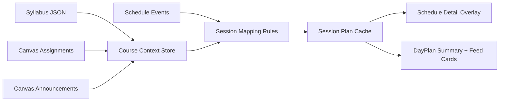

# Event Readiness - Quality-First Implementation Plan

> Clear, low-risk path to ship Event Readiness using existing systems (DayPlan, schedule, syllabus, Canvas) with minimal new components.

---

## Summary

### Objective
Make DormWay the most reliable college assistant by attaching trustworthy, session-specific prep and logistics to each class event, while reusing existing pipelines and avoiding unnecessary new components.

### Scope
- In scope: data synthesis, session prep mapping, announcement surfacing, schedule detail overlay, confidence/provenance, low-cost batching.
- Out of scope: new UI component systems, full task planner replacement, write-back to Canvas, new calendar UI paradigms.

### Principles
- Reuse existing pipelines first (DayPlan, scheduleProcessor, Canvas sync, syllabus extraction).
- Avoid new UI components unless they are clearly superior to existing ones.
- Prefer deterministic mapping; use LLM only for ambiguous cases.
- Every surfaced item must show provenance + freshness.

---

## Current State

### What Exists Today
- DayPlan V2 daily brief generated at 5 AM; stored in `service_data`.
- Unified schedule in `student_time_blocks` from scheduleProcessor.
- Syllabus extraction pipeline (email → workflow → structured JSON).
- Canvas assignments sync into `student_time_blocks` (type=assignment).
- Canvas Canary detects announcements via activity stream.

### Pain Points
- No session-level prep card tied to schedule events.
- Announcements exist in Canvas but are not surfaced or mapped to sessions.
- DayPlan is day-scoped and can go stale after morning generation.
- Schedule reconciliation can delete sources it didn’t ingest.

### Relevant Code Locations
| Component | Path |
|---|---|
| DayPlan generation | `.repos/dormway-platform/services/engine/src/activities/dayplan.activities.ts` |
| DayPlan inputs | `.repos/dormway-platform/services/shared/dormway-core/src/domains/day-plan-data/day-plan-data.service.ts` |
| Schedule reconciliation | `.repos/dormway-platform/services/engine/src/activities/student.activities.ts` |
| Canvas sync + canary | `.repos/dormway-platform/services/engine/src/workflows/canvasSync.workflow.ts` |
| Canvas activities | `.repos/dormway-platform/services/engine/src/activities/canvas.activities.ts` |
| Syllabus processing | `.repos/dormway-platform/services/engine/src/workflows/syllabus.workflow.ts` |

---

## Target State

### Architecture (Overlay, Not Replacement)

### Key Changes
1. Persist announcements and map them to sessions.
2. Generate cached Session Plans (batch, per course/week).
3. Surface Session Prep in schedule detail using existing overlay components.
4. Add confidence + provenance and user override loop.

### Quality Functionality Checklist (Must Cover)
- Session readiness score per class (Ready / Needs prep / At risk).
- Conflict awareness (cross-day clusters + same-day overload).
- Context-aware reminders (time + location + next-class window).
- Confidence-first outputs (suppress low-confidence items by default).
- Source-first UI (every item shows source + timestamp).
- Data freshness badges (Canvas/syllabus/announcement last sync).
- Error handling + fallbacks (graceful degrade to raw data).
- Override loop (Mark done / Hide / Incorrect → feedback).
- Deterministic mapping as default, LLM only for ambiguity.

---

## Methods Evaluated (Pros/Cons)

### Option A: On-Demand (Compute on click)
**Pros**
- No new storage.
- Fast to prototype.

**Cons**
- High latency and LLM cost.
- Unreliable during peak usage.
- Hard to ensure freshness and consistency.

**Verdict:** Not suitable for scale or trust.

### Option B: Extend DayPlan to store per-session prep
**Pros**
- Reuses DayPlan pipeline and storage.
- No new data store.

**Cons**
- DayPlan is daily and runs at 5 AM; becomes stale for announcements.
- Large payloads; may slow generation.
- Session prep needs updates outside DayPlan window.

**Verdict:** Partial fit, but not sufficient alone.

### Option C: Session Plan Cache in `service_data` (Recommended)
**Pros**
- Batchable (per course/week).
- Update on data change (announcement/syllabus/Canvas sync).
- Keeps DayPlan lean; enables per-event freshness.
- Minimal schema changes (reuse `service_data`).

**Cons**
- New workflow/activity needed.
- Requires cache invalidation rules.

**Verdict:** Best long-term balance of cost, quality, and reuse.

### Option D: Store prep metadata directly on `student_time_blocks`
**Pros**
- Prep data sits next to the event.
- Simple query for UI.

**Cons**
- Reconciliation can delete events it doesn’t ingest.
- Blurs schedule vs prep concerns.
- Hard to version or update without side effects.

**Verdict:** Avoid unless scheduleProcessor is redesigned.

---

## Recommended Approach (Best Long-Term)

**Primary:** Option C (Session Plan Cache in `service_data`) + light DayPlan summary enrichment.

**Why:**
- Preserves existing schedule + DayPlan systems.
- Avoids LLM per event.
- Handles mid-day announcement updates.
- Minimal UI changes: use overlay in schedule detail and feed cards.

---

## Implementation Phases

### Phase 0: Audit + Guardrails (1 week)
**Goal:** Validate current inputs and prevent data loss.

**Tasks**
- [ ] Reconcile model config mismatch in docs (Gemini vs GPT-4o-mini).
- [ ] Verify Canvas assignments survival through scheduleProcessor (confirm deletion risk).
- [ ] Define `service_data` method for session plans (no schema change).
- [ ] Define provenance and confidence schema.
- [ ] Define error fallback behavior (no prep vs raw list) for missing/ambiguous inputs.

**Deliverables**
- Source truth update + data flow map.
- Session Plan schema doc.

---

### Phase 1: Announcements Persistence (1-2 weeks)
**Goal:** Make announcements usable and reliable.

**Tasks**
- [ ] Persist Canvas announcements (store raw + parsed) in `service_data`.
- [ ] Trigger announcement refresh on Canary detection.
- [ ] Add freshness metadata (last_announcement_sync).

**Deliverables**
- Announcements available for session mapping.
- Simple “announcements not connected” signal.

---

### Phase 2: Session Mapping + Cache (2 weeks)
**Goal:** Generate Session Plans in batch.

**Tasks**
- [ ] Implement Session Plan generator activity (deterministic rules first).
- [ ] Only use LLM for ambiguous cases ("before next lecture").
- [ ] Batch by course/week; store in `service_data` with event IDs.
- [ ] Add invalidation on schedule update, syllabus update, Canvas sync, and new announcements.
- [ ] Add confidence gating (hide low-confidence items unless user opts in).

**Deliverables**
- Session Plans for pilot users.
- Confidence scoring + provenance field.

---

### Phase 3: UI Overlay + DayPlan Summary (1-2 weeks)
**Goal:** Surface session prep without new components.

**Tasks**
- [ ] Render Session Prep Card inside existing schedule detail overlay.
- [ ] Reuse existing list/assignment components (no new component system).
- [ ] Add links + source pills + "Mark done" / "Hide" actions.
- [ ] Add a compact DayPlan summary line: “Prep needed before next class.”
- [ ] Add session readiness score badge (Ready / Needs prep / At risk).
- [ ] Show data freshness badges for Canvas/syllabus/announcements.

**Deliverables**
- Schedule detail overlay displays prep items.
- DayPlan summary reflects readiness without duplication.

---

### Phase 4: Quality Loop + Metrics (1 week)
**Goal:** Trust, feedback, and reliability.

**Tasks**
- [ ] Add feedback loop for incorrect mappings.
- [ ] Emit metrics: open rate, completion, confidence distribution.
- [ ] Add alerts for missing announcements or stale data.
- [ ] Add conflict awareness signals for heavy days (non-blocking).
- [ ] Add context-aware reminder rules (respect notification prefs).

**Deliverables**
- Feedback-driven refinement loop.
- Trust and reliability dashboards.

---

## Testing Plan

### Unit Tests
- Mapping rules (date logic, week mapping).
- Confidence scoring logic.

### Integration Tests
- Announcement ingestion → session mapping → UI display.
- Session Plan invalidation on schedule updates.

### Manual QA
- [ ] Class with syllabus-only data.
- [ ] Class with Canvas assignments + announcements.
- [ ] Class with conflicting sources (syllabus vs announcement).

---

## Rollout Plan

### Staging
1. Enable feature flag for Session Plans.
2. Pilot with internal users.
3. Validate correctness >95%.

### Production
1. Limited cohort (10-20 users).
2. Expand by campus once announcement coverage is verified.
3. Full rollout after confidence gating meets targets.

### Rollback
- Disable Session Plan display and fall back to schedule detail view without prep.

---

## Risks & Mitigations

| Risk | Impact | Mitigation |
|------|--------|------------|
| Wrong prep items | High | Confidence gating + provenance + user feedback |
| Missing announcements | High | Canary refresh + fallback email/manual upload |
| LLM cost creep | Medium | Batch generation + change-driven updates |
| Data loss during reconciliation | Medium | Keep session plans out of `student_time_blocks` |

---

## Open Questions

- What is the minimum announcement access path per campus (PAT, OAuth, email)?
- Should session plans be stored per event or per date-range chunk?
- How should overrides persist across syllabus updates?

---

## Related Documentation

- [Event Readiness Layer - DayPlan V3 Spec (Draft)](/docs/engineering/architecture/event-readiness-layer-dayplan-v3-spec-draft)
- [Event Readiness Layer - Current State Alignment (Draft)](/docs/engineering/architecture/event-readiness-layer-current-state-alignment-draft)
- [DayPlan V2](/docs/engineering/architecture/sot-dayplan-v2)
- [DayPlan V2 Architecture](/docs/engineering/architecture/dayplan-v2-architecture)
- Engineering/Technical/API/Canvas/Canvas Integration Alignment Plan
- [Schedule Sources & Precedence (Current)](/docs/engineering/technical/calendar/schedule-sources-precedence-current)

---

**Linear Issue**: DORM-XXX
**Last Updated**: 2026-02-03
