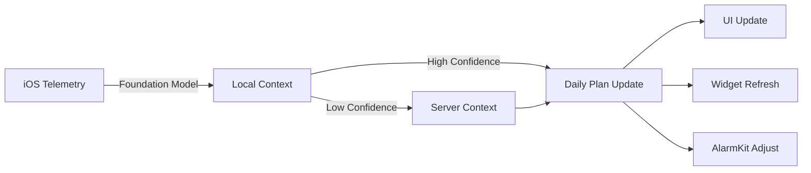

# Journey Development Work Plan - Complete User Onboarding & Data Association

> **Created**: August 20, 2025  
> **Sprint Timeline**: 2 weeks (Aug 20 - Sept 3)  
> **Focus**: Implement complete user journey that properly associates all data assets in the existing schema  
> **Linear Task**: [DORM-123: StudentWatcher Journey Implementation](https://linear.app/dormwayllc/issue/DORM-123/studentwatcher-journey-implementation-complete-user-onboarding-and)  
> **Assigned to**: Ethan Kaplan  
> **Project**: MVP to Launch

## Executive Summary

This work plan outlines the implementation of a complete user onboarding journey that properly associates all data assets (users, contexts, syllabi, documents) using the existing database schema and services. The plan is grounded in the actual codebase structure where:
- User accounts are stored in the `accounts` table
- Syllabi and all processed data are stored in the `service_data` table as JSONB
- StudentWatcher is already running with continueAsNew pattern and 15+ signals
- All crews process data and store results in `service_data` with proper user_id references

## Core User Journey (Based on Actual Schema)

### Journey Flow:
1. **User signs up with DormWay app** - Creates account in `accounts` table
2. **User selects university/building** - Creates context in `contexts` table  
3. **User adds schedule** - Creates time_blocks in `student_time_blocks` table
4. **User uploads syllabi** - Stored in `service_data` with `method: 'processed_syllabus_crew'`
5. **User adjusts notification settings** - Updates `user_preferences` table
6. **User uploads BrainGains documents** - Stored in `braingains_documents` table

This journey properly associates:
- User (accounts) → Context (building/university)
- User → Syllabi (via service_data.user_id)
- User → Schedule (via student_time_blocks.user_id)
- User → Preferences (via user_preferences.user_id)
- User → Documents (via braingains_documents.user_id)

## Phase 1: User Signup & University Detection (Day 1-2)

### 1.1 Account Creation Flow (Using Existing Schema)
**Current Implementation:**
```typescript
// Existing accounts table structure:
// - id: UUID (primary key)
// - primary_owner_user_id: UUID
// - name: VARCHAR(255)
// - email: VARCHAR(320)
// - is_personal_account: BOOLEAN
// - public_data: JSONB (stores university, major, etc.)

// Mobile endpoint: POST /api/mobile/onboarding
{
  userId: string,      // From Auth0/Supabase auth
  firstName: string,
  lastName: string,
  schoolId: string,    // References context for university
  fullName: string
}
```

### 1.2 University Detection & Context Creation
**Use Existing Context System:**
```typescript
// Universities are contexts with type='university'
// Buildings are contexts with type='building'
// Parent-child relationships via contexts.parent_id

// Example: U of M structure
const university = {
  id: 'umich-context-id',
  type: 'university',
  name: 'University of Michigan',
  metadata: { email_domain: 'umich.edu' }
};

const building = {
  id: 'north-quad-id',
  type: 'building',
  parent_id: 'umich-context-id',
  name: 'North Quad'
};
```

## Phase 2: Schedule Integration (Day 3-4)

### 2.1 Calendar Sync (Existing Implementation)
**Google Calendar Integration:**
```typescript
// Already implemented in calendar.activities.ts
// Stores in student_time_blocks table
interface StudentTimeBlock {
  id: UUID,
  user_id: UUID,
  event_id: string,        // Google Calendar event ID
  title: string,
  description: text,
  start_time: timestamp,
  end_time: timestamp,
  location: string,
  calendar_id: string,
  event_metadata: JSONB,   // Full Google Calendar data
  sync_token: string
}

// Sync endpoint: Already exists
await calendarActivities.syncGoogleCalendar(userId);
```

### 2.2 Course Context Creation
**Create Course as Context:**
```typescript
// Courses are contexts with type='course'
const course = {
  type: 'course',
  parent_id: universityContextId,
  name: 'EECS 281 - Data Structures',
  metadata: {
    course_code: 'EECS 281',
    semester: 'Fall 2025',
    professor: 'Dr. Smith'
  }
};

// Link user to course via context_dependencies
INSERT INTO context_dependencies (
  parent_context_id,  // course context
  child_context_id,   // user's personal context
  dependency_type
);
```

## Phase 3: Syllabus Upload & Processing (Day 5-6)

### 3.1 Syllabus Processing (Existing Flow)
**Current Implementation:**
```typescript
// Syllabus webhook already exists
// Stores in service_data table with method='processed_syllabus_crew'

// service_data structure:
{
  id: UUID,
  user_id: UUID,           // Links to user
  context_id: UUID,        // Can link to course context
  service_id: UUID,
  data: JSONB,            // Processed syllabus data
  method: 'processed_syllabus_crew',
  fetched_at: timestamp
}

// Processed data includes:
{
  course_code: "EECS 281",
  course_name: "Data Structures",
  professor: "Dr. Smith",
  exams: [...],
  assignments: [...],
  dates: [...]  // Important dates extracted
}
```

### 3.2 Associate Syllabus with User & Course
**Enhancement Needed:**
```typescript
// When syllabus is uploaded:
1. Extract course_code from processed data
2. Match with user's time_blocks or contexts
3. Update service_data.context_id to link to course
4. Signal StudentWatcher about new syllabus

// Signal to StudentWatcher
await temporalClient.signal(
  `student-watcher-${userId}`,
  'custom_signal',
  { type: 'syllabus_added', courseCode, syllabusId }
);
```

## Phase 4: Notification Preferences (Day 7)

### 4.1 Preference Collection UI
```swift
// iOS: Settings screen
struct NotificationPreferencesView: View {
  @State var morningBriefing = true
  @State var morningTime = "7:00 AM"
  @State var classReminders = true
  @State var reminderMinutes = 15
  @State var studyBlocks = false
  @State var examAlerts = true
}
```

### 4.2 Store Preferences
```typescript
PUT /api/mobile/settings/notifications
{
  morning: { enabled: boolean, time: string },
  midday: { enabled: boolean, time: string },
  evening: { enabled: boolean, time: string },
  classReminders: { enabled: boolean, minutesBefore: number },
  studyBlocks: { enabled: boolean },
  examAlerts: { enabled: boolean, daysBefore: number[] }
}
```

## Phase 5: Document Uploads (Ace/BrainGains) (Day 8-9)

### 5.1 Document Upload Infrastructure
```typescript
POST /api/mobile/documents/upload
{
  type: "ace" | "braingains" | "notes",
  courseId?: string,  // Optional course association
  file: Buffer,
  metadata: {
    title: string,
    description?: string,
    tags?: string[]
  }
}
```

### 5.2 Document Processing
```python
# New crew: document_processor.py
class DocumentProcessorCrew:
  """Extract key concepts, create study guides, Q&A generation"""
  
  def process_document(self, document: bytes, doc_type: str):
    # Extract text/content
    # Identify key concepts
    # Generate study questions
    # Link to course materials
    # Store in vector database for RAG
```

## Phase 6: DayPlan Generation with Complete Context (Day 10-11)

### 6.1 Enhanced DayPlan Generation
Now with complete user context:
```typescript
interface UserContext {
  // Identity
  userId: string;
  university: University;
  
  // Academic
  courses: Course[];           // From schedule + syllabi
  assignments: Assignment[];   // From syllabi processing
  exams: Exam[];              // From syllabi processing
  
  // Preferences
  notifications: NotificationPreferences;
  
  // Materials
  documents: Document[];       // Ace/BrainGains uploads
  
  // Schedule
  calendar: CalendarEvent[];   // From Google or manual entry
}

async function generateDayPlan(context: UserContext): DayPlan {
  // Use complete context for intelligent planning
  // Merge calendar with course schedule
  // Factor in assignments and exams
  // Consider uploaded study materials
  // Respect notification preferences
}
```

### 6.2 DayPlan Structure with Full Context
```typescript
interface DayPlan {
  // ... existing fields ...
  
  // Enhanced with journey data
  courses: {
    todaysClasses: Class[];
    upcomingAssignments: Assignment[];
    studyRecommendations: StudyBlock[];
  };
  
  materials: {
    relevantDocuments: Document[];  // Today's relevant Ace/BrainGains
    suggestedReading: string[];
  };
  
  universityContext: {
    campusEvents: Event[];
    diningRecommendations: string[];
    weatherAlert?: string;
  };
}

## Phase 7: Event Tracking Modernization (Day 12-13)

### 7.1 Unified EventTracker Implementation
Create a centralized event tracking service that routes to Amplitude as primary, with Customer.io for transactional only:

#### EventTracker Service Architecture
```typescript
// services/engine/src/services/eventTracker.ts
class EventTracker {
  private amplitude: AmplitudeClient;
  private customerIO: CustomerIOClient; // For transactional only
  
  async track(userId: string, event: string, properties?: any) {
    // Primary: Always track to Amplitude
    await this.amplitude.track(userId, event, {
      ...properties,
      source: 'temporal_engine',
      timestamp: new Date().toISOString()
    });
    
    // No longer send behavioral events to Customer.io
    // Amplitude will forward via native integration
  }
  
  async identify(userId: string, traits: UserTraits) {
    // Update user properties in Amplitude
    await this.amplitude.identify(userId, traits);
    // Amplitude forwards to Customer.io via integration
  }
  
  // Keep for critical transactional messages only
  async sendTransactional(userId: string, templateId: string, data: any) {
    // Direct to Customer.io for email/push
    await this.customerIO.sendTransactionalMessage(userId, templateId, data);
  }
}
```

#### Migration Tasks
- [ ] Create EventTracker service class
- [ ] Add Amplitude SDK to engine service
- [ ] Configure Amplitude → Customer.io integration
- [ ] Update all workflow activities to use EventTracker
- [ ] Deprecate direct Customer.io behavioral tracking
- [ ] Keep Customer.io for transactional messages only

### 7.2 Activity Migration
Update all activities to use the new EventTracker:

```typescript
// Before (deprecated):
await customerIOActivities.trackCustomerIOServerEvent(
  userId, 
  'onboarding_completed', 
  properties
);

// After (new pattern):
await eventTrackerActivities.track(
  userId,
  'onboarding_completed', 
  properties
);
```

#### Files to Update
- [ ] `studentProcessor.workflow.ts` - Replace Customer.io tracking
- [ ] `syllabusProcessor.workflow.ts` - Update event tracking
- [ ] `scheduleImport.workflow.ts` - Migrate to EventTracker
- [ ] `weeklyWellnessReview.workflow.ts` - Update tracking calls
- [ ] Create new `eventTracker.activities.ts`
- [ ] Deprecate behavioral tracking in `customerio.activities.ts`

## Phase 8: StudentWatcher Integration with Journey Data (Day 14)

### 7.1 StudentWatcher Simplification (KEEP continueAsNew!)
Now that we have complete user journey data, StudentWatcher can be simplified while maintaining efficient patterns:

#### Signal Consolidation (Keep Good Patterns!)
- [ ] **KEEP** continueAsNew pattern (it's efficient for long-lived workflows!)
- [ ] Reduce from 15+ signals to just 3
- [ ] Remove complex conditional logic
- [ ] **KEEP** 7-day cycle with continueAsNew (prevents history buildup)

#### 1.2 Consolidate Signals
Replace 20+ individual signals with 3 core signals:
- [ ] `dailyPlanSignal` - Morning generation trigger
- [ ] `contextUpdateSignal` - Major context changes
- [ ] `deviationSignal` - Handle plan deviations

#### 1.3 Streamline Workflow Structure
```typescript
// Simplified StudentWatcher - KEEPS continueAsNew for efficiency!
export async function studentWatcherWorkflow(args: StudentWatcherArgs) {
  // Initialize daily plan
  let dailyPlan = await generateDailyPlan(args.studentId);
  let checksToday = 0;
  const MAX_CHECKS = 288; // 5-minute checks for 24 hours
  
  // Set up signal handlers (just 3 instead of 15+)
  setHandler(dailyPlanSignal, async () => {
    dailyPlan = await regenerateDailyPlan(args.studentId);
  });
  
  setHandler(contextUpdateSignal, async (update) => {
    dailyPlan.currentContext = { ...dailyPlan.currentContext, ...update };
    await checkForNotifications(dailyPlan);
  });
  
  setHandler(deviationSignal, async (deviation) => {
    dailyPlan = await handleDeviation(dailyPlan, deviation);
  });
  
  // Check every 5 minutes for notifications
  while (checksToday < MAX_CHECKS) {
    await sleep('5 minutes');
    await checkForNotifications(dailyPlan);
    checksToday++;
  }
  
  // Continue as new daily - Temporal best practice!
  // This prevents history buildup in long-lived workflows
  // Could even cycle every 12 hours for smaller history
  await continueAsNew<typeof studentWatcherWorkflow>({
    studentId: args.studentId
  });
}
```

## Phase 2: Digital Twin & Daily Plan V1 (Week 1-2)

### Core Concept
The Digital Twin maintains a server-side representation of the student's day, generating intelligent daily plans at 5am and adapting to deviations throughout the day.

### 2.1 Daily Plan Generation (5am)
- [ ] Implement morning planning workflow
- [ ] Merge calendar events with predicted time blocks
- [ ] Generate study recommendations
- [ ] Create meal/break suggestions
- [ ] Identify campus opportunities

### 2.2 Daily Plan Structure (The Digital Twin's "Day")
```typescript
interface DayPlan {
  planId: string;
  studentId: string;
  generatedAt: Date;
  lastUpdated: Date;
  
  // User preferences (no separate workflows needed!)
  notifications: {
    morning: { enabled: boolean; time: string; sent: boolean; };
    midday: { enabled: boolean; time: string; sent: boolean; };
    evening: { enabled: boolean; time: string; sent: boolean; };
  };
  
  // Merged calendar + predictions
  timeline: Array<{
    startTime: Date;
    endTime: Date;
    type: 'class' | 'study' | 'meal' | 'transit' | 'free';
    title: string;
    location?: string;
    source: 'calendar' | 'predicted' | 'suggested';
  }>;
  
  // Current context (updates throughout day)
  currentContext: {
    location: string;
    activity: string;
    nextEvent: TimelineEntry;
    lastUpdated: Date;
  };
  
  // Today's priorities (from morning generation)
  priorities: Priority[];
  
  // Deviations tracked
  deviations: Array<{
    time: Date;
    type: string;
    handled: boolean;
    response: string;
  }>;

interface TimelineEntry {
  startTime: Date;
  endTime: Date;
  type: 'class' | 'study' | 'meal' | 'transit' | 'free' | 'sleep';
  title: string;
  location?: Location;
  priority: 'required' | 'suggested' | 'optional';
  metadata: Record<string, any>;
}
```

### 2.3 Digital Twin State
- [ ] Current activity tracking
- [ ] Location awareness
- [ ] Energy/focus levels
- [ ] Study progress
- [ ] Social context

## Phase 3: iOS 26 Foundation Model Integration (Week 2)

### 3.1 On-Device Context Processing
Leverage iOS 26's Foundation Models for privacy-first, instant context processing:

#### Capabilities Assessment
- [ ] Evaluate Foundation Model API for context understanding
- [ ] Test on-device syllabus parsing
- [ ] Benchmark response times vs server
- [ ] Assess model size and battery impact

#### Implementation Strategy
```swift
// iOS 26 Foundation Model Usage
import FoundationModels

class LocalContextProcessor {
    private let model = FoundationModel.default
    
    func processContext(_ telemetry: TelemetryData) async -> StudentContext {
        // On-device processing - no network latency
        let context = await model.analyze(
            calendar: telemetry.calendar,
            location: telemetry.location,
            health: telemetry.health,
            screenTime: telemetry.screenTime
        )
        
        // Only send to server if complex analysis needed
        if context.confidence < 0.8 {
            return await serverFallback(telemetry)
        }
        
        return context
    }
}
```

### 3.2 Hybrid Architecture
- [ ] On-device for immediate context (< 100ms)
- [ ] Server for complex predictions
- [ ] Graceful fallback mechanisms
- [ ] Privacy-preserving sync

## Phase 4: Semester Workload Analysis Crew (Week 2)

### 4.1 Comprehensive Workload Calculation
Create a new crew that analyzes the entire semester's workload across all courses:

#### Core Functionality
```python
class SemesterWorkloadCrew(BaseDormWayCrew):
    """
    Analyzes entire semester workload across all courses.
    Combines all syllabi data to identify:
    - Peak stress weeks (multiple exams/projects)
    - Total assignments/exams/projects
    - Reading load per week
    - Study time requirements
    - Course conflict detection
    """
```

#### Implementation Tasks
- [ ] Create `semester_workload.py` crew
- [ ] Aggregate all syllabus data for student
- [ ] Calculate weekly workload distribution
- [ ] Identify peak stress periods
- [ ] Generate study time recommendations
- [ ] Cross-course deadline conflicts
- [ ] Balance recommendations

#### Workload Metrics
```typescript
interface SemesterWorkload {
  totalCourses: number;
  creditHours: number;
  
  weeklyBreakdown: Array<{
    week: number;
    assignments: Assignment[];
    exams: Exam[];
    projects: Project[];
    estimatedHours: number;
    stressLevel: 'low' | 'medium' | 'high' | 'critical';
  }>;
  
  peakWeeks: Array<{
    week: number;
    reason: string;
    conflicts: string[];
    recommendations: string[];
  }>;
  
  totalWorkload: {
    assignments: number;
    exams: number;
    projects: number;
    papers: number;
    presentations: number;
    estimatedTotalHours: number;
  };
  
  recommendations: {
    timeManagement: string[];
    dropAddConsiderations: string[];
    tutoringSuggestions: string[];
    wellnessWarnings: string[];
  };
}
```

#### Integration Points
- [ ] Called after all syllabi uploaded
- [ ] Updates DayPlan with semester view
- [ ] Triggers early warnings for peak weeks
- [ ] Feeds into study planning crews
- [ ] Informs morning briefings about upcoming stress

### 4.2 Detailed Implementation Plan

#### Day 1: Data Models and Aggregation Design

**Data Models (`shared/models/semester_workload_models.py`)**
- `SemesterWorkloadOutput`: Main output model with complete semester analysis
- `WeeklyWorkloadSummary`: Aggregated weekly data across all courses
- `PeakStressPeriod`: Identification of high-stress weeks with specific triggers
- `CourseConflict`: Overlapping deadlines, exams, and major projects
- `StudyTimeRecommendation`: Balanced study schedule with buffer time
- `WorkloadDistribution`: Visual representation for UI calendar views

**Data Aggregation Strategy**
```python
# Query all processed_syllabus_crew data from service_data table
# Combine and normalize:
- Assignments with due dates (handle various date formats)
- Exams and their weights/dates
- Weekly workload scores from each syllabus
- Hidden workload factors (reading, prep time)
- Professor flexibility levels for deadline negotiations
```

#### Day 2: Core Analysis Algorithms

**Conflict Detection Algorithm**
```python
def detect_conflicts(syllabi_data):
    conflicts = []
    # Same-day exam detection
    # Multiple majors within 48-hour window
    # Project deadlines during exam weeks
    # Reading-heavy assignments overlapping
    # Consider professor flexibility for rescheduling
    return conflicts
```

**Peak Stress Calculation**
```python
def calculate_stress_score(week_data):
    # Weighted factors:
    # - Number of exams (weight: 40%)
    # - Assignment deadlines (weight: 30%)
    # - Total estimated hours (weight: 20%)
    # - Professor flexibility (weight: 10%)
    # Returns: 1-10 stress score
```

**Workload Balancing Engine**
```python
def generate_balance_recommendations(semester_data):
    # Calculate optimal start times for projects
    # Distribute study hours across weeks
    # Identify "impossible weeks" needing professor consultation
    # Suggest office hour utilization strategy
    # Build in recovery periods after peak weeks
```

#### Day 3: Crew Agent Implementation

**Agent Structure (`crews/semester_workload.py`)**

1. **Workload Aggregator Agent**
   ```python
   role="Semester Data Aggregator"
   goal="Combine all syllabus data into unified timeline"
   # Handles missing data gracefully
   # Normalizes all date formats
   # Resolves conflicting information
   ```

2. **Conflict Analyzer Agent**
   ```python
   role="Academic Conflict Detective"
   goal="Identify scheduling impossibilities and overlaps"
   # Detects same-day exams
   # Finds deadline clusters
   # Identifies reading overload weeks
   ```

3. **Stress Calculator Agent**
   ```python
   role="Student Wellness Analyst"
   goal="Calculate realistic stress levels per week"
   # Considers cumulative fatigue
   # Accounts for recovery time
   # Factors in extracurriculars
   ```

4. **Strategy Optimizer Agent**
   ```python
   role="Academic Success Strategist"
   goal="Create optimal study and project timeline"
   # Backward planning from due dates
   # Buffer time allocation
   # Professor office hour scheduling
   ```

5. **Wellness Guardian Agent**
   ```python
   role="Burnout Prevention Specialist"
   goal="Ensure sustainable semester plan"
   # Identifies unsustainable weeks
   # Suggests drop/add considerations
   # Recommends self-care windows
   ```

#### Day 4: Integration and Storage

**Database Integration**
```sql
-- Store in service_data table
INSERT INTO service_data (
  user_id, 
  service_type, 
  data_type,
  data,
  created_at
) VALUES (
  $1, 
  'processed_semester_workload',
  'semester_analysis',
  $2::jsonb,
  NOW()
)
```

**Temporal Workflow Integration**
```typescript
// Add to studentWatcher.workflow.ts
async function triggerSemesterAnalysis(studentId: string) {
  const result = await activities.analyzeSemesterWorkload(studentId);
  // Store result
  // Update DayPlan with semester view
  // Schedule early warnings for peak weeks
}
```

#### Day 5: Testing and Optimization

**Test Scenarios**
```python
# test_semester_workload.py
def test_single_course_baseline():
    # Verify basic functionality with one course
    
def test_full_course_load():
    # Test with 5-6 courses, no conflicts
    
def test_conflict_heavy_schedule():
    # Multiple same-day exams, overlapping projects
    
def test_missing_syllabus_data():
    # Handle partial data gracefully
    
def test_stem_vs_liberal_arts():
    # Different workload patterns by major
```

**Performance Targets**
- Execution time: < 30 seconds for full analysis
- Conflict detection accuracy: > 95%
- Stress prediction alignment with student feedback
- Cache duration: 24 hours (invalidate on syllabus update)

### 4.3 Success Metrics
- [ ] Accurately identifies 95% of scheduling conflicts
- [ ] Stress predictions correlate with student-reported stress
- [ ] Recommendations are specific and actionable
- [ ] Handles missing/partial syllabus data gracefully
- [ ] Integrates seamlessly with existing syllabus processing
- [ ] Provides clear visualizations for mobile app

## Phase 5: AlarmKit Integration (Week 2)

### 4.1 Smart Wake Experiences
```swift
// iOS 26 AlarmKit Integration
import AlarmKit

class StudentAlarmManager {
    func configureDailyAlarms(for plan: DailyPlan) {
        // Smart class alarm
        if let firstClass = plan.firstClass {
            AlarmKit.setAlarm(
                time: firstClass.optimalWakeTime,
                label: "First class: \(firstClass.name)",
                sound: .adaptive, // Adjusts based on sleep cycle
                snoozeStrategy: .smart(
                    maxSnoozes: 2,
                    adjustForTraffic: true
                )
            )
        }
        
        // Study session alarms
        for study in plan.studySessions {
            AlarmKit.setStudyAlarm(
                start: study.startTime,
                duration: study.duration,
                breakPattern: .pomodoro
            )
        }
    }
}
```

### 5.2 Alarm Scenarios
- [ ] Class day alarms (weekday patterns)
- [ ] Exam day special handling
- [ ] Weekend sleep optimization
- [ ] Study session management
- [ ] Assignment deadline alerts

## Phase 6: Pressure Testing & Deviation Handling (Week 3)

### 6.1 Deviation Scenarios

#### Severe Weather Event
```typescript
async function handleSevereWeather(plan: DailyPlan, alert: WeatherAlert) {
  // Immediate notifications
  await sendPushNotification({
    title: "⚠️ Severe Weather Alert",
    body: alert.description,
    priority: 'critical'
  });
  
  // Adjust daily plan
  const adjustedPlan = {
    ...plan,
    deviations: [{
      type: 'weather',
      impact: 'all_outdoor_activities',
      adjustments: [
        { cancel: outdoorActivities },
        { suggest: indoorAlternatives },
        { notify: safetyGuidelines }
      ]
    }]
  };
  
  return adjustedPlan;
}
```

#### Calendar Changes
- [ ] Class cancellation handling
- [ ] New assignment detection
- [ ] Schedule conflict resolution
- [ ] Office hours reminders

#### Location Changes
- [ ] Campus departure detection
- [ ] Building change optimization
- [ ] Transit delay handling
- [ ] Study spot recommendations

### 6.2 Testing Matrix
| Scenario | Trigger | Expected Response | Recovery |
|----------|---------|-------------------|----------|
| Severe Weather | NWS Alert | Cancel outdoor, suggest indoor | Auto-clear after event |
| Class Cancelled | Calendar update | Free time suggestions | Replan day |
| Location Change | Geofence exit | Transit updates | Adjust timeline |
| Assignment Added | Canvas webhook | Study block insertion | Reprioritize tasks |
| Sleep Deficit | HealthKit data | Adjusted wake time | Recovery suggestions |

## Phase 7: Context System & DailyPlan Integration (Week 3)

### 7.1 Context Flow Architecture


### 7.2 Integration Points
- [ ] Morning context → Daily plan generation
- [ ] Real-time context → Deviation detection
- [ ] Context history → Pattern learning
- [ ] Context prediction → Proactive suggestions

### 7.3 Data Flow
1. **5am**: Generate daily plan with predicted context
2. **Continuous**: Monitor for context changes
3. **Deviations**: Trigger plan adjustments
4. **Evening**: Analyze day for learning
5. **Next day**: Improved predictions

## Phase 8: Multi-Campus Strategy (Week 3)

### 8.1 Campus-Specific Services
```typescript
interface CampusContext {
  campusId: string;
  services: {
    weather: WeatherService;
    news: CampusNewsService;
    events: EventsService;
    dining: DiningService;
    transportation: TransitService;
  };
  
  // Campus-specific features
  features: {
    hasGreekLife: boolean;
    hasDining: boolean;
    hasTransit: boolean;
    hasAthletics: boolean;
  };
}
```

### 8.2 Implementation Tasks
- [ ] Campus service registry
- [ ] City-level weather/news aggregation
- [ ] Campus event integration
- [ ] Dining hall recommendations
- [ ] Local transit APIs

### 8.3 Scaling Considerations
- [ ] Per-campus configuration
- [ ] Regional weather services
- [ ] Time zone handling
- [ ] Local event sources
- [ ] Campus-specific ML models

## Implementation Schedule - Daily Sprint

### Day 1 (Aug 20) - Cleanup & Simplify StudentWatcher

**Morning (2-3 hours) - Backend Cleanup**
- [ ] Create `deprecated/` folder in engine for backup
- [ ] Move to deprecated:
  ```bash
  # Files to deprecate (not delete yet)
  morningNotificationWorkflow.ts → deprecated/
  middayNotificationWorkflow.ts → deprecated/
  eveningNotificationWorkflow.ts → deprecated/
  generateTravelAdvisoryWorkflow.ts → deprecated/
  ```
- [ ] In `studentWatcher.workflow.ts`:
  ```typescript
  // REMOVE lines 63-73 (12 signals)
  // DELETE: calendarEventAddedSignal
  // DELETE: calendarEventRemovedSignal  
  // DELETE: calendarEventModifiedSignal
  // DELETE: healthDataUpdatedSignal
  // DELETE: screenTimeSnapshotSignal
  // DELETE: focusSessionStartedSignal
  // DELETE: focusSessionEndedSignal
  // DELETE: locationChangedSignal
  // DELETE: appLaunchedSignal
  // DELETE: appBackgroundedSignal
  // DELETE: appForegroundedSignal
  
  // KEEP only:
  // - contextUpdateSignal
  // - deviationSignal  
  // - dailyPlanSignal (new)
  ```
- [ ] Remove complex scheduling logic (lines 95-200)
- [ ] Comment out imports for deprecated workflows

**Afternoon (2-3 hours) - iOS Cleanup**
- [ ] In iOS app, flag for removal:
  ```swift
  // DEPRECATED - Remove after DayPlan migration
  // File: ios-clean/Core/Services/NotificationScheduler.swift
  // - All local notification scheduling
  
  // DEPRECATED - Simplify after migration  
  // File: ios-clean/Core/Services/ContextTrackingService.swift
  // - handleContextTypeChange() - replace with single update
  // - handleLocationEntered() - batch with other context
  // - handleWidgetAdded() - move to telemetry batch
  ```
- [ ] Mark iOS notification workflows:
  ```swift
  // TODO: Replace with DayPlan check
  // File: ios-clean/App/ViewModels/NotificationViewModel.swift
  
  // TODO: Remove after DayPlan
  // File: ios-clean/Core/Models/NotificationPreferences.swift
  ```
- [ ] Create new files:
  - `DayPlan.swift` model
  - `DigitalTwinService.swift` for Ably connection
  - `DayPlanViewModel.swift` for UI binding

### Day 2 (Aug 21) - DayPlan Generation
**Morning (3 hours)**
- [ ] Implement `generateDayPlan` using GPT-4o-mini
- [ ] Target < 2 second generation time
- [ ] Store in PostgreSQL service_data table
- [ ] Add Ably publish for real-time

**Afternoon (2 hours)**
- [ ] Create test script for DayPlan generation
- [ ] Test with 5 different student profiles
- [ ] Measure performance (must be < 2s)
- [ ] Optimize prompts if needed

### Day 3 (Aug 22) - Real-time Connection
**Morning (3 hours)**
- [ ] Update `temporal-dispatcher.ts` to batch signals
- [ ] Map 15 old signals to 3 new ones
- [ ] Add LLM deviation detection
- [ ] Test signal routing

**Afternoon (2 hours)**
- [ ] Create iOS `DigitalTwinService.swift`
- [ ] Connect to Ably real-time
- [ ] Subscribe to day_plan channel
- [ ] Test push updates to device

### Day 4 (Aug 23) - Context Engine
**Morning (2 hours)**
- [ ] Replace conditionals with LLM decisions
- [ ] Create `assessContextImpact` function
- [ ] Use GPT-4o-mini with low temperature (0.3)
- [ ] Cache common patterns

**Afternoon (2 hours)**
- [ ] Integrate with existing notification workflows
- [ ] Test context → notification flow
- [ ] Verify Customer.io delivery
- [ ] Monitor PortKey costs

### Day 5 (Aug 24) - Pressure Testing

**Morning (3 hours) - Deviation Scenarios**
- [ ] Severe Weather Test:
  ```typescript
  // Simulate at 10am
  signal: 'deviation',
  data: { 
    type: 'severe_weather',
    alert: 'Tornado Warning',
    impact: 'all_outdoor_activities'
  }
  // Expected: Cancel outdoor events in DayPlan, send alert
  ```

- [ ] Class Cancellation Test:
  ```typescript
  // Simulate at 8am (before 9am class)
  signal: 'deviation',
  data: {
    type: 'calendar_change',
    event: 'EECS 281 Cancelled',
    time: '9:00am'
  }
  // Expected: Free time suggestion, update timeline
  ```

- [ ] Location Anomaly Test:
  ```typescript
  // Simulate at 2pm (should be in class)
  signal: 'context_update',
  data: {
    type: 'location',
    current: 'off_campus',
    expected: 'classroom'
  }
  // Expected: Check if intentional, adjust predictions
  ```

**Afternoon (2 hours) - Full Day Simulation**
- [ ] 7am: Morning notification (check DayPlan.notifications.morning)
- [ ] 9am: Context update (in class)
- [ ] 10am: Weather deviation
- [ ] 12pm: Midday notification check
- [ ] 2pm: Calendar change
- [ ] 6pm: Evening notification
- [ ] Verify all stored in DayPlan.deviations[]

### Day 6 (Aug 25-26) - Weekend Polish & Final Cleanup

**Saturday Morning - Performance & Cleanup**
- [ ] Performance optimization (< 2s requirement)
- [ ] Add PortKey caching for common queries
- [ ] Final cleanup checklist:
  ```bash
  # Backend - Remove deprecated code
  engine/src/workflows/deprecated/* → DELETE
  engine/src/activities/notification.activities.ts → SIMPLIFY
  ably-relay/src/handlers/* → REMOVE unused signal handlers
  
  # Crews - Mark for optimization
  dormway-crews/crews/morning_briefing_gpt.py → FLAG: "Use DayPlan instead"
  dormway-crews/crews/midday_* → FLAG: "Deprecated - DayPlan handles"
  dormway-crews/crews/evening_* → FLAG: "Deprecated - DayPlan handles"
  ```

**Saturday Afternoon - iOS Final Cleanup**
- [ ] iOS cleanup checklist:
  ```swift
  // Files to remove/simplify
  ios-clean/Core/Services/NotificationScheduler.swift → DELETE
  ios-clean/Core/Services/ContextBatcher.swift → CREATE (batch telemetry)
  ios-clean/App/Views/Debug/SignalDebugView.swift → UPDATE (only 3 signals)
  
  // Update Ably integration
  ios-clean/Core/Services/AblyService.swift:
  - Remove 12 signal channels
  - Add single "student:userId" channel
  - Subscribe to "day_plan" events
  ```
- [ ] Test battery impact with reduced signals
- [ ] Documentation update

**Sunday - Final Verification**
- [ ] Verify no orphaned code:
  ```bash
  # Search for old signal names (should return 0)
  grep -r "calendarEventAdded" services/
  grep -r "healthDataUpdated" services/
  grep -r "focusSessionStarted" services/
  
  # Check for deprecated imports
  grep -r "morningNotificationWorkflow" services/
  ```
- [ ] End-to-end testing with team
- [ ] Update monitoring dashboards
- [ ] Create migration guide for team

## Code Cleanup Summary

### Backend Services to Remove/Deprecate
```
REMOVE:
- engine/src/workflows/morningNotificationWorkflow.ts
- engine/src/workflows/middayNotificationWorkflow.ts  
- engine/src/workflows/eveningNotificationWorkflow.ts
- engine/src/workflows/generateTravelAdvisoryWorkflow.ts
- 12 signal definitions in studentWatcher.workflow.ts

SIMPLIFY:
- ably-relay/src/services/temporal-dispatcher.ts (map to 3 signals)
- engine/src/activities/notification.activities.ts (use DayPlan)
```

### iOS Files to Remove/Update
```
REMOVE:
- ios-clean/Core/Services/NotificationScheduler.swift
- Local notification scheduling logic

UPDATE:
- ios-clean/Core/Services/ContextTrackingService.swift (batch updates)
- ios-clean/Core/Services/AblyService.swift (single channel)
- ios-clean/App/Views/Debug/* (reflect 3 signals only)

CREATE:
- ios-clean/Core/Models/DayPlan.swift
- ios-clean/Core/Services/DigitalTwinService.swift
- ios-clean/Core/Services/ContextBatcher.swift
```

### Crews to Flag as Deprecated
```
FLAG FOR REMOVAL:
- dormway-crews/crews/morning_briefing_gpt.py → Use DayPlan
- dormway-crews/crews/midday_check_in.py → Use DayPlan
- dormway-crews/crews/evening_review.py → Use DayPlan

KEEP BUT OPTIMIZE:
- dormway-crews/crews/context_aggregator.py → For DayPlan generation
```

## Current Code Reality Check

### What We Have Working
- **StudentWatcher**: 15+ signals, complex but functional
- **Ably Relay**: Temporal dispatcher ready
- **Notification Workflows**: Morning/midday/evening complete
- **MorningBriefingCrew**: 5 agents, 30-60s execution
- **Customer.io**: Push/email delivery configured
- **iOS**: ContextTrackingService sending to Customer.io

### Files to Modify (Exact Locations)
1. `/services/engine/src/workflows/studentWatcher.workflow.ts` - Lines 63-73 (remove signals)
2. `/services/engine/src/activities/` - Add `dayplan.activities.ts`
3. `/services/ably-relay/src/services/temporal-dispatcher.ts` - Line 79 (simplify routing)
4. `/services/api-router/src/routes/mobile-routes.ts` - Add DayPlan endpoints
5. `/dormway-dev-tools/ios-clean/Core/Services/` - Add `DigitalTwinService.swift`

### Key Implementation Notes
- Use `aggregateNotificationContext` (already exists) as base for DayPlan
- Use GPT-4o-mini directly, NOT crews (too slow)
- Ably already configured in both backend and iOS
- PostgreSQL service_data table ready for DayPlan storage
- PortKey already tracking all LLM calls

## Success Metrics

### Performance
- Daily plan generation: < 2 seconds (using GPT-4o-mini)
- Context processing: < 100ms (on-device with iOS 26)
- Deviation response: < 500ms
- Battery impact: < 5% daily

### User Experience
- Morning planning completion rate: > 90%
- Deviation handling accuracy: > 85%
- Alarm effectiveness: > 80% on-time
- Context relevance: > 90% accurate

### Technical
- Code complexity: 50% reduction
- Test coverage: > 80%
- Error rate: < 0.1%
- API latency: p99 < 200ms

## Risk Mitigation

### iOS 26 Dependencies
- **Risk**: Foundation Models API changes
- **Mitigation**: Abstract behind interface, maintain server fallback

### Multi-Campus Complexity
- **Risk**: Service availability varies by campus
- **Mitigation**: Graceful degradation, feature flags

### User Adoption
- **Risk**: Daily plan ignored
- **Mitigation**: Progressive disclosure, quick wins

## Next Steps

1. **Immediate** (Today):
   - Review current StudentWatcher implementation
   - Create feature branch for simplification
   - Set up iOS 26 beta environment

2. **Tomorrow**:
   - Begin StudentWatcher simplification
   - Draft Daily Plan schema
   - Research Foundation Model capabilities

3. **This Week**:
   - Complete Phase 1 simplification
   - Prototype Daily Plan generation
   - Test deviation scenarios

## Related Documents
- [StudentWatcher Digital Twin - Complete Implementation Guide](/docs/engineering/technical/studentwatcher/studentwatcher-digital-twin-complete-implementation-guide)
- [5 Core User Journeys](/docs/plans/planning/5-core-user-journeys)
- [iOS 26 Launch Timeline](/docs/plans/planning/ios-26-launch-timeline)
- Context System Architecture
- DailyPlan Concept

---

*Tags: #workplan #studentwatcher #digital-twin #ios26 #implementation*  
*Status: Active Development*  
*Owner: Engineering Team*
