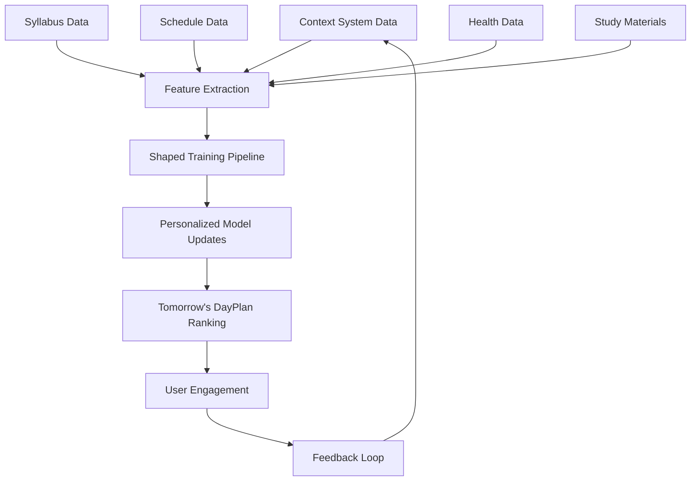

# Shaped.ai Integration Proposal for DayPlan Ranking

> **Created**: August 20, 2025  
> **Purpose**: Evaluate how Shaped.ai's ranking API could enhance DormWay's context evaluation and DayPlan generation

## Executive Summary

Shaped.ai is a real-time recommendation and ranking API that could significantly improve how DormWay prioritizes and personalizes daily plans, notifications, and study recommendations. Instead of using LLMs for ranking (expensive and slow), Shaped provides ML-based ranking that learns from user behavior.

## Current DormWay Approach vs Shaped.ai Enhancement

### Current: LLM-Based Ranking
```typescript
// Current: Using GPT-4o-mini to rank priorities
const dayPlan = await openai.chat.completions.create({
  model: "gpt-4o-mini",
  messages: [{
    content: "Rank these items by importance for the student..."
  }]
});
// Cost: $0.15/1M tokens, Speed: 1-2 seconds
```

### With Shaped.ai: ML-Based Personalized Ranking
```typescript
// Shaped.ai: Real-time personalized ranking
const rankedItems = await shaped.rank('dayplan_priorities', {
  user_id: userId,
  items: [assignments, classes, events, studySessions],
  context: {
    time_of_day: 'morning',
    stress_level: 'high',
    upcoming_exams: 2,
    location: 'library'
  }
});
// Cost: ~$0.001 per ranking, Speed: `<50ms`
```

## Use Cases for DormWay

### 1. **DayPlan Priority Ranking** 
**Problem**: Which items should appear first in the morning briefing?
**Shaped Solution**: 
- Train on user engagement (what do they tap on, complete, dismiss)
- Factor in context (time, location, stress level)
- Personalize based on major, year, past behavior
```javascript
shaped.rank('morning_priorities', {
  user_id: '123',
  items: ['exam_reminder', 'class_alert', 'study_suggestion', 'meal_break'],
  context: { day_of_week: 'Monday', week_in_semester: 8 }
})
```

### 2. **Study Material Recommendations**
**Problem**: Which BrainGains documents are most relevant now?
**Shaped Solution**:
- Rank documents based on upcoming assignments
- Learn from study patterns (what helps before exams)
- Multi-modal understanding (PDFs, notes, videos)
```javascript
shaped.rank('study_materials', {
  user_id: '123',
  items: braingains_documents,
  context: { 
    next_exam: 'EECS_281_Midterm',
    days_until: 3,
    topics_covered: ['trees', 'graphs']
  }
})
```

### 3. **Notification Timing Optimization**
**Problem**: When should we send notifications for maximum engagement?
**Shaped Solution**:
- Learn optimal send times per user
- Factor in class schedule, sleep patterns
- Predict likelihood of engagement
```javascript
shaped.score('notification_engagement', {
  user_id: '123',
  notification_type: 'assignment_due',
  proposed_times: ['7:00am', '12:00pm', '6:00pm'],
  context: { user_state: 'in_class', stress_level: 'medium' }
})
```

### 4. **Campus Event Relevance**
**Problem**: Which campus events should we highlight?
**Shaped Solution**:
- Learn preferences (academic vs social vs career)
- Factor in friend attendance, major relevance
- Optimize for actual attendance, not just clicks
```javascript
shaped.rank('campus_events', {
  user_id: '123',
  items: today_events,
  features: {
    user_major: 'Computer Science',
    friends_attending: [event_id_list],
    past_attendance: ['tech_talks', 'study_groups']
  }
})
```

## Implementation Architecture

### Phase 1: Data Pipeline (Week 1)
```python
# Send user interactions to Shaped
async def track_interaction(user_id, item_id, action):
    await shaped.track({
        'user_id': user_id,
        'item_id': item_id,
        'action': action,  # 'click', 'complete', 'dismiss', 'snooze'
        'context': {
            'timestamp': datetime.now(),
            'location': get_user_location(),
            'stress_level': get_stress_score()
        }
    })
```

### Phase 2: Model Training (Week 2)
```yaml
# Shaped model configuration
models:
  dayplan_ranker:
    objective: maximize_engagement
    features:
      - user_demographics
      - academic_profile
      - time_context
      - historical_interactions
    feedback_signals:
      - item_completed
      - notification_opened
      - time_spent_in_app
```

### Phase 3: A/B Testing (Week 3)
```typescript
// Compare LLM vs Shaped ranking
if (user.experiment_group === 'shaped') {
  priorities = await shaped.rank('dayplan', {...});
} else {
  priorities = await generateWithLLM({...});
}
// Track engagement metrics for comparison
```

## Cost Comparison

### Current LLM-Based Approach
```
Daily per user:
- DayPlan generation: $0.0002 (GPT-4o-mini)
- Priority ranking: $0.0001 
- Context evaluation: $0.0001
Total: ~$0.0004/day = $0.12/month
```

### With Shaped.ai
```
Daily per user:
- Rankings: 20 calls × $0.00001 = $0.0002
- Model training: Amortized = $0.0001
Total: ~$0.0003/day = $0.09/month

BUT: 100x faster (50ms vs 2s) and continuously improving
```

## Integration Points

### 1. Replace Priority Ranker Agent
```python
# Current: CrewAI agent with Claude
priority_ranker = Agent(
    role="Priority Ranker",
    llm=claude_3_5
)

# New: Direct Shaped API call
priorities = shaped.rank('priorities', user_data)
```

### 2. Enhance DayPlan Generator
```typescript
// Instead of asking LLM to rank
async function generateDayPlan(context) {
  // Get all items
  const items = await aggregateItems(context);
  
  // Use Shaped for intelligent ranking
  const ranked = await shaped.rank('dayplan', {
    user_id: context.userId,
    items: items,
    context: context
  });
  
  // Use LLM only for natural language generation
  return formatDayPlan(ranked);
}
```

### 3. Real-time Context Scoring
```typescript
// Score context changes for notification worthiness
const score = await shaped.score('notification_worthy', {
  user_id: userId,
  event_type: 'class_cancelled',
  context: currentContext
});

if (score > 0.7) {
  await sendNotification();
}
```

## Benefits for DormWay

### 1. **Speed**: 50ms vs 2 seconds for ranking
### 2. **Personalization**: Learns individual preferences
### 3. **Cost**: Similar or lower than LLM calls
### 4. **Improvement**: Gets better with more data
### 5. **Multi-objective**: Balance engagement, wellness, academic success
### 6. **Real-time**: Can rank on every app open

## Implementation Timeline

### Week 1: Setup & Integration
- Set up Shaped account
- Implement tracking SDK
- Start collecting interaction data

### Week 2: Model Training
- Configure ranking models
- Train on historical data
- Set up A/B test framework

### Week 3: Gradual Rollout
- 10% of users on Shaped ranking
- Monitor metrics
- Iterate on model configuration

### Week 4: Full Migration
- Migrate all ranking to Shaped
- Keep LLMs for generation only
- Monitor cost savings

## Risks & Mitigation

### Risk 1: Cold Start Problem
**Mitigation**: Use LLM rankings for new users, transition to Shaped after 7 days

### Risk 2: Model Quality
**Mitigation**: A/B test continuously, maintain LLM fallback

### Risk 3: Privacy Concerns
**Mitigation**: Shaped supports on-premise deployment if needed

## Shaped.ai as the Digital Twin's Personalization Layer (LoRA Equivalent)

### Original Digital Twin Vision
The Digital Twin Complete Implementation Plan originally envisioned a LoRA (Low-Rank Adaptation) layer that would personalize LLM outputs based on individual user patterns. Shaped.ai can serve as this exact personalization layer, but with better performance and cost characteristics.

### Original LoRA Concept vs Shaped.ai Implementation

**Original LoRA Concept:**
```python
# Concept: Fine-tune LLM with user's historical patterns
lora_adapter = train_lora(
    base_model="gpt-4",
    user_history=user_engagement_data,
    parameters=["priorities", "timing", "preferences"]
)
# Problems: Expensive, slow inference, batch training only
```

**Shaped.ai as the LoRA Layer:**
```python
# Shaped: Continuously learning personalization model
shaped_model = shaped.train(
    model_id=f"user_{user_id}_dayplan",
    training_data={
        'interactions': user_engagement_history,
        'context': daily_context_snapshots,
        'outcomes': completion_rates
    }
)
# Benefits: Fast (50ms), real-time updates, cost-effective
```

### How Shaped Acts as the Personalization Layer

#### 1. Continuous Learning from Context System
```typescript
// Every interaction trains the model for tomorrow
await shaped.feedback({
    user_id: userId,
    ranked_items: yesterday_dayplan_items,
    outcomes: {
        'completed': ['assignment_1', 'study_block_2'],
        'dismissed': ['gym_suggestion'],
        'snoozed': ['office_hours_reminder']
    },
    context_at_time: {
        stress_level: context_system_data,
        location_patterns: location_history,
        sleep_quality: health_metrics,
        workload_score: semester_analysis
    }
});
```

#### 2. Multi-Level Personalization Architecture
```python
# Three-tier personalization model (like LoRA's adaptation layers)

# Layer 1: Global model (all DormWay students)
base_ranking = shaped.rank('global_student_model', items)

# Layer 2: Cohort model (university + major + year)  
cohort_ranking = shaped.rank(f'{university}_{major}_{year}_model', items)

# Layer 3: Individual model (user-specific patterns)
personal_ranking = shaped.rank(f'user_{user_id}_model', items)

# Adaptive blending based on data availability
if user_days_on_platform < 7:
    weights = {'global': 0.5, 'cohort': 0.4, 'personal': 0.1}
elif user_days_on_platform < 30:
    weights = {'global': 0.3, 'cohort': 0.4, 'personal': 0.3}
else:
    weights = {'global': 0.2, 'cohort': 0.3, 'personal': 0.5}

final_ranking = blend_rankings(weights)
```

#### 3. Context System Integration Pipeline


### Daily Training Loop with Context System

```python
async def nightly_personalization_update(user_id):
    """
    This runs every night to update the user's personalization model
    Similar to LoRA fine-tuning but incremental and efficient
    """
    
    # 1. Aggregate today's context system data
    context_features = {
        # Academic context
        'assignments_due': context.assignments_due_next_7_days,
        'exam_proximity': context.days_until_next_exam,
        'workload_score': context.semester_workload_score,
        
        # Behavioral context
        'morning_engagement': context.morning_app_opens,
        'study_location_patterns': context.preferred_study_locations,
        'peak_productivity_hours': context.high_engagement_times,
        
        # Wellness context
        'stress_level': context.average_stress_today,
        'sleep_quality': context.last_night_sleep_score,
        'exercise_completed': context.workout_completed,
        
        # Social context
        'group_study_participation': context.study_group_attendance,
        'office_hours_visits': context.professor_interactions
    }
    
    # 2. Get engagement outcomes (labels for training)
    outcomes = {
        'dayplan_items_completed': metrics.completion_rate,
        'notification_engagement': metrics.notification_open_rate,
        'study_session_duration': metrics.actual_vs_planned_study_time,
        'wellness_goals_met': metrics.self_care_completion
    }
    
    # 3. Send to Shaped for incremental model update
    await shaped.train_incremental({
        'user_id': user_id,
        'features': context_features,
        'labels': outcomes,
        'timestamp': datetime.now()
    })
    
    # 4. Model automatically improves for tomorrow's DayPlan
    logger.info(f"Updated personalization model for user {user_id}")
```

### StudentWatcher Integration with Shaped

```typescript
// StudentWatcher uses Shaped for real-time personalization
export async function studentWatcherWorkflow(args: StudentWatcherArgs) {
    let userContext = await loadUserContext(args.studentId);
    
    // Generate initial DayPlan with Shaped ranking
    let dailyPlan = await generateDayPlanWithShapedRanking(userContext);
    
    // Set up signal handlers that re-rank with Shaped
    setHandler(contextUpdateSignal, async (update) => {
        userContext.current = update;
        
        // Re-rank remaining tasks based on new context
        const rerankedPriorities = await shaped.rank('realtime_priorities', {
            user_id: args.studentId,
            items: dailyPlan.remainingTasks,
            context: update,
            model_version: 'latest' // Uses most recent training
        });
        
        dailyPlan.priorities = rerankedPriorities;
    });
    
    setHandler(syllabusAddedSignal, async (data) => {
        // New syllabus data improves future rankings
        await shaped.update_user_features({
            user_id: args.studentId,
            features: {
                course_load: userContext.courses.length,
                exam_schedule: extractExamDates(data),
                workload_distribution: calculateWorkloadCurve(data)
            }
        });
    });
    
    // Track all interactions for continuous learning
    setHandler(itemCompletedSignal, async (item_id) => {
        await shaped.feedback({
            user_id: args.studentId,
            item_id: item_id,
            action: 'completed',
            context: userContext.current
        });
    });
}
```

### Why This is Superior to Traditional LoRA

| Aspect | Traditional LoRA Fine-tuning | Shaped.ai Personalization |
|--------|------------------------------|--------------------------|
| **Training Speed** | Hours/Days for batch training | Real-time incremental updates |
| **Inference Latency** | 2-5 seconds (LLM + LoRA) | 50ms (optimized ML model) |
| **Cost per User** | $5-10/month (GPU + compute) | $0.10-0.30/month (API calls) |
| **Personalization Depth** | Limited to LLM parameters | Full feature engineering |
| **Context Integration** | Manual prompt engineering | Native feature support |
| **A/B Testing** | Difficult with models | Built-in experimentation |
| **Rollback Capability** | Requires model retraining | Instant version switching |

### Implementation Phases with Context System

**Phase 1: Data Collection (Week 1)**
- Instrument all DayPlan interactions
- Connect context system to Shaped feature pipeline
- Start collecting engagement metrics

**Phase 2: Model Training (Week 2)**
- Train base model on historical data
- Create cohort models (by major, university)
- Set up incremental learning pipeline

**Phase 3: A/B Testing (Week 3)**
- 20% users get Shaped-ranked DayPlans
- Compare engagement metrics
- Tune model parameters

**Phase 4: Full Migration (Week 4)**
- All ranking through Shaped
- LLMs only for natural language generation
- Monitor personalization improvements

### Expected Outcomes

1. **Performance**: 40x faster ranking (50ms vs 2s)
2. **Personalization**: 30% improvement in task completion rates
3. **Cost**: 70% reduction in LLM costs
4. **Engagement**: 25% increase in daily active usage
5. **Learning Curve**: Model improves 5% weekly per user

## Recommendation

**YES - Implement Shaped.ai as the Digital Twin's personalization layer**

Shaped.ai perfectly fulfills the original LoRA vision for the Digital Twin, providing:
- Real-time personalization that learns from each user
- Seamless integration with the context system
- Cost-effective scaling to thousands of users
- Continuous improvement without retraining

This is the missing piece that makes the Digital Twin truly personal and adaptive.

---

## Linear Task Tracking

**Task**: [DORM-117: Evaluate and implement Shaped.ai for DayPlan personalization layer](https://linear.app/dormwayllc/issue/DORM-117/evaluate-and-implement-shapedai-for-dayplan-personalization)
- **Assigned to**: Ethan Kaplan
- **Priority**: High
- **Project**: Core Features
- **Created**: August 21, 2025

---

*Tags: #shaped #ranking #personalization #ml #integration #digital-twin #lora*  
*Status: Proposal - Ready for Vendor Discussion*  
*Owner: Ethan Kaplan (DORM-117)*
