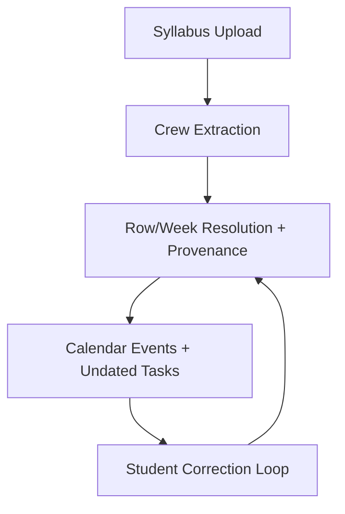

# Syllabus Deadline Resolution - Forward Spec

> Make syllabus-derived deadlines as reliable as Canvas by resolving week/finals references, table layouts, and undated tasks into a complete, trustworthy schedule graph with provenance.

---

## Summary

### Objective
Turn messy syllabus formats (PDF/DOCX tables, week references, finals week, “due by 11:59PM” rows) into calendar + task items that students can trust, with clear provenance and user correction loops.

### Scope
- In scope: syllabus parsing, date resolution, calendar normalization, task surfacing for undated items, timezone correctness for deadline events, provenance/confidence metadata.
- Out of scope: full LMS sync expansion beyond Canvas, iOS UI parity, and classroom attendance/gradebook features.

### Linear Issues
- TBD (create tickets once plan is approved)

---

## Current State

### What Exists Today
- Crew extraction produces `assignments`, `dates`, `class_sessions`, and `schedule_events` in `processed_syllabus_crew`.
- Calendar normalization only emits events when a concrete `due_date` exists.
- Week/finals references were historically dropped; now resolved in normalization (recent fix).
- Canvas deadlines are normalized but can shift when times are floating and timezone is missing.

### Pain Points
- Undated assignments are discarded (no calendar/task presence).
- Table layouts in DOCX often separate date and “due by 11:59PM,” leading to missing deadlines.
- Timezone handling for floating due dates can shift midnight to evening.

### Relevant Code Locations
| Component | Path |
|-----------|------|
| Syllabus workflow | `services/engine/src/workflows/syllabusProcessor.workflow.ts` |
| Crew output enrichment | `services/engine/src/activities/braingains.activities.ts` |
| Calendar normalization | `services/engine/src/services/calendarNormalization.service.ts` |
| Calendar storage | `services/engine/src/activities/calendar.activities.ts` |
| Canvas deadline sync | `services/engine/src/activities/canvas.activities.ts` |

---

## Target State

### Architecture


### Key Changes
1. Resolve week/finals references using term windows for syllabus dates and assignments.
2. Bind table-row context (date column + due row) into a single deadline record.
3. Surface undated syllabus tasks in Tasks/Today with “set date” actions.
4. Normalize floating times in a known timezone (avoid midnight → 7pm shifts).
5. Attach provenance + confidence metadata to syllabus-derived events.

---

## Implementation Phases

### Phase 1: Resolution Foundation (Engine)
**Goal**: Convert week/finals + row-context data into real events.

**Tasks**:
- [x] Resolve Week/Finals references using term windows in calendar normalization.
- [x] Map `class_sessions.assignments_due` and `schedule_events` into calendar events.
- [ ] Add table-row binding at extraction/preprocessing stage (DOCX/PDF row association).
- [ ] Stop using “current date” fallback on parse failure; mark as unresolved instead.

**Deliverables**:
- Syllabus deadlines appear for DOCX tables like FTVM 376/368.
- Week/FInals references become concrete dates.

**Definition of Done**:
- [ ] Unit tests for week/finals + row context.
- [ ] Reprocess sample syllabi and verify calendar output.

---

### Phase 2: Undated Tasks + UX
**Goal**: Don’t lose assignments with no dates.

**Tasks**:
- [ ] Create an “Undated Syllabus Tasks” feed in Tasks/Today.
- [ ] Add “Set date” quick action (creates calendar event + updates provenance).
- [ ] Track corrections as feedback for future extraction.

**Deliverables**:
- Undated tasks visible and actionable.

**Definition of Done**:
- [ ] QA on a syllabus with week-only references and no explicit dates.

---

### Phase 3: Provenance & Confidence
**Goal**: Explain why a date exists and how reliable it is.

**Tasks**:
- [ ] Store metadata: `source_type`, `resolution_method`, `confidence`.
- [ ] UI indicator for low-confidence dates and “confirm?” prompts.
- [ ] De-dup rules when Canvas vs syllabus disagree.

**Deliverables**:
- Every syllabus-derived event has provenance and confidence.

**Definition of Done**:
- [ ] Conflicts between sources are resolved deterministically and visible to users.

---

### Phase 4: Timezone & Deadline Semantics
**Goal**: Eliminate midnight shift bugs for Canvas and syllabus events.

**Tasks**:
- [ ] Ensure floating due dates use course/campus timezone before UTC conversion.
- [ ] Standardize midnight/all-day semantics (e.g., Canvas “due at 11:59PM local”).

**Deliverables**:
- Deadline times match LMS expectations in local time.

**Definition of Done**:
- [ ] 0 reports of midnight → 7pm shifts in QA.

---

## Technical Details

### Database Changes (Proposed)
```sql
-- Optional: store provenance for syllabus-derived events
ALTER TABLE time_blocks
  ADD COLUMN IF NOT EXISTS metadata jsonb;
-- metadata.syllabus = { source, confidence, resolution_method }
```

### API Changes (Proposed)
| Endpoint | Method | Description |
|----------|--------|-------------|
| `/v2/students/me/tasks/undated` | GET | Undated syllabus tasks |
| `/v2/students/me/tasks/:id/date` | POST | Assign a date + promote to calendar |

### Configuration
- Ensure campus timezone and term windows are available for syllabus normalization.

---

## Testing Plan

### Unit Tests
- [ ] Week/Finals reference resolution
- [ ] Row-context binding: date column + due column
- [ ] Timezone conversion for floating due dates

### Integration Tests
- [ ] FTVM 376/368 (DOCX tables)
- [ ] MKT 407 (Canvas structured deadlines)

### Manual QA
- [ ] Upload syllabus with “Week 6” references
- [ ] Upload syllabus with date + “due by 11:59PM” in same row
- [ ] Verify calendar times in local timezone

---

## Rollout Plan

### Staging
1. Reprocess sample syllabi
2. Verify calendar events + undated tasks
3. Validate timezone correctness

### Production
1. Feature-flag row binding + undated tasks
2. Incremental rollout by campus
3. Monitor error + feedback rate

### Rollback Plan
Disable feature flags; revert to strict “dated-only” behavior.

---

## Risks & Dependencies

### Risks
| Risk | Impact | Mitigation |
|------|--------|------------|
| False date binding from tables | Medium | Confidence + confirm UI |
| Timezone misinterpretation | High | Enforce timezone at normalization |
| Conflicts with Canvas dates | Medium | Source precedence + conflict UI |

### Dependencies
- [ ] Campus term window accuracy (current_term_data)
- [ ] UI support for undated tasks and correction flow

---

## Open Questions

- Do we surface syllabus vs Canvas conflicts, or silently pick a winner?
- Should “Finals Week” default to endDate or finals calendar if available?
- Do we allow cohort-level correction propagation (same syllabus, many users)?

---

## Related Documentation

- [Calendar, Time Blocks, Timezones](/docs/engineering/architecture/sot-calendar-time-blocks-timezones)
- [BrainGains & RAG](/docs/engineering/architecture/sot-braingains-rag)
- [Plans](/docs/plans/index)
