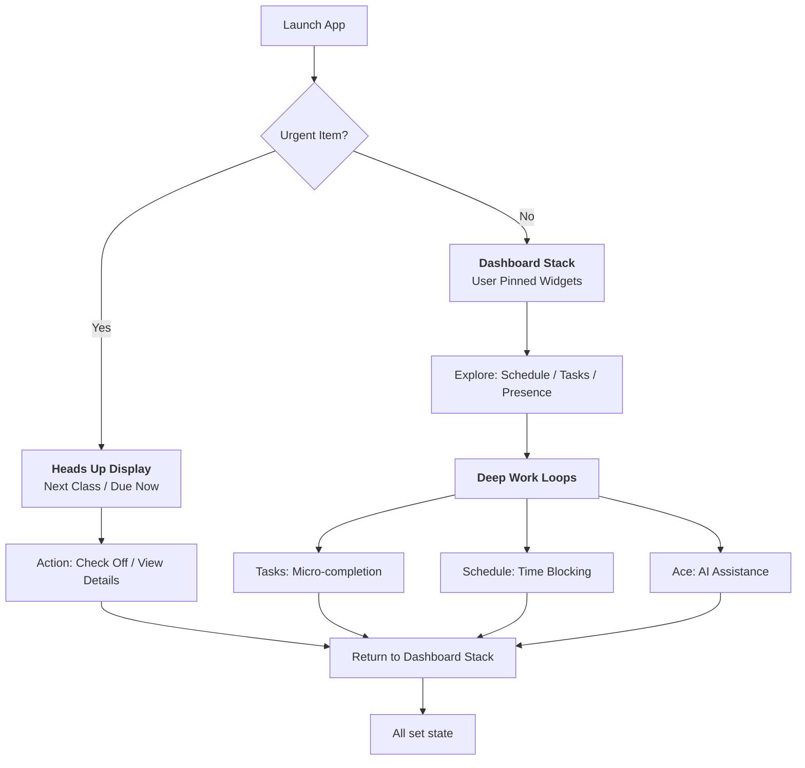

# DormWay iOS-iPadOS-macOS UX Flow (Current)

Single, current map of the DormWay ios-clean UX flow across iPhone, iPad, and Mac Catalyst. This is a consolidation doc, not a Source of Truth. When this conflicts with SoTs or code, SoTs and code win.

## Canonical References (use first when resolving conflicts)

- [Navigation IA](/docs/engineering/architecture/sot-navigation-ia)
- [Home & Widgets](/docs/engineering/architecture/sot-home-widgets)
- [Feed Cards](/docs/engineering/architecture/sot-feed-cards)
- Engineering/Architecture/SoT - iOS App UI Patterns
- [iOS App State of Things](/docs/engineering/technical/ios/sot-ios-app-state-of-things)

Primary code verification points:
- `.repos/ios-clean/App/ContentView.swift`
- `.repos/ios-clean/App/Views/Onboarding/OnboardingView.swift`
- `.repos/ios-clean/App/Shell/TabShellView.swift`
- `.repos/ios-clean/App/Shell/iPad/IPadNavigationShell.swift`
- `.repos/ios-clean/App/Shell/iPad/IPadSidebarView.swift`
- `.repos/ios-clean/App/Views/HomeTabView.swift`
- `.repos/ios-clean/App/Views/Feed/FeedView.swift`
- `.repos/ios-clean/App/Views/Feed/SetupPromptView.swift`
- `.repos/ios-clean/App/Views/Home/IPadHomeView.swift`
- `.repos/ios-clean/App/Views/Schedule/ScheduleTabView.swift`
- `.repos/ios-clean/App/Views/Tasks/TasksTabView.swift`
- `.repos/ios-clean/App/Views/Term/TermTabView.swift`
- `.repos/ios-clean/App/Views/Library/LibraryTabView.swift`
- `.repos/ios-clean/App/Views/Settings/SettingsSheetView.swift`

## Platform Use Context (Gen Z behavior assumptions)

- iPhone: short, frequent sessions. Students open the app between classes or while walking. They want a fast, finite answer to what is next and what is due. Flow must be low friction, low reading load, and control-first.
- iPad: desk and lecture mode. Students plan, review, and take notes for longer stretches. Flow must support split attention (schedule + notes + course context) and frictionless capture.
- macOS (Catalyst today): long, keyboard-first sessions. Students expect fast navigation, shortcuts, and multi-tasking. Flow should favor power use and quick switching, not mobile-only patterns.

## Current Flow (Verified in ios-clean)

### 1) App Entry and Gating
- Launch -> DI initialization -> auth restoration -> onboarding gate.
- Onboarding steps are fixed and linear: Welcome -> Campus -> Housing -> Personality -> Permissions.
- Post-onboarding leads directly into main navigation (Today default).

### 2) Global Navigation IA
- Five primary surfaces: Today, Tasks, Schedule, Courses, Library.
- Settings is not a tab. It is a top-right sheet on all tabs.

### 3) Today (iPhone)
- Feed-first implementation with three layers (current code reality, not ideal):
  - Feed header and setup prompt.
  - For You cards from the feed system (dismissal and snooze supported).
  - Collapsible widget stack (Up Next, Schedule, Tasks, Term, Campus).
- Today is the main daily return surface.

### 4) Tasks
- Bucketed by urgency: Do Now, Do Next, Do Later, Done.
- Quick add and task detail sheet.
- Filters by source and course.

### 5) Schedule
- Day or week modes with term progress and week navigation.
- Event detail sheet with edit and delete.
- Add/edit via sheets.

### 6) Courses
- Term summary, workload heatmap, alerts, course grid.
- Upload actions (schedule, syllabus, docs).
- Course detail navigation from cards.

### 7) Library
- Segmented Files and Notes.
- Notes list + editor sheet.
- Files view uses the shared iPad files view implementation.

### 8) Settings
- Sheet presentation with Profile and settings sections.
- Triggered by the profile button in the top-right.

## Ideal End-to-End Flow (Top to Bottom)

This mirrors the 5 core journeys plus first Ace/BrainGains use. It is the desired student path across all platforms, independent of screen size.

1) Discovery -> Install -> Launch
- App store entry, quick brand trust, fast launch.

2) Onboarding -> Account -> Context
- Minimal steps and clear progress.
- Campus + housing + preferences complete.
- Permission prompts appear only when value is clear.

3) Setup Success -> Core Inputs Connected
- Syllabus upload or schedule import.
- Calendar connection when relevant.
- Canvas connection when available.

4) First Meaningful Win
- Today shows a Heads Up strip (top) plus a finite Dashboard Stack (control).
- Tasks shows a clean, actionable list with micro-completions.
- Schedule shows a trustworthy timeline with clear conflicts.

5) First BrainGains/Ace Use
- One actionable answer with cited context and a next step.
- Avoids hype; focuses on academic clarity.

6) Daily Return Loop
- Morning glance: what is next, what is due, what is at risk.
- Daytime actions: quick edits, add blocks, complete tasks.
- Evening wrap: tomorrow preview and next-priority prompt.

## Ideal Flow by Platform (Swimlane Summary)

### iPhone (Glance -> Act -> Exit)
1) Launch -> Heads Up + Dashboard Stack
2) See next event + top due item in under 10s
3) Tap into Tasks or Schedule if action needed
4) Quick action (complete task, edit event, add block)
5) Return to stack and clear state

### iPad (Plan -> Work -> Capture)
1) Launch -> Today (multi-column)
2) Review courses + workload + Heads Up cards
3) Open Schedule or Courses for deeper context
4) Start lecture capture or notes from Course/Calendar
5) Return to Today with updated context

### macOS (Keyboard-First -> Deep Work)
1) Launch -> Today or command search
2) Use shortcuts to switch surfaces
3) Open Tasks/Schedule/Courses in detail
4) Multi-task or reference notes while working
5) Exit with minimal friction

## Ideal iPhone Flow Diagram (Dashboard-First)

## Stack vs Feed Terminology (Directive)

- Dashboard Stack = finite, user-controlled, completion-friendly.
- Heads Up = thin feed layer only (time-sensitive signals).
- Use "dashboard" or "stack" in UX copy for core productivity views.
- Reserve the word "feed" for internal pipelines and the Heads Up system only.

## Current vs Ideal (Summary Table)

| Surface | Current | Ideal | Owner (proposed) | Priority (proposed) |
| --- | --- | --- | --- | --- |
| Today | Feed-first + setup prompt + widget stack | Dashboard stack + Heads Up strip + clear state | Platform + Design | High |
| Tasks | Buckets + quick add + filters | Micro-complete + tighter schedule linkage | Product + Platform | High |
| Schedule | Day/week + sheets + add/edit | Faster quick-add + conflict clarity | Platform | Medium |
| Courses | Term summary + heatmap + alerts | Stronger risk cues + lecture capture path | Product + Platform | Medium |
| Library | Files/Notes segmented + notes editor | Faster recent items + smarter filtering | Design + Product | Low |

## Gap List (Proposed Tickets + Impact)

- UX-GAP-01: Replace Today feed-first layout with dashboard stack + clear state. Impact: reduces anxiety and improves control. Priority: High.
- UX-GAP-02: One-tap task complete in Heads Up cards and tasks list. Impact: lowers friction for micro-actions. Priority: High.
- UX-GAP-03: Schedule quick-add from empty slots (day view). Impact: faster event capture, fewer drop-offs. Priority: Medium.
- UX-GAP-04: Course cards show next deadline + risk badge. Impact: clearer academic risk signaling. Priority: Medium.
- UX-GAP-05: Library “Recent” section with course filter chips. Impact: quicker access to active materials. Priority: Low.
- UX-GAP-06: iPad lecture capture shortcut from Schedule and Courses. Impact: drives lecture feature adoption. Priority: Medium.
- UX-GAP-07: Social presence module placeholder on Today (no data, just UI slot). Impact: protects layout for future social layer. Priority: Low.
- UX-GAP-08: 3-second capture path (NLP input + camera-first). Impact: reduces capture drop-off. Priority: High.
- UX-GAP-09: Auto-tagging + conflict detection. Impact: reduces cognitive load and prevents schedule mistakes. Priority: Medium.
- UX-GAP-10: Dark mode default for productivity surfaces (design decision). Impact: aligns with Gen Z expectations. Priority: Low.

## Social/Peer Layer (Reserved Space)

College usage is inherently social. Reserve a small, non-blocking slot for peer signals, even if data is not yet available.

- Examples: "3 classmates studying now" or "2 friends in this course."
- Placement: Today (below HeadsUp, above deep widgets) or Courses (per-course presence).
- Goal: avoid later UI rebuild when social features ship.

## Gen Z Student UX Expectations (Assumptions)

These are product assumptions to guide UX. Validate with research when possible.

- Control over consumption: finite dashboards reduce anxiety.
- Zero fluff: fast entry and immediate clarity over multi-screen walkthroughs.
- Trust first: clear privacy stance and visible data sources.
- Autonomy: easy edits and quick overrides without penalty.
- Passive accountability: presence signals over social posting.
- Invisible AI: auto-organize, auto-tag, detect conflicts.
- Camera and NLP capture: reduce typing and metadata friction.
- Dark mode as baseline expectation (validate with research).
- Lightweight personalization: helpful defaults, not a settings maze.

## Strategic Shift Summary (Gen Z Preference)

| Feature | Old Assumption | Gen Z Preference |
| --- | --- | --- |
| Home Screen | Feed scroll | Dashboard stack (finite) |
| Social | Posts and updates | Presence and body doubling |
| Input | Forms and menus | Camera + natural language |
| AI | Chatbot emphasis | Invisible auto-organizer |
| Mac App | iPad port | Keyboard-first power tool |

## Capabilities Map (Current + Target)

### Inputs (Student Actions)
- Upload syllabus, import schedule, connect Canvas, create tasks, capture notes.
- Natural language capture and camera-first capture (target).
- Quick additions are prioritized over multi-step forms.

### Processing (System Actions)
- Normalize calendar and syllabus data into a single timeline.
- Heads Up card generation and dismissal logic.
- Context-aware suggestions for tasks and schedules.
- Auto-tagging (course colors and context) and conflict detection (target).

### Outputs (Student Surfaces)
- Dashboard stack + Heads Up strip (glanceable status).
- Tasks buckets (actionable list).
- Schedule timeline (trustworthy time view).
- Courses overview (risk and workload).
- Library (notes and documents) plus presence widget (target).

### Actions (Student Decisions)
- Add/edit events, complete tasks, upload documents.
- Ask Ace for planning and clarifications.
- Dismiss or snooze Heads Up cards, swipe to clear the stack.

## Research Backlog (Validate Assumptions)

### Behavior and Preference Checks
- Time-to-value: how fast students expect a "next action" on first launch. (Use Research-Template)
- Tolerance for onboarding steps vs skip/deferral appetite. (Use Research-Template)
- Trust triggers: what makes data feel reliable (sources, timestamps, edits). (Use Research-Template)
- AI framing: how much AI branding is acceptable vs helpful. (Use Research-Template)
- Notification value: what feels useful vs noisy in daily use. (Use Research-Template)
- Stack vs feed preference and "all set" state value. (Use Research-Template)
- Body doubling signals: what presence cues feel helpful vs distracting. (Use Research-Template)
- Capture speed: camera/NLP flows vs manual entry. (Use Research-Template)
- Dark mode expectation for productivity apps. (Use Research-Template)
- Social proof: what peer signals feel helpful vs distracting. (Use Research-Template)

### Platform-Specific Checks
- iPhone: preferred default view (feed vs timeline vs tasks). (Use Research-Template)
- iPad: multi-column layout comfort and lecture capture usage frequency. (Use Research-Template)
- macOS: expectation for menu bar, multi-window, and keyboard navigation. (Use Research-Template)

### Artifact Targets
- 8–12 student interviews across phone/iPad/laptop mix. (Use Research-Template)
- 1-week diary study for daily-return loop friction. (Use Research-Template)
- Short A/B tests on Today layout (widget-first vs feed-first emphasis). (Use Research-Template)

## iPadOS Specifics (Verified)

- NavigationSplitView with sidebar and detail pane.
- Sidebar aligns to the same 5-item IA, plus course list.
- Home (IPadHomeView) uses responsive multi-column layouts:
  - Wide (12.9): widgets, courses, and feed in parallel columns.
  - Medium (11): widgets + feed, courses below.
  - Narrow: stacked scroll.
- Lecture experience on iPad supports PencilKit canvas and Notes mode toggle.

## macOS (Catalyst) Specifics (Verified)

- Uses iPad split view shell with Mac adaptations.
- Title bar is hidden; sheets use fixed sizes.
- Keyboard shortcuts for navigation and settings.
- No PencilKit, Screen Time, or Live Activities; lecture view defaults to text-based mode.

## macOS Roadmap Split (Catalyst Now vs Native Later)

### Fixing Catalyst (Near-term)
- Improve keyboard shortcuts and focus handling.
- Reduce sheet friction with consistent sizing and quick dismiss.
- Ensure split-view navigation remains predictable on Mac.

### Building Native (Long-term)
- Menu bar access and global hotkeys.
- Multi-window and workspace-aware collaboration.
- Deeper system integrations (Finder, calendar, notifications).

## Ideal Flow (Target Behavior by Platform)

### iPhone
- Stay feed-first: Today must answer what is next and what is due in under 10 seconds.
- Keep setup tasks on Today until core data is connected (schedule, syllabus, Canvas).
- Prefer bottom sheet details to avoid navigation depth.

### iPad
- Treat iPad as planning and lecture workstation.
- Make lecture capture a top-level action from Courses and Schedule.
- Use the right panel for details to keep context while scanning.

### macOS (Catalyst now, Native later)
- Near-term: emphasize keyboard-first UX, command search, and multi-window patterns where possible.
- Long-term: align with macOS-native goals (menu bar access, collaboration rooms, system integrations).

## DormWay Capabilities That Shape UX

- Feed cards are the primary HeadsUp layer (max 5 cards per load, dismiss and snooze).
- Home widgets are unified via the collapsible widget stack on iOS and multi-column widgets on iPad.
- Schedule timeline, tasks, and course risk signals are core data surfaces.
- Library is the entry point for files and notes; notes are not a primary nav item.

## Known Doc Conflicts and Outdated Guidance

- `Engineering/Technical/iOS/iOS Onboarding Flow.md` describes a PLG zero-state dashboard that is not in the current app flow.
- `Engineering/Technical/iOS/iOS Login Flow Updates.md` references Supabase/Auth0, but iOS now uses Clerk.
- `Engineering/Technical/iOS/SoT - iOS App State of Things.md` lists extra iPad sidebar items that no longer exist in code.
- `Engineering/Technical/iOS/DormWay iOS Dashboard UI Integration.md` reflects legacy DashboardUI integration, not the current feed-first Today surface.

## Open Decisions and Follow-ups

- Confirm whether PLG zero-state onboarding should be revived or formally removed from docs.
- Decide macOS strategy: Catalyst-only or native + menu bar companion.
- Define whether HeadsUp should remain feed-only on iOS or be surfaced as a distinct widget in the stack.
