# Customer.io Campaign Flows - Detailed

This document provides detailed campaign flows with branching logic for all Customer.io campaigns across the 5 user journeys.

## Journey 1: Onboarding Campaign Flow

The onboarding flow has multiple branches based on user actions and completion status.


### Onboarding Email Templates

**Email 1A: Welcome (Complete Profile)**
```
Subject: Welcome to DormWay, {{first_name}}! 🎓
Trigger: user_created AND profile_complete = true
Delay: Immediate

Hi {{first_name}},

Welcome to your personal college assistant! You're joining thousands of students at {{campus}} who are staying on top of their academics with DormWay.

Here's what to do next:
✅ Upload your syllabus (we'll extract all deadlines)
✅ Connect your calendar (never miss a class)
✅ Enable notifications (timely reminders)

[Upload Your First Syllabus] - CTA Button

Questions? Just reply to this email.

Your academic success team,
DormWay
```

**Email 1B: Welcome (Incomplete Profile)**
```
Subject: Complete your DormWay setup, {{email}}
Trigger: user_created AND profile_complete = false
Delay: 2 hours

Hi there,

We noticed you started setting up DormWay but didn't finish. It only takes 2 more minutes!

Complete your profile to:
- Get personalized deadline reminders
- Access your campus resources
- Use AI-powered study help

[Complete Setup] - CTA Button

-The DormWay Team
```

## Journey 2: Syllabus Upload Campaign Flow


### Syllabus Campaign Branches

**Branch 1: No Syllabi (New User)**
1. Day 1: Upload prompt push
2. Day 3: Email with benefits + how-to
3. Day 7: Re-engagement with peer comparison
4. Day 14: Final reminder before semester gets busy

**Branch 2: Partial Syllabi**
1. Immediate: Success notification for uploaded
2. Week 1: Gentle reminder for missing courses
3. Week 2: Urgency increase (deadlines might be missed)
4. Week 3: Final push with manual upload link

**Branch 3: Upload Failures**
1. Immediate: Error notification with tips
2. 1 hour: Email with troubleshooting guide
3. Day 1: Offer to help via support
4. Day 3: Alternative upload methods

## Journey 3: Calendar Connection Flow


### Calendar Connection Scenarios

**Scenario 1: Smooth Connection**
```
1. Permission granted → Immediate success push
2. Sunday: First weekly preview email
3. Ongoing: Smart reminders based on calendar
```

**Scenario 2: Permission Denied - Recoverable**
```
1. Denied → Privacy explanation email (Day 1)
2. Day 7: Benefits reminder with testimonial
3. Day 14: Feature comparison (with vs without)
4. Day 30: Final attempt with new features
```

**Scenario 3: Technical Issues**
```
1. Sync failed → Immediate error notification
2. 1 hour: Troubleshooting email
3. Day 1: Manual calendar entry option
4. Day 3: Support outreach if still failing
```

## Journey 4: First BrainGains Interaction


### BrainGains Engagement Strategies

**High Engagement Path** (Daily Users)
- Streak notifications at milestones
- Weekly insight emails with usage stats
- Advanced tips for power users
- Early access to new features

**Medium Engagement Path** (Weekly Users)
- Weekly study tips related to their courses
- Exam prep reminders
- Popular questions from their classes
- Peer comparison stats

**Low Engagement Path** (Rare Users)
- Monthly feature highlights
- Success stories from other students
- Simplified re-onboarding
- Alternative study resources

## Journey 5: Daily Return User - Complete Flow


### Daily Campaign Variations

**Morning Briefing Variants**

```mermaid
graph LR
    A[Morning Check] --> B{Conditions}
    B -->|Rain + Classes| C["☔ Rainy class day<br/>Don't forget umbrella!"]
    B -->|Deadline Today| D["📚 Assignment due!<br/>{assignment_name} by {time}"]
    B -->|Exam Today| E["📝 Good luck on exam!<br/>{course} at {time}"]
    B -->|Light Day| F["🌟 Light schedule<br/>Great day to catch up"]
    B -->|Friday| G["🎉 Friday vibes<br/>Weekend almost here!"]
```



**Engagement-Based Adjustments**


## Re-engagement Campaign Logic


### Re-engagement Message Progression

1. **Day 3: Gentle Reminder**
   - Push: "Missing anything? Check what's due this week"
   - Personalzied with actual deadline if exists

2. **Day 5: Check-in Email**
   - Subject: "Everything okay, {{first_name}}?"
   - Content: Empathetic, offer help, quick wins

3. **Day 7: Urgency/FOMO**
   - Push: "3 deadlines this week - don't forget!"
   - Email: Success stories from other students

4. **Day 14: Win-back Offer**
   - Special feature unlock or premium trial
   - Direct feedback request

5. **Day 30: Sunset**
   - Final email: "We'll be here when you need us"
   - Move to minimal communication

## Campaign Performance Tracking


## Technical Implementation Notes

### Segment Definitions

```javascript
// High-Value Users (Protect at all costs)
segment.highValue = {
  conditions: [
    { dailyActiveStreak: { gte: 7 } },
    { syllabusCount: { gte: 4 } },
    { brainGainsQuestions: { gte: 20 } },
    { pushClickRate: { gte: 0.5 } }
  ],
  campaigns: ['premium_experience', 'early_access', 'vip_support']
};

// At-Risk Users (Re-engage aggressively)
segment.atRisk = {
  conditions: [
    { lastActiveAt: { lt: "now-3d" } },
    { lastActiveAt: { gt: "now-7d" } },
    { totalSessions: { gte: 5 } }
  ],
  campaigns: ['win_back_sequence', 'special_offers', 'feedback_request']
};

// Power Users (Optimize for retention)
segment.powerUsers = {
  conditions: [
    { dailyActiveStreak: { gte: 14 } },
    { engagementScore: { gte: 0.8 } },
    { featuresUsed: { includes: ['braingains', 'calendar', 'notifications'] } }
  ],
  campaigns: ['power_user_tips', 'beta_features', 'referral_program']
};
```

### Campaign Timing Logic

```typescript
// Smart send time calculation
function calculateOptimalSendTime(user: User): Date {
  const preferences = user.notificationPreferences;
  const historicalEngagement = user.engagementHistory;
  
  // Check explicit preferences first
  if (preferences.morningTime) {
    return parseTime(preferences.morningTime);
  }
  
  // Use historical engagement data
  const bestHour = historicalEngagement
    .filter(e => e.action === 'notification_clicked')
    .map(e => e.timestamp.getHours())
    .reduce((acc, hour) => {
      acc[hour] = (acc[hour] || 0) + 1;
      return acc;
    }, {});
  
  // Default to 8 AM if no data
  return new Date().setHours(
    Object.keys(bestHour).sort((a, b) => bestHour[b] - bestHour[a])[0] || 8
  );
}
```

---

*Created: 2025-07-18*
*Status: 🟢 Ready for implementation with detailed flows*
*Related: [Customer.io Campaign Map](/docs/product/features/customerio-campaign-map-5-journeys), [Customer.io Event Implementation Guide](/docs/engineering/technical/customerio/customerio-event-implementation-guide), [5 Core User Journeys](/docs/plans/planning/5-core-user-journeys)*
