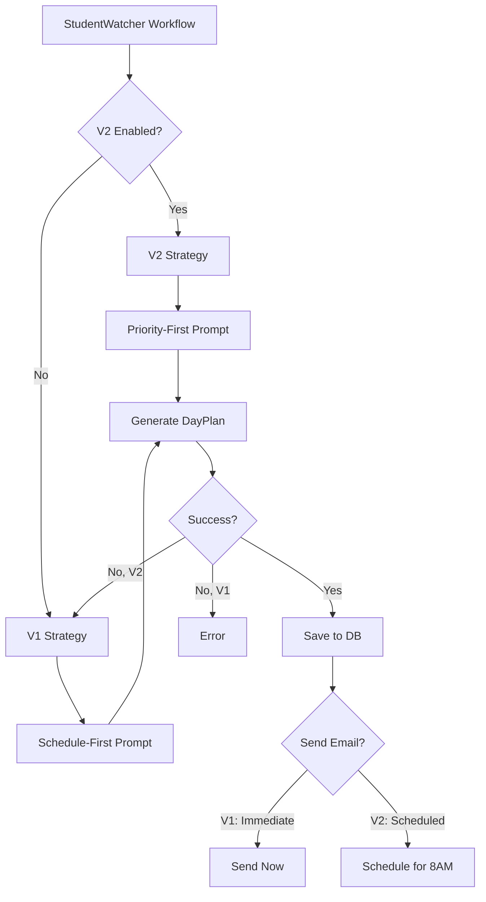

# DayPlan V2: Priority-First Redesign

## Executive Summary

- **Purpose**: Transform DayPlan from "micromanaging scheduler" to "priority-first daily brief"
- **Target**: College students who need actionable morning briefings, not overwhelming schedules
- **Feature Flag**: `DAYPLAN_V2_ENABLED` environment variable controls rollout
- **Timing Change**: V2 emails send at 8AM (configurable) instead of 5AM generation time
- **Backward Compatible**: V1 `events[]` array still populated for existing consumers

## Problem Statement

V1 DayPlan treated students like corporate executives with packed calendars. College students have different needs:

| V1 Approach | V2 Approach |
|-------------|-------------|
| Hour-by-hour schedule | Priority-first summary |
| Every event listed | Focus on what's due TODAY |
| Complex time blocks | Simple actionable items |
| Overwhelming detail | Quick morning glance |

## V2 Data Structure

### Core Fields

```typescript
interface DayPlan {
  // V2 Priority-First Fields
  dueToday?: AssignmentItem[];      // What's due today (PRIMARY FOCUS)
  hardCommitments?: HardCommitment[]; // Classes, exams, meetings
  conflicts?: ConflictAlert[];      // Schedule conflicts to resolve
  suggestedBlocks?: SuggestedBlock[]; // Optional study time suggestions
  nearFuture?: AssignmentItem[];    // Next 3 days lookahead
  summary?: DayPlanSummary;         // AI-generated one-liner + stats

  // V1 fields preserved for backward compatibility
  events?: DayPlanEvent[];
}
```

### Supporting Types

```typescript
interface AssignmentItem {
  id: string;
  title: string;
  courseName: string;
  courseId?: string;
  dueTime: string;                   // ISO timestamp
  submissionStatus?: 'not_started' | 'in_progress' | 'submitted';
  estimatedMinutes?: number;
  priority?: 'normal' | 'high' | 'critical';
  canvasUrl?: string;
}

interface HardCommitment {
  id: string;
  title: string;
  startTime: string;
  endTime: string;
  type: 'class' | 'exam' | 'meeting' | 'appointment' | 'work';
  location?: string;
  courseName?: string;
  isRecurring?: boolean;
}

interface ConflictAlert {
  id: string;
  type: 'overlap' | 'tight_gap' | 'deadline_during_class' | 'overload';
  severity: 'warning' | 'critical';
  message: string;
  affectedItems: string[];  // IDs of conflicting items
  suggestedResolution?: string;
}

interface SuggestedBlock {
  id: string;
  startTime: string;
  endTime: string;
  duration: number;         // Minutes
  quality: 'prime' | 'good' | 'marginal';
  suggestedUse?: string;    // "Work on Math homework"
  targetAssignment?: string; // Assignment ID
}

interface DayPlanSummary {
  oneLiner: string;         // "Busy day: 2 assignments due, 3 classes"
  dayLoad: 'light' | 'moderate' | 'busy' | 'heavy';
  highlights: string[];     // Key things to know
  contextNote?: string;     // Weather, campus events, etc.
  stats: {
    classCount: number;
    assignmentsDue: number;
    totalCommittedHours: number;
    freeHours: number;
  };
}
```

## Architecture

### Strategy Pattern

V2 uses a strategy pattern for clean V1/V2 separation:

```
src/activities/dayplan/
├── types.ts              # Strategy interfaces
├── strategy-factory.ts   # V1/V2 factory based on env var
├── strategy-base.ts      # Shared utilities
├── v1-strategy.ts        # Thin wrapper (existing logic)
├── v2-strategy.ts        # New priority-first strategy
├── v1-email-builder.ts   # V1 email format
├── v2-email-builder.ts   # V2 email format
├── email-timing.ts       # Timing logic (5AM vs 8AM)
└── index.ts              # Module exports
```

### Feature Flag

```typescript
// Check if V2 is enabled
function isDayPlanV2Enabled(): boolean {
  const envValue = process.env.DAYPLAN_V2_ENABLED;
  return envValue === 'true' || envValue === '1';
}
```

### Generation Flow



## Email Timing

### V1 vs V2 Timing

| Aspect | V1 | V2 |
|--------|-----|-----|
| Generation | 5AM local | 5AM local |
| Email Send | Immediate | 8AM (configurable) |
| User Control | None | Full preferences |

### V2 Preferences

```typescript
interface DayPlanPreferences {
  emailTiming: 'morning' | 'night_before' | 'deadlines_only' | 'never';
  preferredEmailTime?: string;  // "08:00", "07:30", etc.
  coachingLevel: 'minimal' | 'focused' | 'coach';
  showSuggestedBlocks: boolean;
  lookaheadDays: number;        // Default: 3
  timezone?: string;
}
```

### Timing Options

- **morning**: Send at `preferredEmailTime` (default 8AM)
- **night_before**: Send evening before (separate workflow)
- **deadlines_only**: Only send if assignments due today
- **never**: Don't send DayPlan emails

## API Endpoints

### New Endpoints

| Endpoint | Purpose |
|----------|---------|
| `GET /dayplan/today` | Full V2 priority-first view |
| `GET /dayplan/today/summary` | Quick summary with counts |

### `/dayplan/today` Response

```json
{
  "date": "2025-11-29",
  "timezone": "America/New_York",
  "version": 2,
  "fetchedAt": "2025-11-29T05:00:00Z",

  "dueToday": [
    {
      "id": "canvas-123",
      "title": "Problem Set 5",
      "courseName": "Physics 201",
      "dueTime": "2025-11-29T23:59:00Z",
      "submissionStatus": "not_started",
      "priority": "high"
    }
  ],

  "hardCommitments": [
    {
      "id": "class-456",
      "title": "Physics 201",
      "startTime": "2025-11-29T10:00:00",
      "endTime": "2025-11-29T11:30:00",
      "type": "class",
      "location": "Science Building 201"
    }
  ],

  "conflicts": [],

  "summary": {
    "oneLiner": "Moderate day: 1 assignment due, 3 classes",
    "dayLoad": "moderate",
    "highlights": ["Physics problem set due tonight"],
    "stats": {
      "classCount": 3,
      "assignmentsDue": 1,
      "totalCommittedHours": 4.5,
      "freeHours": 8
    }
  },

  "nearFuture": [...],
  "events": [...]  // V1 backward compatibility
}
```

### `/dayplan/today/summary` Response

```json
{
  "date": "2025-11-29",
  "timezone": "America/New_York",
  "planId": "dp_abc123",
  "version": 2,
  "summary": {
    "oneLiner": "Moderate day: 1 assignment due, 3 classes",
    "dayLoad": "moderate"
  },
  "counts": {
    "dueToday": 1,
    "commitments": 3,
    "conflicts": 0
  },
  "fetchedAt": "2025-11-29T05:00:00Z"
}
```

## Customer.io Email Template

See DayPlan V2 Email Template for the complete email design.

**Template ID**: `dayplan_v2_priority_first`

### Email Variables

```json
{
  "first_name": "Alex",
  "date_formatted": "Friday, November 29",
  "summary_one_liner": "Moderate day: 1 assignment due, 3 classes",
  "day_load": "moderate",
  "weather_emoji": "☀️",
  "weather_temp": "52",
  "weather_condition": "sunny",

  "due_today": [...],
  "hard_commitments": [...],
  "conflicts": [...],
  "near_future": [...],
  "suggested_blocks": [...],

  "stats": {
    "class_count": 3,
    "assignments_due": 1,
    "committed_hours": 4.5,
    "free_hours": 8
  }
}
```

## Rollout Strategy

### Phase 1: Development (Current)
- [x] Backend implementation complete
- [ ] Customer.io template created
- [ ] iOS/web client updates

### Phase 2: Beta Testing
1. Deploy with `DAYPLAN_V2_ENABLED=false`
2. Create Customer.io template `dayplan_v2_priority_first`
3. Enable for internal team: `DAYPLAN_V2_ENABLED=true`
4. Test for 1 week, gather feedback

### Phase 3: Gradual Rollout
1. Enable for 10% of users (random cohort)
2. Monitor engagement metrics
3. A/B test V1 vs V2 open rates
4. Expand to 50%, then 100%

### Phase 4: V1 Deprecation
1. Set V2 as default
2. Remove V1 code paths
3. Archive V1 email template

## Testing

### Unit Tests

```bash
# Run strategy-base tests
cd services/engine && npm test -- --testPathPattern="strategy-base"
```

16 tests cover:
- `findFreeSlots` - Gap detection between events
- `detectConflicts` - Overlap and deadline conflicts
- `calculateDayLoad` - Day classification
- Data transformation functions

### Integration Testing

```bash
# Test V2 endpoint
curl -H "Authorization: Bearer $TOKEN" \
  http://localhost:3001/dayplan/today

# Test summary endpoint
curl -H "Authorization: Bearer $TOKEN" \
  http://localhost:3001/dayplan/today/summary
```

## File Locations

### Engine Service

| File | Purpose |
|------|---------|
| `src/activities/dayplan/types.ts` | Strategy interfaces |
| `src/activities/dayplan/strategy-factory.ts` | V1/V2 factory |
| `src/activities/dayplan/strategy-base.ts` | Shared utilities |
| `src/activities/dayplan/v1-strategy.ts` | V1 wrapper |
| `src/activities/dayplan/v2-strategy.ts` | V2 implementation |
| `src/activities/dayplan/v1-email-builder.ts` | V1 email |
| `src/activities/dayplan/v2-email-builder.ts` | V2 email |
| `src/activities/dayplan/email-timing.ts` | Timing logic |
| `src/types/dayplan.types.ts` | Core type definitions |

### API Router

| File | Purpose |
|------|---------|
| `src/routes/dayplan-routes.ts` | API endpoints |

## Related Documents

- DayPlan V2 Email Template - Customer.io template design
- [Customer.io Email Templates](/docs/product/features/customerio-email-templates) - All email templates
- [StudentWatcher Workflow](/docs/engineering/technical/studentwatcher/studentwatcher-workflow-deep-dive-current) - Parent workflow
- Engine Workflow DAG Analysis - Workflow documentation

---

*Implementation completed: 2025-11-29*
*Status: Backend complete, awaiting Customer.io template and client updates*
