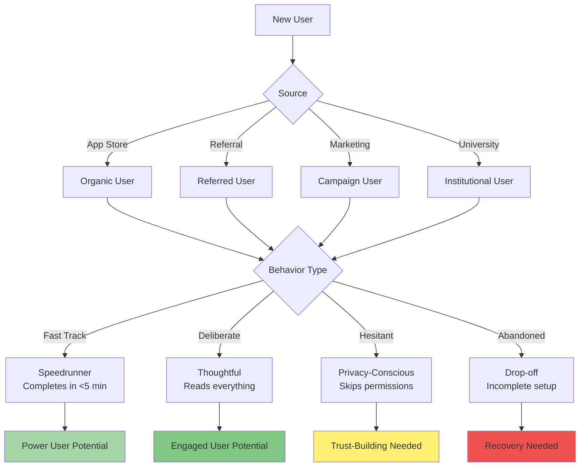
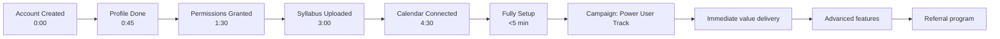
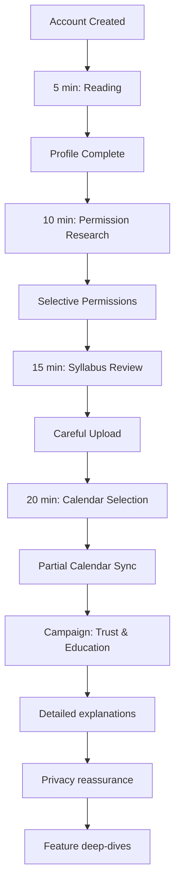
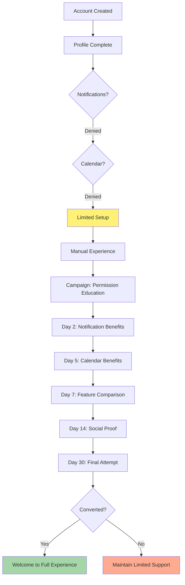
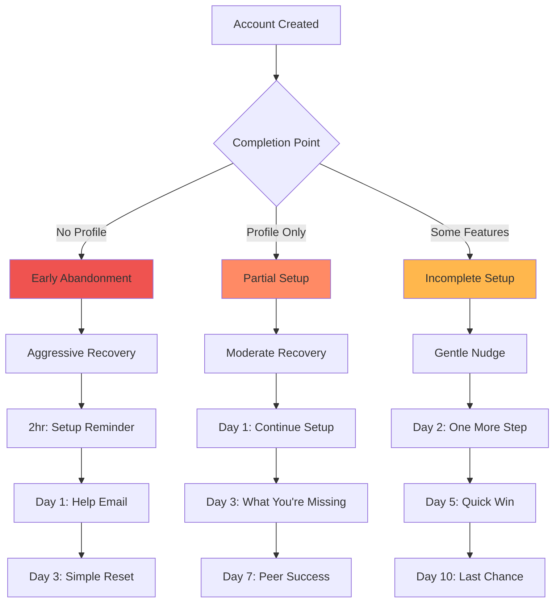
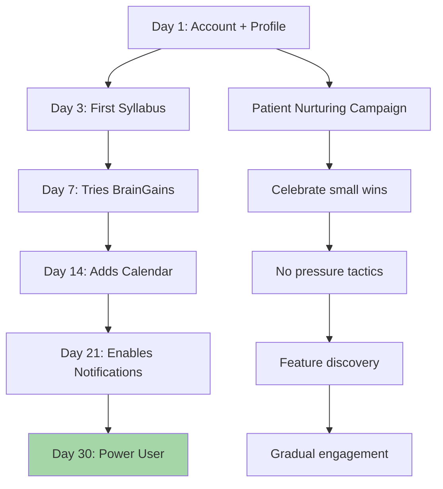
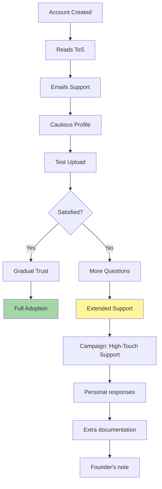
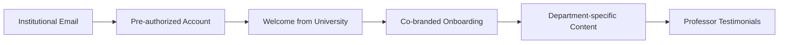
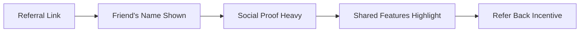
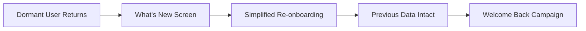

# Onboarding Campaign Variations

This document details all possible onboarding flow variations and their corresponding Customer.io campaigns.

## Onboarding User Segments

We identify users by their onboarding behavior patterns:



## Variation 1: The Speedrunner

Users who complete everything quickly and grant all permissions.



### Campaign: Power User Fast Track

**Hour 1: Celebration + Advanced Tips**
```
Push: "Wow! You're all set up in record time! 🚀"
Email Subject: "You're in the top 5% of organized students"
Content: 
- Congratulations on quick setup
- Advanced tips they might have missed
- Hidden features for power users
- Early access to beta features
```

**Day 1: Maximize Your Setup**
```
Email Subject: "Pro tips for DormWay power users"
Content:
- Keyboard shortcuts
- Widget customization
- BrainGains advanced queries
- Calendar color coding
```

**Day 3: Referral Incentive**
```
Email Subject: "Share DormWay with your study group"
Content:
- Referral program details
- Group study features coming soon
- Social proof from other power users
```

## Variation 2: The Thoughtful User

Reads permissions, takes time with each step, but completes everything.



### Campaign: Trust & Education Track

**Day 1: Privacy & Security First**
```
Email Subject: "Your privacy matters to us"
Content:
- Detailed privacy practices
- Data usage transparency
- Security measures we take
- User control options
```

**Day 3: Feature Deep-Dive Series**
```
Email 1: "How DormWay's AI protects your data"
Email 2: "Understanding calendar permissions"
Email 3: "Your syllabus data: what we do (and don't do)"
```

**Week 1: Building Confidence**
```
- Daily tips with explanations
- Success stories from similar users
- Gradual feature introduction
- Always include privacy notes
```

## Variation 3: The Permission-Skipper

Completes profile but denies all permissions initially.



### Campaign: Permission Education Track

**Day 2: Notification Benefits (Not Pushy)**
```
Email Subject: "Using DormWay without notifications"
Content:
- Acknowledge their choice
- Show what they can still do
- Gentle education on benefits
- "If you change your mind" section
```

**Day 5: Calendar Integration Benefits**
```
Email Subject: "How other students use calendar sync"
Content:
- Student testimonials
- Privacy controls highlighted
- Manual alternative options
- Success metrics without pressure
```

**Day 14: Feature Comparison**
```
Email Subject: "DormWay with vs without permissions"
Content:
- Side-by-side comparison
- Real student stories
- Emphasize user control
- One-click permission update
```

## Variation 4: The Abandoner

Starts but doesn't complete initial setup.



### Campaign: Recovery Tracks

**Early Abandonment Recovery**
```
2 Hours:
Push: "Complete your setup in 2 minutes"

Day 1:
Email: "Need help getting started?"
- Direct support link
- Video walkthrough
- Common issues addressed

Day 3:
Email: "Start fresh with DormWay"
- One-click setup restart
- Simplified flow option
- Success guarantee
```

**Partial Setup Recovery**
```
Day 1:
Email: "You're almost there!"
- Show progress bar
- Next step clearly marked
- Benefits of completion

Day 3:
Email: "See what [Name] is doing with DormWay"
- Peer success story
- FOMO elements
- Easy continue button
```

## Variation 5: The Gradual Adopter

Completes basics but takes days/weeks to fully adopt.



### Campaign: Patient Nurturing Track

**Weekly Feature Spotlights**
```
Week 1: "Master your syllabus uploads"
Week 2: "BrainGains basics"
Week 3: "Calendar sync benefits"
Week 4: "Notification customization"
```

**Milestone Celebrations**
```
- First syllabus: "Great start!"
- First BrainGains question: "Smart studying!"
- Calendar connected: "Never miss class!"
- All features active: "DormWay Pro!"
```

## Variation 6: The Skeptical User

Questions everything, reads ToS, emails support.



### Campaign: High-Touch Support Track

**Immediate: Support Acknowledgment**
```
Email: "Thanks for your questions"
- Personal response from support
- Detailed answers
- Additional resources
- Direct contact option
```

**Day 3: Founder's Note**
```
Email: From: CEO
Subject: "Why I built DormWay"
- Personal story
- Mission and values
- Commitment to privacy
- Open invitation to connect
```

## Dynamic Campaign Assignment

```javascript
// Determine which campaign track based on behavior
function assignOnboardingCampaign(user: User): CampaignTrack {
  const profile = analyzeOnboardingBehavior(user);
  
  if (profile.completionTime < 300 && profile.allPermissionsGranted) {
    return 'power_user_fast_track';
  }
  
  if (profile.completionTime > 1200 && profile.permissionResearch) {
    return 'trust_education_track';
  }
  
  if (!profile.notificationPermission && !profile.calendarPermission) {
    return 'permission_education_track';
  }
  
  if (!profile.profileComplete) {
    return profile.timeElapsed < 3600 ? 'aggressive_recovery' : 'gentle_recovery';
  }
  
  if (profile.supportContacts > 0 || profile.tosRead) {
    return 'high_touch_support_track';
  }
  
  if (profile.daysToFullAdoption > 7) {
    return 'patient_nurturing_track';
  }
  
  return 'standard_onboarding_track';
}
```

## A/B Testing Strategy

### Test 1: Permission Priming
- **Variant A**: Ask immediately after profile
- **Variant B**: Wait until feature context
- **Variant C**: Education before asking
- **Metric**: Permission grant rate

### Test 2: Recovery Messaging
- **Variant A**: Urgency-based ("Don't miss out")
- **Variant B**: Empathy-based ("We understand")
- **Variant C**: Peer-based ("Join your classmates")
- **Metric**: Recovery rate

### Test 3: Email Frequency
- **Variant A**: Daily for first week
- **Variant B**: Every other day
- **Variant C**: Day 1, 3, 7 only
- **Metric**: Engagement vs unsubscribe

## Special Scenarios

### Scenario: University Partnership Launch


### Scenario: Referral Onboarding


### Scenario: Re-activation


## Success Metrics by Variation

| Variation | Target Completion | Target D7 Retention | Target Feature Adoption |
|-----------|------------------|---------------------|------------------------|
| Speedrunner | 95% | 80% | 100% in 7 days |
| Thoughtful | 85% | 75% | 80% in 14 days |
| Permission-Skipper | 70% | 60% | 50% in 30 days |
| Abandoner | 40% recovery | 50% | 60% if recovered |
| Gradual Adopter | 100% eventual | 85% | 100% in 30 days |
| Skeptical | 80% | 90% | 95% after trust |

---

*Created: 2025-07-18*
*Status: 🟢 Comprehensive flow mapping complete*
*Related: [Customer.io Campaign Flows](/docs/product/features/customerio-campaign-flows-detailed), [Onboarding](/docs/product/features/onboarding/onboarding), [User Segmentation](/docs/product/features/user-segmentation)*
