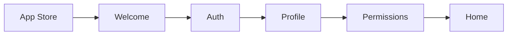

# Onboarding

Status: 🟡 Needs Privacy Fix

First user experience from app download to home screen. Part of [Journey 1: First-Time Onboarding](/docs/plans/planning/5-core-user-journeys).

## Overview

The onboarding flow introduces new users to [DormWay](/docs/operations/meta/obsidian-indexes/dormway) and collects essential information for personalization.

## Flow Diagram

## Components

### Frontend
- `SplashView.swift` - Launch screen
- `OnboardingFlow.swift` - Flow controller
- `AuthView.swift` - Sign up/in
- `ProfileSetupView.swift` - User details
- `PermissionsView.swift` - System permissions

### Backend
- Authentication Service - Supabase auth
- API Router - Profile endpoints
- Campus/Major data - Static configuration

## Current Issues

### 🔴 [Privacy Consent Default](/docs/product/features/student-experience/privacy-consent-default)
- **Problem**: Defaults to true (illegal)
- **Required**: Must default to false
- **Location**: `OnboardingFlow.swift` line 145
- **Impact**: Blocks [launch](/docs/plans/planning/launch-plan)

### Implementation Tasks
- [x] Welcome screen design
- [x] Authentication flow
- [x] Profile setup UI
- [x] Campus selection
- [x] Major selection
- [ ] Fix privacy consent default
- [ ] Polish animations
- [ ] Error handling

## Metrics

Target for [operational stability](/docs/plans/planning/operational-stability):
- 95%+ completion rate
- `&lt;2 min average time
- `<5% drop-off rate

## Testing

See Testing/Onboarding Test Plan for:
- Happy path tests
- Error scenarios
- Performance benchmarks

## Related

- Next Journey: Product/Features/Syllabus Loading
- Blocks: [Product/Features/Push Notifications](/docs/product/features/push-notifications) (needs permissions)
- Architecture: Engineering/Architecture/Dependency Injection
- Daily Note: Notes/Daily Notes/2025-07-11 Snap the Line

---

*Tags: #feature #onboarding #needs-fix #journey-1*
*Created: 2025-05-15*
*Updated: 2025-07-11*
