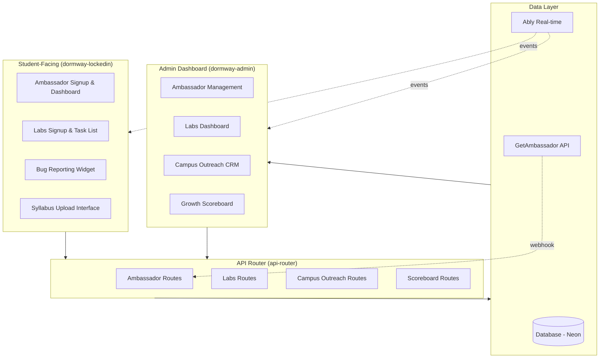
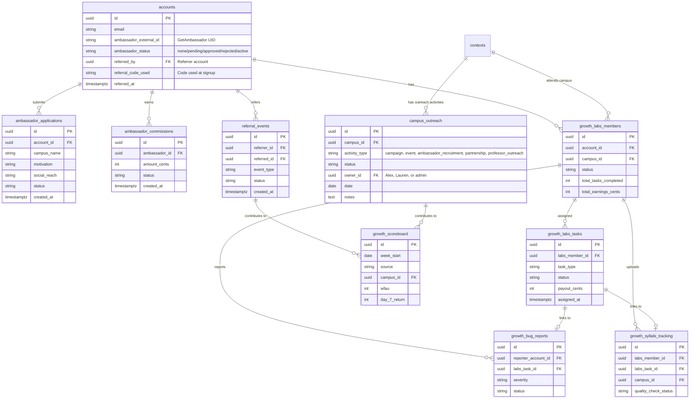
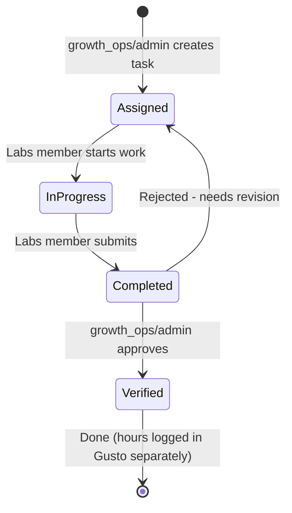
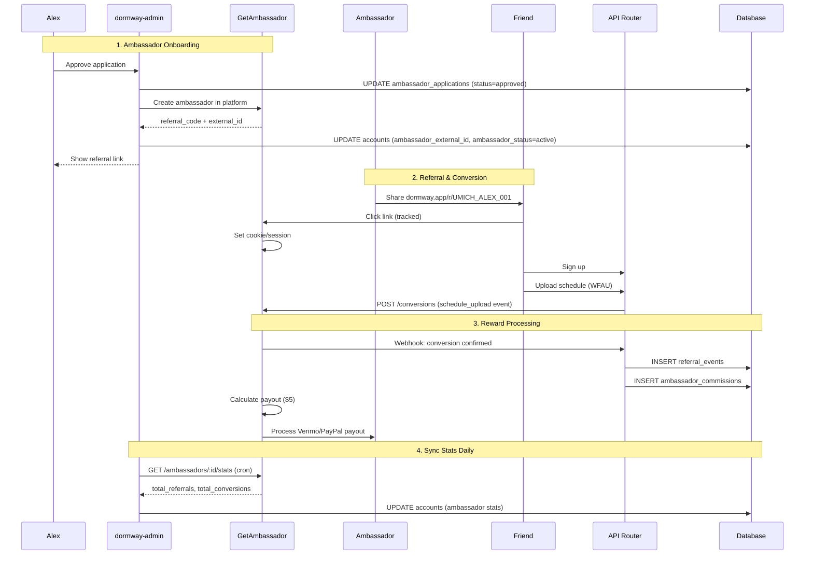
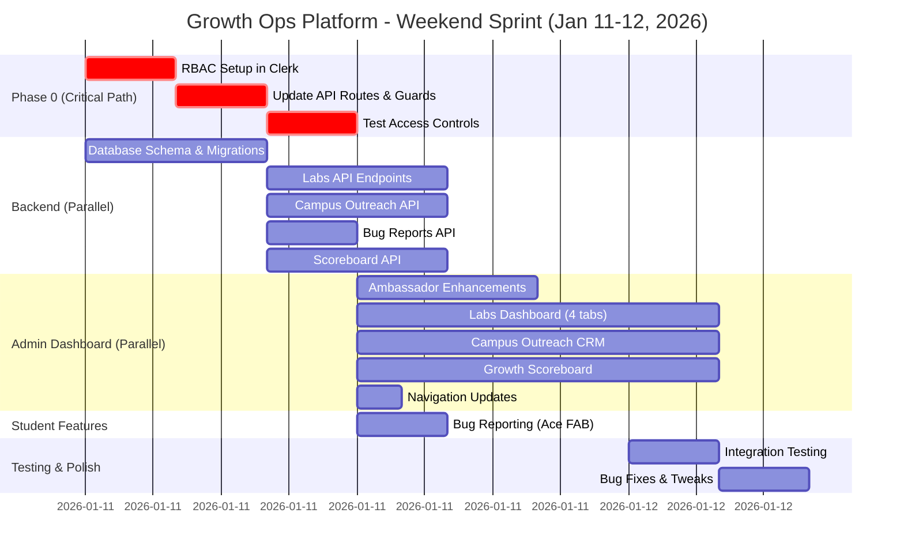
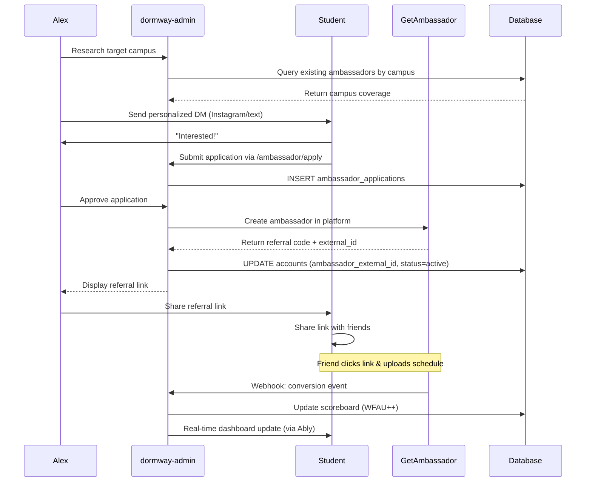
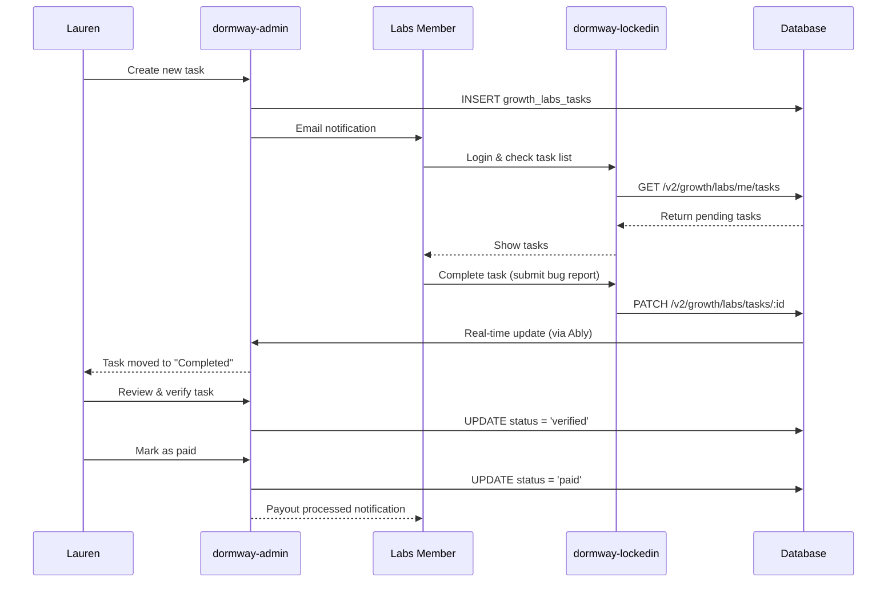
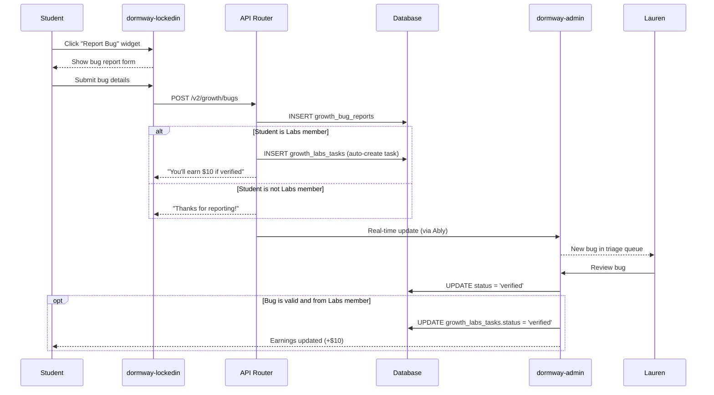

# Growth Ops Platform Integration PRD

## Executive Summary

Build native tools in **dormway-admin** and **dormway-lockedin** to support Alex and Lauren's growth operations, replacing Notion-based workflows with integrated platform features.

**Critical Discovery:** DormWay **already has a complete Ambassador program** (DORM-206) integrated with GetAmbassador.com. We don't need to rebuild ambassadors - they're fully functional!

**What Already Exists:**
- ✅ **Ambassador System (DORM-206)** - Applications, approvals, status tracking, GetAmbassador integration
- ✅ **Ambassador Student UIs** - iOS app (application + dashboard + QR codes) + Web (Labs page + ambassador CTA)
- ✅ **Ambassador Admin UI** - dormway-admin `/ambassador` page (745 lines, 3 tabs: applications, ambassadors, commissions)
- ✅ **Ambassador APIs** - 9 endpoints for student-facing + admin features, webhooks from GetAmbassador
- ✅ **Database** - `ambassador_applications`, `referral_events`, `ambassador_commissions`, account columns

**What Needs to Be Built:**
- 🔨 **Labs Program** - W2 employee program ($20/hr) for QA, syllabus gathering, bug reports, plugin testing (backend + admin UI)
- 🔨 **Campus Outreach CRM** - Track ambassador recruitment, campus campaigns, professor outreach, partnerships (backend + admin UI)
- 🔨 **Growth Scoreboard** - Weekly acquisition & engagement metrics (WFAU, WAU, platform split) (backend + admin UI)
- 🔨 **Ambassador Enhancements** - Campus map, notes system, status management (frontend only)
- 🔨 **Student Features** - Bug reporting via Ace FAB, simplified syllabus review (frontend + backend)

**Revised Goals:**
- Give Lauren tools for Labs program management (W2 employees, 10-week cohorts, task assignment)
- Give Alex tools for campus expansion (CRM for ambassador recruitment, campaigns, partnerships)
- Centralize growth metrics (acquisition, engagement, platform split iOS/Web)
- Enhance ambassador management (full permissions for growth_ops, campus visibility)
- Enable quality feedback loops (bug reporting, syllabus verification)

**Launch Timeline:** This weekend (Jan 11-12, 2026) with AI-assisted development (~84 hours estimated effort)

---

## Architecture Overview

### System Components



---

## Existing Ambassador Implementation (DORM-206)

### ✅ Complete Ambassador System Already Built

DormWay **already has a fully functional ambassador referral system** integrated with GetAmbassador.com. This was built in DORM-206 and includes:

### Database Schema (Existing)

#### `accounts` table columns:
- `ambassador_external_id` (text) - GetAmbassador UID
- `ambassador_status` (text) - none, pending, approved, rejected, active
- `ambassador_applied_at` (timestamptz)
- `ambassador_approved_at` (timestamptz)
- `ambassador_sync_status` (text) - pending, synced, error, manual_required
- `referred_by` (uuid) - FK to referrer's account
- `referral_code_used` (text) - Code used during signup
- `referred_at` (timestamptz)

#### `ambassador_applications` table:
```sql
CREATE TABLE ambassador_applications (
  id UUID PRIMARY KEY,
  account_id UUID REFERENCES accounts(id),
  campus_name VARCHAR(255),
  motivation TEXT,
  social_reach VARCHAR(100),
  status VARCHAR(50), -- pending, approved, rejected
  rejection_reason TEXT,
  reviewed_by VARCHAR(100),
  reviewed_at TIMESTAMPTZ,
  created_at TIMESTAMPTZ,
  updated_at TIMESTAMPTZ
);
```

#### `referral_events` table:
```sql
CREATE TABLE referral_events (
  id UUID PRIMARY KEY,
  referrer_id UUID REFERENCES accounts(id), -- Ambassador who referred
  referred_id UUID REFERENCES accounts(id), -- User who was referred
  event_type VARCHAR(50), -- signup, registration, onboarding_complete, first_course, 30_day_active, 90_day_active
  status VARCHAR(50), -- pending, approved, rejected
  commission_amount_cents INT,
  commission_status VARCHAR(50),
  ambassador_external_id VARCHAR(255),
  getambassador_event_id VARCHAR(255),
  created_at TIMESTAMPTZ
);
```

#### `ambassador_commissions` table:
```sql
CREATE TABLE ambassador_commissions (
  id UUID PRIMARY KEY,
  ambassador_id UUID REFERENCES accounts(id),
  referral_event_id UUID REFERENCES referral_events(id),
  amount_cents INT NOT NULL,
  currency VARCHAR(10) DEFAULT 'USD',
  status VARCHAR(50), -- pending, approved, paid, rejected
  getambassador_commission_id VARCHAR(255),
  paid_at TIMESTAMPTZ,
  created_at TIMESTAMPTZ,
  updated_at TIMESTAMPTZ
);
```

### GetAmbassador.com API Integration (Existing)

#### `ambassador-client.ts` (434 lines)
Complete API client for GetAmbassador platform:
- `getAmbassador(uid)` - Get ambassador by UID
- `getAmbassadorByEmail(email)` - Get ambassador by email
- `recordEvent(params)` - Record referral events (signup, conversion)
- `getStats(ambassadorUid)` - Get commission stats
- `generateReferralLink(ambassadorUid, channel?)` - Generate tracked link
- `validateReferralCode(code)` - Validate referral code
- `listAmbassadors(options)` - List all ambassadors (admin)

**Configuration:**
- `AMBASSADOR_API_BASE_URL` - GetAmbassador API base
- `AMBASSADOR_API_USERNAME` - API username
- `AMBASSADOR_API_KEY` - API key
- `AMBASSADOR_CAMPAIGN_ID` - DormWay campaign ID
- `AMBASSADOR_WEBHOOK_SECRET` - Webhook signature secret

#### `ambassador.service.ts` (1,246 lines)
Complete business logic for ambassador program:

**Key Methods:**
- `getAmbassadorStatus(accountId)` - Get current user's status
- `submitApplication(accountId, data)` - Submit application
- `approveApplication(applicationId, adminUsername)` - Approve + sync to GetAmbassador
- `rejectApplication(applicationId, reason, adminUsername)` - Reject application
- `generateReferralLink(accountId, channel?)` - Generate tracked link
- `validateReferrer(code)` - Validate referrer code during signup
- `recordReferralEvent(referrerId, referredId, eventType)` - Record milestone
- `processCommissionWebhook(webhookData)` - Process GetAmbassador webhooks
- `getCommissions(accountId)` - Get user's commission history
- `getAllAmbassadors(filters)` - List all ambassadors (admin)
- `getPendingApplications()` - Get pending applications (admin)
- `getAnalytics()` - Platform-wide analytics (admin)
- `getAllCommissions(filters)` - All commissions (admin)
- `forcePlatformSync(accountId)` - Force GetAmbassador sync (admin)

#### `webhooks/ambassador-routes.ts` (320 lines)
Real-time webhook handler for GetAmbassador events:

**Security:**
- HMAC-SHA256 signature verification
- Timestamp validation (5-minute window)
- Replay attack prevention

**Event Handlers:**
- `commission.created` / `commission.pending` - New commission pending
- `commission.approved` / `commission.confirmed` - Commission approved
- `commission.paid` / `commission.completed` - Commission paid
- `commission.rejected` / `commission.cancelled` - Commission rejected
- `referral.created` / `referral.new` - New referral tracked
- `referral.converted` - Referral converted
- `ambassador.created` - New ambassador created
- `ambassador.updated` - Ambassador profile updated

### Student-Facing API Endpoints (Existing)

**`/v2/students/me/ambassador` routes:**

#### `GET /v2/students/me/ambassador`
Get current user's ambassador profile and status.

**Response:**
```json
{
  "isAmbassador": true,
  "status": "active",
  "profile": {
    "uid": "12345",
    "email": "student@umich.edu",
    "referralCode": "UMICH123",
    "referralUrl": "https://blue.mbsy.co/dormway/12345",
    "stats": {
      "totalReferrals": 42,
      "approvedReferrals": 38,
      "pendingCommission": 2000,
      "paidCommission": 19000,
      "totalEarnings": 21000
    }
  },
  "application": {
    "id": "uuid",
    "status": "approved",
    "appliedAt": "2025-12-15T10:00:00Z",
    "approvedAt": "2025-12-15T14:30:00Z"
  }
}
```

#### `POST /v2/students/me/ambassador/apply`
Submit ambassador application.

**Body:**
```json
{
  "campusName": "University of Michigan",
  "motivation": "I'm the SGA President and want to help students...",
  "socialReach": "@umich_sga - 2.5k followers"
}
```

#### `POST /v2/students/me/ambassador/referral-link`
Generate a tracked referral link.

**Body:**
```json
{
  "channel": "instagram" // optional: instagram, twitter, email, etc.
}
```

**Response:**
```json
{
  "referralUrl": "https://blue.mbsy.co/dormway/12345?channel=instagram",
  "referralCode": "UMICH123"
}
```

#### `GET /v2/students/me/ambassador/commissions`
Get commission history for current user.

**Response:**
```json
{
  "commissions": [
    {
      "id": "uuid",
      "amountCents": 500,
      "currency": "USD",
      "status": "paid",
      "eventType": "schedule_upload",
      "referredUserEmail": "friend@umich.edu",
      "paidAt": "2026-01-10T10:00:00Z",
      "createdAt": "2026-01-08T14:30:00Z"
    }
  ],
  "totalPending": 2000,
  "totalPaid": 19000,
  "totalEarnings": 21000
}
```

#### `GET /v2/ambassadors/validate/:uid`
Public endpoint to validate referrer code during signup.

**Response:**
```json
{
  "valid": true,
  "referrerName": "Jane Doe",
  "campus": "University of Michigan"
}
```

### Admin API Endpoints (Existing)

**`/admin/ambassador` routes (445 lines):**

#### `GET /admin/ambassador/analytics`
Platform-wide ambassador analytics.

**Response:**
```json
{
  "totalAmbassadors": 45,
  "activeAmbassadors": 38,
  "pendingApplications": 7,
  "totalReferrals": 1250,
  "totalConversions": 890,
  "conversionRate": 71.2,
  "totalCommissionsPaid": 445000,
  "totalCommissionsPending": 32000,
  "topPerformers": [
    {
      "uid": "12345",
      "name": "Jane Doe",
      "campus": "University of Michigan",
      "totalReferrals": 125,
      "totalConversions": 98,
      "totalEarnings": 49000
    }
  ]
}
```

#### `GET /admin/ambassador/applications`
List all applications with filters.

**Query Params:**
- `status` - pending, approved, rejected
- `campus` - filter by campus name

#### `POST /admin/ambassador/applications/:id/approve`
Approve application and sync to GetAmbassador.

**Body:**
```json
{
  "reviewedBy": "riley"
}
```

#### `POST /admin/ambassador/applications/:id/reject`
Reject application.

**Body:**
```json
{
  "rejectionReason": "Low social reach",
  "reviewedBy": "riley"
}
```

#### `POST /admin/ambassador/applications/:id/retry-sync`
Retry GetAmbassador platform sync if failed.

#### `GET /admin/ambassador/ambassadors`
List all ambassadors with filters.

**Query Params:**
- `status` - active, paused, churned
- `campus` - filter by campus
- `minReferrals` - minimum referral count

#### `GET /admin/ambassador/commissions`
List all commissions across all ambassadors.

**Query Params:**
- `status` - pending, approved, paid, rejected
- `ambassadorId` - filter by ambassador
- `dateFrom`, `dateTo` - date range

#### `POST /admin/ambassador/sync`
Force full platform sync for all ambassadors.

### What Still Needs Building

Since the ambassador system is **fully functional**, we only need to build:

1. **Labs Program** (NEW) - See database schema below
   - `growth_labs_members` table
   - `growth_labs_tasks` table
   - `growth_bug_reports` table
   - `growth_syllabi_tracking` table
   - Labs API endpoints
   - Bug reporting widget
   - Student-facing Labs pages

2. **Campus Outreach CRM** (NEW)
   - `campus_outreach` table
   - Campus outreach API
   - Admin UI for campus outreach tracking

3. **Growth Scoreboard** (NEW)
   - `growth_scoreboard` table
   - Weekly aggregation API
   - Scoreboard visualization in admin

4. **Admin Dashboard UI** (NEW)
   - Ambassador management UI (uses existing endpoints)
   - Labs management UI (new)
   - Campus outreach CRM UI (new)
   - Growth scoreboard UI (new)

5. **Student-Facing UI** (NEW)
   - Ambassador dashboard (uses existing endpoints)
   - Labs program pages (new)
   - Bug reporting widget (new)

**Estimated Effort Reduction:** ~40 hours saved by not rebuilding ambassadors!

---

## Existing Student-Facing UIs

### iOS App (Already Shipped)

**Location:** `ios-clean/App/Views/Ambassador/`

#### Ambassador Application (`AmbassadorApplicationView.swift`)
Complete application form with:
- Two-field form: "Why do you want to be an ambassador?" + "What's your social reach?"
- Character count validation (10+ chars minimum)
- Real-time validation with visual feedback
- Glassmorphic design matching app theme
- Success/error states
- Submits to `/v2/students/me/ambassador/apply`

#### Ambassador Dashboard (`AmbassadorDashboardView.swift`)
Full-featured dashboard (840 lines) with **5 status views:**

**1. Not Applied View:**
- Hero section with benefits
- "Become an Ambassador" CTA
- Three benefit cards (earn commissions, referral link, track progress)
- Opens application sheet

**2. Pending View:**
- "Application Under Review" status
- Shows application details (motivation, social reach, applied date)
- Wait state with clock icon

**3. Rejected View:**
- "Application Not Approved" message
- Shows rejection reason (if provided)

**4. Approved/Active Dashboard:**
- **Stats Grid:** Total referrals, approved referrals, total earnings, pending commission
- **Referral Link Section:**
  - Display referral URL with copy button
  - QR code generator (full-screen modal)
  - Share sheet integration
  - Copy/QR Code/Share action buttons
- **Earnings Summary:** Pending vs. Paid commissions breakdown
- **Recent Commissions List:** Last 5 commissions with status badges
- Pull-to-refresh support

**5. Error View:**
- Error message display
- Retry button

**Integration Points:**
- Uses `ReferralService` protocol
- Real-time API calls to all `/v2/students/me/ambassador/*` endpoints
- Native iOS share sheet
- QR code generation with Core Image
- Photo library integration (save QR codes)

#### Me Tab Integration (`MeAmbassadorSection.swift`)
Entry point in main navigation

### Web App (Already Shipped)

**Location:** `dormway-lockedin/src/app/labs/page.tsx`

#### Labs Landing Page (`/labs`)
Comprehensive 729-line marketing page with:

**Hero Section:**
- "DormWay Labs - Alpha Cohort" branding
- Winter 2025 • 10-Week Paid Program • 10-Person Cohort
- North star: WFAU (Weekly First-Action Users)
- Stats cards: 10 weeks, 10 students, 5-8 hrs/week, Dec 1 start
- Animated ripple grid background

**What's DormWay Labs:**
- Riley's personal founder story
- Program philosophy (paid W2 temps, $20/hr)
- Pre-launch validation focus
- Sample screenshot of workspace

**Value Exchange:**
- Two-column layout: "You Get" vs. "DormWay Gets"
- Learning sessions, tooling access, LinkedIn recs
- Confidence testing, syllabi samples, feedback

**Program Structure:**
- Timeline: Phases 1-2 (onboarding), 3-8 (active testing), 9-10 (pre-launch)
- Weekly cadence breakdown (Mon/Wed/Fri + optional weekend)
- Target metrics grid (300+ issues, 50+ syllabi, 20 campuses, 0 critical bugs at launch)

**What You'll Learn:**
- Bento grid layout with cards:
  - Agentic coding tools (with fake terminal prompt display)
  - Tech stack overview
  - Small team dynamics
  - Real decision-making
  - Testing and analysis

**Selection Criteria:**
- Checklist format with 6 requirements
- iPhone iOS 17+ requirement
- Geographic diversity callout

**CTA Section:**
- Apply button → `/careers#apply`
- Program dates: December 1 - January 27
- Applications close at 10 people or Dec 1
- W2 employment note with NDA/IP assignment disclosure

#### Ambassador Components (`src/components/`)

**`CampusAmbassadorForm.tsx`:**
- Sticky floating button (bottom-right)
- "Build With Us" CTA
- Only shows for signed-out users
- Links to `/careers`
- Amplitude tracking on view + click
- Gradient purple-to-pink button

---

## Existing Admin UIs

### dormway-admin: Ambassador Analytics Page ✅ COMPLETE

**Location:** `/ambassador` route (`services/dormway-admin/src/pages/ambassador-analytics/index.tsx`)

**Current Features (745 lines, production-ready):**

**Dashboard Metrics:**
- Total ambassadors (active vs all)
- Pending applications count
- Total referrals across all ambassadors
- Pending payouts vs total commissions (in cents)

**Tab 1: Applications Management**
- DataGrid showing all pending + approved (needs-sync) applications
- Columns: Name, Email, Campus, Motivation, Applied Date, Status, Actions
- **Approve** button → calls `POST /admin/ambassador/applications/:id/approve`
- **Reject** button → opens dialog for rejection reason → calls `POST /admin/ambassador/applications/:id/reject`
- **Sync to Platform** button → for approved apps needing GetAmbassador sync → calls `POST /admin/ambassador/applications/:id/retry-sync`
- Status chips: pending (warning), approved (success), rejected (error)

**Tab 2: Ambassadors List**
- DataGrid showing all active ambassadors
- Columns: Name, Email, Campus, Referral ID (GetAmbassador), Referrals Count, Earnings ($), Status, Joined Date
- Monospace referral ID display
- Active status indicator
- Total earnings in USD

**Tab 3: Commissions Tracking**
- DataGrid showing all commission events
- Columns: Ambassador Email, Amount ($), Status, Created Date, Paid Date
- Status chips: pending (warning), approved (info), paid (success), rejected (error)
- Currency display with cents conversion

**Global Actions:**
- **Force Sync** button → triggers `POST /admin/ambassador/sync` to sync with GetAmbassador platform
- Real-time loading states and snackbar notifications

**API Endpoints Used:**
- `GET /admin/ambassador/analytics` - Dashboard metrics
- `GET /admin/ambassador/applications?status=pending` - Pending applications
- `GET /admin/ambassador/applications?status=approved` - Approved (needs sync)
- `GET /admin/ambassador/ambassadors` - All ambassadors list
- `GET /admin/ambassador/commissions` - Commission history
- `POST /admin/ambassador/applications/:id/approve` - Approve application
- `POST /admin/ambassador/applications/:id/reject` - Reject with reason
- `POST /admin/ambassador/applications/:id/retry-sync` - Sync to GetAmbassador
- `POST /admin/ambassador/sync` - Force platform sync

**Navigation:**
- Listed under "Growth & People" section
- Icon: Ambassador icon
- Keywords: referral, affiliate, applications, commissions
- Requires admin authentication (Clerk)

**Error Handling:**
- ErrorBoundary wrapper
- Safe null handling in DataGrid value getters
- API error messages displayed in snackbars
- Loading states for all async operations

**What's Missing:**
- No export to CSV functionality
- No date range filters
- No search/filter on application grid
- No bulk approval workflow
- No email notification triggers from UI

**Verdict:** Ambassador admin UI is **95% complete**. Lauren can use this immediately for application review and commission tracking. Only needs minor enhancements (search, filters, exports).

---

**What Needs to Be Built:**

Since students **already have full ambassador/labs UI** AND dormway-admin **already has ambassador management**, Alex/Lauren only need:

1. **New Admin Pages in dormway-admin:**
   - ~~Ambassador applications (approve/reject)~~ ✅ **ALREADY EXISTS** at `/ambassador`
   - Labs members and tasks dashboard (NEW - 24 hours)
   - Campus Outreach CRM (NEW - 16 hours)
   - Growth scoreboard visualization (NEW - 20 hours)

2. **Minor Ambassador Admin Enhancements** (optional, 8 hours):
   - CSV export for applications/ambassadors/commissions
   - Date range filters on grids
   - Search/filter on application grid
   - Bulk approval workflow
   - Email notification triggers from UI

3. **Enhanced Student Features** (optional, 12 hours):
   - In-app bug reporting widget in dormway-lockedin (NEW)
   - Syllabus verification checklist in dormway-lockedin (NEW)
   - Labs task dashboard in dormway-lockedin (NEW)

**Revised Effort Estimate:** ~80 hours (down from ~120 hours) because ambassador admin UI already exists!

## Database Schema

### Entity Relationship Diagram



### New Tables (Labs, Campus Outreach, Scoreboard)

**Note:** Ambassador tables already exist (see "Existing Ambassador Implementation" above). We only need to create Labs, Campus Outreach, and Scoreboard tables.

#### `growth_labs_members`
Tracks Labs beta testers recruited by Lauren.

```sql
CREATE TABLE growth_labs_members (
  id UUID PRIMARY KEY DEFAULT uuid_generate_v4(),
  account_id UUID REFERENCES accounts(id) ON DELETE CASCADE,
  campus_id UUID REFERENCES contexts(id),
  status VARCHAR(50) DEFAULT 'invited', -- invited, onboarded, active, paused, churned
  onboarded_at TIMESTAMPTZ,
  total_tasks_completed INT DEFAULT 0,
  total_earnings_cents INT DEFAULT 0, -- track in cents
  last_task_at TIMESTAMPTZ,
  recruited_by VARCHAR(100) DEFAULT 'lauren',
  notes TEXT,
  created_at TIMESTAMPTZ DEFAULT NOW(),
  updated_at TIMESTAMPTZ DEFAULT NOW()
);

CREATE INDEX idx_growth_labs_members_account ON growth_labs_members(account_id);
CREATE INDEX idx_growth_labs_members_campus ON growth_labs_members(campus_id);
CREATE INDEX idx_growth_labs_members_status ON growth_labs_members(status);
```

#### `growth_labs_tasks`
Tasks assigned to Labs members by Lauren.

```sql
CREATE TABLE growth_labs_tasks (
  id UUID PRIMARY KEY DEFAULT uuid_generate_v4(),
  labs_member_id UUID REFERENCES growth_labs_members(id) ON DELETE CASCADE,
  task_type VARCHAR(50) NOT NULL, -- bug_report, syllabus_gathering, syllabus_upload, data_audit, feature_testing
  title VARCHAR(255) NOT NULL,
  description TEXT,
  status VARCHAR(50) DEFAULT 'assigned', -- assigned, in_progress, completed, verified, paid
  assigned_by VARCHAR(100) DEFAULT 'lauren',
  assigned_at TIMESTAMPTZ DEFAULT NOW(),
  completed_at TIMESTAMPTZ,
  verified_at TIMESTAMPTZ,
  payout_cents INT DEFAULT 0, -- $5 = 500, $10 = 1000, etc.
  deliverable_url TEXT, -- link to bug report, syllabus file, etc.
  deliverable_data JSONB, -- structured data (bug details, syllabus metadata, etc.)
  week_start DATE, -- week starting Monday (for rollups)
  created_at TIMESTAMPTZ DEFAULT NOW(),
  updated_at TIMESTAMPTZ DEFAULT NOW()
);

CREATE INDEX idx_growth_labs_tasks_member ON growth_labs_tasks(labs_member_id);
CREATE INDEX idx_growth_labs_tasks_status ON growth_labs_tasks(status);
CREATE INDEX idx_growth_labs_tasks_type ON growth_labs_tasks(task_type);
CREATE INDEX idx_growth_labs_tasks_week ON growth_labs_tasks(week_start);
```

#### `growth_bug_reports`
Bug reports submitted by Labs members (or anyone).

```sql
CREATE TABLE growth_bug_reports (
  id UUID PRIMARY KEY DEFAULT uuid_generate_v4(),
  reporter_account_id UUID REFERENCES accounts(id) ON DELETE SET NULL,
  labs_task_id UUID REFERENCES growth_labs_tasks(id) ON DELETE SET NULL, -- if from a Labs task
  title VARCHAR(255) NOT NULL,
  description TEXT NOT NULL,
  platform VARCHAR(50), -- ios, web, android
  severity VARCHAR(50) DEFAULT 'medium', -- critical, high, medium, low
  status VARCHAR(50) DEFAULT 'new', -- new, verified, duplicate, fixed, wont_fix
  forwarded_to_team BOOLEAN DEFAULT FALSE,
  verified_by VARCHAR(100), -- riley, ethan, etc.
  fixed_in_version VARCHAR(50),
  reported_at TIMESTAMPTZ DEFAULT NOW(),
  verified_at TIMESTAMPTZ,
  fixed_at TIMESTAMPTZ,
  metadata JSONB, -- screenshots, logs, device info, etc.
  created_at TIMESTAMPTZ DEFAULT NOW(),
  updated_at TIMESTAMPTZ DEFAULT NOW()
);

CREATE INDEX idx_growth_bug_reports_reporter ON growth_bug_reports(reporter_account_id);
CREATE INDEX idx_growth_bug_reports_status ON growth_bug_reports(status);
CREATE INDEX idx_growth_bug_reports_severity ON growth_bug_reports(severity);
```

#### `growth_syllabi_tracking`
Syllabi gathered/uploaded by Labs members.

```sql
CREATE TABLE growth_syllabi_tracking (
  id UUID PRIMARY KEY DEFAULT uuid_generate_v4(),
  labs_member_id UUID REFERENCES growth_labs_members(id) ON DELETE SET NULL,
  labs_task_id UUID REFERENCES growth_labs_tasks(id) ON DELETE SET NULL,
  course_name VARCHAR(255),
  professor VARCHAR(255),
  campus_id UUID REFERENCES contexts(id),
  source VARCHAR(50), -- email_forward, manual_upload, scan
  file_url TEXT, -- S3 URL or attachment
  parsed_successfully BOOLEAN DEFAULT FALSE,
  quality_check_status VARCHAR(50) DEFAULT 'pending', -- pending, checked, errors_found, approved
  quality_checked_by VARCHAR(100),
  quality_checked_at TIMESTAMPTZ,
  submitted_at TIMESTAMPTZ DEFAULT NOW(),
  metadata JSONB, -- parser results, error logs, etc.
  created_at TIMESTAMPTZ DEFAULT NOW(),
  updated_at TIMESTAMPTZ DEFAULT NOW()
);

CREATE INDEX idx_growth_syllabi_labs_member ON growth_syllabi_tracking(labs_member_id);
CREATE INDEX idx_growth_syllabi_campus ON growth_syllabi_tracking(campus_id);
CREATE INDEX idx_growth_syllabi_status ON growth_syllabi_tracking(quality_check_status);
```

#### `campus_outreach`
Campus outreach activities and initiatives managed by Alex and Lauren.

```sql
CREATE TABLE campus_outreach (
  id UUID PRIMARY KEY DEFAULT uuid_generate_v4(),
  campus_id UUID REFERENCES contexts(id) NOT NULL,
  activity_type VARCHAR(100) NOT NULL, -- campaign, event, ambassador_recruitment, partnership, professor_outreach, other
  title VARCHAR(255) NOT NULL,
  description TEXT,
  status VARCHAR(50) DEFAULT 'planned', -- planned, in_progress, completed, on_hold, cancelled
  owner_id UUID REFERENCES accounts(id), -- Alex, Lauren, or admin
  start_date DATE,
  end_date DATE,
  target_signups INT,
  actual_signups INT DEFAULT 0,
  notes TEXT,
  created_at TIMESTAMPTZ DEFAULT NOW(),
  updated_at TIMESTAMPTZ DEFAULT NOW()
);

CREATE TABLE campus_outreach_contacts (
  id UUID PRIMARY KEY DEFAULT uuid_generate_v4(),
  campus_id UUID REFERENCES contexts(id) NOT NULL,
  name VARCHAR(255) NOT NULL,
  role VARCHAR(100), -- professor, student_leader, admin, ambassador_candidate
  email VARCHAR(255),
  phone VARCHAR(50),
  instagram_handle VARCHAR(100),
  status VARCHAR(50) DEFAULT 'cold', -- cold, warm, meeting_scheduled, closed
  last_contact_date DATE,
  next_followup_date DATE,
  notes TEXT,
  created_at TIMESTAMPTZ DEFAULT NOW(),
  updated_at TIMESTAMPTZ DEFAULT NOW()
);

CREATE INDEX idx_campus_outreach_campus ON campus_outreach(campus_id);
CREATE INDEX idx_campus_outreach_status ON campus_outreach(status);
CREATE INDEX idx_campus_outreach_owner ON campus_outreach(owner_id);
CREATE INDEX idx_campus_outreach_contacts_campus ON campus_outreach_contacts(campus_id);
CREATE INDEX idx_campus_outreach_contacts_status ON campus_outreach_contacts(status);
```

#### `growth_scoreboard`
Weekly scoreboard aggregation (pre-computed for performance).

```sql
CREATE TABLE growth_scoreboard (
  id UUID PRIMARY KEY DEFAULT uuid_generate_v4(),
  week_start DATE NOT NULL, -- Monday of the week
  source VARCHAR(50) NOT NULL, -- ambassadors, campus_outreach, lifecycle, labs, organic
  campus_id UUID REFERENCES contexts(id), -- optional, for campus-level rollups
  reach INT DEFAULT 0, -- people contacted or exposed
  clicks INT DEFAULT 0, -- clicked link or engaged
  signups INT DEFAULT 0, -- created account
  wfau INT DEFAULT 0, -- completed first action in 7 days
  day_7_return INT DEFAULT 0, -- came back on day 7
  day_7_return_pct NUMERIC(5,2), -- calculated
  metadata JSONB, -- source-specific details
  created_at TIMESTAMPTZ DEFAULT NOW(),
  updated_at TIMESTAMPTZ DEFAULT NOW(),
  UNIQUE(week_start, source, campus_id) -- prevent duplicates
);

CREATE INDEX idx_growth_scoreboard_week ON growth_scoreboard(week_start);
CREATE INDEX idx_growth_scoreboard_source ON growth_scoreboard(source);
CREATE INDEX idx_growth_scoreboard_campus ON growth_scoreboard(campus_id);
```

---

## API Endpoints

### ✅ Ambassadors API (Already Exists)

**NOTE:** All ambassador endpoints **already exist** in production (DORM-206). See "Existing Ambassador Implementation" section above for complete documentation.

**Student-Facing Endpoints:**
- `GET /v2/students/me/ambassador` - Get profile and status
- `POST /v2/students/me/ambassador/apply` - Submit application
- `POST /v2/students/me/ambassador/referral-link` - Generate link
- `GET /v2/students/me/ambassador/commissions` - View earnings
- `GET /v2/ambassadors/validate/:uid` - Validate referrer

**Admin Endpoints:**
- `GET /admin/ambassador/analytics` - Platform analytics
- `GET /admin/ambassador/applications` - List applications
- `POST /admin/ambassador/applications/:id/approve` - Approve
- `POST /admin/ambassador/applications/:id/reject` - Reject
- `GET /admin/ambassador/ambassadors` - List all ambassadors
- `GET /admin/ambassador/commissions` - List commissions
- `POST /admin/ambassador/sync` - Force platform sync

**No new ambassador endpoints needed!**

---

### Labs API (`/v2/growth/labs`)

#### `GET /v2/growth/labs/members`
List all Labs members (admin only).

**Query Params:**
- `campus_id` (optional)
- `status` (optional)

**Response:**
```json
{
  "members": [
    {
      "id": "uuid",
      "account_id": "uuid",
      "email": "student@umich.edu",
      "campus_name": "University of Michigan",
      "status": "active",
      "total_tasks_completed": 23,
      "total_earnings_cents": 32000,
      "tasks_this_week": 5,
      "last_task_at": "2026-01-09T16:45:00Z",
      "onboarded_at": "2025-12-10T12:00:00Z"
    }
  ],
  "total": 10,
  "active_count": 8
}
```

#### `POST /v2/growth/labs/members`
Add a new Labs member (admin only).

**Body:**
```json
{
  "account_id": "uuid",
  "campus_id": "uuid",
  "recruited_by": "lauren"
}
```

#### `GET /v2/growth/labs/tasks`
List all Labs tasks (admin only).

**Query Params:**
- `labs_member_id` (optional)
- `status` (optional)
- `task_type` (optional)
- `week_start` (optional): YYYY-MM-DD

**Response:**
```json
{
  "tasks": [
    {
      "id": "uuid",
      "labs_member_id": "uuid",
      "member_name": "Jane Doe",
      "task_type": "bug_report",
      "title": "Test new widget layout on mobile",
      "status": "completed",
      "assigned_at": "2026-01-06T09:00:00Z",
      "completed_at": "2026-01-07T14:30:00Z",
      "payout_cents": 1000,
      "deliverable_url": "https://link-to-bug-report"
    }
  ],
  "total": 125,
  "pending_count": 8,
  "completed_this_week": 15
}
```

#### `POST /v2/growth/labs/tasks`
Create a new task (admin only, Lauren).

**Body:**
```json
{
  "labs_member_id": "uuid",
  "task_type": "syllabus_gathering",
  "title": "Gather 5 syllabi from STEM classes",
  "description": "Forward syllabi to syllabus@dormway.app from your current classes.",
  "payout_cents": 2500 // $25 for 5 syllabi at $5 each
}
```

#### `PATCH /v2/growth/labs/tasks/:id`
Update task status (admin or Labs member).

**Body:**
```json
{
  "status": "completed",
  "deliverable_url": "https://link.to/bug-report",
  "deliverable_data": {
    "bug_title": "Schedule widget crashes on iOS",
    "severity": "high",
    "platform": "ios"
  }
}
```

#### `GET /v2/growth/labs/me`
Get current user's Labs profile (student-facing).

**Response:**
```json
{
  "id": "uuid",
  "status": "active",
  "total_tasks_completed": 23,
  "total_earnings_cents": 32000,
  "earnings_this_week_cents": 5000,
  "tasks_pending": 2,
  "tasks_completed_this_week": 5,
  "performance_tier": "power_tester", // power_tester, active, occasional
  "next_payout_date": "2026-01-17"
}
```

#### `GET /v2/growth/labs/me/tasks`
Get tasks assigned to current user (student-facing).

**Response:**
```json
{
  "tasks": [
    {
      "id": "uuid",
      "task_type": "bug_report",
      "title": "Test new widget layout on mobile",
      "description": "Open the app on mobile and report any visual bugs.",
      "status": "assigned",
      "assigned_at": "2026-01-09T09:00:00Z",
      "payout_cents": 1000,
      "due_date": "2026-01-12T23:59:59Z" // optional
    }
  ]
}
```

#### `POST /v2/growth/labs/signup`
Student applies to join Labs (student-facing).

**Body:**
```json
{
  "why_join": "I love testing new features and finding bugs. I've been using DormWay daily for 2 months."
}
```

---

### Bug Reports API (`/v2/growth/bugs`)

#### `POST /v2/growth/bugs`
Submit a bug report (anyone, auto-creates Labs task if reporter is a Labs member).

**Body:**
```json
{
  "title": "Schedule widget crashes on iOS 18",
  "description": "When I tap the schedule widget, the app crashes immediately.",
  "platform": "ios",
  "severity": "high", // optional, defaults to medium
  "metadata": {
    "device": "iPhone 15 Pro",
    "ios_version": "18.1",
    "app_version": "1.2.3",
    "screenshot_url": "https://..."
  }
}
```

**Response:**
```json
{
  "bug_report_id": "uuid",
  "message": "Bug reported successfully. You'll earn $10 if this is verified.",
  "labs_task_created": true // if reporter is a Labs member
}
```

#### `GET /v2/growth/bugs`
List all bug reports (admin only).

**Query Params:**
- `status` (optional)
- `severity` (optional)
- `platform` (optional)

---

### Syllabi API (`/v2/growth/syllabi`)

#### `POST /v2/growth/syllabi`
Upload a syllabus (Labs members or anyone).

**Body (multipart/form-data):**
```
course_name: "ECON 101"
professor: "Dr. Smith"
file: <binary>
source: "manual_upload" // email_forward, manual_upload, scan
```

**Response:**
```json
{
  "syllabus_id": "uuid",
  "message": "Syllabus uploaded successfully. You'll earn $15 after it's verified.",
  "labs_task_created": true,
  "parsed_successfully": true,
  "assignments_found": 12
}
```

#### `GET /v2/growth/syllabi`
List all syllabi (admin only).

---

### Campus Outreach API (`/v2/growth/outreach`)

#### `GET /v2/growth/outreach/activities`
List all campus outreach activities.

**Query Params:**
- `campus_id` (optional)
- `status` (optional) - planned, in_progress, completed
- `owner_id` (optional) - filter by Alex/Lauren
- `activity_type` (optional) - campaign, event, ambassador_recruitment, partnership, professor_outreach

**Response:**
```json
{
  "activities": [
    {
      "id": "uuid",
      "campus_id": "uuid",
      "campus_name": "University of Michigan",
      "title": "Winter Welcome Week Campaign",
      "activity_type": "campaign",
      "status": "in_progress",
      "owner": {
        "id": "uuid",
        "name": "Alex"
      },
      "start_date": "2026-01-06",
      "target_signups": 50,
      "actual_signups": 32
    }
  ]
}
```

#### `POST /v2/growth/outreach/activities`
Create a new outreach activity.

#### `PATCH /v2/growth/outreach/activities/:id`
Update activity status/metrics.

#### `GET /v2/growth/outreach/contacts`
List campus outreach contacts (professors, student leaders, etc.).

**Query Params:**
- `campus_id` (required)
- `status` (optional) - cold, warm, meeting_scheduled, closed

#### `POST /v2/growth/outreach/contacts`
Add a new contact for campus outreach.

---

### Scoreboard API (`/v2/growth/scoreboard`)

#### `GET /v2/growth/scoreboard`
Get weekly scoreboard (admin only).

**Query Params:**
- `week_start` (optional): YYYY-MM-DD, defaults to current week
- `source` (optional): filter by source
- `campus_id` (optional): filter by campus

**Response:**
```json
{
  "week_start": "2026-01-06",
  "totals": {
    "reach": 1250,
    "clicks": 450,
    "signups": 180,
    "wfau": 125,
    "day_7_return": 38,
    "day_7_return_pct": 30.4
  },
  "by_source": [
    {
      "source": "ambassadors",
      "reach": 500,
      "clicks": 200,
      "signups": 80,
      "wfau": 65,
      "day_7_return": 22,
      "day_7_return_pct": 33.8
    },
    {
      "source": "campus_outreach",
      "reach": 300,
      "clicks": 150,
      "signups": 60,
      "wfau": 42,
      "day_7_return": 12,
      "day_7_return_pct": 28.6
    }
  ],
  "by_campus": [
    {
      "campus_name": "University of Michigan",
      "wfau": 45,
      "signups": 65
    }
  ]
}
```

---

## Information Architecture: dormway-admin Navigation

### Recommended Structure: Enhanced "Growth & People" Section

**Current "Growth & People" Section:**
```
Growth & People
├─ Waitlist
├─ Ambassadors             ← Existing
├─ Users
├─ Clerk Metadata
├─ Feedback & Requests
└─ Roadmap Timeline
```

**Recommended Structure (Flat - OPTION 1):**
```
Growth & People
├─ 📈 Growth Scoreboard        ← NEW (top priority - Lauren's weekly check-in)
├─ 👥 Ambassadors             ← Existing (daily use - Alex/Lauren full access)
├─ 🔬 Labs Program            ← NEW (frequent task management - Lauren)
├─ 🗺️ Campus Outreach         ← NEW (CRM for campus expansion - Alex)
│
├─ 📋 Waitlist                (admin-only)
├─ 👤 Users                   (admin-only)
├─ 🔐 Clerk Metadata          (admin-only)
│
├─ 💬 Feedback & Requests     (admin-only)
└─ 🗓️ Roadmap Timeline        (admin-only)
```

**Why Flat Structure:**
- ✅ **Fastest access** - No nested menus, one click to any feature
- ✅ **Matches existing pattern** - Ambassadors already top-level
- ✅ **Search-friendly** - All items indexed at same level
- ✅ **No extra dev work** - No submenu component needed
- ✅ **Clear priority** - Scoreboard at top signals importance

### Code Implementation

**Navigation Items (src/App.tsx):**

```typescript
import {
  TrendingUp as TrendingUpIcon,      // Growth Scoreboard
  Groups as AmbassadorIcon,            // Ambassadors (existing)
  Science as ScienceIcon,              // Labs Program
  Public as CampusOutreachIcon,        // Campus Outreach (globe icon)
  AdminPanelSettings as AdminIcon,     // Clerk Metadata
} from "@mui/icons-material";

{
  title: "Growth & People",
  items: [
    // Core Growth Ops (growth_ops + admin roles)
    {
      text: "Growth Scoreboard",
      icon: <TrendingUpIcon />,
      path: "/growth/scoreboard",
      keywords: ["wfau", "metrics", "kpi", "performance", "weekly", "funnel", "conversion"],
      roles: ["admin", "growth_ops"]
    },
    {
      text: "Ambassadors",
      icon: <AmbassadorIcon />,
      path: "/ambassador",
      keywords: ["referral", "affiliate", "applications", "commissions", "ambassadors", "getambassador"],
      roles: ["admin", "growth_ops"]  // growth_ops has full permissions (approve, reject, notes, sync, export)
    },
    {
      text: "Labs Program",
      icon: <ScienceIcon />,
      path: "/growth/labs",
      keywords: ["beta", "testing", "qa", "tasks", "syllabus", "bugs", "quality", "labs", "testers"],
      roles: ["admin", "growth_ops"]
    },
    {
      text: "Campus Outreach",
      icon: <CampusOutreachIcon />,
      path: "/growth/outreach",
      keywords: ["campus", "expansion", "crm", "recruitment", "campaigns", "partnerships", "professor", "outreach"],
      roles: ["admin", "growth_ops"]
    },

    // User Management (admin-only)
    {
      text: "Waitlist",
      icon: <ListIcon />,
      path: "/waitlist",
      keywords: ["invites", "getwaitlist"],
      roles: ["admin"]
    },
    {
      text: "Users",
      icon: <PeopleIcon />,
      path: "/users",
      keywords: ["accounts", "students"],
      roles: ["admin"]
    },
    {
      text: "Clerk Metadata",
      icon: <AdminIcon />,
      path: "/users/clerk-metadata",
      keywords: ["auth", "roles", "rbac"],
      roles: ["admin"]
    },

    // Product Feedback (admin-only)
    {
      text: "Feedback & Requests",
      icon: <FeedbackIcon />,
      path: "/feedback",
      keywords: ["feature", "requests"],
      roles: ["admin"]
    },
    {
      text: "Roadmap Timeline",
      icon: <TimelineIcon />,
      path: "/roadmap",
      keywords: ["timeline", "plan"],
      roles: ["admin"]
    },
  ],
}
```

### URL Structure

**Growth Operations Routes:**

```typescript
// Growth scoreboard
/growth/scoreboard               // Main KPI dashboard

// Ambassador program (existing)
/ambassador                      // Keep existing route

// Labs program
/growth/labs                     // Main Labs dashboard (tabs: Members, Tasks, Bugs, Syllabi)
/growth/labs/members             // Optional: dedicated members view
/growth/labs/tasks               // Optional: dedicated tasks kanban
/growth/labs/bugs                // Optional: dedicated bug reports
/growth/labs/syllabi             // Optional: dedicated syllabus tracking

// Campus Outreach CRM
/growth/outreach                 // Campus list view (CRM)
/growth/outreach/:campusId       // Individual campus detail page
```

**Route Grouping:**
- All new features under `/growth/*` namespace (except `/ambassador` - keep existing)
- Clear URL hierarchy for future growth ops features
- RESTful patterns for detail views (`:id` params)

### Dashboard Home Page (/) Updates

**Add Growth Ops Quick Actions for Alex/Lauren:**

```typescript
// In src/pages/dashboard/index.tsx
const growthOpsCards = userRole === 'growth_ops' || userRole === 'admin' ? [
  {
    title: "This Week's WFAU",
    value: "142",
    change: "+23% vs last week",
    icon: <TrendingUpIcon />,
    link: "/growth/scoreboard",
    color: "success"
  },
  {
    title: "Pending Ambassador Apps",
    value: "8",
    subtitle: "Review needed",
    icon: <AmbassadorIcon />,
    link: "/ambassador",
    color: "warning"
  },
  {
    title: "Active Labs Members",
    value: "12",
    subtitle: "23 tasks in progress",
    icon: <ScienceIcon />,
    link: "/growth/labs",
    color: "info"
  },
  {
    title: "Active Campaigns",
    value: "5",
    subtitle: "3 campuses need ambassadors",
    icon: <CampusOutreachIcon />,
    link: "/growth/outreach",
    color: "primary"
  },
] : [];
```

### Search Keywords Strategy

**Optimized for Lauren's workflow:**

| Page | Keywords | Use Case |
|------|----------|----------|
| Growth Scoreboard | "wfau", "metrics", "kpi", "performance", "weekly", "funnel" | Lauren types "wfau" → instant access |
| Labs Program | "beta", "testing", "qa", "tasks", "syllabus", "bugs", "labs" | Lauren types "beta" or "qa" → finds Labs |
| Campus Outreach | "campus", "expansion", "crm", "recruitment", "campaigns", "partnerships", "professor" | Alex types "campus" or "crm" → finds Outreach |
| Ambassadors | "referral", "affiliate", "applications", "ambassadors" | Alex/Lauren type "referral" → finds Ambassadors |

### Role-Based Navigation Filtering

**Implementation in App.tsx:**

```typescript
// Filter navigation items by user role
const userRole = user?.publicMetadata?.role || 'user';

const filteredNavigationSections = navigationSections.map(section => ({
  ...section,
  items: section.items.filter(item => {
    if (!item.roles) return true; // No role restriction
    return item.roles.includes(userRole);
  })
})).filter(section => section.items.length > 0); // Remove empty sections
```

**Visibility Matrix:**

| Item | admin | growth_ops | user |
|------|-------|------------|------|
| Growth Scoreboard | ✅ Full | ✅ Full | ❌ Hidden |
| Ambassadors | ✅ Full | ✅ Full | ❌ Hidden |
| Labs Program | ✅ Full | ✅ Full | ❌ Hidden |
| Campus Outreach | ✅ Full | ✅ Full | ❌ Hidden |
| Waitlist | ✅ Full | ❌ Hidden | ❌ Hidden |
| Users | ✅ Full | ❌ Hidden | ❌ Hidden |
| Clerk Metadata | ✅ Full | ❌ Hidden | ❌ Hidden |
| Feedback | ✅ Full | ❌ Hidden | ❌ Hidden |
| Roadmap | ✅ Full | ❌ Hidden | ❌ Hidden |

### Implementation Effort

**Navigation Updates (2 hours):**
- ✅ Add new navigation items to App.tsx
- ✅ Import new icons from Material-UI
- ✅ Add role-based filtering logic
- ✅ Update dashboard quick actions
- ✅ Test navigation with admin + growth_ops roles

**Why This Matters:**
Clear IA ensures Alex and Lauren can:
- Find features quickly via search
- Access daily tasks with one click
- See only relevant features (no admin clutter)
- Navigate intuitively without training

---

## dormway-admin Features

### 1. Ambassador Analytics ✅ ALREADY EXISTS (`/ambassador`)

**Current Implementation (Production-Ready):**

See "Existing Admin UIs" section above for complete details. This page is **95% complete** and production-ready.

**3 Tabs:**
1. **Applications** - Approve/reject pending applications, sync to GetAmbassador platform
2. **Ambassadors** - View all active ambassadors with referral IDs, earnings, stats
3. **Commissions** - Track all commission events (pending, approved, paid)

**Dashboard Metrics:**
- Total ambassadors (active vs all)
- Pending applications
- Total referrals
- Pending payouts vs total commissions

**Permissions:**
- **growth_ops + admin** have FULL access (approve, reject, notes, sync, export) - NOT read-only
- Alex and Lauren can approve/reject applications, manage ambassadors completely

**MVP Enhancements (8 hours):**

1. **Campus Map Visualization** (Mapbox)
   - Pin/marker for each campus with active ambassador
   - Color-coded by status:
     - 🟢 Green: Active ambassador (has referrals)
     - 🟡 Yellow: Approved but inactive (no recent referrals)
     - 🔴 Red: No ambassador (gap to fill)
   - Clickable markers → show ambassador name + stats
   - Integrates with Campus Outreach CRM (shows coverage gaps)

2. **Notes System**
   - Free-form timestamped notes per ambassador
   - Format: "Jan 10, 2026 - Alex: Reached out about winter campaign"
   - Log automatically tracks who added note + timestamp
   - Visible to growth_ops + admin only
   - Add note from ambassador detail view or table row action

3. **Status Management**
   - Keep it simple: Active/Inactive (boolean flag)
   - "Mark as Inactive" button (hides from main list but keeps in database)
   - Filter: Show Active | Show Inactive | Show All
   - Who can change: growth_ops + admin

**Nice-to-Have (Phase 2):**
- CSV export for all grids
- Date range filters
- Search/filter on application grid
- Weekly performance charts
- Low-activity ambassador alerts (0 uploads in 2 weeks)

### 2. Labs Dashboard (`/growth/labs`)

**Purpose:** Manage Labs W2 employees ($20/hr, 10-week cohorts). Time tracking happens in Gusto (external). This dashboard is for work assignment and quality review only.

**Members Tab:**

Table of all Labs members:
- Name, Email, Campus
- Start Date, Week # (auto-calculated, e.g., "Week 3 of 10")
- Status: Active, Offboarded
- Tasks Completed (count)
- Last Active
- Actions: View history, Add note, Offboard

Filters:
- Status (active, offboarded)
- Campus
- Week # (approaching week 10)

Actions:
- **Add Member** (manual entry from Breezy hire)
- **Offboard Member** (mark as offboarded, end date = today)
- Alert when member hits Week 10

**Tasks Tab:**

Kanban board: **Assigned → In Progress → Completed → Verified**

Filter by:
- Task type (Bug Report, Syllabus Upload, Syllabus Verification, QA Testing, Plugin Development, Campus Info, User Interview, Other)
- Assigned to (Labs member)
- Week
- Campus

Bulk actions:
- Verify multiple completed tasks
- Export task list to CSV

Task Card shows:
- Task title/description
- Type (with icon/color)
- Assigned to
- Date created
- Due date (optional)
- Status

Task creation:
- **Create Task** button
- Form: Title, Description, Type (dropdown), Assign to (dropdown of active members), Due date (optional)
- Creator: growth_ops or admin (Lauren, Alex, Ethan, Riley)

**Task State Machine:**



**Bug Reports Tab:**

Table of all bug reports submitted via Ace FAB in dormway-lockedin:
- Title, Description
- Reporter (student name, email)
- Platform (Web - auto-detected)
- Browser/Device info (auto-captured)
- Screenshot (if uploaded)
- Status: New, Verified, Forwarded to Linear, Closed, Duplicate
- Severity: Low, Medium, High, Critical
- Reported Date
- Actions: View details, Verify, Forward to Linear, Mark duplicate, Close

Filters:
- Status
- Severity
- Platform
- Date range

Actions:
- **Forward to Linear** (creates Linear issue, marks as "Forwarded")
- **Mark as Duplicate** (link to original)
- **Close** (not a bug, won't fix, etc.)

**Syllabi Tab:**

Simplified syllabus review queue (not the complex admin Syllabus Hub):
- Table of all syllabi in database
- Columns: Course Name, Course Code, Professor, Campus, Term, Upload Date, Parsed Status, Quality Status
- Quality Status: Unreviewed, Verified, Needs Review, Flagged
- Actions: View syllabus (opens course detail page for verification), Flag for review, Mark verified

Filters:
- Campus
- Quality status
- Term/semester
- Upload date

Note: Labs members can verify syllabus data on the course detail page (separate feature). This tab is for browsing/triaging.

### 3. Campus Outreach CRM (`/growth/outreach`)

**Purpose:** Campus-centric CRM for Alex to track ambassador recruitment, campaigns, partnerships, and outreach efforts.

**Main View: Campus List**

Columns:
- Campus name
- City, State
- Status:
  - 🔴 No Ambassador (priority target)
  - 🟡 Ambassador Recruited (applied, not yet active)
  - 🟢 Active Ambassador
  - ⭐ Multiple Ambassadors
- Current ambassador(s) (if any)
- Active initiatives count (events, campaigns, outreach)
- Total signups from campus
- Last activity date
- Owner (Alex, Lauren, or unassigned)

Filters:
- Status (no ambassador, recruited, active)
- State/Region
- Owner
- Has active campaigns

Actions:
- Add campus manually (if not in database)
- Bulk status update
- Export to CSV

**Campus Detail Page** (`/growth/outreach/:campusId`)

**1. Ambassador Section:**
- Current ambassador(s) with contact info
- Ambassador pipeline:
  - 🔍 Prospecting (identified potential ambassadors)
  - 📞 Contacted (reached out)
  - 📝 Applied (submitted application)
  - ✅ Active (approved and referring)
- Notes on recruitment efforts (timestamped log)
- Quick actions: "Contact Ambassador", "View in Ambassador Dashboard"

**2. Outreach Activities:**

Activity types:
- 🎉 Events (tabling, launch parties, activations)
- 📱 Ad Campaigns (Instagram, TikTok, campus media)
- 👨‍🏫 Professor Outreach (class adoption, course integration)
- 🤝 Partnerships (orgs, Greek life, campus admin)

Each activity:
- Type (dropdown)
- Status (planned, in progress, completed)
- Date/timeline
- Contact person
- Expected reach/outcome
- Actual results (signups, impressions)
- Notes (free-form)
- Actions: Edit, Mark complete, Delete

**3. Contacts/Leads:**

Contact list per campus:
- Name, Role (professor, student leader, admin, ambassador candidate)
- Contact info (email, phone, Instagram)
- Status (cold, warm, meeting scheduled, closed/converted)
- Last contact date
- Next follow-up date
- Notes
- Actions: Email, Log call, Schedule follow-up

**Quick Add:**
- "Add Activity" button
- "Add Contact" button
- "Change Ambassador Status" button

### 4. Growth Scoreboard (`/growth/scoreboard`)

**Purpose:** Lauren's weekly check-in dashboard for acquisition and engagement metrics, with platform split (iOS vs Web).

**Layout:** Standard analytics dashboard with big metric cards, trend graphs, and comparisons.

**Hero Metrics (Top Row):**

Big metric cards with week-over-week comparison:

1. **WFAU (Weekly First-Action Users)** - North star metric
   - Current week: 142
   - Change: +23% vs last week
   - Sparkline: last 8 weeks

2. **WAU (Weekly Active Users)**
   - Current week: 487
   - Change: +12% vs last week
   - Sparkline: last 8 weeks

3. **New Signups**
   - Current week: 95
   - Change: +18% vs last week
   - Sparkline: last 8 weeks

4. **Day-7 Return Rate**
   - Current week: 34%
   - Change: +5% vs last week
   - Sparkline: last 8 weeks

**Acquisition Metrics:**

Section with tabs: This Week | This Month | All Time

Metrics:
- **WFAU** (primary)
- **Total signups**
- **Activation rate** (% who upload schedule)
- **Source breakdown:**
  - Ambassador referrals
  - Campus campaigns/events
  - Organic (direct, search)
  - Paid ads (if any)

Charts:
- Line chart: WFAU trend (last 12 weeks)
- Stacked bar chart: Signups by source (last 8 weeks)
- Pie chart: Current week source breakdown

**Engagement Metrics:**

Section with tabs: This Week | This Month | All Time

Metrics:
- **WAU (Weekly Active Users)**
- **Day-7 return rate** (% who come back after week 1)
- **Day-30 return rate**
- **Average sessions per user** (this week)

Charts:
- Line chart: WAU trend (last 12 weeks)
- Line chart: Day-7 return rate (last 12 weeks)
- Bar chart: Session frequency distribution

**Platform Split:**

Toggle: Combined | iOS Only | Web Only

All acquisition and engagement metrics above broken down by:
- **iOS** (native app)
- **Web** (dormway-lockedin)
- **Platform preference** (% iOS vs % Web users)

Chart: Platform split trend over time

**No Export/Sharing for MVP** (keep it simple - just dashboard view)

---

## dormway-lockedin Features

### 1. Ambassador Program Page (`/ambassadors`)

**Hero Section:**
- Title: "Become a DormWay Campus Ambassador"
- Description: "Earn $5 for every friend you get to upload their schedule. Help your campus stay organized."
- CTA: "Apply Now"

**How It Works:**
1. Get your unique referral link
2. Share with friends on campus
3. Earn $5 for each friend who uploads their schedule
4. Get paid weekly via Venmo/PayPal

**Ambassador Dashboard (if enrolled):**
- Your referral link (copy button)
- This week: 5 referrals → 3 uploads → $15 earned
- Total earnings: $190
- Next payout: Friday, Jan 17
- Top referrer badge (if applicable)

### 2. Bug Reporting (via Ace FAB)

**Integration:** Add "Report Bug" action to existing **Ace FAB** (floating action button) in dormway-lockedin

**Location:** Ace FAB (already exists in dormway-lockedin)

**Bug Report Form (Modal):**
- **Title** (text, required)
- **Description** (textarea, required)
- **Platform** (auto-detected: Web, read-only)
- **Browser/Device Info** (auto-captured: browser, OS, screen size)
- **Screenshot** (file upload, optional)
- **Steps to Reproduce** (textarea, optional)
- **Expected vs Actual Behavior** (textarea, optional)
- **Submit** button

**Data Flow:**
1. Student submits bug report via Ace FAB
2. Bug report saved to database → appears in **Labs Dashboard → Bug Reports tab**
3. growth_ops/admin (Lauren, Alex, Riley, Ethan) review in Labs Dashboard
4. If valid → "Forward to Linear" button → creates Linear issue
5. If duplicate/invalid → Mark as "Closed" or "Duplicate"

**After Submit:**
- Success message: "Bug report submitted! We'll review it within 24 hours."
- No payment promise (handled separately in Labs if assigned as task)

**Backend:**
- **POST `/api/growth/bugs`** - Submit bug report (authenticated users only)
- Stores: title, description, platform (web), browser/device info, screenshot URL (S3), reporter user_id, status (new), severity (user can't set), timestamp

**Note:** Syllabus uploads and verification are handled separately in the admin Labs Dashboard. No changes to student-facing syllabus upload flow needed for this phase.

---

## GetAmbassador.com Integration

### Integration Architecture



### Current Integration
DormWay already uses GetAmbassador.com for tracking referrals and rewards.

### How It Works
1. **Ambassador Signup:**
   - Student applies via `/v2/students/me/ambassador/apply` → creates `ambassador_applications` record
   - Alex/Riley approves in dormway-admin → syncs to GetAmbassador platform
   - GetAmbassador returns referral code → stored in `accounts.ambassador_external_id`
   - Ambassador gets unique referral code (e.g., `UMICH_ALEX_001`)

2. **Referral Tracking:**
   - Ambassador shares link: `https://dormway.app/r/UMICH_ALEX_001`
   - Friend clicks link → GetAmbassador tracks visit
   - Friend signs up → GetAmbassador records conversion
   - Friend uploads schedule (WFAU) → GetAmbassador records reward event

3. **Payout Processing:**
   - GetAmbassador automatically calculates: 1 schedule upload = $5 reward
   - Weekly batch payout via GetAmbassador's payment system (Venmo, PayPal, etc.)
   - Admin (Alex) reviews payouts in GetAmbassador dashboard

### API Integration
**Webhook from GetAmbassador → DormWay:**
```json
{
  "event": "conversion",
  "referral_code": "UMICH_ALEX_001",
  "referred_user_email": "friend@umich.edu",
  "conversion_type": "schedule_upload",
  "reward_cents": 500,
  "timestamp": "2026-01-10T14:30:00Z"
}
```

**DormWay Action:**
- Look up ambassador by `referral_code`
- Update `growth_scoreboard`: increment WFAU for "ambassadors" source
- Increment ambassador's `total_referrals` and `total_uploads` counts
- Send Ably event to update ambassador's dashboard in real-time

**Sync GetAmbassador Stats to dormway-admin:**
- Cron job (daily): Fetch ambassador stats from GetAmbassador API
- Sync to local tables: `referral_events`, `ambassador_commissions`
- Display in admin dashboard (real-time from local tables)

---

## Implementation Phases

### Timeline Overview



### 🔴 Phase 0: RBAC Setup (BLOCKING PREREQUISITE)

**⚠️ CRITICAL: This phase MUST be completed before Alex/Lauren can access dormway-admin.**

**Why Phase 0 is Required:**
Without RBAC, Alex and Lauren would either:
1. Have NO access → Can't do their jobs
2. Have FULL admin access → Security nightmare (can approve ambassadors, access all user data, change system settings, delete data, etc.)

#### Deliverables

**1. Create `growth_ops` Role in Clerk**

Add custom claim to Clerk:
```json
{
  "role": "growth_ops",
  "permissions": ["labs:all", "outreach:all", "scoreboard:read", "ambassadors:all"]
}
```

**Permission Matrix:**

| Feature | Admin (Riley/Ethan) | growth_ops (Alex/Lauren) |
|---------|---------------------|--------------------------|
| **Ambassadors** | ✅ Full | ✅ Full (approve, reject, notes, sync, export) |
| **Labs** | ✅ Full | ✅ Full |
| **Campus Outreach** | ✅ Full | ✅ Full |
| **Scoreboard** | ✅ Full | 👁️ Read-only |
| **Payouts (Labs)** | ✅ Approve | 📝 Request only |
| **System Settings** | ✅ Full | ❌ Blocked |
| **User Management** | ✅ Full | ❌ Blocked |

**2. Update Existing Ambassador API Routes**

The existing `/admin/ambassador/*` endpoints currently require `admin` role. Update to allow `growth_ops` for **FULL access** (including approve/reject):

```typescript
// Before (admin only):
router.get('/admin/ambassador/analytics', requireRole(['admin']), ...);

// After (allow growth_ops FULL access):
router.get('/admin/ambassador/analytics', requireRole(['admin', 'growth_ops']), ...);
router.get('/admin/ambassador/applications', requireRole(['admin', 'growth_ops']), ...);
router.get('/admin/ambassador/ambassadors', requireRole(['admin', 'growth_ops']), ...);
router.get('/admin/ambassador/commissions', requireRole(['admin', 'growth_ops']), ...);

// growth_ops can now approve/reject (delegating down):
router.post('/admin/ambassador/applications/:id/approve', requireRole(['admin', 'growth_ops']), ...);
router.post('/admin/ambassador/applications/:id/reject', requireRole(['admin', 'growth_ops']), ...);
router.post('/admin/ambassador/sync', requireRole(['admin', 'growth_ops']), ...);
router.post('/admin/ambassador/:id/notes', requireRole(['admin', 'growth_ops']), ...);
router.patch('/admin/ambassador/:id/status', requireRole(['admin', 'growth_ops']), ...);
```

**3. Add Route Guards in dormway-admin**

Create `RouteGuard.tsx` component:

```typescript
const ALLOWED_ROUTES: Record<string, string[]> = {
  growth_ops: [
    '/ambassador',             // Full access (approve, reject, notes, sync, export)
    '/growth/labs',
    '/growth/labs/members',
    '/growth/labs/tasks',
    '/growth/labs/bugs',
    '/growth/labs/syllabi',
    '/growth/labs/payouts',    // can request, not approve
    '/growth/outreach',        // Campus Outreach CRM
    '/growth/outreach/:campusId',
    '/growth/scoreboard',      // read-only
  ],
  admin: ['*'], // Full access
};

function RouteGuard({ children }: RouteGuardProps) {
  const { user } = useAuth();
  const userRole = user?.publicMetadata?.role as string;
  const pathname = window.location.pathname;

  if (!ALLOWED_ROUTES[userRole]?.includes(pathname) && userRole !== 'admin') {
    return <Navigate to="/unauthorized" />;
  }

  return <>{children}</>;
}
```

**4. Component-Level Permission Checks**

Create `usePermissions()` hook:

```typescript
function usePermissions() {
  const { user } = useAuth();
  const role = user?.publicMetadata?.role as string;

  return {
    // Ambassadors - growth_ops has FULL access (delegating down)
    canApproveAmbassadors: ['admin', 'growth_ops'].includes(role),
    canManageAmbassadors: ['admin', 'growth_ops'].includes(role),
    canAddAmbassadorNotes: ['admin', 'growth_ops'].includes(role),
    canSyncAmbassadors: ['admin', 'growth_ops'].includes(role),

    // Labs
    canManageLabsTasks: ['admin', 'growth_ops'].includes(role),
    canApprovePayout: role === 'admin',
    canRequestPayout: ['admin', 'growth_ops'].includes(role),

    // Campus Outreach
    canManageOutreach: ['admin', 'growth_ops'].includes(role),

    // Scoreboard
    canViewScoreboard: ['admin', 'growth_ops'].includes(role),
  };
}

// Usage in components:
function AmbassadorApplicationRow({ application }: Props) {
  const { canApproveAmbassadors } = usePermissions();

  return (
    <tr>
      <td>{application.name}</td>
      <td>{application.campus}</td>
      <td>
        {canApproveAmbassadors ? (
          <>
            `<button onClick={() =>` approve(application.id)}>Approve</button>
            `<button onClick={() =>` reject(application.id)}>Reject</button>
          </>
        ) : (
          <span className="text-gray-500">Approval access restricted</span>
        )}
      </td>
    </tr>
  );
}
```

**5. Database RLS Policies (if using Postgres RLS)**

```sql
-- growth_ops has FULL access to ambassadors (approve, reject, notes, sync)
CREATE POLICY growth_ops_ambassador_all ON ambassador_applications
  FOR ALL USING (
    auth.jwt() ->> 'role' IN ('admin', 'growth_ops')
  );

CREATE POLICY growth_ops_ambassador_notes ON ambassador_notes
  FOR ALL USING (
    auth.jwt() ->> 'role' IN ('admin', 'growth_ops')
  );

-- growth_ops has full Labs access
CREATE POLICY growth_ops_labs_all ON growth_labs_tasks
  FOR ALL USING (
    auth.jwt() ->> 'role' IN ('admin', 'growth_ops')
  );

-- growth_ops has full Campus Outreach access
CREATE POLICY growth_ops_outreach_all ON campus_outreach
  FOR ALL USING (
    auth.jwt() ->> 'role' IN ('admin', 'growth_ops')
  );
```

**6. Navigation Menu Filtering**

```typescript
function Sidebar() {
  const {
    canManageAmbassadors,
    canManageLabsTasks,
    canManageOutreach,
    canViewScoreboard
  } = usePermissions();

  return (
    <nav>
      {canViewScoreboard && (
        <NavLink to="/growth/scoreboard">Growth Scoreboard</NavLink>
      )}
      {canManageAmbassadors && (
        <NavLink to="/ambassador">Ambassadors</NavLink>
      )}
      {canManageLabsTasks && (
        <NavLink to="/growth/labs">Labs Program</NavLink>
      )}
      {canManageOutreach && (
        <NavLink to="/growth/outreach">Campus Outreach</NavLink>
      )}
    </nav>
  );
}
```

#### Testing Checklist

Before Alex/Lauren can access dormway-admin:

- [ ] Create `growth_ops` role in Clerk dashboard
- [ ] Add Alex and Lauren's accounts with `growth_ops` role
- [x] Update all existing ambassador API routes to allow `growth_ops` FULL access (approve, reject, notes, sync)
- [ ] Test: Alex can view AND approve ambassador applications
- [ ] Test: Alex can view ambassador analytics
- [ ] Test: Alex CANNOT access `/admin/users` or other admin routes
- [ ] Test: Navigation menu hides unavailable routes
- [ ] Test: Approve/reject buttons visible and functional for `growth_ops` users

**Effort:** 8-12 hours (backend + frontend)

**Status:** 🟡 **PARTIAL** - API routes allow `growth_ops`; access provisioning + validation tests pending.

---

### Phase 1: Database + API (Week 1-2)
**Deliverables:**
- [x] Create all database tables (migration)
- [x] Build API endpoints for ambassadors, labs, bugs, syllabi, campus outreach, scoreboard
- [ ] Add RLS policies for admin vs. student access (not verified in vault)
- [x] Set up GetAmbassador webhook handler

**Effort:** ~40 hours (backend engineer)

### Phase 2: dormway-admin Dashboard (Week 3-4)
**Deliverables:**
- [x] Ambassadors dashboard (list, filters, campus view) - ✅ COMPLETE (already existed)
- [x] Labs dashboard (members, tasks Kanban, bug reports, syllabi) - ✅ COMPLETE with typeahead search
- [x] Campus Outreach CRM (campus list, activity tracking, contacts) - ⚠️ ~60% COMPLETE (Read/Create done, Update/Analytics missing)
  - [x] Backend API (8 endpoints: CRUD for activities + contacts) - ✅ COMPLETE (594 lines)
  - [x] Database tables (campus_outreach, campus_outreach_contacts) - ✅ COMPLETE
  - [x] Campus list view with search/filters - ✅ COMPLETE (360 lines)
  - [x] Campus detail page (3 tabs: Ambassadors, Activities, Contacts) - ✅ COMPLETE (935 lines)
  - [x] Add Activity dialog (campus typeahead, all fields) - ✅ COMPLETE
  - [x] Add Contact dialog (campus typeahead, all fields) - ✅ COMPLETE
  - [ ] Edit Contact modal (update status, dates, notes) - ❌ BLOCKS ALEX'S DAILY WORKFLOW (8 hours)
  - [ ] Edit Activity modal (update status, actual signups) - ❌ BLOCKS ALEX'S DAILY WORKFLOW (6 hours)
  - [ ] Follow-up Dashboard (due today, overdue contacts) - ❌ BLOCKS ALEX'S DAILY WORKFLOW (10 hours)
  - [ ] Analytics Dashboard (weekly summary, funnel, completion rates) - ❌ MISSING SOW KPIs (16 hours)
  - [ ] Recruitment notes timeline - ❌ MOCKED IN UI (6 hours)
  - [ ] Ambassador integration - ❌ MANUAL CORRELATION (8 hours)
- [ ] Growth scoreboard (weekly summary, charts, export) - page + API done, charts/export pending
- [ ] Bug report detail modal + comment thread + action wiring (admin)
- [ ] Labs task detail modal + comment thread + action wiring (admin)
- [ ] Payout management (Labs payouts, GetAmbassador link)

**Effort:** ~60 hours (frontend engineer)
**Status:** ~65% complete (Ambassadors + Labs dashboards ✅, Campus Outreach CRM 60% - read/create done, missing edit operations + analytics for Alex's SOW workflow)

### Phase 3: dormway-lockedin Student Features (Week 5-6)
**Deliverables:**
- [ ] Ambassador program page + dashboard
- [x] Labs program page + task list - ✅ COMPLETE (`app/labs/dashboard/page.tsx` - 442 lines)
- [x] Bug reports list + detail modal (student) - ✅ COMPLETE (`app/labs/bug-reports/page.tsx` - 256 lines, modal - 279 lines)
- [x] Comments UI component (student) - ✅ COMPLETE (`components/CommentsSection.tsx` - 267 lines, full React Query + threading)
- [ ] Bug reporting widget (floating button + modal)
- [ ] Enhanced syllabus upload (Labs member rewards)

**Effort:** ~40 hours (frontend engineer)
**Status:** ~60% complete (Labs dashboard, bug reports, comments system all shipped; ambassador page + bug widget + enhanced syllabus pending)

### Phase 4: Automation & Polish (Week 7-8)
**Deliverables:**
- [ ] Weekly scoreboard auto-calculation (cron job)
- [ ] Labs task auto-creation (bug reports, syllabus uploads)
- [ ] Email notifications (task assigned, payout processed)
- [ ] Ably real-time updates (ambassador dashboard, Labs task list) - server publish exists, client hooks pending
- [ ] Analytics tracking (Mixpanel events for all growth actions)

**Effort:** ~30 hours (backend + frontend)

---

## Success Metrics

### Platform Adoption (by Alex & Lauren)
- **Week 4:** Both use dormway-admin exclusively (no Notion)
- **Week 8:** All workflows migrated (ambassadors, Labs, campus outreach, scoreboard)

### Data Quality
- **Scoreboard accuracy:** ≥95% match with manual counts
- **GetAmbassador sync:** Real-time webhook processing (&lt;5 min delay)
- **Bug report triage:** ≥90% reviewed within 24 hours

### User Engagement
- **Ambassadors:** ≥80% check their dashboard weekly
- **Labs members:** ≥70% complete assigned tasks within 48 hours
- **Bug reports:** ≥5 bugs/week submitted via widget

---

## Role-Based Access Control (RBAC)

### New Role: `growth_ops`

Create a new role in dormway-admin with limited permissions for Alex and Lauren.

**Permission Scope:**

```typescript
// Role definition
const GROWTH_OPS_PERMISSIONS = {
  // Labs Management (Lauren's primary area)
  labs: {
    members: ['read', 'update'], // Can view and update Labs member status
    tasks: ['create', 'read', 'update', 'delete'], // Full task management
    bugs: ['read', 'update'], // Can review and verify bugs
    syllabi: ['read', 'update'], // Can review and approve syllabi
    payouts: ['read', 'create'], // Can preview and submit payout requests (Riley approves)
  },

  // Campus Outreach (shared by both - Alex's primary area)
  outreach: {
    activities: ['create', 'read', 'update', 'delete'], // Can manage outreach activities
    contacts: ['create', 'read', 'update', 'delete'], // Can manage contacts/leads
  },

  // Ambassadors (Alex's primary area - FULL access, delegating down)
  ambassadors: {
    applications: ['read', 'update', 'approve', 'reject'], // FULL access to approve/reject
    profiles: ['read', 'update'], // Can view and update ambassador profiles
    notes: ['create', 'read'], // Can add notes to ambassador profiles
    sync: ['execute'], // Can sync with GetAmbassador
    commissions: ['read'], // Can view commission history
    referrals: ['read'], // Can view referral stats
  },

  // Scoreboard (both can view)
  scoreboard: {
    weekly: ['read'], // Can view weekly metrics
    export: ['read'], // Can export CSV
  },

  // What they CANNOT do:
  blocked: [
    'users:write', // Cannot create/edit user accounts
    'system:write', // Cannot change system settings
    'admin:access', // Cannot access other admin features
    'payouts:approve', // Cannot approve payouts (Riley only)
  ],
};
```

### Implementation in dormway-admin

**1. Clerk Custom Claims**

Add `growth_ops` role to Clerk JWT:

```typescript
// In Clerk dashboard: Add custom claim
{
  "role": "growth_ops", // or "admin" for Riley/Ethan
  "permissions": ["labs", "outreach", "scoreboard", "ambassadors"]
}
```

**2. Route Guards**

```typescript
// services/dormway-admin/src/components/RouteGuard.tsx
const ALLOWED_ROUTES: Record<string, string[]> = {
  growth_ops: [
    '/growth/labs',
    '/growth/labs/members',
    '/growth/labs/tasks',
    '/growth/labs/bugs',
    '/growth/labs/syllabi',
    '/growth/labs/payouts',
    '/growth/outreach',
    '/growth/outreach/:campusId',
    '/growth/scoreboard',
    '/ambassador', // FULL access (approve, reject, notes, sync)
  ],
  admin: ['*'], // Full access
};

function RouteGuard({ children, requiredRole }: RouteGuardProps) {
  const { user } = useAuth();
  const userRole = user?.publicMetadata?.role as string;

  if (!ALLOWED_ROUTES[userRole]?.includes(window.location.pathname)) {
    return <Navigate to="/unauthorized" />;
  }

  return <>{children}</>;
}
```

**3. Component-Level Permissions**

```typescript
// Hook for permission checks
function usePermissions() {
  const { user } = useAuth();
  const role = user?.publicMetadata?.role as string;

  return {
    canApproveAmbassadors: role === 'admin',
    canApprovePayout: role === 'admin',
    canManageLabsTasks: ['admin', 'growth_ops'].includes(role),
    canViewScoreboard: ['admin', 'growth_ops'].includes(role),
  };
}

// Usage in components
function LabsTasksPage() {
  const { canManageLabsTasks } = usePermissions();

  if (!canManageLabsTasks) {
    return <UnauthorizedMessage />;
  }

  return (
    <DataGrid
      rows={tasks}
      columns={[
        // ...
        {
          field: 'actions',
          renderCell: (params) => (
            <>
              `<Button onClick={() =>` verifyTask(params.row.id)}>
                Verify
              </Button>
              {/* Only admins can delete tasks */}
              {role === 'admin' && (
                `<Button onClick={() =>` deleteTask(params.row.id)}>
                  Delete
                </Button>
              )}
            </>
          ),
        },
      ]}
    />
  );
}
```

**4. API-Level Authorization**

```typescript
// services/api-router/src/middleware/growth-ops-auth.ts
export function growthOpsMiddleware(req: Request, res: Response, next: NextFunction) {
  const userRole = req.user?.role;

  // Check if user has growth_ops or admin role
  if (!['admin', 'growth_ops'].includes(userRole)) {
    return res.status(403).json({
      success: false,
      error: 'Insufficient permissions',
    });
  }

  // Additional checks for specific actions
  // Note: growth_ops can now approve ambassadors (delegating down)
  if (req.path.includes('/payouts/approve') && userRole !== 'admin') {
    return res.status(403).json({
      success: false,
      error: 'Only admins can approve payouts',
    });
  }

  next();
}

// Apply to growth routes
router.use('/api/v2/growth', growthOpsMiddleware);
```

**5. Navigation Menu (dormway-admin)**

```typescript
// Dynamic menu based on role
const MENU_ITEMS: Record<string, MenuItem[]> = {
  admin: [
    { label: 'Dashboard', path: '/' },
    { label: 'Users', path: '/users' },
    { label: 'Growth Ops', path: '/growth' },
    { label: 'System Settings', path: '/settings' },
    // ... all other admin items
  ],
  growth_ops: [
    { label: 'Growth Scoreboard', path: '/growth/scoreboard' },
    { label: 'Ambassadors', path: '/ambassador' }, // FULL access
    { label: 'Labs Program', path: '/growth/labs' },
    { label: 'Campus Outreach', path: '/growth/outreach' },
  ],
};

function Sidebar() {
  const { user } = useAuth();
  const role = user?.publicMetadata?.role as string;
  const menuItems = MENU_ITEMS[role] || [];

  return (
    <nav>
      {menuItems.map((item) => (
        <Link key={item.path} to={item.path}>
          {item.label}
        </Link>
      ))}
    </nav>
  );
}
```

### Database-Level RLS (Row Level Security)

```sql
-- Enable RLS on growth tables
ALTER TABLE growth_labs_members ENABLE ROW LEVEL SECURITY;
ALTER TABLE growth_labs_tasks ENABLE ROW LEVEL SECURITY;
ALTER TABLE campus_outreach ENABLE ROW LEVEL SECURITY;
ALTER TABLE campus_outreach_contacts ENABLE ROW LEVEL SECURITY;

-- growth_ops can see all Labs data
CREATE POLICY growth_ops_labs_select ON growth_labs_members
  FOR SELECT USING (
    auth.jwt() ->> 'role' IN ('admin', 'growth_ops')
  );

CREATE POLICY growth_ops_labs_tasks_all ON growth_labs_tasks
  FOR ALL USING (
    auth.jwt() ->> 'role' IN ('admin', 'growth_ops')
  );

-- growth_ops has FULL access to campus outreach
CREATE POLICY growth_ops_outreach_all ON campus_outreach
  FOR ALL USING (
    auth.jwt() ->> 'role' IN ('admin', 'growth_ops')
  );

CREATE POLICY growth_ops_outreach_contacts_all ON campus_outreach_contacts
  FOR ALL USING (
    auth.jwt() ->> 'role' IN ('admin', 'growth_ops')
  );

-- growth_ops has FULL access to ambassadors (approve, reject, notes, sync)
CREATE POLICY growth_ops_ambassador_all ON ambassador_applications
  FOR ALL USING (
    auth.jwt() ->> 'role' IN ('admin', 'growth_ops')
  );
```

### User Setup Process

**For Alex and Lauren:**

1. **Riley invites them to dormway-admin** via Clerk
2. **Riley assigns `growth_ops` role** in Clerk dashboard
3. **They log in** and see only Growth Ops menu items
4. **Permissions are automatically enforced** at route, component, and API levels

**For Riley/Ethan:**

- Keep existing `admin` role
- Full access to everything, including approving ambassador applications and payouts

---

## Open Questions

1. **GetAmbassador Integration:**
   - ✅ Already integrated (DORM-206)
   - ✅ Webhooks already set up for real-time conversion tracking
   - No changes needed

2. **Payout Processing:**
   - Ambassadors: Handled by GetAmbassador (automatic)
   - Labs: Manual via Venmo/PayPal (Lauren creates payout request, Riley approves)

3. **Permissions:**
   - ✅ Resolved: Create `growth_ops` role with delegated permissions (see RBAC section above)
   - Alex/Lauren have FULL access to: Ambassadors (approve/reject), Labs, Campus Outreach, Scoreboard (read-only)
   - Only Riley/Ethan can approve payouts (Labs payment requests)

4. **Data Retention:**
   - Scoreboard: Keep forever (historical data valuable for trends)
   - Campus Outreach: Archive completed activities after 90 days (soft delete with `archived_at` timestamp)
   - Labs tasks: Keep forever (audit trail for payroll verification)

5. **Email/SMS Notifications:**
   - Ambassadors: GetAmbassador handles notifications
   - Labs members: Email when task assigned (use existing email infrastructure)
   - Use Loops or Mailgun (same as existing notification system)

---

## Appendix: Example Workflows

### Ambassador Recruitment Flow (Alex)



### Labs Task Flow (Lauren)



### Student Bug Report Flow



### Alex's Weekly Workflow

**Monday Morning:**
1. Open dormway-admin → Growth Scoreboard
2. Review last week's numbers (WFAU by source, top campuses)
3. Open Ambassadors Dashboard → filter by "Low Activity" (0 uploads in 2 weeks)
4. Add notes to low-performers: "Check in this week"
5. Open Campus View → identify 3 target campuses with no ambassador
6. Research ambassadors for those campuses (outside platform)

**Tuesday-Thursday:**
1. Message ambassadors via Instagram/text (outside platform)
2. When ambassador agrees → Create new ambassador in dormway-admin
3. Ambassador gets referral link automatically (via GetAmbassador)
4. Share referral link with ambassador via DM
5. Check ambassador dashboards throughout week (real-time updates from GetAmbassador)

**Friday Afternoon:**
1. Open Growth Scoreboard → export weekly CSV
2. Review ambassador performance (top performers, earnings)
3. GetAmbassador processes payouts automatically (no action needed)
4. Update notes in dormway-admin for next week's targets

### Lauren's Weekly Workflow

**Monday Morning:**
1. Open dormway-admin → Labs Dashboard
2. Review last week's tasks (completed, verified, paid)
3. Open Members tab → filter by "Active" → identify top performers
4. Sync with Riley/Ethan on Slack: "What features need testing this week?"
5. Create 15-20 new tasks in Labs Dashboard (assign to members)

**Tuesday-Thursday:**
1. Check Labs Dashboard → Tasks tab (Kanban view)
2. Move tasks from "Completed" to "Verified" after reviewing deliverables
3. Bug Reports tab → review new bugs, forward to Riley/Ethan in Slack
4. Syllabi tab → spot check uploaded syllabi for quality
5. Reply to Labs members via email/DM with feedback

**Friday Afternoon:**
1. Labs Dashboard → Tasks tab → filter "Verified" → bulk action "Mark as Paid"
2. Open Payout Management → Preview Labs payouts for the week
3. Approve batch → Process via Venmo/PayPal (manual, outside platform)
4. Update Growth Scoreboard with Labs-sourced data (syllabi, bugs)
5. Export weekly report (CSV) and share with Riley

### Student (Ambassador) Workflow

**Initial Signup:**
1. Alex DMs them → sends link to dormway.app/ambassadors
2. Student clicks → reads program page → "Apply Now"
3. Fills out short form (Instagram, current role, why join)
4. Alex approves in dormway-admin → student gets onboarded email
5. Email contains referral link: dormway.app/r/UMICH_ALEX_001

**Weekly Activity:**
1. Student shares referral link on Instagram Story
2. Friends click link → sign up → upload schedule
3. Student checks dormway.app/ambassadors/dashboard:
   - "This week: 5 referrals → 3 uploads → $15 earned"
   - "Next payout: Friday, Jan 17"
4. Friday: Gets Venmo payment from GetAmbassador

### Student (Labs Member) Workflow

**Initial Signup:**
1. Lauren DMs them → sends link to dormway.app/labs
2. Student clicks → reads program page → "Apply to Join"
3. Fills out short form (why join, how active on DormWay)
4. Lauren approves in dormway-admin → student gets onboarded email
5. Email: "Welcome to Labs! Check your task list."

**Weekly Activity:**
1. Student logs into dormway.app/labs/dashboard
2. Sees 2 pending tasks:
   - "Test new widget layout on mobile" ($10)
   - "Gather 5 syllabi from STEM classes" ($25)
3. Completes task #1 → clicks "Report Bug" widget → fills out form
4. Task automatically moves to "Completed" in Lauren's view
5. Lauren verifies → marks as "Paid" → student sees earnings update
6. Friday: Gets Venmo payment from Lauren

---

## Next Steps

1. **Validate GetAmbassador Integration:** Confirm API access and webhook capabilities
2. **Review Database Schema:** Get feedback from backend team on table structure
3. **Prioritize Features:** Which phase should we build first? (recommend Phase 1 + Phase 2 core features)
4. **Assign Engineers:** Who owns backend? Who owns admin dashboard? Who owns student-facing?
5. **Set Timeline:** When do Alex and Lauren start? (align with feature launch)
