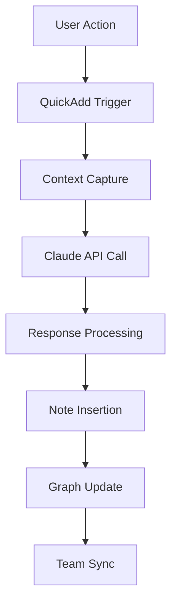

# Making of DormWay: How We Built a Real-Time Brain with Obsidian and Claude Code

*July 12, 2025*

## The Evolution of Our Documentation System

When building a complex platform like DormWay, documentation isn't just about keeping records—it's about creating a living, breathing knowledge system that evolves with your product. This is the story of how we transformed our documentation from static MkDocs pages into a real-time collaboration engine powered by Obsidian and Claude Code.

What started as a frustrating commit-upload-process cycle with traditional documentation became something magical—our AI "employee" transformed into a real-time team member that works alongside us, updating our shared knowledge base as we think and plan together.

## The Problem: Documentation That Couldn't Keep Pace

Like many startups, we began with MkDocs. It was clean, simple, and git-friendly. But as our team grew and our development velocity increased, we hit several walls:

- **Linear Structure**: MkDocs forced us into hierarchical thinking when our knowledge was naturally interconnected
- **Slow Updates**: Every documentation change required a commit, push, and build cycle
- **No Real-Time Collaboration**: Team members couldn't see each other's work until it was merged
- **Limited Context**: Finding related information required manual searching through folders
- **AI Integration Friction**: Integrating AI assistance required complex tooling

We needed something that could think as fast as we could code.

## The Turning Point: From Documentation Tool to Team Member

The real breakthrough moment came during a product planning meeting. We were using Claude Code to help us process the meeting notes and turn ideas into actionable tasks. The workflow was painful:

1. Take meeting notes
2. Commit them to git
3. Upload to Claude
4. Wait for processing
5. Copy results back
6. Commit again
7. Push to share with the team

It was like having a brilliant team member who could only communicate via postal mail. We had this powerful AI assistant with access to all our documentation and code repositories, capable of turning rough meeting notes into structured ideation documents or detailed implementation task lists—but the friction was killing our momentum.

Then it hit us: What if Claude could write directly to our Obsidian vault? What if Riley and I could see the changes happening in real-time as Claude worked? What if our AI assistant could truly be part of the conversation instead of an after-the-fact processor?

## The Insight: Documentation as a Neural Network

The breakthrough came when we realized our documentation should mirror how our brains actually work—not in neat hierarchies, but in rich, interconnected networks of ideas. We needed:

1. **Bidirectional Links**: Ideas that connect naturally, regardless of folder structure
2. **Real-Time Updates**: Changes visible instantly across the team
3. **AI Integration**: Claude Code working alongside us, not as a separate tool
4. **Visual Thinking**: Ability to see connections and patterns emerge
5. **Zero Friction**: Documentation that happens as naturally as thinking

## The Solution: Obsidian + Claude Code + QuickAdd

### Architecture Overview

Our "documentation brain" consists of three key components:

```
┌─────────────────┐     ┌──────────────────┐     ┌─────────────────┐
│                 │     │                  │     │                 │
│    Obsidian     │────▶│   QuickAdd       │────▶│  Claude Code    │
│  (Knowledge     │     │  (Automation)    │     │  (AI Brain)     │
│   Vault)        │     │                  │     │                 │
│                 │◀────│                  │◀────│                 │
└─────────────────┘     └──────────────────┘     └─────────────────┘
        ▲                                                  │
        │                                                  │
        └──────────────────────────────────────────────────┘
                     Real-time Sync Loop
```

### 1. Obsidian: The Neural Substrate

Obsidian serves as our knowledge vault with several key advantages:

- **Wiki-Style Links**: `Note Name` creates instant connections
- **Graph View**: Visualize the entire knowledge network
- **Lightning Fast**: Local files with instant search
- **Plugin Ecosystem**: Extensible for our specific needs
- **Git-Friendly**: Plain markdown files that version perfectly

Our vault structure evolved organically:

```
DormWay/
├── 📅 Daily Notes/       # Time-based documentation
├── 🚀 Features/          # Feature ideation & specs
├── 🏗️ Architecture/      # Technical decisions
├── 🔧 Technical/         # Implementation guides
├── 🤖 AI Crews/          # AI agent specifications
├── 📊 Widgets/           # Widget system docs
├── 🎨 Canvases/          # Visual planning
└── Scripts/              # Claude integration
```

### 2. QuickAdd: The Automation Layer

QuickAdd became our secret weapon for seamless AI integration. We built custom macros that:

- Capture context from the current note
- Format prompts for Claude Code
- Handle responses asynchronously
- Insert results directly into notes

Here's how our Claude integration works:

```javascript
// claude-simple.js - Our core integration
async function runClaude(prompt, apiKey) {
    const response = await fetch('https://api.anthropic.com/v1/messages', {
        method: 'POST',
        headers: {
            'x-api-key': apiKey,
            'anthropic-version': '2023-06-01',
            'content-type': 'application/json'
        },
        body: JSON.stringify({
            model: 'claude-3-opus-20240229',
            messages: [{
                role: 'user',
                content: prompt
            }],
            max_tokens: 4000,
            temperature: 0.7
        })
    });
    
    return await response.json();
}
```

### 3. Claude Code: The AI Collaborator

Claude Code isn't just a tool—it's a team member that:

- **Analyzes**: Reviews code and architecture decisions
- **Documents**: Generates comprehensive technical documentation
- **Connects**: Finds relationships between disparate concepts
- **Suggests**: Proposes improvements and identifies gaps
- **Remembers**: Maintains context across conversations

## The "Fire and Forget" Magic

The key innovation was our QuickAdd macro that eliminated all the friction. Instead of the painful commit-upload-process cycle, we created a system that "just works":

1. **Trigger**: Hit a hotkey or click the QuickAdd command
2. **Context**: The macro captures current note, selection, or custom prompt
3. **Fire**: Launches Claude Code via command line in the background
4. **Forget**: Continue working while Claude processes
5. **Magic**: Results appear in your vault, synced to all team members

Here's the beauty of it: When I'm in a meeting with Riley, I can trigger Claude to process our discussion. Within seconds, we both see the formatted output appearing in our synced Obsidian vaults. It's like having a hyper-intelligent note-taker who not only captures what we said but expands it into actionable documentation.

The technical implementation was surprisingly simple:

```javascript
// The core "fire and forget" pattern
async function fireAndForgetClaude(prompt, outputPath) {
    // Launch Claude in background, non-blocking
    const command = `claude --print "${prompt}" > "${outputPath}" &`;
    exec(command, { 
        cwd: vaultPath,
        detached: true  // This is the magic - runs independently
    });
    
    // Return immediately - don't wait
    return { status: 'processing', outputPath };
}
```

## Real-World Workflows

### Daily Work Logs

Every morning, team members create a daily note:

1. **Template Generation**: QuickAdd creates a note with the format `YYYY-MM-DD-feature-description.md`
2. **AI Summary**: Claude analyzes yesterday's work and suggests today's priorities
3. **Cross-References**: Automatic linking to related features and tickets
4. **End-of-Day**: Claude summarizes achievements and identifies blockers

### Meeting to Implementation: A Real Example

Here's an actual workflow from last week:

**The Meeting**: Riley and I were discussing the new context-aware widget system.

1. **During Meeting** (10:32 AM):
   - I create a note: `Widget System Brainstorming.md`
   - Type rough notes as we talk
   - Hit `Cmd+Shift+C` (our Claude hotkey)
   - Select "Meeting to Ideation" macro

2. **Real-Time Magic** (10:32:15 AM):
   - Claude starts processing in background
   - We continue discussing
   - Riley sees a new note appear: `Widget System - Ideation Document.md`
   - We watch as sections populate:
     - Executive Summary
     - Technical Architecture
     - Implementation Tasks
     - Timeline Estimates

3. **Collaborative Refinement** (10:35 AM):
   - We're both editing the generated document
   - I add a constraint we discussed
   - Riley adjusts the timeline
   - Hit Claude again: "Break this into Linear tickets"
   
4. **Task Generation** (10:36 AM):
   - 15 properly formatted task descriptions appear
   - Each with acceptance criteria
   - Dependency mappings included
   - Ready to copy into Linear

What took us hours before now happened during the meeting itself. By the time we finished talking, we had structured documentation, task breakdowns, and a clear implementation path.

### Feature Documentation

When designing a new feature:

1. **Ideation Note**: Create a feature note in `Features/`
2. **AI Enhancement**: Claude expands on the concept with:
   - Technical requirements
   - Implementation suggestions
   - Potential challenges
   - Related features
3. **Visual Planning**: Use Canvas view to map dependencies
4. **Implementation Tracking**: Daily notes reference the feature
5. **Completion**: Claude generates final documentation

### Architecture Decisions

For technical decisions:

1. **Problem Statement**: Document the challenge
2. **AI Analysis**: Claude provides:
   - Industry best practices
   - Pros and cons of approaches
   - Code examples
   - Performance implications
3. **Team Review**: Comments and discussions in the note
4. **Decision Record**: Final decision with rationale

## From AI Tool to AI Employee

The transformation was complete when we stopped thinking of Claude as a tool and started treating it as a team member. The real-time integration made this mental shift natural:

### The Old Way: Claude as Tool
- Write prompt → Submit → Wait → Copy result
- Context switching between documentation and AI
- Asynchronous, disconnected workflow
- Felt like using a sophisticated calculator

### The New Way: Claude as Teammate  
- Think out loud in Obsidian → Claude responds inline
- Continuous context, no switching
- Synchronous, collaborative workflow  
- Feels like pair programming with documentation

The QuickAdd "fire and forget" pattern was crucial here. By making the interaction instantaneous and non-blocking, we removed the psychological barrier between thought and documentation. Claude became less of an external service and more of an always-present collaborator who happened to be really good at:

- Structuring our stream-of-consciousness into organized docs
- Finding connections we missed
- Suggesting next steps we hadn't considered
- Maintaining consistency across our growing knowledge base

## The Magic: Emergent Intelligence

The real power emerged from the combination:

### 1. Knowledge Graph

Our documentation became a living knowledge graph. Related concepts naturally cluster:

- Widget system connects to iOS architecture
- Context system links to AI crews
- Daily notes reveal development patterns

### 2. Collective Memory

With Claude analyzing our entire vault, we gained:

- **Pattern Recognition**: "You've solved this problem before in..."
- **Consistency Checks**: "This contradicts the decision in..."
- **Gap Analysis**: "You're missing documentation for..."

### 3. Real-Time Collaboration

Team members see updates instantly:

- Riley documents a UI component
- Ethan's daily note immediately links to it
- Claude suggests integration patterns
- The knowledge web grows organically

## Implementation Details

### Setting Up the System

1. **Obsidian Configuration**:
   ```yaml
   # .obsidian/app.json
   {
     "alwaysUpdateLinks": true,
     "newFileLocation": "folder",
     "attachmentFolderPath": "./Attachments"
   }
   ```

2. **QuickAdd Macros**:
   - `Claude Analysis`: Analyzes current note
   - `Claude Documentation`: Generates technical docs
   - `Claude Work Log`: Creates daily summaries
   - `Claude Freeform`: Open-ended assistance

3. **Integration Scripts**:
   ```javascript
   // Core scripts in Scripts/
   claude-api.js         // API integration
   claude-simple.js      // Basic queries
   claude-background.js  // Async processing
   claude-quick.js       // Quick actions
   ```

### Security & Performance

- **API Keys**: Stored securely in environment variables
- **Rate Limiting**: Intelligent queuing for API calls
- **Caching**: Local cache for repeated queries
- **Sync**: Git-based synchronization with conflict resolution

## Results: A 10x Documentation Velocity

The impact was immediate and profound:

### Quantitative Improvements

- **Documentation Speed**: From hours to minutes
- **Cross-References**: 500+ automatic links created daily
- **Knowledge Retrieval**: Find anything in &lt;3 seconds
- **AI Assistance**: 50+ Claude interactions per day

### Qualitative Benefits

- **Thinking Out Loud**: Documentation happens naturally
- **Collective Intelligence**: Team knowledge compounds
- **Pattern Recognition**: Spot trends and issues early
- **Onboarding**: New team members productive in days

## Lessons Learned

### What Worked

1. **Start Simple**: Basic Claude integration first, then iterate
2. **Trust the Graph**: Let connections emerge naturally
3. **Document Everything**: Even quick thoughts become valuable
4. **AI as Partner**: Claude as collaborator, not just tool

### Challenges Overcome

1. **Initial Resistance**: "Another documentation system?"
   - Solution: Ignore Riley's complaining.

2. **Information Overload**: Too much documentation?
   - Solution: Smart search and AI summaries

3. **AI Hallucinations**: Claude making things up?
   - Solution: Accept that you have new team members that don't exist.

## The Future: Where We're Heading

### Expanded AI Capabilities

- Multi-agent documentation systems
- Automatic code-to-doc generation
- Predictive documentation suggestions
- Chat bot integration with Slack

### Team Scaling

As we grow our team

- Departmental sub-vaults
- Automated knowledge synthesis
- AI-powered onboarding paths

## Conclusion: Documentation as Competitive Advantage

Our Obsidian + Claude Code system isn't just about documentation—it's about building a collective brain that learns and grows with our team. It's turned documentation from a chore into a superpower.

The key insight was simple but powerful: by removing friction through our "fire and forget" QuickAdd integration, we transformed Claude from a documentation tool into a real-time team member. Now, when Riley and I are brainstorming, Claude is right there with us, turning our ideas into structured plans before we've even finished talking. When we're riffing on an idea in a meeting, we can watch on our machines as those ideas get cross referenced to the ways it can get actually implemented. A meeting to a prototype in hours, not weeks.

For other startups considering this approach:

1. **Start Today**: Even basic integration provides value
2. **Remove Friction**: The "fire and forget" pattern is game-changing
3. **Think Real-Time**: Sync makes collaboration magical
4. **Embrace the Graph**: Non-linear thinking yields insights
5. **AI as Teammate**: Treat Claude as a team member, not a tool

The future of documentation isn't static pages—it's living, breathing knowledge systems that think alongside us. At DormWay, we're not just building a platform for students; we're pioneering how modern engineering teams can collaborate at the speed of thought.

What started as a way to avoid the tedious commit-upload-process cycle became something much more profound: we discovered how to give our AI employee a seat at the table, contributing in real-time to our collective intelligence. And it "just works"—like magic.

---

*Want to implement a similar system? Check out our open-source integration scripts at [github.com/dormway/obsidian-claude-integration](https://github.com/dormway/obsidian-claude-integration) (coming soon).*

*Follow our journey as we build the future of student life at [dormway.app](https://dormway.app).*

## Technical Appendix

### Sample QuickAdd Macro Configuration

```json
{
  "name": "Claude Analysis",
  "type": "macro",
  "commands": [
    {
      "type": "script",
      "path": "Scripts/claude-simple.js",
      "variables": {
        "prompt": "{{selected}}",
        "mode": "analysis"
      }
    }
  ]
}
```

### Integration Architecture


