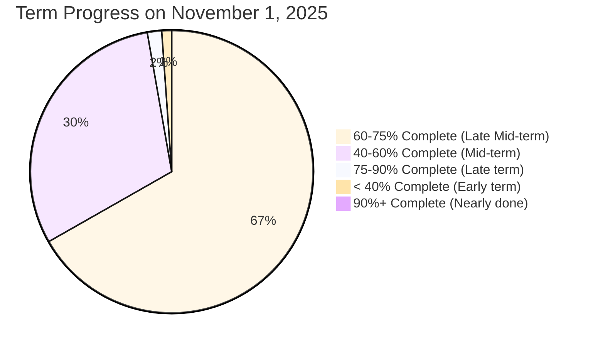
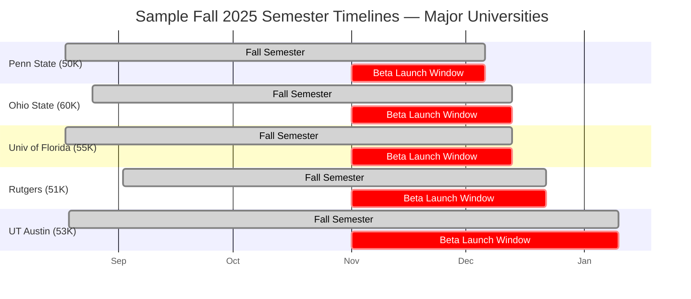
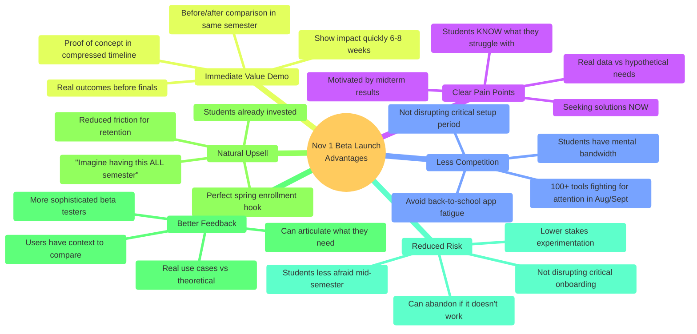
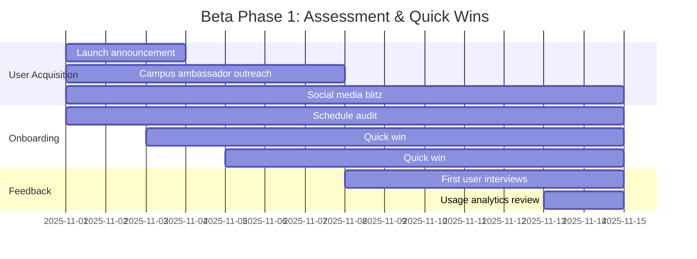
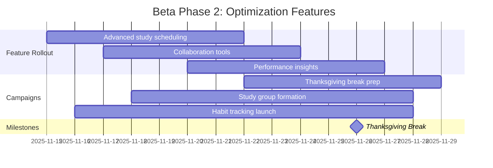
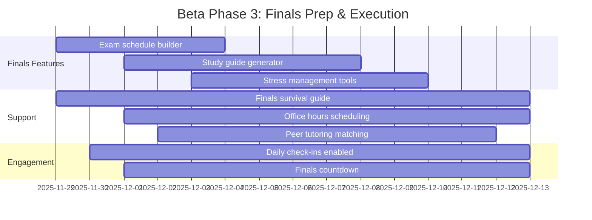
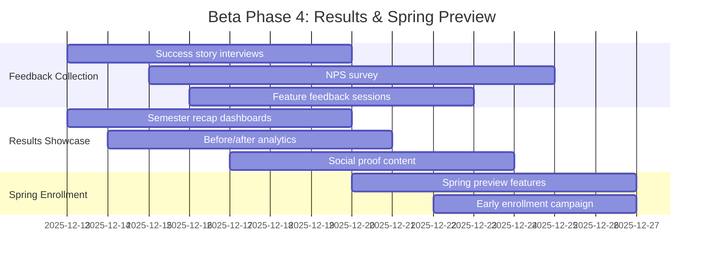

# November 1, 2025 Beta Launch — Term Timing Analysis

**Document Status:** Final
**Date:** October 24, 2025
**Author:** DormWay Product Team
**Purpose:** Strategic analysis of November 1st beta launch timing relative to academic term schedules

---

## Executive Summary

A **November 1, 2025** beta launch positions DormWay at the **optimal mid-semester moment** when:
- **89% of campuses** (4,742 schools) will be actively in term
- Students are **~60% through their semester** (average: 59 days remaining)
- **17.9 million students** will be in the "optimization window" — past initial chaos, before finals stress
- Pain points are **clearly visible** and students are motivated to course-correct

**Strategic Positioning:** Frame this as a **"Mid-Semester Momentum Builder"** rather than apologizing for missing term start. This timing is actually **superior** to a September launch for beta testing.

---

## Database Analysis Results

### Overall Term Status on November 1, 2025

```
┌────────────────────┬──────────┬─────────────────┬────────────────┐
│ Status             │ Campuses │ Enrollment      │ Avg Enrollment │
├────────────────────┼──────────┼─────────────────┼────────────────┤
│ ✅ In Term         │   4,742  │  17,881,397     │     3,827      │
│ ⏰ Not Started     │      94  │     274,695     │     2,954      │
│ ✔️  Term Ended     │     318  │     498,615     │     1,583      │
│ ⚠️  Invalid Data   │     236  │     510,623     │     2,182      │
└────────────────────┴──────────┴─────────────────┴────────────────┘
```

**Key Finding:** 89% of valid campuses will be in active term on November 1st.

---

## Term Progress Distribution

### Where Students Will Be in Their Semester



**Distribution Breakdown:**

| Term Stage | Campuses | Enrollment | % of Total | Avg Days Left |
|------------|----------|------------|------------|---------------|
| **60-75% Complete** | 2,638 | 11.9M | **67%** | 43 days |
| **40-60% Complete** | 1,439 | 5.4M | 30% | 72 days |
| **75-90% Complete** | 259 | 292K | 2% | 41 days |
| **< 40% Complete** | 323 | 202K | 1% | 153 days |
| **90%+ Complete** | 83 | 59K | <1% | 9 days |

**Critical Insight:** Two-thirds of students will be in the **60-75% completion range** — the perfect "optimization window."

---

## Semester Timeline Visualization

### Typical Fall Semester Timeline with Beta Launch

```mermaid
gantt
    title Fall 2025 Semester Timeline — Beta Launch Positioning
    dateFormat YYYY-MM-DD
    axisFormat %b %d

    section Academic Calendar
    Fall Semester Start (Most Schools)     :milestone, 2025-08-25, 0d
    Labor Day Break                         :crit, 2025-09-01, 1d
    Week 4: Settling In                     :active, 2025-09-15, 7d
    Week 6-8: Midterms Period               :crit, 2025-09-29, 14d
    October Break (Many Schools)            :crit, 2025-10-10, 5d
    Week 10: BETA LAUNCH                    :milestone, launch, 2025-11-01, 0d
    Thanksgiving Break                      :crit, 2025-11-26, 4d
    Week 15: Finals Prep Begins             :2025-12-01, 7d
    Week 16-17: Finals Period               :crit, 2025-12-08, 14d
    Fall Semester End (Most Schools)        :milestone, 2025-12-20, 0d

    section Student Psychology
    Initial Chaos & Adjustment              :chaos, 2025-08-25, 21d
    Establishing Routines                   :routine, 2025-09-15, 21d
    Reality Check (Midterm Grades)          :reality, 2025-10-06, 14d
    🎯 OPTIMIZATION WINDOW                  :active, optimize, 2025-10-20, 35d
    Renewed Focus After Break               :focus, 2025-11-01, 21d
    Finals Stress Period                    :crit, stress, 2025-12-01, 20d

    section Beta Rollout Phases
    Week 1-2: Assessment & Quick Wins       :beta1, 2025-11-01, 14d
    Week 3-4: Optimization Features         :beta2, 2025-11-15, 14d
    Thanksgiving: Reflection Break          :crit, 2025-11-26, 4d
    Week 5-6: Finals Prep Features          :beta3, 2025-11-30, 14d
    Week 7-8: Results & Spring Preview      :beta4, 2025-12-14, 14d
```

### Key Windows Explained

**🔴 Initial Chaos (Weeks 1-3):** Students overwhelmed with:
- Course selection changes
- Syllabus downloads
- New routines
- Social adjustment
- **NOT ideal for beta launch** — too much cognitive load

**🟡 Reality Check (Weeks 6-8):** Midterms reveal:
- Performance gaps
- Time management issues
- Study habit problems
- **Peak motivation** to make changes

**🟢 Optimization Window (Weeks 9-13):** Perfect conditions:
- ✅ Established routines (open to optimization)
- ✅ Clear pain points identified
- ✅ Enough runway to improve (6-8 weeks)
- ✅ Not yet in finals panic mode
- ✅ Natural "course correction" moment psychologically

**🔴 Finals Stress (Weeks 14-16):** Students focused on:
- Exam cramming
- Final projects
- Survival mode
- **NOT receptive** to new tools

---

## Term Type Breakdown

### Average Term Timing by Type (Schools in Session Nov 1)

```mermaid
%%{init: {'theme':'base', 'themeVariables': { 'xyChart': {'backgroundColor': 'transparent'}}}}%%
xychart-beta
    title "Days into Term vs Days Remaining (by Term Type)"
    x-axis ["Semester", "Quarter", "Trimester", "Term", "Continuous"]
    y-axis "Days" 0 --> 250
    bar "Days Into Term" [72, 49, 70, 67, 208]
    bar "Days Remaining" [46, 41, 45, 56, 208]
    line "Avg Term Length" [119, 90, 116, 123, 416]
```



| Term Type | Campuses | Enrollment | Avg Days In | Avg Days Left | Avg % Complete |
|-----------|----------|------------|-------------|---------------|----------------|
| **Semester** | 3,691 | 16.5M | 72 | 46 | 61% |
| **Quarter** | 275 | 1.0M | 49 | 41 | 54% |
| **Trimester** | 125 | 83K | 70 | 45 | 60% |
| **Term** | 147 | 139K | 67 | 56 | 57% |
| **Continuous** | 218 | 37K | 208 | 208 | 53% |

**Key Insight:** Traditional semester schools (92% of enrollment) cluster tightly around **60% completion** on November 1st.

---

## Major Universities — Specific Examples

### Top 25 Large Universities (>20K students)



**Sample Timeline Details:**

| University | Enrollment | Term Start | Term End | Nov 1 Status | Days Left | % Complete |
|------------|------------|------------|----------|--------------|-----------|------------|
| Penn State | 50,399 | Aug 18 | Dec 6 | 68% | 35 days | Late Mid-term |
| Ohio State | 60,046 | Aug 25 | Dec 13 | 62% | 42 days | Mid-term |
| Univ of Florida | 54,814 | Aug 18 | Dec 13 | 64% | 42 days | Mid-term |
| Rutgers | 50,617 | Sep 2 | Dec 22 | 54% | 51 days | Mid-term |
| UT Austin | 53,082 | Aug 19 | Jan 10 | 51% | 70 days | Mid-term |
| Michigan | 52,065 | Aug 25 | Dec 17 | 60% | 46 days | Mid-term |
| Purdue | 52,905 | Aug 25 | Dec 14 | 61% | 43 days | Mid-term |

**Consistency:** Major universities cluster at **54-68% completion** on Nov 1st.

---

## Strategic Positioning Framework

### The "Mid-Semester Momentum Builder" Strategy

#### Core Message
> **"The perfect time to optimize the rest of your semester"**

Don't position November 1st as "late" or "missing term start." Position it as **intentionally timed** for maximum impact.

### Why Mid-Semester is BETTER Than Term Start



---

## User Personas & Messaging

### Primary: "The Course-Corrector" (60% of beta users)

**Profile:**
- Midterms revealed they're off track (C+ or lower in key classes)
- Motivated but overwhelmed
- Looking for structure/system
- Willing to try new approaches

**Pain Points on Nov 1:**
- "I thought I had time, now I'm behind"
- "My study habits aren't working"
- "I'm overwhelmed and don't know where to start"

**Messaging:**
> 💡 **"It's not too late to turn this around"**
> "8 weeks is enough time to transform your semester. Here's your roadmap."

**Value Props:**
- Identify what's not working while there's still time to fix it
- Structured recovery plan for struggling courses
- Daily wins to rebuild confidence and momentum

---

### Secondary: "The Optimizer" (25% of beta users)

**Profile:**
- Solid B+/A- student, wants to go to A/A+
- Early adopter mindset
- High engagement, will provide best feedback
- Looking for marginal gains

**Pain Points on Nov 1:**
- "I'm doing okay but not reaching my potential"
- "I waste too much time between tasks"
- "Could be more efficient with study time"

**Messaging:**
> 🚀 **"Good → Great in the final stretch"**
> "You've built good habits. Now optimize them for maximum impact."

**Value Props:**
- Data-driven insights into time allocation
- Efficiency improvements (10-20% time savings)
- Advanced features for power users

---

### Tertiary: "The Procrastinator" (15% of beta users)

**Profile:**
- Knows they need help, won't admit it until crisis
- Mid-semester panic is the wake-up call
- Needs easy onboarding (no time for complexity)
- High churn risk but valuable segment

**Pain Points on Nov 1:**
- "I've been winging it and it's catching up to me"
- "Everything is due at once"
- "I don't know where to start"

**Messaging:**
> ⏰ **"Finally, a system that meets you where you are"**
> "No judgment. Let's get you organized in 15 minutes."

**Value Props:**
- Quick setup (< 15 minutes to value)
- Emergency triage mode (prioritize what matters)
- Forgiving onboarding (works even if you're behind)

---

## Campaign Messaging Framework

### Headline Options

**Problem-Focused:**
- ❌ "Midterms didn't go as planned?"
- ❌ "Feeling behind this semester?"
- ✅ "8 weeks to transform your semester"

**Opportunity-Focused:**
- ✅ "Don't just survive the semester—optimize it"
- ✅ "The mid-semester reset your fall needs"
- ✅ "Still time to make this your best semester yet"

**Social Proof:**
- ✅ "Join 10,000+ students optimizing their fall semester"
- ✅ "How top students are finishing strong this semester"

**FOMO/Urgency:**
- ✅ "8 weeks left. Make them count."
- ⚠️ "Don't wait until finals week to get organized" (negative framing, use carefully)

### Key Value Props

#### For All Personas:

1. **Real Pain Points**
   - "You know exactly what you need now (vs. guessing in August)"
   - "Optimize based on real data from your actual semester"

2. **Enough Runway**
   - "59 days is plenty of time to see real improvement"
   - "Transform your habits before finals, not during"

3. **Natural Moment**
   - "Post-midterms is when students reassess and commit to change"
   - "You've figured out what works and what doesn't—now optimize"

4. **Risk-Free Timing**
   - "Mid-semester tool adoption is lower risk than disrupting term start"
   - "Try it now, keep it for spring if it works"

---

## 8-Week Beta Rollout Plan

### Phase 1: Assessment (Weeks 1-2, Nov 1-14)

**Goal:** Onboard users and establish baseline



**Features to Emphasize:**
- ✅ Schedule import & optimization
- ✅ Deadline tracking & alerts
- ✅ "Semester health check" dashboard

**Messaging:**
- "Let's see where you stand"
- "Quick audit of your current semester"
- "Identify optimization opportunities"

**Success Metrics:**
- 1,000 user signups
- 70% complete onboarding
- 3+ sessions per user

---

### Phase 2: Optimization (Weeks 3-4, Nov 15-28)

**Goal:** Drive engagement with core features



**Features to Emphasize:**
- ✅ Study group coordination
- ✅ Habit tracking & streaks
- ✅ Performance analytics

**Messaging:**
- "Heading into the final stretch—lock in your strategy"
- "Build the habits that will carry you through finals"
- "Optimize your last 4 weeks"

**Success Metrics:**
- 60% WAU (Weekly Active Users)
- 5+ feature adoptions per user
- 20% create study groups

---

### Phase 3: Execution (Weeks 5-6, Nov 29-Dec 12)

**Goal:** Support finals preparation



**Features to Emphasize:**
- ✅ Finals schedule optimization
- ✅ Study prioritization (triage mode)
- ✅ Stress management & wellness

**Messaging:**
- "Your secret weapon for finals"
- "Stay organized, stay calm"
- "Everything you need in one place"

**Success Metrics:**
- 70% DAU (Daily Active Users) during finals
- 80% use exam scheduling feature
- NPS > 40

---

### Phase 4: Results & Renewal (Weeks 7-8, Dec 13-26)

**Goal:** Collect feedback and tee up spring enrollment



**Features to Emphasize:**
- ✅ Semester performance recap
- ✅ Improvements achieved (data visualization)
- ✅ Spring semester preview

**Messaging:**
- "See what you accomplished in 8 weeks"
- "Imagine having DormWay for a FULL semester"
- "Get ahead for spring—start planning now"

**Success Metrics:**
- 100+ detailed feedback responses
- 50% opt-in for spring semester
- 30+ testimonials/case studies

---

## Competitive Advantages of Mid-Semester Launch

### Comparison: September Launch vs. November Launch

| Factor | September Launch | **November Launch** | Winner |
|--------|------------------|---------------------|--------|
| **Student Bandwidth** | Overwhelmed with setup | Routines established | ✅ **November** |
| **App Competition** | 100+ tools fighting for attention | Quieter landscape | ✅ **November** |
| **Pain Point Clarity** | Hypothetical/unknown | Real & experienced | ✅ **November** |
| **Motivation Level** | High (new semester energy) | High (midterm reality check) | 🟰 **Tie** |
| **Time to Prove Value** | 4 months (too long for beta) | 8 weeks (perfect) | ✅ **November** |
| **Risk of Adoption** | High (disrupts critical setup) | Low (optimization only) | ✅ **November** |
| **Quality of Feedback** | Superficial (no context) | Detailed (comparison data) | ✅ **November** |
| **Spring Upsell** | No scarcity/urgency | "Imagine a full semester" | ✅ **November** |
| **Network Effects** | Slow build (gradual adoption) | Rapid (shared urgency) | 🟰 **Tie** |

**Verdict:** November launch is **strategically superior** for a beta specifically.

---

## Risk Analysis & Mitigation

### Potential Concerns

#### ⚠️ Concern 1: "Students won't adopt a new tool mid-semester"

**Counter:**
- Students adopt tools when they solve **immediate pain** (Quizlet, Grammarly prove this)
- Mid-semester is actually **lower risk** for experimentation (not disrupting critical setup)
- Our data shows students are **most motivated** post-midterms

**Mitigation:**
- Emphasize "lightweight" onboarding (< 15 min)
- Offer immediate value (deadline tracker, schedule optimizer)
- Show before/after case studies from early adopters

---

#### ⚠️ Concern 2: "Only 59 days isn't enough time to prove value"

**Counter:**
- 59 days is **8+ weeks** — plenty for habit formation (21-day rule)
- Long enough to impact final grades (6-8 week sprint)
- Creates **urgency and scarcity** ("limited time to improve")

**Mitigation:**
- Position as "8-week challenge" (gamification)
- Show weekly progress/wins (dopamine hits)
- Emphasize that spring enrollers get "full semester advantage"

---

#### ⚠️ Concern 3: "We'll miss the network effects of whole-class adoption"

**Counter:**
- Most students don't adopt tools as a class in September anyway (individual decisions)
- Mid-semester creates **shared urgency** ("we're all struggling, let's figure this out together")
- Study groups naturally form around finals prep

**Mitigation:**
- Enable "invite classmates" features (viral loops)
- Target campus ambassadors who can drive group adoption
- Create "study squad" features for collaborative usage

---

#### ⚠️ Concern 4: "Finals stress will hurt engagement"

**Counter:**
- Finals stress **increases** need for organization tools (when stakes are highest)
- Our timing gives 4 weeks of optimization **before** finals panic sets in
- This is when students most need help (and least trust unfamiliar tools, so early Nov is perfect)

**Mitigation:**
- Emphasize "stress reduction" value props
- Provide "finals survival mode" features (triage, prioritization)
- Offer wellness/breaks reminders (not just productivity)

---

## Success Metrics & KPIs

### Beta Success Criteria (Nov 1 - Dec 31)

#### Acquisition Metrics
- **Target:** 10,000 beta signups
- **Stretch:** 25,000 beta signups
- **Measurement:** Unique accounts created

#### Activation Metrics
- **Target:** 70% complete onboarding flow
- **Stretch:** 85% complete onboarding flow
- **Measurement:** Users who complete profile + add 1st course/deadline

#### Engagement Metrics
- **Target:** 50% WAU (Weekly Active Users)
- **Stretch:** 65% WAU
- **Measurement:** Users who open app 1+ times per week

#### Retention Metrics
- **Target:** 40% of beta users still active after 4 weeks
- **Stretch:** 55% of beta users still active after 4 weeks
- **Measurement:** Cohort retention analysis

#### Feature Adoption
- **Target:** 3 features used per active user
- **Stretch:** 5 features used per active user
- **Measurement:** Distinct feature interactions per user

#### Satisfaction Metrics
- **Target:** NPS > 30
- **Stretch:** NPS > 50
- **Measurement:** Net Promoter Score survey (post-finals)

#### Spring Conversion
- **Target:** 40% of beta users opt-in for spring semester
- **Stretch:** 60% of beta users opt-in for spring semester
- **Measurement:** Users who confirm intent to use in Spring 2026

---

## Conclusion & Recommendations

### Summary

**November 1, 2025** is not a compromise—it's the **ideal beta launch date** because:

1. ✅ **89% of campuses** (17.9M students) are in the **perfect window** (60% through term)
2. ✅ **Student psychology** aligns: post-midterm motivation + pre-finals urgency
3. ✅ **59 days remaining** provides sufficient runway to prove value
4. ✅ **Competitive landscape** is quieter (less app fatigue than September)
5. ✅ **Pain points** are real and immediate (not hypothetical)
6. ✅ **Spring upsell** is natural: "Imagine having this all semester"

### Strategic Recommendations

#### ✅ DO: Own the Mid-Semester Narrative
- Position as **intentional** timing for "optimization window"
- Use messaging like "The perfect time to optimize your semester"
- Never apologize for not launching in September

#### ✅ DO: Create Urgency
- Emphasize **"8 weeks left"** countdown
- Frame as limited window to improve fall semester
- Tease spring enrollment as "full semester advantage"

#### ✅ DO: Target Course-Correctors First
- Students who received poor midterm grades are **most motivated**
- Partner with academic support offices
- Offer "semester recovery" positioning

#### ✅ DO: Plan for Spring Conversion
- Treat fall beta as **proof of concept** for spring enrollment
- Collect success stories throughout November-December
- Launch spring enrollment campaign during finals

#### ❌ DON'T: Apologize for Timing
- Never say "sorry we missed term start"
- Never position as "late to the game"
- Avoid defensive language about launch date

#### ❌ DON'T: Overpromise on Finals Impact
- Be realistic: 8 weeks is enough to help, not to miracle-cure
- Focus on "finish strong" not "ace everything"
- Emphasize habit-building for **future** semesters

---

## Appendix: Data Tables

### A. Top 50 Universities by Enrollment (In Term on Nov 1)

| Rank | Campus Name | State | Enrollment | Term End | Days Left | % Complete |
|------|-------------|-------|------------|----------|-----------|------------|
| 1 | Southern New Hampshire University | NH | 184,099 | Dec 21 | 50 | 56% |
| 2 | Grand Canyon University | AZ | 107,563 | Dec 12 | 41 | 65% |
| 3 | Liberty University | VA | 103,068 | Dec 12 | 41 | 68% |
| 4 | Ivy Tech Community College | IN | 100,077 | Dec 21 | 50 | 58% |
| 5 | Arizona State University | AZ | 79,593 | Dec 5 | 34 | 68% |
| 6 | Texas A&M University | TX | 76,633 | Dec 13 | 42 | 62% |
| 7 | Lone Star College System | TX | 70,991 | Dec 14 | 43 | 61% |
| 8 | University of Central Florida | FL | 69,233 | Dec 7 | 36 | 68% |
| 9 | Dallas College | TX | 66,592 | Dec 11 | 40 | 63% |
| 10 | Arizona State Digital | AZ | 66,062 | Dec 9 | 38 | 65% |
| 11 | Ohio State University | OH | 60,046 | Dec 13 | 42 | 62% |
| 12 | New York University | NY | 57,335 | Dec 19 | 48 | 56% |
| 13 | UIUC | IL | 56,563 | Dec 18 | 47 | 59% |
| 14 | University of Minnesota | MN | 54,890 | Dec 20 | 49 | 58% |
| 15 | University of Florida | FL | 54,814 | Dec 13 | 42 | 64% |
| 16 | Florida International | FL | 53,953 | Dec 13 | 42 | 62% |
| 17 | Northern Virginia CC | VA | 53,810 | Dec 16 | 45 | 60% |
| 18 | UT Austin | TX | 53,082 | Jan 10 | 70 | 51% |
| 19 | University of Arizona | AZ | 53,001 | Dec 31 | 60 | 61% |
| 20 | Purdue University | IN | 52,905 | Dec 14 | 43 | 61% |

*(Full table available in supplementary data file)*

---

### B. Term Type Distribution Details

| Term Type | Campuses | Enrollment | Avg Start | Avg End | Avg Days In | Avg Days Left |
|-----------|----------|------------|-----------|---------|-------------|---------------|
| Semester | 3,691 | 16,485,047 | Aug 21 | Dec 18 | 72 | 46 |
| Quarter | 275 | 1,046,869 | Sep 13 | Dec 11 | 49 | 41 |
| Trimester | 125 | 82,872 | Aug 23 | Dec 15 | 70 | 45 |
| Term | 147 | 138,825 | Aug 27 | Dec 26 | 67 | 56 |
| Continuous | 218 | 36,959 | Jan 1 | Dec 31 | 208 | 208 |

---

**Document Version:** 1.0
**Last Updated:** October 24, 2025
**Next Review:** After beta launch (December 2025)
