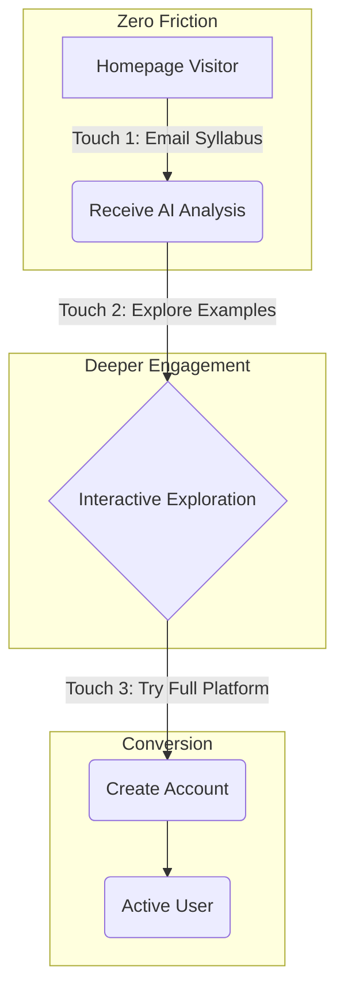

# DormWay Unified Homepage Strategy

## Executive Summary
This document outlines the strategy for combining dormway-lockedin and syllabus-webviewer into a unified homepage that maximizes Product-Led Growth (PLG) motion while maintaining clear product positioning.

---

## Current State Analysis

### dormway-lockedin Homepage
**Strengths:**
- Strong brand positioning: "The OS for College Life"
- Clear value proposition: "Lock In. Focus. Thrive."
- Comprehensive feature showcase
- Demo account access
- Mobile app waitlist integration
- 6,154 campuses coverage stats

**Weaknesses:**
- High friction - requires login to try
- No immediate value delivery
- Abstract benefits until experienced

### syllabus-webviewer Homepage
**Strengths:**
- Zero-friction entry: Email PDF for instant analysis
- Live demo rotation (auto-cycling examples)
- Immediate value demonstration
- Customer.io tracking integration
- Idle user re-engagement modal

**Weaknesses:**
- Limited to single feature
- Doesn't showcase full platform
- Missing broader ecosystem story

---

## Unified Homepage Vision

### Core Positioning
**Primary Message:** "The OS for Every Student's Success"
**Supporting Message:** "Free Forever - 6,200 Schools Strong"

### Value Proposition Hierarchy
1. **Instant Intelligence** - Upload syllabus, get insights (instant for cached courses)
2. **Universal Platform** - From Ivy League to trade schools, we speak your language
3. **100% Free** - No premium tiers, no paywalls, equal access for all
4. **Academic AI** - Purpose-built for YOUR educational journey

---

## PLG Motion Design

### The Three-Touch Journey



#### Touch 1: Zero Friction Value (No Signup)
- **Action:** Email syllabus to syllabus@dormway.app (mailer opens pre-filled)
- **Value:** Follow the email straight into the web viewer to see the full analysis—no waiting on the homepage
- **Hook:** "Join students from 6,200 schools who've decoded their semester"
- **Top Navigation:** "Get started fast" button triggers the same email flow; "Lock In" surfaces the login for returning students
- **Cache Strategy:** Pioneer program - first uploader gets recognition in the follow-up email/viewer

#### Touch 2: Interactive Exploration
- **Action:** Click "View Example Analysis"
- **Value:** See live syllabus breakdowns
- **Hook:** Auto-rotating examples from real courses

#### Touch 3: Full Experience
- **Action:** "Try Demo" (Riley's account) or "Lock In"
- **Value:** Access complete dashboard with real student data
- **Hook:** "Experience Riley's academic command center"

### Conversion Funnel Metrics
```
Visitor -> Email Submitter -> Analysis Receiver -> Account Creator -> Active User
  100%  ->      25%        ->       20%        ->      10%       ->    5%

Target: 5% visitor to active user in 7 days
```

---

## Page Architecture

### Above the Fold (0-100vh)
```
┌─────────────────────────────────────────┐
│            DormWay Logo                 │
│                                          │
│   "The OS for Every Student's Success"  │
│     Lock In. Focus. Thrive.             │
│                                          │
│ ┌──────────────┐  ┌──────────────┐      │
│ │ Email Syllabus│  │  Try Demo    │      │
│ └──────────────┘  └──────────────┘      │
│                                          │
│ 📊 6,200 Schools | 🌍 2,200 Cities      │
│ 🎓 From Harvard to Trade Schools        │
│                                          │
│ ╔══════════════════════════════════════╗ │
│ ║   [School-Type Specific Example]     ║ │
│ ║   [Cache Status: Instant/Pioneer]    ║ │
│ ╚══════════════════════════════════════╝ │
└─────────────────────────────────────────┘
```

- Top navigation: brand mark on the left, "Get started fast" (email CTA) and "Lock In" (login) on the right to reinforce PLG flow.

### Section 2: Triple Value Props (100-200vh)
```
┌─────────────┬─────────────┬─────────────┐
│  Syllabus   │    Ace      │   Focus     │
│Intelligence │    LLM      │    Mode     │
│             │             │             │
│ • Workload  │ • Notes AI  │ • Distraction│
│ • Deadlines │ • Q&A       │   Free      │
│ • Insights  │ • Tutoring  │ • Deep Work │
└─────────────┴─────────────┴─────────────┘
```

### Section 3: How It Works (200-300vh)
```
Step 1: Upload -> Step 2: Analyze -> Step 3: Optimize
```

### Section 4: Platform Showcase (300-400vh)
- Screenshot carousel of dashboard views
- Feature grid (8 tiles)
- Mobile app coming soon banner

### Section 5: Social Proof (400-500vh)
- University logos ticker
- Success metrics
- Student testimonials

---

## Technical Implementation

### A/B Testing Strategy (Amplitude Experiment)

#### Setup
```javascript
// Initialize Amplitude Experiment
import * as amplitude from '@amplitude/analytics-browser';
import { Experiment } from '@amplitude/experiment-browser';

amplitude.init(process.env.NEXT_PUBLIC_AMPLITUDE_API_KEY);
const experiment = Experiment.initialize(process.env.NEXT_PUBLIC_AMPLITUDE_DEPLOYMENT_KEY);
await experiment.start();
```

#### Test 1: CTA Positioning
```javascript
const ctaVariant = experiment.variant('homepage_cta_order');
const ctaLayout = ctaVariant?.value || 'email_first'; // default

if (ctaLayout === 'demo_first') {
  // Show Demo CTA prominently, Email secondary
} else {
  // Show Email CTA prominently, Demo secondary
}
```
- **Variants:** `email_first` (control) vs `demo_first`
- **Success Metric:** Email submission rate
- **Allocation:** 50/50 split

#### Test 2: Value Prop Messaging
```javascript
const messageVariant = experiment.variant('homepage_headline');
const headline = messageVariant?.payload?.text || "The OS for Every Student's Success";
```
- **Variant A:** "The OS for Every Student's Success"
- **Variant B:** "Your Academic Command Center"
- **Variant C:** "From Syllabus to Success in Seconds"
- **Success Metric:** Scroll depth > 50%, time on page > 30s
- **Allocation:** 33/33/34 split

#### Test 3: Pioneer Program Emphasis
```javascript
const pioneerVariant = experiment.variant('pioneer_program_visibility');
const showPioneerBadge = pioneerVariant?.value === 'prominent';
```
- **Variant A:** Standard messaging
- **Variant B:** Prominent pioneer badges and incentives
- **Success Metric:** First-time syllabus upload rate
- **Allocation:** 50/50 split

### Dynamic Personalization

#### School Detection & Adaptation
```javascript
// Enhanced detection for all 6,200 schools:
1. IP geolocation -> nearest schools (multiple options)
2. Email domain matching
3. Self-selection: "Can't find your school? Select here"
4. School type detection (community, trade, online, etc.)

// Adaptive content by school type:
if (school.type === 'community_college') {
  hero = "Balance work, life, and classes";
  features = ['transfer_planner', 'part_time_optimizer'];
} else if (school.type === 'trade_school') {
  hero = "Master your craft, manage your time";
  features = ['certification_tracker', 'lab_scheduler'];
} else if (school.type === 'online') {
  hero = "Structure for self-paced success";
  features = ['async_tracker', 'virtual_groups'];
}

// Cache-aware messaging:
if (syllabusInCache) {
  cta = "Get instant analysis - Join 47 classmates";
  time = "Results in seconds";
} else {
  cta = "Be the pioneer for your class";
  time = "First analysis: 3-7 minutes";
  incentive = "Unlock instant access for classmates";
}
```

#### Progressive Disclosure
```javascript
// Based on engagement depth:
if (emailSubmitted) {
  show("Advanced Features");
  show("Pricing Preview");
}

if (demoViewed > 60s) {
  show("Power User Features");
  trigger("Signup Prompt");
}
```

### Tracking & Analytics (Amplitude)

#### Key Events Implementation
```javascript
// Track homepage view with experiment exposure
amplitude.track('homepage_viewed', {
  experiment_cta_order: experiment.variant('homepage_cta_order')?.value,
  experiment_headline: experiment.variant('homepage_headline')?.value,
  experiment_pioneer: experiment.variant('pioneer_program_visibility')?.value,
  school_detected: detectedSchool?.name || 'unknown',
  cache_hit_available: syllabusInCache
});

// Track key conversion events
amplitude.track('email_cta_clicked', {
  position: ctaPosition,
  variant: ctaVariant
});

amplitude.track('syllabus_submitted', {
  method: 'email',
  is_cached: syllabusInCache,
  processing_time: processingTime,
  school: userSchool
});

amplitude.track('demo_started', {
  source: referralSource,
  variant: demoVariant
});

// Track experiment success metrics
experiment.exposure('homepage_cta_order');
experiment.exposure('homepage_headline');
experiment.exposure('pioneer_program_visibility');
```

#### Attribution Model
- First touch: Original source via UTM params
- Last touch: Final conversion trigger
- Multi-touch: Email -> Demo -> Signup journey tracking
- Experiment attribution: Auto-handled by Amplitude

---

## Bridge to Action: Post-Analysis CTAs

### Converting Insights to Active Workflow
After users receive their syllabus analysis, present immediate action paths:

#### Primary CTA: "Build Your Study Plan"
```javascript
// Auto-generate from syllabus data:
const studyPlan = {
  weeklyHours: calculateFromWorkload(syllabusData),
  peakPeriods: identifyCrunchTimes(assignments, exams),
  suggestedSchedule: optimizeStudyBlocks(userPreferences)
};

// One-click actions:
- "Add to my calendar" -> Export to Google/Apple Calendar
- "Set deadline alerts" -> Push notifications 48h before due dates
- "Create study blocks" -> Auto-schedule focused work sessions
```

#### Secondary CTAs: Social & Viral Features
1. **"Compare with Classmates"**
   - Show anonymous class averages
   - "3 classmates are also taking this course"
   - "Your workload is 20% lighter than average"

2. **"Share Your Schedule"**
   - Generate shareable link for study groups
   - "Find study partners" matching system
   - Discord/Slack integration for class channels

3. **"Get Professor Insights"**
   - Rate difficulty vs previous semesters
   - Show grade distribution (if available)
   - "Office hours optimizer" based on workload

#### Conversion Optimization
- Show CTAs based on analysis results:
  - Heavy workload -> "Optimize your schedule"
  - Many exams -> "Create study plan"
  - Group projects -> "Find teammates"
- A/B test CTA prominence and messaging
- Track click-through to activation rates

---

## Email Follow-Up Experience

### Promise: "Send it and meet us in your inbox"
Once the visitor triggers the email flow, the homepage stops there and hands the baton to email:

- Confirmation copy reinforces the next steps-attach the PDF, press send, then check the inbox.
- The follow-up email mirrors homepage language and links straight into the public syllabus viewer.
- Cache intelligence (pioneer badges, hit/miss messaging) lives in the email and viewer so the value shows up immediately.

### Email Payload
```
Subject: Your DormWay syllabus analysis is ready

Body pillars:
✓ Summary card (workload, assignments, peak weeks)
✓ Primary button: "Open interactive analysis" -> syllabus.dormway.app
✓ Pioneer highlight if this is the first upload for the course
✓ Secondary CTA: "Lock in your dashboard"
```

### Viewer Responsibilities
- Show real-time progress if the syllabus is still processing.
- Deliver the post-analysis CTAs (build plan, calendar export, invite classmates).
- Collect the personalization survey that feeds the full DormWay onboarding once the user signs up.

---

## Measurement Matrix & Ownership

### Clear KPI Ownership Assignment

| Homepage Section | Primary KPI | Owner | Target | Measurement Tool |
|-----------------|------------|-------|--------|------------------|
| **Hero Section** | Email submission rate | Marketing | 25% of visitors | Customer.io |
| **Email CTA** | Syllabus upload rate | Product | 80% of emails | Backend metrics |
| **Email Follow-Up** | Email open rate | Lifecycle | 70% open rate | Customer.io |
| **Analysis Results** | CTA click rate | Product | 60% click any action | Amplitude |
| **Demo Carousel** | Demo completion | Product | 60% watch >30s | Amplitude |
| **Social Proof** | Trust score impact | Content | +5% conversion | A/B test |
| **Pioneer Program** | Pioneer conversion | Growth | 40% to account | Backend metrics |
| **School Selector** | Correct school rate | Engineering | 85% accurate | User feedback |
| **Mobile Waitlist** | Waitlist conversion | Marketing | 15% of visitors | Customer.io |
| **Footer Links** | Support deflection | Support | <5% contact rate | Zendesk |

### Weekly Review Cadence
- **Monday**: Marketing reviews acquisition metrics
- **Wednesday**: Product reviews engagement & activation
- **Friday**: Engineering reviews performance & reliability
- **Monthly**: Executive review of all KPIs with owners

---

## Demo Experience (/demo)

### Using Riley's Real Account Data

#### Existing Demo Flow
- **Route:** `/demo` -> Riley's pre-authenticated dashboard
- **Data:** Real student account with full semester data
- **Experience:** Complete platform capabilities, read-only mode
- **Value:** See actual student's workflow and success patterns

#### Demo Account Benefits
```javascript
// Riley's account showcases:
- 5 active courses with real syllabi
- Complete assignment tracking
- Actual grade calculations
- Real study patterns
- Live Ace LLM interactions
- Full calendar integration
```

#### Security for Demo
- Read-only access enforced
- No ability to modify Riley's data
- Session timeout after 30 minutes
- Clear "DEMO MODE" indicator
- Auto-redirect to signup after exploration

---

## Campus Ambassador Program

### Recruitment & Management System

#### Program Structure
```
Tiers:
1. Pioneer Ambassadors (First 10 at each school)
   - Early access to new features
   - Monthly virtual meetup with founders
   - Special pioneer badge on profile
   - Direct input on product roadmap

2. Active Ambassadors (11-50 at each school)
   - Priority support channel
   - Ambassador badge on profile
   - Quarterly swag packages

3. Community Ambassadors (Unlimited)
   - Access to ambassador Slack
   - Referral recognition
   - Ambassador certificate
```

#### Recruitment Strategy
1. **Automatic Invitations**
   - Trigger after 3 successful syllabus uploads
   - "Become the DormWay ambassador for [School Name]"
   - Show current ambassador count and goal

2. **Responsibilities**
   - Upload 5+ syllabi per semester
   - Share in 2+ class group chats
   - Host 1 virtual info session
   - Provide monthly feedback

3. **Recognition & Rewards**
   ```
   Per Semester (non-monetary):
   - 10 verified signups = DormWay swag box
   - 25 signups = Featured ambassador spotlight
   - 50 signups = LinkedIn recommendation from founders
   - 100+ signups = Campus visit from DormWay team
   ```

4. **Management Dashboard**
   ```javascript
   const ambassadorMetrics = {
     syllabusUploads: count,
     referralSignups: count,
     engagementScore: calculate(),
     schoolCoverage: percentage,
     nextTierProgress: visualBar
   };
   ```

5. **Communication Channels**
   - Dedicated Slack workspace
   - Monthly newsletter with tips
   - Quarterly virtual summits
   - Direct access to product team

#### Success Metrics
- Target: 500 active ambassadors by semester 2
- Coverage: At least 1 ambassador per 1,000 students
- Retention: 60% ambassador retention semester-over-semester
- Impact: Ambassadors drive 30% of new signups

---

## Content Strategy

### Hero Variations by Time of Year & School Type

#### August-September (Back to School)
- **Universities:** "Start the semester strong. Get your syllabus roadmap in minutes."
- **Community Colleges:** "New semester, new balance. Juggle work and school like a pro."
- **Trade Schools:** "New term, new skills. Track every certification milestone."
- **Online:** "Self-paced doesn't mean self-planned. Get structured."

#### October-November (Midterms)
- **Universities:** "Midterms approaching? See your workload peaks before they hit."
- **Community Colleges:** "Midterms + work schedule = chaos. We'll help you balance."
- **Trade Schools:** "Practical exams ahead. Organize your prep time."

#### December-January (Finals/New Term)
- **Universities:** "Finals mode: activated. Focus on what matters most."
- **Community Colleges:** "Winter term intensity. Short semester, smart planning."
- **Trade Schools:** "Certification season. Track every requirement."

#### Year-Round
- **Online Universities:** "No semester? No problem. Create your own structure."

### Email Templates

#### Instant Analysis Email
```
Subject: Analyze My Syllabus

Body:
Just attach any syllabus PDF to this email and press send!

You'll receive an AI-powered analysis within 3-7 minutes including:
- Complete workload distribution
- All assignments and deadlines extracted
- Study time recommendations
- Grade weight breakdowns

Powered by DormWay AI
```

---

## Mobile App Integration

### Waitlist Strategy
1. **Subtle Persistent Banner:** Bottom of page, always visible
2. **Contextual Prompts:** "Get notifications on mobile"
3. **Idle Modal:** After 30s inactivity
4. **Exit Intent:** "Don't miss mobile launch"

### App Store Optimization Preview
- Show app icon prominently
- "Coming to iOS & Android"
- Expected launch timeline
- Feature preview cards

---

## School Coverage as Competitive Moat

### Universal Coverage Strategy
- **6,200 schools** across all categories (research universities to trade schools)
- **2,200 cities** creating local study networks
- **No student left behind** - equal features regardless of school size
- **School-type specific features** while maintaining core functionality

### Pioneer Program & Cache Network Effects
- **First uploader per course** becomes "Course Pioneer"
- **Pioneer benefits:** Badge, priority support, see impact metrics
- **Cache warming:** Partner with schools for pre-semester syllabus access
- **Target:** 60% cache hit rate by October, 80% by November

### Free Forever for Students
```
All Students: Free forever
- Full platform access
- All features included
- No premium tiers
- No hidden costs
- Equal access for all 6,200 schools
```

## Competitive Differentiation

### vs. Notion for Students
- **Our Edge:** Academic-specific AI, zero setup required
- **Message:** "Built for students, not adapted for them"

### vs. Google Calendar
- **Our Edge:** Syllabus intelligence, workload visualization
- **Message:** "See the forest, not just the trees"

### vs. Chegg Study
- **Our Edge:** Holistic platform, not just homework help
- **Message:** "Success system, not band-aids"

---

## Success Metrics

### Primary KPIs (Revised with Cache Intelligence)
1. **Visitor -> Any Action:** 40% (email OR direct upload)
2. **Cache Hit Rate:** >60% by semester start
3. **Pioneer -> Account:** 40% conversion
4. **Pioneer Viral Coefficient:** 3+ classmates per pioneer
5. **School Type Distribution:** All categories >5% representation

### Secondary Metrics
- Average session duration: 3+ minutes
- Scroll depth: 80%+
- Demo completion rate: 60%+
- Mobile waitlist conversion: 15%
- Schools with active users: 2,000+ within 6 months
- Cities with study groups: 500+ within 6 months
- Cache warming effectiveness: >80% popular courses pre-cached

### North Star Metric
**Weekly Active Learners (WAL):** Users who engage with 3+ features per week

---

## Implementation Roadmap

### Day 1: Core Integration (4-6 hours)
- [ ] Merge syllabus email flow into lockedin homepage
- [ ] Connect existing /demo (Riley's account) to main CTA
- [ ] Set up Amplitude Experiment SDK
- [ ] Create 3 initial feature flags (CTA order, headline, pioneer)
- [ ] Deploy unified tracking (Customer.io + Amplitude events)
- [ ] Set up synthetic monitoring for syllabus pipeline

### Day 2: School Intelligence (4-6 hours)
- [ ] Implement school detection for 6,200 schools
- [ ] Add cache hit tracking and pioneer badges
- [ ] Create progress visualization for processing
- [ ] Deploy cache-aware messaging

### Day 3: Conversion Optimization (3-4 hours)
- [ ] Add post-analysis CTAs ("Build Your Study Plan")
- [ ] Implement school-type personalization
- [ ] Set up A/B test framework (max 3 concurrent)
- [ ] Add micro-surveys during wait time

### Day 4-5: Growth Features (8-10 hours)
- [ ] Launch pioneer referral program
- [ ] Build ambassador signup flow
- [ ] Add diverse testimonials
- [ ] Create school comparison widget

### Week 2: Scale & Polish
- [ ] ML-based cache warming
- [ ] Ambassador management dashboard
- [ ] Automated outreach sequences
- [ ] Performance optimizations
- [ ] Pre-semester campaign automation

---

## Risk Mitigation

### Technical Risks
- **Email delivery:** Use SendGrid with backup providers
- **Analysis speed:** Leverage caching, show progress for new syllabi
- **Scale:** CDN for static assets, queue for processing
- **School detection accuracy:** Fallback to manual selection
- **Cache invalidation:** Version syllabi, allow manual refresh

### Business Risks
- **Competitor copying:** 6,200 school coverage + cache network = moat
- **University pushback:** Partner approach, professor early access
- **Seasonality:** Year-round online schools, summer sessions
- **Small school adoption:** "First 10 free" incentive
- **School type bias:** Ensure UI/UX works for all education types

---

## Next Steps

1. **Stakeholder Review:** Get buy-in on unified vision
2. **Design Mockups:** Create high-fidelity prototypes
3. **Technical Spike:** Test email processing pipeline
4. **Content Creation:** Write copy variations for A/B tests
5. **Launch Plan:** Soft launch with 10% traffic initially

---

## Appendix

### Copy Bank
- "Where syllabi become strategies"
- "Your academic command center"
- "From chaos to clarity in minutes"
- "The student OS you've been waiting for"
- "Lock in. Level up. Lead the pack."

### Design Tokens
```css
--primary: purple-500
--secondary: pink-500
--accent: cyan-400
--success: emerald-400
--warning: amber-400
--gradient: linear-gradient(135deg, purple, pink, orange)
```

### Tech Stack
- **Frontend:** Next.js 14 (App Router)
- **Analytics:** Customer.io, PostHog, Google Analytics
- **Email:** SendGrid, AWS SES
- **Processing:** Temporal workflows, OpenAI API
- **Database:** PostgreSQL, Redis cache

---

## Implementation Readiness Checklist

### ✅ Strategy Components Complete
- [x] PLG three-touch journey defined
- [x] Cache intelligence and pioneer program designed
- [x] School diversity and inclusive messaging incorporated
- [x] Bridge-to-action CTAs specified
- [x] Progress visualization UX detailed
- [x] Measurement matrix with clear ownership
- [x] Demo account security specifications
- [x] Campus ambassador program structure
- [x] Pre-launch infrastructure requirements

### 🚀 Ready for Implementation
This strategy document now includes all critical feedback from Gemini and Codex reviews, plus additional implementation details for:
1. Converting passive insights to active workflows
2. Engaging users during processing wait times
3. Clear KPI ownership and accountability
4. Secure demo infrastructure
5. Scalable ambassador program

### 📊 Success Criteria
- **Week 1:** Homepage unified and live
- **Week 2:** 10% visitor -> email conversion
- **Month 1:** 40% cache hit rate
- **Month 2:** 200 active ambassadors
- **Month 3:** 5% visitor -> active user conversion
- **Month 6:** 2,000+ schools with active users

---

*Last Updated: 2025-09-22*
*Author: DormWay Product Team*
*Status: Implementation Ready*

---

## Gemini's Analysis

> This is an exceptionally well-crafted product strategy document. It's clear, concise, and covers all the essential aspects of a successful product-led growth (PLG) motion.
>
> **Pros:**
>
> *   **Clear Vision and Messaging:** The strategy starts with a clear and compelling vision ("The OS for College Life") and a supporting message that immediately communicates value ("From Syllabus to Success in Seconds"). This is a strong foundation for all marketing and product efforts.
> *   **Strong PLG Focus:** The "Three-Touch Journey" is a classic and effective PLG model. It lowers the barrier to entry by providing immediate value (syllabus analysis) without requiring a signup. This is a great way to build trust and demonstrate the product's capabilities.
> *   **Data-Driven Approach:** The strategy is heavily data-driven, with clear KPIs, a well-defined conversion funnel, and a robust A/B testing plan. This will allow the team to make informed decisions and continuously optimize the homepage for conversions.
> *   **Personalization and Progressive Disclosure:** The plan to use dynamic personalization (university detection) and progressive disclosure is very sophisticated. This will create a more relevant and engaging experience for users, and it will help to guide them through the conversion funnel.
> *   **Seasonal Content Strategy:** The hero variations based on the time of year are a great touch. This shows that the team is thinking about the user's context and how to make the messaging as relevant as possible.
> *   **Competitive Differentiation:** The competitive analysis is sharp and to the point. It clearly articulates DormWay's unique value proposition against its main competitors.
> *   **Comprehensive Roadmap:** The implementation roadmap is broken down into logical phases, with clear deliverables for each phase. This provides a clear path forward for the development team.
> *   **Risk Mitigation:** The document proactively identifies potential risks and outlines a plan for mitigating them. This shows that the team is thinking ahead and is prepared for potential challenges.
>
> **Cons:**
>
> *   **Aggressive Conversion Targets:** The conversion funnel metrics are quite ambitious (e.g., 25% visitor to email submitter). While it's good to have aggressive goals, it's also important to be realistic. It may take some time and iteration to achieve these numbers.
> *   **Complexity of Personalization:** The dynamic personalization features, while powerful, will add complexity to the implementation. The team will need to ensure that they have the right infrastructure and data to support these features.
> *   **Potential for "Analysis Paralysis":** The A/B testing plan is very comprehensive, but there's a risk of "analysis paralysis," where the team spends too much time testing and not enough time shipping. It will be important to prioritize the most impactful tests and to have a clear process for making decisions based on the results.
> *   **Reliance on Email:** The initial "touch" in the PLG motion relies on email. While this is a good way to capture leads, it's also a channel that's becoming increasingly crowded. The team should consider other channels for delivering the initial value, such as a web-based uploader or a browser extension.
> *   **"Black Box" Analysis:** The document mentions that the AI analysis will be delivered in 3-7 minutes. This is a relatively long time to wait for a web-based service. The team should consider ways to provide more immediate feedback to the user, even if the full analysis takes a few minutes to generate. For example, they could show a progress bar or provide some initial insights while the full analysis is running.
>
> **Overall Assessment:**
>
> This is a very strong product strategy document. The pros far outweigh the cons. The plan is well-researched, data-driven, and user-centric. It provides a clear and compelling vision for the future of the DormWay homepage, and it lays out a clear path for achieving that vision.
>
> The biggest challenge will be execution. The plan is ambitious, and it will require a high level of coordination between the product, engineering, and marketing teams. However, if the team can execute on this plan, they will be well on their way to building a successful and scalable PLG engine.

---

## Codex Analysis

**Strategic Highlights**
- The three-touch journey effectively balances zero-friction sampling with deeper product education; consider adding an “Upload without email” path that saves to a temporary workspace to reduce reliance on inbox delivery latency.
- Seasonal hero variants are clever, but we should pair them with dynamic social proof (e.g., campus-specific testimonials) to reinforce relevance beyond calendar timing.
- The roadmap’s phased rollout aligns with engineering focus, yet it lacks an explicit experimentation guardrail; define maximum concurrent tests per quarter to avoid bandwidth dilution.

**Execution Risks**
- Personalization requires stitched data across marketing, product, and email systems; we need a single owner for profile resolution to prevent inconsistent targeting.
- The funnel assumes 3–7 minute SLA for syllabus insights; to keep users engaged, surface a progress state with “What to expect” tips or a micro-survey while processing runs.
- Demo account access is powerful but must be sandboxed-capture reset cadence, data seeding script ownership, and monitoring for abuse in the implementation plan.

**Opportunities**
- Extend Touch 2 (interactive exploration) into a lightweight “compare my courses” widget to hint at the broader analytics suite and upsell returning visitors.
- Integrate Customer.io and PostHog events so we can run retroactive cohort analyses (e.g., campuses with highest conversion) and feed them into hero personalization rules.
- Add a “Build your first plan” CTA post-analysis that pre-fills a schedule snippet; this bridges the gap between passive insight consumption and active workflow adoption.

**Recommendations**
1. Produce a measurement matrix that ties each section of the homepage to a primary KPI and owner (e.g., Hero -> email submits, Exploration carousel -> demo activations).
2. Stand up a synthetic monitoring loop for syllabus ingestion to ensure the PLG motion remains reliable during peak start-of-term traffic.
3. Schedule a cross-functional launch review two weeks before go-live to lock messaging, ensure analytics parity, and confirm rollback procedures.
