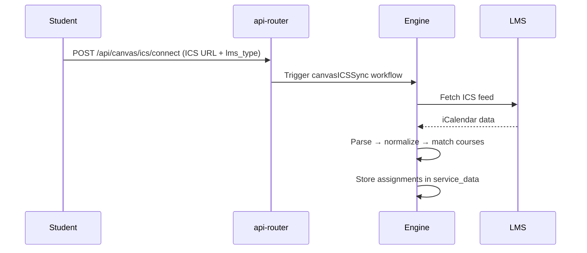

# Canvas LMS Integration

DormWay does **not** have a single Canvas path. The current contract supports:

- full Canvas API sync via **PAT**
- full Canvas API sync via **OAuth2**
- a lighter **ICS calendar feed** path that also covers several non-Canvas LMS variants

The API-based paths are the richer integration. ICS is the lightweight fallback and the cross-LMS compatibility layer.

## Connection Modes

| Mode | Current role | Important contract |
|------|--------------|--------------------|
| **PAT** | Direct Canvas API sync with bearer token auth | Token is stored encrypted; no refresh-token flow exists in this mode. |
| **OAuth2** | Direct Canvas API sync with refresh-capable credential storage | Refresh token is stored, but the main engine sync path does not auto-refresh yet. |
| **ICS feed** | Lightweight calendar/assignment ingestion and the multi-LMS compatibility path | Uses stored feed URLs plus LMS-specific parsers and normalization rules. |

## ICS Feed Support

| Platform | Status | Parser |
|----------|--------|--------|
| Canvas (Instructure) | Implemented | `parseCanvasICSFormat()` |
| Moodle | Implemented | `parseMoodleICSFormat()` |
| Blackboard Learn (Anthology) | Stub | Falls back to Canvas parser |
| Google Classroom | Stub | Falls back to Canvas parser |
| Brightspace / Schoology | Generic | `parseGenericICSFormat()` |

The `lms_type` is stored in `service_credentials` at connect time and determines which parser runs. Routing is by stored type — not by PRODID auto-detection.

## Sync Paths

| Path | What it does today |
|------|--------------------|
| **Canvas API sync** | Pulls courses, assignments, submissions, discussions, calendar events, and classmates through Canvas endpoints. |
| **ICS sync** | Fetches and parses iCalendar feeds, normalizes events into a Canvas-like shape, and feeds the same downstream assignment/schedule pipeline. |
| **Canary checks** | Uses activity-stream checks for API users and ETag / last-modified checks for ICS users to detect meaningful change cheaply. |

### ICS Sync Flow



The entry points are:
- `api-router/src/routes/canvas-routes.ts` — ICS connect endpoint
- `engine/src/workflows/canvasICSSync.workflow.ts` — sync orchestration
- `engine/src/activities/canvasICS.activities.ts` — per-platform parsers

<Note>
  The ICS path is only one branch of the integration. The current engineering contract also treats **PAT** and **OAuth2** Canvas API sync as first-class, production paths.
</Note>

## Platform Details

### Canvas (Instructure)

**Feed URL pattern:**
```
https://{institution}.instructure.com/feeds/calendars/user_{hash}.ics
```

**PRODID:** `Instructure`

Course codes are extracted from `[brackets]` in the SUMMARY field:

```
Homework Set 2 [ASTRO 104 001 FA 2025]
                └─ courseCode = "ASTRO 104"
```

Events without brackets are skipped. Canvas UIDs contain the entity type and ID, enabling reliable deduplication. RRULE is present for recurring events.

### Moodle

**Feed URL pattern:**
```
https://{institution}/calendar/export_execute.php?userid={id}&authtoken={token}&preset_what=all&preset_time=recentupcoming
```

**PRODID:** `Bennu`

Moodle SUMMARY contains only the event name — no course prefix. Course identification uses the `CATEGORIES` field:

```
BIOL201L All Sections 2026S  →  course code: "BIOL 201L"
```

Key differences from Canvas:
- All timestamps are UTC (`Z` suffix only — no `TZID`)
- No RRULE — all recurring events are expanded individually
- Default export window is 60 days; max 1000 events per feed
- Attendance session events are filtered out to avoid spurious assignments

### Blackbaud (K-12)

**Feed URL pattern:**
```
https://{school}.myschoolapp.com/podium/feed/iCal.aspx?z={base64-token}
```

Two separate feeds per student: **schedule** (class sessions) and **assignments** (due dates).

SUMMARY patterns:
- Schedule: `AP English Language - 2 (F)` (course + section + period)
- Assignments: `AP Calculus AB - 2: Summer Assignment Due` (course: title)

Day-label events (`Day 3 Maroon (HS)`) are filtered out as non-academic meta-events.

<Note>
Blackbaud integration is research-complete but not yet connected to the sync pipeline as of 2026-02-18.
</Note>

## Normalization

All parsers normalize their output to a common Canvas-like format before hitting the downstream sync pipeline (`syncCanvasCourses` / `syncCanvasAssignments`). This means regardless of which LMS a student uses, the stored data has the same shape.

Key normalization behaviors:

- **Lab/section collapsing** — `BIOL 201` and `BIOL 201L` are collapsed to a single course context to avoid duplicate course buckets
- **All-day event handling** — `VALUE=DATE` events receive a `T23:59:59Z` time so they display on the correct date in negative-UTC timezones
- **Term-start filtering** — assignments before the current term start are dropped and cleaned from `student_time_blocks`
- **Course context resolution** — `findOrCreateCourseContext()` ensures ICS assignments link to the student's enrolled course contexts

## Platform Comparison

| Feature | Canvas | Moodle | Blackbaud K-12 |
|---------|--------|--------|----------------|
| RRULE support | Yes | No (expanded) | No (expanded) |
| Course in SUMMARY | Yes (brackets) | No (use CATEGORIES) | Yes (structured) |
| Timestamps | TZID or VALUE=DATE | UTC (`Z`) only | TZID or VALUE=DATE |
| Feed window | Full duration | 60 days default | 14 months rolling |
| Events/semester | ~50–200 | Up to 1000 (capped) | ~500+ (all expanded) |
| Feed auth | Hash in URL | userid + authtoken | Base64 token (`z=`) |

## Related

- Sync orchestration details: [Sync Orchestration](/docs/engineering/sync-orchestration)
- Assignment storage: data lives in the `service_data` table (partitioned by month) under `method = 'canvas_assignment'`
