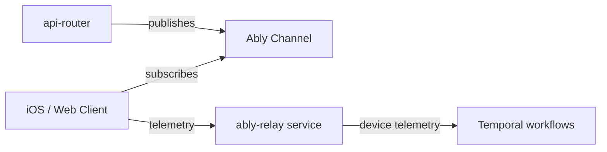

# Realtime Events

DormWay uses **Ably** for all real-time pub/sub communication. Clients subscribe to Ably channels to receive live updates without polling. The server publishes to channels when data changes.

## Architecture



There are two separate real-time flows:

1. **Server → Client**: api-router publishes dashboard deltas and Canvas events to user-scoped Ably channels. Clients subscribe and update their UI.
2. **Client → Server (telemetry)**: iOS clients publish location and health data to the `telemetry` channel. The **ably-relay** service (port 3032) consumes these messages and routes them to Temporal workflows via signals.

## Getting an Ably Token

Clients must obtain a short-lived Ably token from the DormWay API. Tokens are scoped to the authenticated user's channels.

```http
POST /api/ably/auth
Authorization: Bearer <clerk_jwt>
```

Response is an Ably `TokenRequest` object that the Ably SDK exchanges for a token directly with Ably's servers.

Token TTL: **1 hour**. Clients should re-authenticate before expiry.

## Channel Naming

All user-scoped channels follow the pattern `{namespace}:{userId}:{resource}`. Clients receive subscribe-only tokens — publishing to user channels from the client is not permitted.

### Dashboard Channel

```
user:{userId}:dashboard
```

The server publishes **dashboard delta messages** to this channel when widget data changes.

### Canvas Updates Channel

```
user:{userId}:canvas:updates
```

Used for grade and assignment change notifications from Canvas.

### Growth / Notification Channels

```
growth:bug-reports:{userId}    (subscribe)
growth:labs-tasks:{userId}     (subscribe)
growth:admin-bugs              (admin only — subscribe + publish + history)
growth:admin-tasks             (admin only — subscribe + publish + history)
```

## Dashboard Delta Protocol

When the server detects a widget data change, it publishes a delta message to `user:{userId}:dashboard`:

```json
{
  "type": "dashboard.delta",
  "version": "1.0",
  "baseEtag": "W/\"dcv1-abc123\"",
  "seq": 1,
  "ops": [
    { "op": "upsert", "id": "weather", "value": { } },
    { "op": "remove", "id": "parking" }
  ],
  "ts": "2025-08-20T12:34:56Z"
}
```

**Client behavior:**

- Maintain a `seq` counter per (user, tab, context).
- If `baseEtag` does not match the client's current snapshot, or a `seq` gap is detected, discard the delta and re-fetch the full snapshot via `GET /dashboard/v1/composite`.
- Apply `upsert` ops by merging widget data into a `byId` map; apply `remove` ops by deleting from the map.
- Server coalesces updates in 500–1000ms windows and rate-limits to ≤2 messages/sec per user.

## Canvas Realtime Events

Grade and assignment change events are published to `user:{userId}:canvas:updates`.

### grade_posted

Published when a grade is posted or updated in Canvas:

```json
{
  "event_version": 1,
  "event_id": "uuid-v4",
  "source": "webhook",
  "type": "grade_posted",
  "user_id": "dormway-user-uuid",
  "course_id": "dormway-course-context-uuid",
  "assignment_id": "dormway-assignment-uuid",
  "submission_id": "canvas-submission-id",
  "score": 87.5,
  "points_possible": 100,
  "grade": "B+",
  "graded_at": "2025-10-28T14:30:00Z",
  "excused": false,
  "late": false,
  "missing": false,
  "posted_at": "2025-10-28T14:30:05Z",
  "assignment_name": "Midterm Exam",
  "course_code": "CS 101"
}
```

### assignment_updated

Published when an assignment's metadata changes in Canvas:

```json
{
  "event_version": 1,
  "event_id": "uuid-v4",
  "source": "diff_emitter",
  "type": "assignment_updated",
  "user_id": "dormway-user-uuid",
  "course_id": "dormway-course-context-uuid",
  "assignment_id": "dormway-assignment-uuid",
  "changes": {
    "due_at": true,
    "points_possible": true
  },
  "updated_at": "2025-10-28T14:30:00Z",
  "assignment_name": "Final Project",
  "course_code": "CS 101"
}
```

The `source` field distinguishes whether the event came from a Canvas Live Events webhook (`webhook`) or a polling diff emitter (`diff_emitter`).

## Client-Side Subscription (JavaScript)

```typescript
import Ably from 'ably';

// 1. Fetch token from DormWay API
const tokenRequest = await fetch('/api/ably/auth', {
  method: 'POST',
  headers: { Authorization: `Bearer ${clerkToken}` }
}).then(r => r.json());

// 2. Initialize Ably with the token
const ably = new Ably.Realtime({ authCallback: (_params, callback) => {
  callback(null, tokenRequest);
}});

// 3. Subscribe to dashboard updates
const dashboardChannel = ably.channels.get(`user:${userId}:dashboard`);
dashboardChannel.subscribe((message) => {
  const delta = message.data;
  // Apply delta ops to local widget map
});

// 4. Subscribe to Canvas grade notifications
const canvasChannel = ably.channels.get(`user:${userId}:canvas:updates`);
canvasChannel.subscribe('grade_posted', (message) => {
  const event = message.data;
  // Show grade notification toast
});
```

## The ably-relay Service

The **ably-relay** service (port 3032) is a separate Node.js process that handles the mobile telemetry flow. It:

1. Connects to Ably as a subscriber on the `telemetry` channel
2. Validates and parses incoming `TelemetryMessage` payloads
3. Routes messages to the appropriate Temporal workflow via signals

Telemetry messages must include `userId` or `deviceId`, a `type` string (e.g., `location.update`, `health.update`), and a `timestamp`.

The relay also exposes a presence API over HTTP for Temporal workers to check whether a student is currently online:

```http
GET /presence/{userId}
POST /presence/batch   body: { "userIds": ["id1", "id2"] }
```

## Security

- Client tokens are **subscribe-only** on user channels. Clients cannot publish to `user:{userId}:*` channels.
- Token capabilities are scoped per user and role at token generation time.
- Admin channels (`growth:admin-*`) require `admin` or `system` role.
