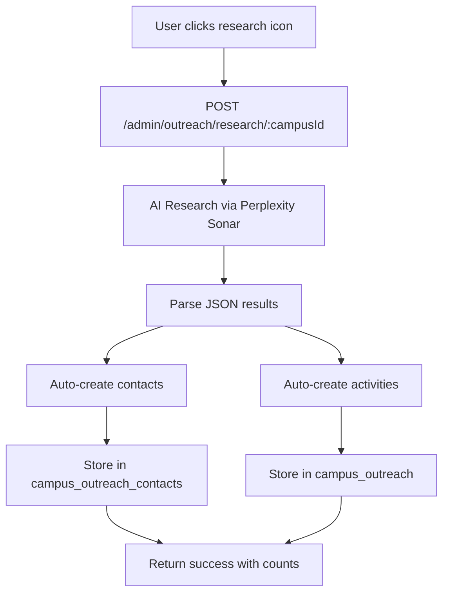

# Campus Outreach AI Research - Implementation

## Overview

The Campus Outreach AI Research feature auto-creates contact and activity records from AI research results, eliminating manual data entry for campus outreach campaigns.

**Current Status**: Production ready and tested

## Architecture

### Components

- **Research Utility**: `researchCampusOutreach()` using Portkey + Perplexity Sonar
- **API Endpoint**: POST `/admin/outreach/research/:campusId`
- **Frontend Integration**: Magnifying glass icon in campus list with loading states
- **Data Storage**: Results stored in `campus_outreach` and `campus_outreach_contacts` tables

### Process Flow



## Implementation Details

### Auto-Create Contacts

The system creates contacts from multiple sources:

```typescript
// Student government contacts
if (intel.student_government?.president) {
  contacts.push({
    campus_id: campusId,
    name: intel.student_government.president,
    role: 'Student Body President',
    email: intel.student_government.email || null,
    instagram_handle: intel.student_government.instagram || null,
    status: 'prospect',
    metadata: JSON.stringify({
      source: 'ai_research',
      organization: 'Student Government'
    })
  });
}

// Top 5 organizations (by influence score)
const topOrgs = intel.top_organizations
  .sort((a, b) => (b.influence_score || 0) - (a.influence_score || 0))
  .slice(0, 5);

// Student media contacts
for (const media of intel.student_media.slice(0, 3)) {
  contacts.push({
    campus_id: campusId,
    name: media.name,
    role: `${media.type} Contact`,
    email: media.contact || null,
    status: 'prospect',
    metadata: JSON.stringify({
      source: 'ai_research',
      media_type: media.type
    })
  });
}
```

### Auto-Create Activities

Creates event activities from upcoming campus events:

```typescript
// Auto-create activities for upcoming events (max 3)
for (const event of intel.upcoming_events.slice(0, 3)) {
  await pool.query(
    `INSERT INTO campus_outreach (
      campus_id, activity_type, title, owner_id, status, start_date, notes, metadata
    ) VALUES ($1, $2, $3, $4, $5, $6, $7, $8)
    ON CONFLICT DO NOTHING`,
    [
      campusId,
      'event',
      event.name,
      req.user?.id,
      'planned',
      event.date || null,
      `Outreach opportunity: ${event.outreach_opportunity}`,
      JSON.stringify({
        source: 'ai_research',
        event_type: event.type
      })
    ]
  );
}
```

## Configuration

### Timeout Settings

<Warning>
AI research operations take 25-30 seconds. The default API timeout is 5 seconds.
</Warning>

Override timeout for research calls:

```typescript
await apiClient.post(`/admin/outreach/research/${campusId}`, {}, {
  timeout: 60000, // 60 seconds
});
```

### Activity Type Constraints

Valid `activity_type` values for campus_outreach table:
- `ambassador_recruitment`
- `campus_campaign` 
- `partnership`
- `event`
- `social_media`
- `other`

Research records use `other`, discovered events use `event`.

### JSON Parsing

<Note>
Perplexity Sonar adds citations/metadata after JSON objects. The parser extracts content between first `{` and last `}` to handle this.
</Note>

```typescript
const firstBrace = cleanContent.indexOf('{');
const lastBrace = cleanContent.lastIndexOf('}');
if (firstBrace !== -1 && lastBrace !== -1) {
  cleanContent = cleanContent.substring(firstBrace, lastBrace + 1);
}
```

## Database Schema

### Contact Storage

```sql
INSERT INTO campus_outreach_contacts (
  campus_id, name, role, email, instagram_handle, status, metadata
) VALUES ($1, $2, $3, $4, $5, $6, $7)
ON CONFLICT DO NOTHING
```

### Activity Storage

```sql
INSERT INTO campus_outreach (
  campus_id, activity_type, title, owner_id, status, start_date, notes, metadata
) VALUES ($1, $2, $3, $4, $5, $6, $7, $8)
ON CONFLICT DO NOTHING
```

<Note>
`ON CONFLICT DO NOTHING` prevents duplicate creation if research is run multiple times on the same campus.
</Note>

## Performance Metrics

- **Research time**: 25-30 seconds average
- **Contacts created**: 5-10 per campus
- **Events created**: 0-3 per campus (depends on timing)
- **Frontend timeout**: 60 seconds configured
- **Cost per research**: ~$0.10-0.20 (Perplexity Sonar)

## Testing Results

**Test Campus**: Boston Architectural College

**Results**:
- ✅ 10 contacts created (Student Government, AIAS, NOMAS, SASLA, etc.)
- ✅ 3 event activities created (Orientation, BAC Talks, Alumni Awards)
- ✅ All marked with `source: ai_research` in metadata
- ✅ Contacts in `prospect` status
- ✅ Activities in `planned` status

## Related Files

### Backend
- `services/api-router/src/routes/admin/outreach-routes.ts` - Main endpoint
- `services/api-router/src/utils/campus-outreach-researcher.ts` - AI research utility

### Frontend
- `services/dormway-admin/src/pages/growth/outreach/campus-list.tsx` - Research button + UI

### Database Tables
- `campus_outreach` - Research records + event activities
- `campus_outreach_contacts` - Auto-created contacts