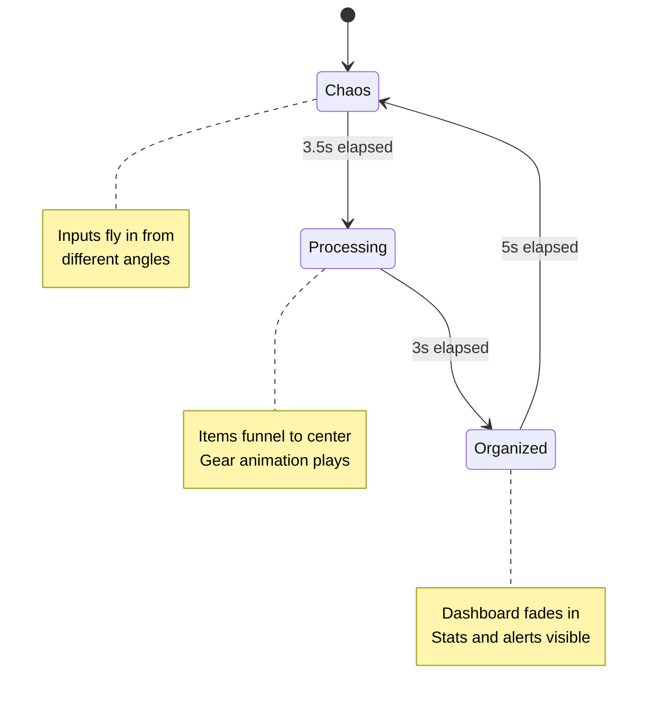
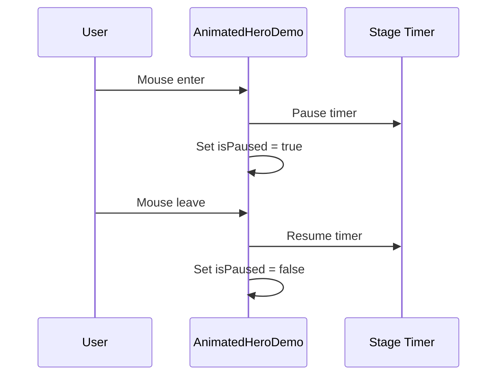

# Homepage Animated Demo

The animated demo component on the DormWay homepage showcases the platform's core value proposition through a three-stage animation loop: Chaos → Processing → Organized.

## Architecture

### Three-Stage Animation Flow

The demo cycles through three distinct stages in an infinite loop:

| Stage | Duration | Description |
|-------|----------|-------------|
| **Chaos** | 3.5s | Input items fly in from different angles with slight rotation |
| **Processing** | 3s | Items funnel into a glowing central orb with animated gear |
| **Organized** | 5s | Mini dashboard appears with alerts, stats, and schedule |

**Total loop:** ~11.5 seconds, auto-repeating



### Demo Data

**Chaos Stage Inputs:**
```typescript
const DEMO_INPUTS = [
  { id: 'syllabus-1', label: 'ECON 301 Syllabus', icon: FileText, color: 'var(--ds-primary-brand)' },
  { id: 'syllabus-2', label: 'MATH 201 Syllabus', icon: FileText, color: 'var(--ds-status-info)' },
  { id: 'schedule', label: 'Class Schedule', icon: Calendar, color: 'var(--ds-status-success)' },
  { id: 'canvas', label: 'Canvas', icon: Link2, color: 'var(--ds-status-warning)' },
  { id: 'gcal', label: 'Google Calendar', icon: Calendar, color: '#4285F4' },
];
```

**Organized Stage Outputs:**
- Alert cards: "3 assignments due this week", "Midterms in 12 days"
- Stat counters: 5 courses, 47 assignments
- Today's schedule: Mini timeline with classes

### Stage Duration Constants

```typescript
const STAGE_DURATIONS = {
  chaos: 3500,      // 3.5 seconds for inputs to fly in
  processing: 3000, // 3 seconds for funnel animation
  organized: 5000,  // 5 seconds to display dashboard
} as const;
```

## Integration

### Hero Section Layout

**Desktop (lg+):**
```
┌─────────────────────────────────────────────────────────┐
│  ┌─────────────────────┐   ┌─────────────────────────┐  │
│  │  Your college life. │   │   ┌─────────────────┐   │  │
│  │  One dashboard.     │   │   │ AnimatedHeroDemo│   │  │
│  │                     │   │   │ (3-stage loop)  │   │  │
│  │  [subtitle]         │   │   └─────────────────┘   │  │
│  │                     │   │   Import → Analyze →    │  │
│  │  [Get Started CTA]  │   │        Organize         │  │
│  │                     │   │                         │  │
│  │  [proof badges]     │   └─────────────────────────┘  │
│  └─────────────────────┘                                │
└─────────────────────────────────────────────────────────┘
```

### Mobile Variant

The mobile version is optimized for smaller screens with a faster animation cycle:

| Stage | Duration | Description |
|-------|----------|-------------|
| **Chaos** | 2.5s | 4 inputs appear with spring animation |
| **Processing** | 2s | Smaller orb with gear animation |
| **Organized** | 3.5s | Compact alert, stats row, ready badge |

**Total mobile loop:** ~8 seconds

**Key differences:**
- Faster cycle (8s vs 11.5s)
- Fewer demo inputs (4 vs 5)
- Simplified output display
- Smaller container (max-w-[280px])
- No hover pause (touch devices)

## API

### Component Props

```typescript
interface AnimatedHeroDemoProps {
  /** Auto-advance through stages (default: true) */
  autoPlay?: boolean;
  /** Show stage indicator below demo (default: true) */
  showIndicator?: boolean;
  /** Pause animation on hover (default: true) */
  pauseOnHover?: boolean;
  /** Container className */
  className?: string;
  /** Force mobile variant (default: false) */
  mobile?: boolean;
}
```

### Usage

```tsx
// Desktop variant (auto-detected)
<AnimatedHeroDemo autoPlay={true} pauseOnHover={true} />

// Mobile variant
<AnimatedHeroDemo mobile={true} autoPlay={true} />
```

### Data Types

```typescript
interface DemoInput {
  id: string;
  label: string;
  icon: LucideIcon;
  color: string;
}

type DemoStage = 'chaos' | 'processing' | 'organized';
```

## File Structure

```
src/components/landing/
├── AnimatedHeroDemo.tsx     # Main animated demo component
├── HeroSection.tsx          # Hero with split layout integration
├── SystemsCloud.tsx         # "25+ platforms" cloud
└── index.ts                 # Export barrel file

src/app/demo/animated-hero/
└── page.tsx                 # Interactive preview with controls
```

## Dependencies

- **Framer Motion:** Stage transitions, spring physics, stagger effects
- **Lottie:** Animated gear icon in processing stage
- **Lucide React:** Icons (FileText, Calendar, Link2, etc.)
- **Design System:** CSS variables (`--ds-*`) and glassmorphic styling

## Performance

- Uses GPU-accelerated transforms (`transform` and `opacity`)
- Hidden on mobile with `hidden lg:block` to prevent unnecessary rendering
- All demo data is static/hardcoded (no network requests)
- SystemsCloud floating animation disabled for performance

<Warning>
The floating/bouncing animation on the "25+ platforms" cloud is disabled due to performance issues. Pills appear with spring-in animation but remain static.
</Warning>

## Hover Behavior



## Known Limitations

- No reduced motion support (static fallback not implemented)
- Lottie gear may not load if CDN is slow
- Desktop-only hover pause behavior