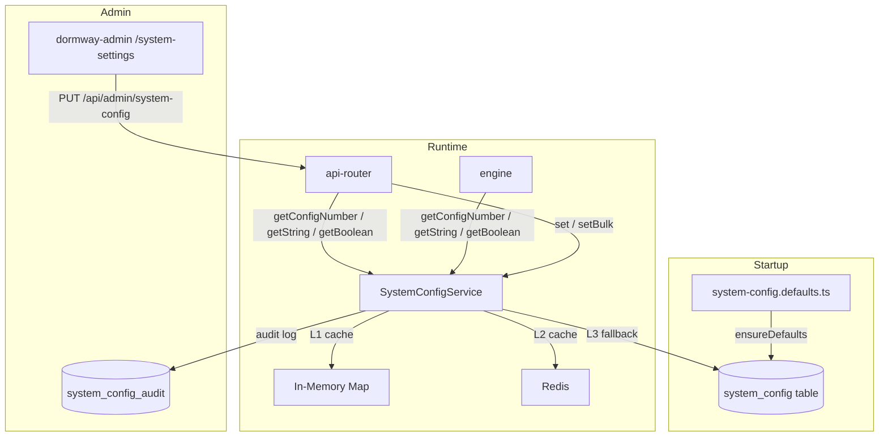

# System Configuration - Source of Truth

## Overview

DormWay uses a **database-backed runtime configuration system** that stores tunable settings in the `system_config` PostgreSQL table. All config values are managed through `SystemConfigService` in `@dormway/core` and are accessible from any backend service (api-router, engine).

**Key properties:**
- Values are cached in-memory + Redis (60 s TTL) for fast reads
- Every change is audit-logged in `system_config_audit`
- Admins can edit values via the admin dashboard at `/system-settings`
- A TypeScript seed file (`system-config.defaults.ts`) defines all defaults and is auto-applied on startup
- Production values are never overwritten by the seed mechanism

## Architecture



### Cache Behavior

1. **Memory cache** (L1) - per-process `Map`, 60 s TTL
2. **Redis cache** (L2) - shared across processes, 60 s TTL
3. **Database** (L3) - source of truth, hit only on cache miss

When a value is updated via `set()`, both caches are invalidated immediately.

## Database Schema

### `system_config` table

| Column | Type | Description |
|--------|------|-------------|
| `id` | uuid | Primary key |
| `key` | varchar | Unique config key (e.g. `sync.max_concurrent_cities`) |
| `value` | jsonb | Current value (JSON-encoded) |
| `category` | varchar | Grouping category |
| `description` | text | Human-readable description |
| `value_type` | varchar | `number`, `string`, `boolean`, or `json` |
| `default_value` | jsonb | Seed default (for admin "reset to default") |
| `constraints` | jsonb | Validation rules (`{ min, max }` or `{ enum: [...] }`) |
| `is_migrated` | boolean | Whether this key has been migrated from hardcoded code |
| `migration_notes` | text | Notes about migration |
| `updated_at` | timestamp | Last update |
| `updated_by` | uuid | Admin who last changed the value |
| `created_at` | timestamp | Row creation time |

### `system_config_audit` table

Every call to `set()` or `reset()` writes an audit row with previous value, new value, who changed it, timestamp, reason, IP, and user agent.

## Categories

| Category | Purpose | Example Keys |
|----------|---------|--------------|
| `sync` | Data synchronization | `sync.max_concurrent_cities`, `sync.canvas_sync_interval_minutes` |
| `processing` | Campus/city processing | `processing.campus_scheduled_batch_size` |
| `student` | Student-facing limits | `student.calendar_max_total_events` |
| `dayplan` | Day plan generation | `dayplan.prep_lookahead_hours` |
| `llm` | AI model selection & params | `llm.dayplan_model`, `llm.dayplan_temperature` |
| `ratelimits` | Rate limits & timeouts | `ratelimits.crew_service_timeout_ms` |
| `batching` | Queue/batch settings | `batching.notification_batch_size` |
| `limits` | System-wide limits | `limits.max_file_upload_bytes` |
| `canvas` | Canvas LMS integration | `canvas.grace_period_days` |
| `defaults` | System fallback values | `defaults.timezone`, `defaults.admin_email` |
| `temporal` | Temporal workflow settings | `temporal.worker_processor_timeout_minutes` |
| `workflow` | General workflow config | `workflow.student_watcher_canvas_sync_interval_hours` |
| `feature` | Feature flags | `feature.evening_briefing_enabled`, `feature.week_preview_enabled` |
| `demo` | Demo account settings | `demo.testflight_url`, `demo.welcome_email_subject` |

## How to Use a Config Value in Code

### 1. Import the helper

```typescript
import {
  getConfigNumber,
  getConfigString,
  getConfigBoolean,
  getConfigJson,
} from '@dormway/core';
```

### 2. Call the typed getter with a default

```typescript
// Number
const maxCities = await getConfigNumber('sync.max_concurrent_cities', 2);

// String (model name, URL, etc.)
const model = await getConfigString('llm.dayplan_model', 'gpt-4o-mini');

// Boolean (feature flag)
const enabled = await getConfigBoolean('feature.evening_briefing_enabled', false);

// JSON (complex objects)
const rules = await getConfigJson<MyRules>('processing.custom_rules', defaultRules);
```

The second argument is the **hardcoded fallback** used when:
- The key doesn't exist in the database
- The database is unreachable
- The service hasn't been initialized yet

### 3. Where to call these

- **Engine activities** - call at the top of the activity function
- **API Router routes** - call in the route handler
- **Workflows** - call via an activity (not directly in workflow code, since workflows must be deterministic)

## How to Add a New Config

### Step 1: Add to the defaults file

Open `services/shared/dormway-core/src/domains/system-config/system-config.defaults.ts` and add an entry:

```typescript
{
  key: 'processing.my_new_setting',
  value: 42,
  category: 'processing',
  description: 'Brief description of what this controls',
  valueType: 'number',
  defaultValue: 42,
  constraints: { min: 1, max: 100 },
},
```

**Key naming convention:** `{category}.{snake_case_name}`

**Value types:**
- `number` - integers and decimals
- `string` - text values (model names, URLs, email subjects)
- `boolean` - feature flags, on/off toggles
- `json` - complex objects (rare)

**Constraints (optional):**
- `{ min: 0, max: 100 }` - range for numbers
- `{ enum: ['a', 'b', 'c'] }` - allowed values for strings
- `null` - no constraints

### Step 2: Rebuild dormway-core

```bash
cd services/shared/dormway-core && npm run build
```

### Step 3: Restart services

```bash
./scripts/dev/dev-with-doppler.sh up -d api-router
# or
./scripts/dev/dev-with-doppler.sh up -d engine
```

On startup, `ensureDefaults()` runs and inserts the new key. No SQL migration needed.

### Step 4: Use it in code

```typescript
const mySetting = await getConfigNumber('processing.my_new_setting', 42);
```

## How to Add a New Feature Flag

Same process as above, using the `feature` category and `boolean` type:

```typescript
// In system-config.defaults.ts
{
  key: 'feature.my_feature_enabled',
  value: false,
  category: 'feature',
  description: 'Enable my feature. OFF by default for safe rollout.',
  valueType: 'boolean',
  defaultValue: false,
  constraints: null,
},
```

```typescript
// In your activity or route
const myFeatureEnabled = await getConfigBoolean('feature.my_feature_enabled', false);
if (!myFeatureEnabled) return;
```

For **long-running Temporal workflows** (e.g. StudentWatcher), always wrap new activity calls with `patched()`:

```typescript
import { patched } from '@temporalio/workflow';

const myFeatureEnabled = patched('my-feature-flag-v1')
  ? await featureFlagActivities.isMyFeatureEnabled()
  : false; // old workflows skip this
```

## Seed / Upsert Mechanism

### How it works

On service startup (api-router and engine), after `initializeSystemConfigService()`:

1. `ensureDefaults(SYSTEM_CONFIG_DEFAULTS)` is called
2. All 123+ entries are batched (50 per query) into a single transaction
3. SQL: `INSERT ... ON CONFLICT (key) DO UPDATE SET description, constraints, default_value`
4. **Inserts** missing keys with their default values
5. **Updates metadata** (description, constraints, default_value) on existing keys
6. **Never touches `value`** on existing keys - production customizations are preserved

### What gets updated on existing keys

| Column | Overwritten? | Why |
|--------|-------------|-----|
| `value` | NEVER | Preserves production customizations |
| `description` | Yes | Keeps descriptions current |
| `constraints` | Yes | Keeps validation rules current |
| `default_value` | Yes | Keeps "reset to default" accurate |

### Startup safety

The `ensureDefaults()` call is wrapped in try/catch. If the database is unavailable or the query fails, the service still starts normally. A warning is logged.

## Admin Dashboard

The admin UI at `dormway-admin` port 3004 path `/system-settings` provides:

- View all configs grouped by category
- Edit values with type-aware inputs (number, string, boolean, JSON)
- Validation against constraints (min/max, enum)
- Reset individual keys to their default value
- View modification history (audit log)
- Filter by category, search by key name

Changes take effect within 60 seconds (cache TTL) across all services.

## What NOT to Put in System Config

| Type | Where It Belongs |
|------|-----------------|
| Secrets (API keys, tokens) | Doppler |
| Infrastructure config (ports, hosts) | Environment variables |
| Build-time constants | TypeScript constants |
| Values that never change | Hardcoded in code |

System config is for **tunable runtime values** that may need to change without a deploy.

## Source Files

| File | Purpose |
|------|---------|
| `dormway-core/src/domains/system-config/system-config.defaults.ts` | All config defaults (single source of truth) |
| `dormway-core/src/domains/system-config/system-config.service.ts` | Service implementation (get/set/ensureDefaults) |
| `dormway-core/src/domains/system-config/types.ts` | TypeScript types (ConfigCategory, ConfigDefault, etc.) |
| `dormway-core/src/domains/system-config/config-helpers.ts` | Convenience helpers (getConfigNumber, etc.) |
| `dormway-core/src/domains/system-config/system-config.factory.ts` | Singleton factory (initializeSystemConfigService) |
| `api-router/src/routes/admin/system-config-routes.ts` | Admin REST endpoints |
| `api-router/src/index.ts` | Startup: init + ensureDefaults |
| `engine/src/index.ts` | Startup: init + ensureDefaults |